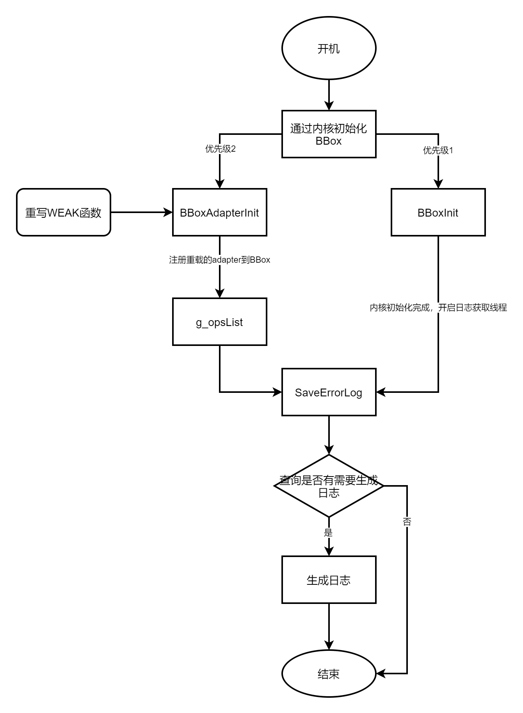

# hiviewdfx_blackbox

-   [简介](#简介)
-   [目录](#目录)
-   [运行流程](#运行流程)
-   [系统调用接口定义](#系统调用接口定义)
-   [重写接口](#重写接口)
-   [相关仓](#相关仓)

## 简介

blackbox是帮助系统抓取保存LitOS死机重启故障现场信息的功能模块。
blackbox功能包括故障信息获取，故障日志保存，死机重启等功能

## 目录

blackbox源代码目录结构如下：

```
/base/hiviewdfx/blackbox.
├── blackbox_adapter.c                          #平台适配
├── blackbox_core.c                             #blackbox核心代码
├── blackbox_detector.c
├── blackbox_detector.h
└── interfaces                                  #公共接口
    └── native
        ├── innerkits
        │   ├── blackbox.h
        │   └── blackbox_adapter.h
        └── kits
            ├── blackbox.h
            └── blackbox_adapter.h
```

## 运行流程

blackbox运行流程如下：



blackbox在开机的时候由内核启动，运行SaveErrorLog线程检测是否有日志需要储存在日志文件中。

当开机以后BBoxInit和BBoxAdapterInit相继被初始化，重写的适配层函数被加载到blackbox_core。

当内核初始化完成以后线程函数SaveErrorLog启动，SaveErrorLog通过重写的适配层函数进行日志信息查询和日志存储操作。当日志存储完成SaveErrorLog线程结束。

在Hi3816芯片中，系统已经提供获取故障的接口hi_syserr_get，适配层函数SystemModuleGetLastLogInfo去芯片接口获得当前是否有故障信息。适配层函数SystemModuleSaveLastLog进行日志存储。具体详见[重写接口](#重写接口)

## 系统调用接口定义

### struct ErrorInfo

```
struct ErrorInfo {
    char event[EVENT_MAX_LEN];
    char module[MODULE_MAX_LEN];
    char errorDesc[ERROR_DESC_MAX_LEN];
};
```

故障信息结构体

- 参数：
  | 成员 | 类型 | 必填 | 说明 |
  | -------- | -------- | -------- | -------- |
  | event | char[] | 是 | 输入故障事件名称。 |
  | module | char[] | 是 | 输入故障模式 |
  | errorDesc | char[] | 是 | 故障信息描述 |

### BBoxNotifyError

```
int BBoxNotifyError(const char event[EVENT_MAX_LEN], const char module[MODULE_MAX_LEN],
    const char errorDesc[ERROR_DESC_MAX_LEN], int needSysReset);
```

该方法可以放在故障中断上下文中，当故障发生时，传入信息到，并且调用适配层函数SystemModuleDump获取故障数据，然后选择是否重启

- 参数：
  | 参数名 | 类型 | 必填 | 说明 |
  | -------- | -------- | -------- | -------- |
  | event | const char[] | 是 | 输入故障事件名称。 |
  | module | const char[] | 是 | 输入故障模式，与BBoxAdapterInit注册的模式相匹配才能才能继续 |
  | errorDesc | const char[] | 是 | 故障信息描述 |
  | needSysReset | int | 是 | 是否重启，0：不重启；1：重启 |

- 示例：

在LitOS_A内核中OsUserExcHandle用户异常中断和OsExcHandleEntry系统异常中断中加入BBoxNotifyError通知blackbox进行相应处理

对应位置kernel/liteos_a/arch/arm/arm/src/los_exc.c 577行和1212行。

## 重写接口

实例可以参考hi3861芯片的重写，对应位置为device/soc/hisilicon/hi3861v100/sdk_liteos/app/wifiiot_app/src/blackbox_adapter_impl.c

### SystemModuleDump

```
void SystemModuleDump(const char *logDir, struct ErrorInfo *info);
```

重写系统dump函数，当系统出现异常调用BBoxNotifyError函数时，会被调用。可以进行数据的预处理：将异常栈信息等故障数据存储在特定内存区域中开机重启以后在生成日志；也可以选择在不重启的情况下保存故障数据到日志文件中。

- 参数：
  | 参数名 | 类型 | 必填 | 说明 |
  | -------- | -------- | -------- | -------- |
  | logDir | const char* | 是 | 日志路径。 |
  | info | struct ErrorInfo* | 是 | 输入的故障信息 |

### SystemModuleReset

```
void SystemModuleReset(struct ErrorInfo *info);
```

重写系统重启函数，当系统出现异常调用BBoxNotifyError函数时，会被调用。在重启之前进行相应的操作。

- 参数：
  | 参数名 | 类型 | 必填 | 说明 |
  | -------- | -------- | -------- | -------- |
  | info | struct ErrorInfo* | 是 | 输入的故障信息 |

### SystemModuleGetLastLogInfo

```
int SystemModuleGetLastLogInfo(struct ErrorInfo *info);
```

重写获得日志信息函数，当重启之后的SaveErrorLog线程中，调用此接口判断是否有日志需要保存。

- 参数：
  | 参数名 | 类型 | 必填 | 说明 |
  | -------- | -------- | -------- | -------- |
  | info | struct ErrorInfo* | 是 | 输入的故障信息 |

### SystemModuleSaveLastLog

```
int SystemModuleSaveLastLog(const char *logDir, struct ErrorInfo *info);
```

重写日志保存函数，当重启之后的SaveErrorLog线程中，调用此接口进行日志保存。

- 参数：
  | 参数名 | 类型 | 必填 | 说明 |
  | -------- | -------- | -------- | -------- |
  | logDir | const char* | 是 | 日志路径。 |
  | info | struct ErrorInfo* | 是 | 输入的故障信息 |

### FullWriteFile

```
int FullWriteFile(const char *filePath, const char *buf, unsigned int bufSize, int isAppend);
```

重写日志文件写操作函数。

- 参数：
  | 参数名 | 类型 | 必填 | 说明 |
  | -------- | -------- | -------- | -------- |
  | logDir | const char* | 是 | 日志路径。 |
  | buf | const char* | 是 | 需要写入文件的数据 |
  | bufSize | unsigned int | 是 | 需要写入数据大小 |
  | isAppend | int | 是 | 是否为追加模式：0是覆写模式，清空当前文件全部内容：1是追加模式，向日志中追加数据 |

### GetFaultLogPath

```
char *GetFaultLogPath(void);
```

返回需要保存的日志路径。

- 返回值：
  | 类型 | 说明 |
  | -------- | -------- |
  | char * | 返回日志存储的路径 |

### RebootSystem

```
void RebootSystem(void); 
```

调用系统重启函数

## 相关仓

[DFX子系统](https://gitee.com/openharmony/docs/blob/master/zh-cn/readme/DFX%E5%AD%90%E7%B3%BB%E7%BB%9F.md)

**hiviewdfx\_blackbox**

[hiviewdfx\_hidumper\_lite](https://gitee.com/openharmony/hiviewdfx_hidumper_lite/blob/master/README_zh.md)

[hiviewdfx\_hilog\_lite](https://gitee.com/openharmony/hiviewdfx_hilog_lite/blob/master/README_zh.md)

[hiviewdfx\_hievent\_lite](https://gitee.com/openharmony/hiviewdfx_hievent_lite/blob/master/README_zh.md)

[hiviewdfx\_hiview\_lite](https://gitee.com/openharmony/hiviewdfx_hiview_lite/blob/master/README_zh.md)
