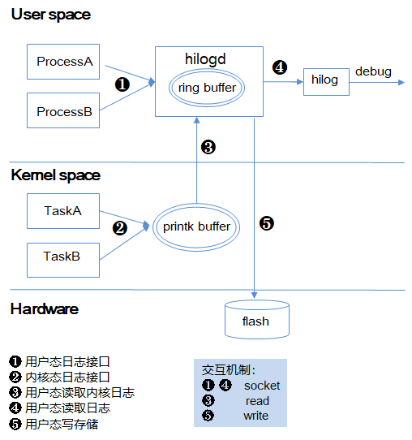

# HiLog组件<a name="ZH-CN_TOPIC_0000001115694144"></a>

- [HiLog组件<a name="ZH-CN_TOPIC_0000001115694144"></a>](#hilog组件)
  - [简介<a name="section11660541593"></a>](#简介)
  - [目录<a name="section161941989596"></a>](#目录)
  - [约束<a name="section119744591305"></a>](#约束)
  - [说明<a name="section06487425716"></a>](#说明)
    - [接口说明<a name="section1551164914237"></a>](#接口说明)
    - [使用说明<a name="section129654513264"></a>](#使用说明)
  - [涉及仓<a name="section177639411669"></a>](#涉及仓)

-   [涉及仓](#section177639411669)

## 简介<a name="section11660541593"></a>

HiLog是OpenHarmony日志系统，提供给系统框架、服务、以及应用打印日志，记录用户操作、系统运行状态等。

**图 1**  HiLog架构图<a name="fig4460722185514"></a>  




用户态Process通过日志接口将日志内容写入hilogd buffer中，用户态的hilog工具支持将输出到控制台（console）进行查看，同时也支持通过hilog工具给hilogd发送命令将日志落盘。

下述主要任务的详细内容：

-   hilogd是流水日志的用户态服务。

1.  此功能是常驻服务，在研发版本系统启动时默认启动。
2.  当用户态模块调用日志接口，将格式化好的日志内容传输给该任务，并将其存储在一个环形缓冲区中 。

-   hilog日志查看命令行工具

1.  从hilogd读取ringbuffer内容，输出到标准输出，可支持日志过滤。

支持特性：

-   支持参数隐私标识格式化（详见下面举例）。
-   支持对超标日志打印进程流控。
-   支持对超标日志打印domain\(标识子系统/模块\)流控。
-   支持流压缩落盘。

## 目录<a name="section161941989596"></a>

```
/base/hiviewdfx/hilog
├── frameworks           # 框架代码
│   └── native          # HiLog native实现代码
├── interfaces           # 接口
│   └── native          # 对外C/C++接口
│       └── innerkits   # 对内部子系统暴露的头文件
│       └── kits        # 对应用暴露的头文件
│   └── js              # 对外js接口
├── services
│   └── hilogd          # 日志常驻服务实现
│   └── hilogtool       # 日志工具实现
```

## 约束<a name="section119744591305"></a>

依赖 Clang 编译器\(**Clang**  8.0.0 \)及以上。

## 说明<a name="section06487425716"></a>

### 接口说明<a name="section1551164914237"></a>

**表 1**  主要API说明

<a name="table5489165165714"></a>
<table><thead align="left"><tr id="row12490195195718"><th class="cellrowborder" valign="top" width="14.09%" id="mcps1.2.4.1.1"><p id="p862411212488"><a name="p862411212488"></a><a name="p862411212488"></a>类</p>
</th>
<th class="cellrowborder" valign="top" width="33.98%" id="mcps1.2.4.1.2"><p id="p10859172921116"><a name="p10859172921116"></a><a name="p10859172921116"></a>方法</p>
</th>
<th class="cellrowborder" valign="top" width="51.93%" id="mcps1.2.4.1.3"><p id="p104901150576"><a name="p104901150576"></a><a name="p104901150576"></a>描述</p>
</th>
</tr>
</thead>
<tbody><tr id="row34901758577"><td class="cellrowborder" valign="top" width="14.09%" headers="mcps1.2.4.1.1 "><p id="p16501115918497"><a name="p16501115918497"></a><a name="p16501115918497"></a>HiLogLabel</p>
</td>
<td class="cellrowborder" valign="top" width="33.98%" headers="mcps1.2.4.1.2 "><p id="p1550175974917"><a name="p1550175974917"></a><a name="p1550175974917"></a>HiLogLabel(int type, int domain, String tag)</p>
</td>
<td class="cellrowborder" valign="top" width="51.93%" headers="mcps1.2.4.1.3 "><p id="p135021859104915"><a name="p135021859104915"></a><a name="p135021859104915"></a>构造日志标签，包括：日志类型、领域标识、日志tag。</p>
</td>
</tr>
<tr id="row868117162916"><td class="cellrowborder" valign="top" width="14.09%" headers="mcps1.2.4.1.1 "><p id="p1215914385013"><a name="p1215914385013"></a><a name="p1215914385013"></a>HiLog</p>
</td>
<td class="cellrowborder" valign="top" width="33.98%" headers="mcps1.2.4.1.2 "><p id="p1415914345011"><a name="p1415914345011"></a><a name="p1415914345011"></a>Info(const HiLogLabel &amp;label, const char *fmt, ...)</p>
</td>
<td class="cellrowborder" valign="top" width="51.93%" headers="mcps1.2.4.1.3 "><p id="p1274814305510"><a name="p1274814305510"></a><a name="p1274814305510"></a>info级别日志打印接口。</p>
</td>
</tr>
</tbody>
</table>

### 使用说明<a name="section129654513264"></a>

1. 查看日志

通过shell , 执行命令 hilog  | grep “MY\_TAG”。

```
Debug模式输出：
01-26 11:01:06.870 1051 1051 W 00201/test: Failed to visit [https://gitee.com/openharmony](https://gitee.com/openharmony), reason:503.
release模式输出：
01-26 11:01:06.870 1051 1051 W 00201/test: Failed to visit <private>, reason:503.
```
2. hilog命令行使用说明
   
|     短选项                                                                                   |     长选项           |     参数                                                                                                                              |     说明                                                                                                     |
|----------------------------------------------------------------------------------------------|----------------------|---------------------------------------------------------------------------------------------------------------------------------------|--------------------------------------------------------------------------------------------------------------|
|     -h                                                                                       |     --help           |                                                                                                                                       |     帮助命令                                                                                                 |
|     缺省                                                                                     |     缺省             |                                                                                                                                       |     阻塞读日志，不退出                                                                                       |
|     -x                                                                                       |     --exit           |                                                                                                                                       |     非阻塞读日志，读完退出                                                                                   |
|     -g                                                                                       |                      |                                                                                                                                       |     查询buffer的大小，配合-t指定某一类型使用，默认app和core                                                |
|     -G                                                                                       |     --buffer-size    |     \<size>                                                                                                                            |     设置指定\<type>日志类型缓冲区的大小，配合-t指定某一类型使用，默认app和core，     可使用B/K/M/G为单位    |
|     -r                                                                                       |                      |                                                                                                                                       |     清除buffer日志,配合-t指定某一类型使用，默认app和core                                                     |
|     -p                                                                                       |     --privacy        |     <on/off>                                                                                                                          |     支持系统调试时日志隐私开关控制                                                                         |
|                                                                                              |                      |     on                                                                                                                                |     打开隐私开关，显示\<private>                                                                              |
|                                                                                              |                      |     off                                                                                                                               |     关闭隐私开关，显示明文                                                                                   |
|     -k                                                                                       |                      |     <on/off>                                                                                                                          |     Kernel日志读取开关控制                                                                                   |
|                                                                                              |                      |     on                                                                                                                                |     打开读取kernel日志                                                                                       |
|                                                                                              |                      |     off                                                                                                                               |     关闭读取kernel日志                                                                                       |
|     -s                                                                                       |     --statistics     |                                                                                                                                       |     查询统计信息，需配合-t或-D使用                                                                           |
|     -S                                                                                       |                      |                                                                                                                                       |     清除统计信息，需配合-t或-D使用                                                                           |
|     -Q                                                                                       |                      |     \<control-type>                                                                                                                    |     流控缺省配额开关控制                                                                                     |
|                                                                                              |                      |     pidon                                                                                                                             |     进程流控开关打开                                                                                         |
|                                                                                              |                      |     pidoff                                                                                                                            |     进程流控开关关闭                                                                                         |
|                                                                                              |                      |     domainon                                                                                                                          |     domain流控开关打开                                                                                       |
|                                                                                              |                      |     domainoff                                                                                                                         |     domain流控开关关闭                                                                                       |
|     -L                                                                                       |     --level          |     \<level>                                                                                                                           |     指定级别的日志，示例：-L D/I/W/E/F                                                                       |
|     -t                                                                                       |     --type           |     \<type>                                                                                                                            |     指定类型的日志，示例：-t app core init                                                                   |
|     -D                                                                                       |     --domain         |     \<domain>                                                                                                                          |     指定domain                                                                                               |
|     -T                                                                                       |     --Tag            |     \<tag>                                                                                                                             |     指定tag                                                                                                  |
|     -a                                                                                       |     --head           |     \<n>                                                                                                                               |     只显示前\<n>行日志                                                                                        |
|     -z                                                                                       |     --tail           |     \<n>                                                                                                                               |     只显示后\<n>行日志                                                                                        |
|     -P                                                                                       |     --pid            |     \<pid>                                                                                                                             |     标识不同的pid                                                                                            |
|     -e                                                                                       |     --regex          |     \<expr>                                                                                                                            |     只打印日志消息与\<expr>匹配的行，其中\<expr>是一个正则表达式                                               |
|     -f                                                                                       |     --filename       |     \<filename>                                                                                                                        |     设置落盘的文件名                                                                                         |
|     -l                                                                                       |     --length         |     \<length>                                                                                                                          |     设置落盘的文件大小，需要大于等于64K                                                                          |
|     -n                                                                                       |     --number         |     \<number>                                                                                                                          |     设置落盘文件的个数                                                                                       |
|     -j                                                                                       |     --jobid          |     \<jobid>                                                                                                                           |     设置落盘任务的ID                                                                                         |
|     -w                                                                                       |     --write          |     \<control>                                                                                                                         |     落盘任务控制                                                                                             |
|                                                                                              |                      |     query                                                                                                                             |     落盘任务查询                                                                                             |
|                                                                                              |                      |     start                                                                                                                             |     落盘任务开始，命令行参数为文件名、单文件大小、落盘算法、rotate文件数目.                                  |
|                                                                                              |                      |     stop                                                                                                                              |     落盘任务停止                                                                                             |
|     -m                                                                                       |     --stream         |     \<algorithm>                                                                                                                       |     落盘方式控制                                                                                             |
|                                                                                              |                      |     none                                                                                                                              |     无压缩方式落盘                                                                                           |
|                                                                                              |                      |     zlib                                                                                                                              |     zlib压缩算法落盘，落盘文件为.gz                                                                          |
|                                                                                              |                      |     zstd                                                                                                                              |     zstd压缩算法落盘，落盘文件为.zst                                                                         |
|     -v                                                                                       |     --format         |     \<format>                                                                                                                          |                                                                                                              |
|                                                                                              |                      |     time                                                                                                                              |     显示本地时间                                                                                             |
|                                                                                              |                      |     color                                                                                                                             |     显示不同级别显示不同颜色，参数缺省级别颜色模式处理（按黑白方式）                                         |
|                                                                                              |                      |     epoch                                                                                                                             |     显示相对1970时间                                                                                         |
|                                                                                              |                      |     monotonic                                                                                                                         |     显示相对启动时间                                                                                         |
|                                                                                              |                      |     usec                                                                                                                              |     显示微秒精度时间                                                                                         |
|                                                                                              |                      |     nsec                                                                                                                              |     显示纳秒精度时间                                                                                         |
|                                                                                              |                      |     year                                                                                                                              |     显示将年份添加到显示的时间                                                                               |
|                                                                                              |                      |     zone                                                                                                                              |     显示将本地时区添加到显示的时间                                                                           |
|     -b                                                                                       |     --baselevel      |     \<loglevel>                                                                                                                        |     设置可打印日志的最低等级：D(DEBUG)/I(INFO)/W(WARN)/E(ERROR)/F(FATAL)                                     |

```
示例：hilog -G 2M -t core                                                                
解释：设置buffer大小为2M，日志类型为core。                                                                                          
示例：hilog -g -t app                                                                    
解释：查询日志类型为app的buffer大小。                                                                                             
示例：hilog -w start -f "hilog" -l 66k -m zlib -n 10                                   
解释：执行名字为hilog的落盘任务，10个落盘文件进行轮转，单个文件落盘大小为66k，采用zlib压缩算法。                                  
type、level、domain、tag支持排除查询，排除查询可以使用以"^"开头的参数和分隔符"，"."来完成   
示例：hilog -t ^core,app 排除core和app类型的日志，可以与其他参数一起使用。
示例：hilog -t app core 打印core和app类型的日志，可以与其他参数一起使用。                                         
```          

## 涉及仓<a name="section177639411669"></a>

[DFX子系统](https://gitee.com/openharmony/docs/blob/master/zh-cn/readme/DFX%E5%AD%90%E7%B3%BB%E7%BB%9F.md)

[hiviewdfx\_hiview](https://gitee.com/openharmony/hiviewdfx_hiview/blob/master/README_zh.md)

**hiviewdfx\_hilog**

[hiviewdfx\_hiappevent](https://gitee.com/openharmony/hiviewdfx_hiappevent/blob/master/README_zh.md)

[hiviewdfx\_hisysevent](https://gitee.com/openharmony/hiviewdfx_hisysevent/blob/master/README_zh.md)

[hiviewdfx\_faultloggerd](https://gitee.com/openharmony/hiviewdfx_faultloggerd/blob/master/README_zh.md)

[hiviewdfx\_hilog\_lite](https://gitee.com/openharmony/hiviewdfx_hilog_lite/blob/master/README_zh.md)

[hiviewdfx\_hievent\_lite](https://gitee.com/openharmony/hiviewdfx_hievent_lite/blob/master/README_zh.md)

[hiviewdfx\_hiview\_lite](https://gitee.com/openharmony/hiviewdfx_hiview_lite/blob/master/README_zh.md)

