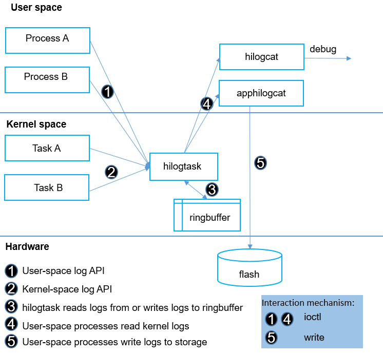

# Hilog\_lite<a name="EN-US_TOPIC_0000001078674780"></a>

-   [Introduction](#s9c9ad6e6d5494719ad0f6630a0a1add4)
-   [Directory Structure](#s4edd47ec6791449aa2d6362fed84325e)
-   [Constraints](#s7f347323ea45437ca31edae5c10f2991)
-   [Log Function for the Mini System](#sd6e99f792bc942f9bb5aa92111be7aff)
-   [Small System](#s33e0a62bc1dd4a2a9578fc22bd023f11)
-   [Repositories Involved](#s999c697ebde345449386ce8dc1df1db0)

## Introduction<a name="s9c9ad6e6d5494719ad0f6630a0a1add4"></a>

Hilog\_lite provides the log function of the DFX subsystem for the mini and small systems.

## Directory Structure<a name="s4edd47ec6791449aa2d6362fed84325e"></a>

**Table  1**  Directory structure for Hilog\_lite in the DFX subsystem

<a name="ta443dcf0f0dd4e07834b95e031c9fb12"></a>
<table><thead align="left"><tr id="ra41be074cf4949d284a843a90e781f33"><th class="cellrowborder" valign="top" width="30.34%" id="mcps1.2.3.1.1"><p id="a727aecc17b674751a9d5d7ebdd391310"><a name="a727aecc17b674751a9d5d7ebdd391310"></a><a name="a727aecc17b674751a9d5d7ebdd391310"></a>Directory</p>
</th>
<th class="cellrowborder" valign="top" width="69.66%" id="mcps1.2.3.1.2"><p id="ad32d72628b854c53ae4b7c54edfc8afe"><a name="ad32d72628b854c53ae4b7c54edfc8afe"></a><a name="ad32d72628b854c53ae4b7c54edfc8afe"></a>Description</p>
</th>
</tr>
</thead>
<tbody><tr id="rc4c61aa63a33430fb82263e2bda83e02"><td class="cellrowborder" valign="top" width="30.34%" headers="mcps1.2.3.1.1 "><p id="a08bb3cab9f18422bbebabac53be94111"><a name="a08bb3cab9f18422bbebabac53be94111"></a><a name="a08bb3cab9f18422bbebabac53be94111"></a>interfaces/native/kits/hilog</p>
</td>
<td class="cellrowborder" valign="top" width="69.66%" headers="mcps1.2.3.1.2 "><p id="a4603eff664a64d7e80db8d890957522c"><a name="a4603eff664a64d7e80db8d890957522c"></a><a name="a4603eff664a64d7e80db8d890957522c"></a>Defines external APIs that provide the log function for the small system.</p>
</td>
</tr>
<tr id="rf932828a7faa477e894fc6ac1405c5c2"><td class="cellrowborder" valign="top" width="30.34%" headers="mcps1.2.3.1.1 "><p id="aa165ba46894b44e396163892a274c308"><a name="aa165ba46894b44e396163892a274c308"></a><a name="aa165ba46894b44e396163892a274c308"></a>interfaces/native/kits/hilog_lite</p>
</td>
<td class="cellrowborder" valign="top" width="69.66%" headers="mcps1.2.3.1.2 "><p id="af97241f84b4649de924f32608d0298da"><a name="af97241f84b4649de924f32608d0298da"></a><a name="af97241f84b4649de924f32608d0298da"></a>Defines external APIs that provide the log function for the mini system.</p>
</td>
</tr>
<tr id="r81c09daddf724dc088992dc6fb5caeae"><td class="cellrowborder" valign="top" width="30.34%" headers="mcps1.2.3.1.1 "><p id="a915128b09aeb4e25b1f7aba042c42459"><a name="a915128b09aeb4e25b1f7aba042c42459"></a><a name="a915128b09aeb4e25b1f7aba042c42459"></a>services/hilogcat</p>
</td>
<td class="cellrowborder" valign="top" width="69.66%" headers="mcps1.2.3.1.2 "><p id="a7645a6df6f164244b3292347b1f7ad04"><a name="a7645a6df6f164244b3292347b1f7ad04"></a><a name="a7645a6df6f164244b3292347b1f7ad04"></a>Stores log-related services and commands for the small system.</p>
</td>
</tr>
<tr id="r4fa9d620df3c4e24bd1a94c79ccabcae"><td class="cellrowborder" valign="top" width="30.34%" headers="mcps1.2.3.1.1 "><p id="a95c8bfabb4424e38a11d03a59162ae14"><a name="a95c8bfabb4424e38a11d03a59162ae14"></a><a name="a95c8bfabb4424e38a11d03a59162ae14"></a>services/apphilogcat</p>
</td>
<td class="cellrowborder" valign="top" width="69.66%" headers="mcps1.2.3.1.2 "><p id="a25c0853c8d0446839ea2b900856696cd"><a name="a25c0853c8d0446839ea2b900856696cd"></a><a name="a25c0853c8d0446839ea2b900856696cd"></a>Provides the log flushing service for the small system.</p>
</td>
</tr>
<tr id="r0a82ab924ac24725bcb24cf3fa523010"><td class="cellrowborder" valign="top" width="30.34%" headers="mcps1.2.3.1.1 "><p id="aba63f8bc7c0a469f94e6f8d177b5c91c"><a name="aba63f8bc7c0a469f94e6f8d177b5c91c"></a><a name="aba63f8bc7c0a469f94e6f8d177b5c91c"></a>command</p>
</td>
<td class="cellrowborder" valign="top" width="69.66%" headers="mcps1.2.3.1.2 "><p id="a1f274cd4df2949589ebe8a29c4e9a241"><a name="a1f274cd4df2949589ebe8a29c4e9a241"></a><a name="a1f274cd4df2949589ebe8a29c4e9a241"></a>Provides log query commands for the mini system.</p>
</td>
</tr>
<tr id="rb359a73bb38e47c8952cf3a809b7d38d"><td class="cellrowborder" valign="top" width="30.34%" headers="mcps1.2.3.1.1 "><p id="a3a7a4fbfa61e45a5ba3bc4c4af4d82c2"><a name="a3a7a4fbfa61e45a5ba3bc4c4af4d82c2"></a><a name="a3a7a4fbfa61e45a5ba3bc4c4af4d82c2"></a>frameworks/featured</p>
</td>
<td class="cellrowborder" valign="top" width="69.66%" headers="mcps1.2.3.1.2 "><p id="a307bdb53cf7545d4bd663fb62dd0ca38"><a name="a307bdb53cf7545d4bd663fb62dd0ca38"></a><a name="a307bdb53cf7545d4bd663fb62dd0ca38"></a>Implements the APIs that provide the log function for the small system.</p>
</td>
</tr>
<tr id="rbb7fc424f05a4df181595f633455e8a8"><td class="cellrowborder" valign="top" width="30.34%" headers="mcps1.2.3.1.1 "><p id="a32392112d5b04f7e8baceca6353b9ecf"><a name="a32392112d5b04f7e8baceca6353b9ecf"></a><a name="a32392112d5b04f7e8baceca6353b9ecf"></a>frameworks/mini</p>
</td>
<td class="cellrowborder" valign="top" width="69.66%" headers="mcps1.2.3.1.2 "><p id="af1f91dea1e6b46dd983e659f936f22a7"><a name="af1f91dea1e6b46dd983e659f936f22a7"></a><a name="af1f91dea1e6b46dd983e659f936f22a7"></a>Implements the APIs that provide the log function for the mini system.</p>
</td>
</tr>
</tbody>
</table>

## Constraints<a name="s7f347323ea45437ca31edae5c10f2991"></a>

The overall code of the mini system is developed based on the C standard library.

## Log Function for the Mini System<a name="sd6e99f792bc942f9bb5aa92111be7aff"></a>

-   To add a module \(for example, Module A\) and print logs, perform the following steps:
    1.  **Add the module ID.**

        Add  **HILOG\_MODULE\_A**  to  **base/hiviewdfx/interfaces/hilog\_lite/interfaces/native/kits/hilog\_lite**.

        ```
        typedef enum {
            /** DFX */    
            HILOG_MODULE_HIVIEW = 0,    
            /** System Module A */    
            HILOG_MODULE_A,    
            /** Maximum number of modules */
            HILOG_MODULE_MAX
        } HiLogModuleType;
        ```


    1.  **Register the module.**

        Add the following code to the initialization process of Module A to register it with the log framework:

        ```
        HiLogRegisterModule(HILOG_MODULE_A, "A");
        ```


    1.  **Modify the static configuration of the DFX framework.**

        Modify  **g\_hiviewConfig**  in the following file as required. By default, modification is not required and logs are output to the serial port.

        ```
        utils/lite/hiview_config.c
        ```

        <a name="td247e4651b964f66b48433481b4d4ec3"></a>
        <table><thead align="left"><tr id="r2d18b74da660408380d46a6048a9e8be"><th class="cellrowborder" valign="top" width="25.180000000000003%" id="mcps1.1.3.1.1"><p id="a3d342605963b49f0bbc054a45a0f6c33"><a name="a3d342605963b49f0bbc054a45a0f6c33"></a><a name="a3d342605963b49f0bbc054a45a0f6c33"></a>Configuration Item</p>
        </th>
        <th class="cellrowborder" valign="top" width="74.82%" id="mcps1.1.3.1.2"><p id="a40c1ea12a15d43d6b53412f1db99cf3d"><a name="a40c1ea12a15d43d6b53412f1db99cf3d"></a><a name="a40c1ea12a15d43d6b53412f1db99cf3d"></a>Description</p>
        </th>
        </tr>
        </thead>
        <tbody><tr id="re41b7052898d4451a271af54fc0444c9"><td class="cellrowborder" valign="top" width="25.180000000000003%" headers="mcps1.1.3.1.1 "><p id="ade652f31f1924b89a6043e0d8f2e2f8e"><a name="ade652f31f1924b89a6043e0d8f2e2f8e"></a><a name="ade652f31f1924b89a6043e0d8f2e2f8e"></a>outputOption</p>
        </td>
        <td class="cellrowborder" valign="top" width="74.82%" headers="mcps1.1.3.1.2 "><p id="a831cff5b5e4640bba83434a0eb26c2e8"><a name="a831cff5b5e4640bba83434a0eb26c2e8"></a><a name="a831cff5b5e4640bba83434a0eb26c2e8"></a>Log output mode. The value can be:</p>
        <a name="ul11276181319272"></a><a name="ul11276181319272"></a><ul id="ul11276181319272"><li><strong id="b1027691316279"><a name="b1027691316279"></a><a name="b1027691316279"></a>OUTPUT_OPTION_DEBUG</strong>: Logs are directly output to the serial port without cross-task scheduling. This value is used only for temporary debugging.</li></ul>
        <a name="ul659914264273"></a><a name="ul659914264273"></a><ul id="ul659914264273"><li><strong id="b1359818268279"><a name="b1359818268279"></a><a name="b1359818268279"></a>OUTPUT_OPTION_FLOW</strong> (default value): Logs are output as data flow to the serial port.</li></ul>
        <a name="ul283283282711"></a><a name="ul283283282711"></a><ul id="ul283283282711"><li><strong id="b18831133217271"><a name="b18831133217271"></a><a name="b18831133217271"></a>OUTPUT_OPTION_TEXT_FILE</strong>: Logs are output as text files.</li></ul>
        </td>
        </tr>
        <tr id="rd29a278d00134ad4af1dde3b0957bf1e"><td class="cellrowborder" valign="top" width="25.180000000000003%" headers="mcps1.1.3.1.1 "><p id="a0930c997c3724317a1de154038668048"><a name="a0930c997c3724317a1de154038668048"></a><a name="a0930c997c3724317a1de154038668048"></a>level</p>
        </td>
        <td class="cellrowborder" valign="top" width="74.82%" headers="mcps1.1.3.1.2 "><p id="a60b30c4ddebf41e895ef4eacb832629d"><a name="a60b30c4ddebf41e895ef4eacb832629d"></a><a name="a60b30c4ddebf41e895ef4eacb832629d"></a>Log level for output. Only the logs whose levels are higher than or equal to the level specified by this parameter can be output. The value can be <strong id="en-us_topic_0000001051742157_b388817225412"><a name="en-us_topic_0000001051742157_b388817225412"></a><a name="en-us_topic_0000001051742157_b388817225412"></a>HILOG_LV_DEBUG</strong>, <strong id="en-us_topic_0000001051742157_b1010817302414"><a name="en-us_topic_0000001051742157_b1010817302414"></a><a name="en-us_topic_0000001051742157_b1010817302414"></a>HILOG_LV_INFO</strong>, <strong id="en-us_topic_0000001051742157_b1888283212411"><a name="en-us_topic_0000001051742157_b1888283212411"></a><a name="en-us_topic_0000001051742157_b1888283212411"></a>HILOG_LV_WARN</strong>, <strong id="en-us_topic_0000001051742157_b863582564112"><a name="en-us_topic_0000001051742157_b863582564112"></a><a name="en-us_topic_0000001051742157_b863582564112"></a>HILOG_LV_ERROR</strong>, or <strong id="en-us_topic_0000001051742157_b108501827164112"><a name="en-us_topic_0000001051742157_b108501827164112"></a><a name="en-us_topic_0000001051742157_b108501827164112"></a>HILOG_LV_FATAL</strong>.</p>
        </td>
        </tr>
        <tr id="r6b11c6bf7a0b4937a663ef5ec344ab50"><td class="cellrowborder" valign="top" width="25.180000000000003%" headers="mcps1.1.3.1.1 "><p id="aad1cbc77fa614e36a2481198278ad2d4"><a name="aad1cbc77fa614e36a2481198278ad2d4"></a><a name="aad1cbc77fa614e36a2481198278ad2d4"></a>logSwitch</p>
        </td>
        <td class="cellrowborder" valign="top" width="74.82%" headers="mcps1.1.3.1.2 "><p id="ad714e073f17e4f33b5843c01de0a9c87"><a name="ad714e073f17e4f33b5843c01de0a9c87"></a><a name="ad714e073f17e4f33b5843c01de0a9c87"></a>Log switch. The HiLog module can be successfully initialized even if this switch is turned off before compilation. By default, this switch is turned on. The value can be <strong id="en-us_topic_0000001051742157_b860151584911"><a name="en-us_topic_0000001051742157_b860151584911"></a><a name="en-us_topic_0000001051742157_b860151584911"></a>HIVIEW_FEATURE_ON</strong> or <strong id="en-us_topic_0000001051742157_b63541819493"><a name="en-us_topic_0000001051742157_b63541819493"></a><a name="en-us_topic_0000001051742157_b63541819493"></a>HIVIEW_FEATURE_OFF</strong>.</p>
        </td>
        </tr>
        <tr id="re811d5b688a94e2796630e601f0ee6c6"><td class="cellrowborder" valign="top" width="25.180000000000003%" headers="mcps1.1.3.1.1 "><p id="a20d547f657cf49a2b8ab3b4622d4aba0"><a name="a20d547f657cf49a2b8ab3b4622d4aba0"></a><a name="a20d547f657cf49a2b8ab3b4622d4aba0"></a>dumpSwitch</p>
        </td>
        <td class="cellrowborder" valign="top" width="74.82%" headers="mcps1.1.3.1.2 "><p id="ab5eef5ce590149438be7393317530fda"><a name="ab5eef5ce590149438be7393317530fda"></a><a name="ab5eef5ce590149438be7393317530fda"></a>Dump switch. If this switch is turned off before compilation, the HiDumper module will not be initialized. By default, this switch is turned off. The value can be <strong id="en-us_topic_0000001051742157_b1139516363532"><a name="en-us_topic_0000001051742157_b1139516363532"></a><a name="en-us_topic_0000001051742157_b1139516363532"></a>HIVIEW_FEATURE_ON</strong> or <strong id="en-us_topic_0000001051742157_b16939113816534"><a name="en-us_topic_0000001051742157_b16939113816534"></a><a name="en-us_topic_0000001051742157_b16939113816534"></a>HIVIEW_FEATURE_OFF</strong>.</p>
        </td>
        </tr>
        <tr id="ra276f7f5a7cb4a0b8449047b5cdff658"><td class="cellrowborder" valign="top" width="25.180000000000003%" headers="mcps1.1.3.1.1 "><p id="ac47f6a11699c401090b9c7b8fdffff30"><a name="ac47f6a11699c401090b9c7b8fdffff30"></a><a name="ac47f6a11699c401090b9c7b8fdffff30"></a>eventSwitch</p>
        </td>
        <td class="cellrowborder" valign="top" width="74.82%" headers="mcps1.1.3.1.2 "><p id="a45b2e86aed4848d18c2faaa8c22c6bd3"><a name="a45b2e86aed4848d18c2faaa8c22c6bd3"></a><a name="a45b2e86aed4848d18c2faaa8c22c6bd3"></a>Event output switch. If this switch is turned off before compilation, the HiEvent module will not be initialized. By default, this switch is turned off. The value can be <strong id="en-us_topic_0000001051742157_b146761815543"><a name="en-us_topic_0000001051742157_b146761815543"></a><a name="en-us_topic_0000001051742157_b146761815543"></a>HIVIEW_FEATURE_ON</strong> or <strong id="en-us_topic_0000001051742157_b1816422311548"><a name="en-us_topic_0000001051742157_b1816422311548"></a><a name="en-us_topic_0000001051742157_b1816422311548"></a>HIVIEW_FEATURE_OFF</strong>.</p>
        </td>
        </tr>
        </tbody>
        </table>

    2.  **Print logs.**

        Include  **\#include "log.h"**  in the  **.c**  file where logs need to be printed. Call the following API:

        HILOG\_INFO\(HILOG\_MODULE\_A, "log test: %d", 88\);

        The following table describes the parameters in the API.

        <a name="tb0e7329d09184f109c0cae274325b2f1"></a>
        <table><thead align="left"><tr id="r74cdd06495cb4915ad894e023deff4b2"><th class="cellrowborder" valign="top" width="11.57%" id="mcps1.1.5.1.1"><p id="a8cfadf9da95144fd8a9eb9dbd1362b89"><a name="a8cfadf9da95144fd8a9eb9dbd1362b89"></a><a name="a8cfadf9da95144fd8a9eb9dbd1362b89"></a>Parameter</p>
        </th>
        <th class="cellrowborder" valign="top" width="11.83%" id="mcps1.1.5.1.2"><p id="afa5ef86b0da84d6db423e3026452c36e"><a name="afa5ef86b0da84d6db423e3026452c36e"></a><a name="afa5ef86b0da84d6db423e3026452c36e"></a>Mandatory</p>
        </th>
        <th class="cellrowborder" valign="top" width="15.21%" id="mcps1.1.5.1.3"><p id="a9af4eafce7f64e28b91d13840b0ebcbe"><a name="a9af4eafce7f64e28b91d13840b0ebcbe"></a><a name="a9af4eafce7f64e28b91d13840b0ebcbe"></a>Data Type</p>
        </th>
        <th class="cellrowborder" valign="top" width="61.39%" id="mcps1.1.5.1.4"><p id="abeeb3a23760d45939183b063ebd23980"><a name="abeeb3a23760d45939183b063ebd23980"></a><a name="abeeb3a23760d45939183b063ebd23980"></a>Description</p>
        </th>
        </tr>
        </thead>
        <tbody><tr id="r7e6639aad87e416ab86b866f8e41f99e"><td class="cellrowborder" valign="top" width="11.57%" headers="mcps1.1.5.1.1 "><p id="a2e815fd48b364454993f15e71fe77098"><a name="a2e815fd48b364454993f15e71fe77098"></a><a name="a2e815fd48b364454993f15e71fe77098"></a>mod</p>
        </td>
        <td class="cellrowborder" valign="top" width="11.83%" headers="mcps1.1.5.1.2 "><p id="a69360b58343843629f44854149aedac6"><a name="a69360b58343843629f44854149aedac6"></a><a name="a69360b58343843629f44854149aedac6"></a>Yes</p>
        </td>
        <td class="cellrowborder" valign="top" width="15.21%" headers="mcps1.1.5.1.3 "><p id="a73824d7214b945baa2e8ed3cfc8ec3d2"><a name="a73824d7214b945baa2e8ed3cfc8ec3d2"></a><a name="a73824d7214b945baa2e8ed3cfc8ec3d2"></a>uint8</p>
        </td>
        <td class="cellrowborder" valign="top" width="61.39%" headers="mcps1.1.5.1.4 "><p id="a306257d426c040ebb352413f0ad22730"><a name="a306257d426c040ebb352413f0ad22730"></a><a name="a306257d426c040ebb352413f0ad22730"></a>Module or service ID.</p>
        <p id="ac6cda7a8fb154e08bb81c97c329c12e6"><a name="ac6cda7a8fb154e08bb81c97c329c12e6"></a><a name="ac6cda7a8fb154e08bb81c97c329c12e6"></a>IDs are planned and allocated in a unified manner. A maximum of 64 IDs are supported. Third-party applications use <strong id="en-us_topic_0000001051742157_b0632102212343"><a name="en-us_topic_0000001051742157_b0632102212343"></a><a name="en-us_topic_0000001051742157_b0632102212343"></a>HILOG_MODULE_APP</strong> as their module ID.</p>
        </td>
        </tr>
        <tr id="r94a3462cd6a2429baabd1f1c2ec46868"><td class="cellrowborder" valign="top" width="11.57%" headers="mcps1.1.5.1.1 "><p id="a1d00ea1c726040b4b018fb84f30ea0a7"><a name="a1d00ea1c726040b4b018fb84f30ea0a7"></a><a name="a1d00ea1c726040b4b018fb84f30ea0a7"></a>fmt</p>
        </td>
        <td class="cellrowborder" valign="top" width="11.83%" headers="mcps1.1.5.1.2 "><p id="a41bdb7eaba30400e876efbef6fd419ea"><a name="a41bdb7eaba30400e876efbef6fd419ea"></a><a name="a41bdb7eaba30400e876efbef6fd419ea"></a>Yes</p>
        </td>
        <td class="cellrowborder" valign="top" width="15.21%" headers="mcps1.1.5.1.3 "><p id="a29306f4446424bc1878e6ec62d528725"><a name="a29306f4446424bc1878e6ec62d528725"></a><a name="a29306f4446424bc1878e6ec62d528725"></a>char *</p>
        </td>
        <td class="cellrowborder" valign="top" width="61.39%" headers="mcps1.1.5.1.4 "><p id="aa050915fc17e4308a596eac11126f7f1"><a name="aa050915fc17e4308a596eac11126f7f1"></a><a name="aa050915fc17e4308a596eac11126f7f1"></a>Format specifier for output.</p>
        <p id="a0b8e453d8f79476f836d740bf321f248"><a name="a0b8e453d8f79476f836d740bf321f248"></a><a name="a0b8e453d8f79476f836d740bf321f248"></a>1. A maximum of six variable parameters are supported. <strong id="b820071113185"><a name="b820071113185"></a><a name="b820071113185"></a>%s</strong> is not supported.</p>
        <p id="a965a11a4bc1d4051b6df1e6e7379b691"><a name="a965a11a4bc1d4051b6df1e6e7379b691"></a><a name="a965a11a4bc1d4051b6df1e6e7379b691"></a>2. The maximum length of a formatted log record is 128 bytes. If the maximum length is exceeded, new logs cannot be printed.</p>
        </td>
        </tr>
        <tr id="r6332c90d65704e7e86f4d621a9fcfe74"><td class="cellrowborder" valign="top" width="11.57%" headers="mcps1.1.5.1.1 "><p id="a518fca3b03cb4431bb83b3eaa9309eb1"><a name="a518fca3b03cb4431bb83b3eaa9309eb1"></a><a name="a518fca3b03cb4431bb83b3eaa9309eb1"></a>Variable parameters</p>
        </td>
        <td class="cellrowborder" valign="top" width="11.83%" headers="mcps1.1.5.1.2 "><p id="aa5fbcb8d1d8742a39ee76b96ef6d4d56"><a name="aa5fbcb8d1d8742a39ee76b96ef6d4d56"></a><a name="aa5fbcb8d1d8742a39ee76b96ef6d4d56"></a>No</p>
        </td>
        <td class="cellrowborder" valign="top" width="15.21%" headers="mcps1.1.5.1.3 "><p id="a6f4d9ca5beaa4e8187e6b50d478af7eb"><a name="a6f4d9ca5beaa4e8187e6b50d478af7eb"></a><a name="a6f4d9ca5beaa4e8187e6b50d478af7eb"></a>int32</p>
        </td>
        <td class="cellrowborder" valign="top" width="61.39%" headers="mcps1.1.5.1.4 "><p id="a7ebc1ecb043044d08dba95031abc5700"><a name="a7ebc1ecb043044d08dba95031abc5700"></a><a name="a7ebc1ecb043044d08dba95031abc5700"></a>Variable parameters. Only numeric types are supported. A maximum of six variable parameters are allowed.</p>
        </td>
        </tr>
        </tbody>
        </table>


## Small System<a name="s33e0a62bc1dd4a2a9578fc22bd023f11"></a>

**Native C and C++ APIs**

Available HiLog APIs are as follows:

```
HILOG_DEBUG(type, ...)
HILOG_INFO(type, ...)
HILOG_WARN(type, ...)
HILOG_ERROR(type, ...)
HILOG_FATAL(type, ...)
```

Usage guidelines:

1. Define the log tag.

2. Perform local debugging. \(The domain value  **0**  can be used.\)

3. Include the header file using  **\#include <hilog/log.h\>**.

4. Add the dependency library  **libhilog**  to  **BUILD.gn**.

API rules:

1. The format specifier is labeled public by default, for example,  **HILOGI\("Hello World\\n"\); \>\> Hello World**.

2. The formatted parameter is labeled private by default, for example,  **HILOGI\("Age is %d\\n", 10\); \>\> Age is <private\>**.

3. Parameters labeled  **%\{private\}**  are private data, for example,  **HILOGI\("Age is %\{private\}d\\n", 10\); \>\> Age is <private\>**.

4. Parameters labeled  **%\{public\}**  are public data, for example,  **HILOGI\("Age is %\{public\}d\\n", 10\); \>\>Age is 10**.

Parameter description

<a name="t3027cfdb064a423d815607ebc0790c5b"></a>
<table><thead align="left"><tr id="r7c745f75ae7c4caca52d02b8ea7d922f"><th class="cellrowborder" valign="top" width="25.94%" id="mcps1.1.3.1.1"><p id="ae90a5f6e584048898aca3c9e8b92546a"><a name="ae90a5f6e584048898aca3c9e8b92546a"></a><a name="ae90a5f6e584048898aca3c9e8b92546a"></a>Parameter</p>
</th>
<th class="cellrowborder" valign="top" width="74.06%" id="mcps1.1.3.1.2"><p id="add5f3970c65244a2af03fbbbb4e8dd9f"><a name="add5f3970c65244a2af03fbbbb4e8dd9f"></a><a name="add5f3970c65244a2af03fbbbb4e8dd9f"></a>Description</p>
</th>
</tr>
</thead>
<tbody><tr id="r2046ed95b2bf458e8ef3425b6c597174"><td class="cellrowborder" valign="top" width="25.94%" headers="mcps1.1.3.1.1 "><p id="a1feb6efbb48547d28a8e71ee0a61242a"><a name="a1feb6efbb48547d28a8e71ee0a61242a"></a><a name="a1feb6efbb48547d28a8e71ee0a61242a"></a>domain</p>
</td>
<td class="cellrowborder" valign="top" width="74.06%" headers="mcps1.1.3.1.2 "><p id="a8027bbc4329d4d32a7a45b294531d213"><a name="a8027bbc4329d4d32a7a45b294531d213"></a><a name="a8027bbc4329d4d32a7a45b294531d213"></a>Domain ID</p>
</td>
</tr>
<tr id="rdbcb919a55204f55b16c186c625c493f"><td class="cellrowborder" valign="top" width="25.94%" headers="mcps1.1.3.1.1 "><p id="a716122a0fa304d089dcd248301a5b7e4"><a name="a716122a0fa304d089dcd248301a5b7e4"></a><a name="a716122a0fa304d089dcd248301a5b7e4"></a>tag</p>
</td>
<td class="cellrowborder" valign="top" width="74.06%" headers="mcps1.1.3.1.2 "><p id="a527cd7253b79449cadba49bae525d7e9"><a name="a527cd7253b79449cadba49bae525d7e9"></a><a name="a527cd7253b79449cadba49bae525d7e9"></a>Log tag</p>
</td>
</tr>
<tr id="ree2e47f74c664e66930f773a88c5955d"><td class="cellrowborder" valign="top" width="25.94%" headers="mcps1.1.3.1.1 "><p id="a3b7919fb6fe349cda481b7e49809c9b1"><a name="a3b7919fb6fe349cda481b7e49809c9b1"></a><a name="a3b7919fb6fe349cda481b7e49809c9b1"></a>isFmtPrivate</p>
</td>
<td class="cellrowborder" valign="top" width="74.06%" headers="mcps1.1.3.1.2 "><p id="ae858f47965f442298e5200b9db805c2f"><a name="ae858f47965f442298e5200b9db805c2f"></a><a name="ae858f47965f442298e5200b9db805c2f"></a>Whether the format specifier is private (Value <strong id="b188181937113818"><a name="b188181937113818"></a><a name="b188181937113818"></a>yes</strong> means that the format specifier is private.)</p>
</td>
</tr>
<tr id="r7c847c32fa1d42b98a6321aa03683f9b"><td class="cellrowborder" valign="top" width="25.94%" headers="mcps1.1.3.1.1 "><p id="a5af240669e8649a1a979655a2c4fc904"><a name="a5af240669e8649a1a979655a2c4fc904"></a><a name="a5af240669e8649a1a979655a2c4fc904"></a>fmt</p>
</td>
<td class="cellrowborder" valign="top" width="74.06%" headers="mcps1.1.3.1.2 "><p id="a9a09fcea9ba54456bb9769dd5fccd8f2"><a name="a9a09fcea9ba54456bb9769dd5fccd8f2"></a><a name="a9a09fcea9ba54456bb9769dd5fccd8f2"></a>Format specifier</p>
</td>
</tr>
<tr id="ra7a3bc01bac24a97b5296680ea5ec315"><td class="cellrowborder" valign="top" width="25.94%" headers="mcps1.1.3.1.1 "><p id="a4158d666b3e84d1c95ae796afd9371a2"><a name="a4158d666b3e84d1c95ae796afd9371a2"></a><a name="a4158d666b3e84d1c95ae796afd9371a2"></a>args</p>
</td>
<td class="cellrowborder" valign="top" width="74.06%" headers="mcps1.1.3.1.2 "><p id="ac27db004bb6b4e21aebe139c89347e11"><a name="ac27db004bb6b4e21aebe139c89347e11"></a><a name="ac27db004bb6b4e21aebe139c89347e11"></a>Parameters to be displayed using the format specifier</p>
</td>
</tr>
</tbody>
</table>

**Viewing logs**

1.  Go to the  **/storage/data/log/**  directory to view hilog logs generated during debugging.

2.  Run the  **hilogcat**  command to view hilog logs in real time.


**Log system architecture**



1.  hilogtask: log task in the kernel
    -   This is a task or thread of the Linux kernel. It is initialized during system startup.
    -   When a module in the kernel calls the log API, the formatted log content is transferred to the task and stored in a ringbuffer.
    -   When the log API is called in the user space, the formatted log content is written into the driver node by calling  **ioctl**. The driver node then sends the log content to hilogtask, and hilogtask stores the log content in the ringbuffer.

2.  hilogcatd: storage for logs in user space
    -   This is a user-space process. It periodically reads the log content from the ringbuffer and stores it in the log file.
    -   Log files can be compressed in  **gzip**  format by using  **zlib**.
    -   The size of a single file and the number of files can be configured during compilation.

3.  hilogcat: command line tool for viewing logs

    This tool reads the log content in the ringbuffer via the kernel driver API, and then outputs the content to  **stdout**.

4.  ringbuffer: configurable buffer for logs
    -   The ringbuffer size can be configured during compilation.


## Repositories Involved<a name="s999c697ebde345449386ce8dc1df1db0"></a>

[DFX subsystem](https://gitee.com/openharmony/docs/blob/master/en/readme/dfx.md)

**hiviewdfx\_hilog\_lite**

[hiviewdfx\_hiview\_lite](https://gitee.com/openharmony/hiviewdfx_hiview_lite/blob/master/README.md)

[hiviewdfx\_hievent\_lite](https://gitee.com/openharmony/hiviewdfx_hievent_lite/blob/master/README.md)
