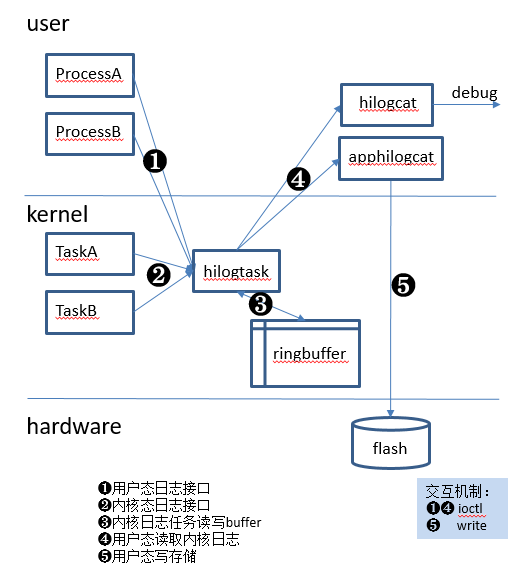

# Hilog\_lite组件介绍<a name="ZH-CN_TOPIC_0000001078674780"></a>

-   [简介](#s9c9ad6e6d5494719ad0f6630a0a1add4)
-   [目录](#s4edd47ec6791449aa2d6362fed84325e)
-   [约束](#s7f347323ea45437ca31edae5c10f2991)
-   [使用-轻量系统](#sd6e99f792bc942f9bb5aa92111be7aff)
-   [使用-小型系统](#s33e0a62bc1dd4a2a9578fc22bd023f11)
-   [涉及仓](#s999c697ebde345449386ce8dc1df1db0)

## 简介<a name="s9c9ad6e6d5494719ad0f6630a0a1add4"></a>

提供DFX子系统在轻量系统和小型系统的流水日志功能。

## 目录<a name="s4edd47ec6791449aa2d6362fed84325e"></a>

**表 1**  DFX子系统hilog\_lite组件代码目录结构

<a name="ta443dcf0f0dd4e07834b95e031c9fb12"></a>
<table><thead align="left"><tr id="ra41be074cf4949d284a843a90e781f33"><th class="cellrowborder" valign="top" width="30.34%" id="mcps1.2.3.1.1"><p id="a727aecc17b674751a9d5d7ebdd391310"><a name="a727aecc17b674751a9d5d7ebdd391310"></a><a name="a727aecc17b674751a9d5d7ebdd391310"></a>名称</p>
</th>
<th class="cellrowborder" valign="top" width="69.66%" id="mcps1.2.3.1.2"><p id="ad32d72628b854c53ae4b7c54edfc8afe"><a name="ad32d72628b854c53ae4b7c54edfc8afe"></a><a name="ad32d72628b854c53ae4b7c54edfc8afe"></a>描述</p>
</th>
</tr>
</thead>
<tbody><tr id="rc4c61aa63a33430fb82263e2bda83e02"><td class="cellrowborder" valign="top" width="30.34%" headers="mcps1.2.3.1.1 "><p id="a08bb3cab9f18422bbebabac53be94111"><a name="a08bb3cab9f18422bbebabac53be94111"></a><a name="a08bb3cab9f18422bbebabac53be94111"></a>interfaces/native/kits/hilog</p>
</td>
<td class="cellrowborder" valign="top" width="69.66%" headers="mcps1.2.3.1.2 "><p id="a4603eff664a64d7e80db8d890957522c"><a name="a4603eff664a64d7e80db8d890957522c"></a><a name="a4603eff664a64d7e80db8d890957522c"></a>小型系统流水日志对外接口定义</p>
</td>
</tr>
<tr id="rf932828a7faa477e894fc6ac1405c5c2"><td class="cellrowborder" valign="top" width="30.34%" headers="mcps1.2.3.1.1 "><p id="aa165ba46894b44e396163892a274c308"><a name="aa165ba46894b44e396163892a274c308"></a><a name="aa165ba46894b44e396163892a274c308"></a>interfaces/native/kits/hilog_lite</p>
</td>
<td class="cellrowborder" valign="top" width="69.66%" headers="mcps1.2.3.1.2 "><p id="af97241f84b4649de924f32608d0298da"><a name="af97241f84b4649de924f32608d0298da"></a><a name="af97241f84b4649de924f32608d0298da"></a>轻量系统流水日志对外接口定义</p>
</td>
</tr>
<tr id="r81c09daddf724dc088992dc6fb5caeae"><td class="cellrowborder" valign="top" width="30.34%" headers="mcps1.2.3.1.1 "><p id="a915128b09aeb4e25b1f7aba042c42459"><a name="a915128b09aeb4e25b1f7aba042c42459"></a><a name="a915128b09aeb4e25b1f7aba042c42459"></a>services/hilogcat</p>
</td>
<td class="cellrowborder" valign="top" width="69.66%" headers="mcps1.2.3.1.2 "><p id="a7645a6df6f164244b3292347b1f7ad04"><a name="a7645a6df6f164244b3292347b1f7ad04"></a><a name="a7645a6df6f164244b3292347b1f7ad04"></a>小型系统流水日志相关服务和命令</p>
</td>
</tr>
<tr id="r4fa9d620df3c4e24bd1a94c79ccabcae"><td class="cellrowborder" valign="top" width="30.34%" headers="mcps1.2.3.1.1 "><p id="a95c8bfabb4424e38a11d03a59162ae14"><a name="a95c8bfabb4424e38a11d03a59162ae14"></a><a name="a95c8bfabb4424e38a11d03a59162ae14"></a>services/apphilogcat</p>
</td>
<td class="cellrowborder" valign="top" width="69.66%" headers="mcps1.2.3.1.2 "><p id="a25c0853c8d0446839ea2b900856696cd"><a name="a25c0853c8d0446839ea2b900856696cd"></a><a name="a25c0853c8d0446839ea2b900856696cd"></a>小型系统流水日志落盘服务</p>
</td>
</tr>
<tr id="r0a82ab924ac24725bcb24cf3fa523010"><td class="cellrowborder" valign="top" width="30.34%" headers="mcps1.2.3.1.1 "><p id="aba63f8bc7c0a469f94e6f8d177b5c91c"><a name="aba63f8bc7c0a469f94e6f8d177b5c91c"></a><a name="aba63f8bc7c0a469f94e6f8d177b5c91c"></a>command</p>
</td>
<td class="cellrowborder" valign="top" width="69.66%" headers="mcps1.2.3.1.2 "><p id="a1f274cd4df2949589ebe8a29c4e9a241"><a name="a1f274cd4df2949589ebe8a29c4e9a241"></a><a name="a1f274cd4df2949589ebe8a29c4e9a241"></a>轻量系统日志查询命令</p>
</td>
</tr>
<tr id="rb359a73bb38e47c8952cf3a809b7d38d"><td class="cellrowborder" valign="top" width="30.34%" headers="mcps1.2.3.1.1 "><p id="a3a7a4fbfa61e45a5ba3bc4c4af4d82c2"><a name="a3a7a4fbfa61e45a5ba3bc4c4af4d82c2"></a><a name="a3a7a4fbfa61e45a5ba3bc4c4af4d82c2"></a>frameworks/featured</p>
</td>
<td class="cellrowborder" valign="top" width="69.66%" headers="mcps1.2.3.1.2 "><p id="a307bdb53cf7545d4bd663fb62dd0ca38"><a name="a307bdb53cf7545d4bd663fb62dd0ca38"></a><a name="a307bdb53cf7545d4bd663fb62dd0ca38"></a>小型系统流水日志接口实现</p>
</td>
</tr>
<tr id="rbb7fc424f05a4df181595f633455e8a8"><td class="cellrowborder" valign="top" width="30.34%" headers="mcps1.2.3.1.1 "><p id="a32392112d5b04f7e8baceca6353b9ecf"><a name="a32392112d5b04f7e8baceca6353b9ecf"></a><a name="a32392112d5b04f7e8baceca6353b9ecf"></a>frameworks/mini</p>
</td>
<td class="cellrowborder" valign="top" width="69.66%" headers="mcps1.2.3.1.2 "><p id="af1f91dea1e6b46dd983e659f936f22a7"><a name="af1f91dea1e6b46dd983e659f936f22a7"></a><a name="af1f91dea1e6b46dd983e659f936f22a7"></a>轻量系统流水日志接口实现</p>
</td>
</tr>
</tbody>
</table>

## 约束<a name="s7f347323ea45437ca31edae5c10f2991"></a>

轻量系统整体代码使用标准C开发。

## 使用-轻量系统<a name="sd6e99f792bc942f9bb5aa92111be7aff"></a>

-   **以下以A模块为例说明如何添加模块并进行日志打印。**
    1.  **第一步添加模块ID**

        在“base/hiviewdfx/hilog\_lite/interfaces/native/kits/hilog\_lite/hiview\_log.h“中添加HILOG\_MODULE\_A定义。

        ```
        typedef enum {
            /** DFX */    
            HILOG_MODULE_HIVIEW = 0,    
            /** System Module A */    
            HILOG_MODULE_A,    
            /** Maximum number of modules */
            HILOG_MODULE_MAX
        } HiLogModuleType;
        ```


    1.  **第二步模块注册**

        在A模块的初始化流程中添加如下代码，注册模块到日志框架中：

        ```
        HiLogRegisterModule(HILOG_MODULE_A, "A");
        ```


    1.  **第三步日志打印**

        在需要打印日志的.c文件中 \#include "log.h"，调用如下接口：

        HILOG\_INFO\(HILOG\_MODULE\_A,“log test: %d”, 88\);

        接口参数说明：

        <a name="tb0e7329d09184f109c0cae274325b2f1"></a>
        <table><thead align="left"><tr id="r74cdd06495cb4915ad894e023deff4b2"><th class="cellrowborder" valign="top" width="11.57%" id="mcps1.1.5.1.1"><p id="a8cfadf9da95144fd8a9eb9dbd1362b89"><a name="a8cfadf9da95144fd8a9eb9dbd1362b89"></a><a name="a8cfadf9da95144fd8a9eb9dbd1362b89"></a>参数名</p>
        </th>
        <th class="cellrowborder" valign="top" width="11.83%" id="mcps1.1.5.1.2"><p id="afa5ef86b0da84d6db423e3026452c36e"><a name="afa5ef86b0da84d6db423e3026452c36e"></a><a name="afa5ef86b0da84d6db423e3026452c36e"></a>是否必填</p>
        </th>
        <th class="cellrowborder" valign="top" width="15.21%" id="mcps1.1.5.1.3"><p id="a9af4eafce7f64e28b91d13840b0ebcbe"><a name="a9af4eafce7f64e28b91d13840b0ebcbe"></a><a name="a9af4eafce7f64e28b91d13840b0ebcbe"></a>参数类型</p>
        </th>
        <th class="cellrowborder" valign="top" width="61.39%" id="mcps1.1.5.1.4"><p id="abeeb3a23760d45939183b063ebd23980"><a name="abeeb3a23760d45939183b063ebd23980"></a><a name="abeeb3a23760d45939183b063ebd23980"></a>参数说明</p>
        </th>
        </tr>
        </thead>
        <tbody><tr id="r7e6639aad87e416ab86b866f8e41f99e"><td class="cellrowborder" valign="top" width="11.57%" headers="mcps1.1.5.1.1 "><p id="a2e815fd48b364454993f15e71fe77098"><a name="a2e815fd48b364454993f15e71fe77098"></a><a name="a2e815fd48b364454993f15e71fe77098"></a>mod</p>
        </td>
        <td class="cellrowborder" valign="top" width="11.83%" headers="mcps1.1.5.1.2 "><p id="a69360b58343843629f44854149aedac6"><a name="a69360b58343843629f44854149aedac6"></a><a name="a69360b58343843629f44854149aedac6"></a>是</p>
        </td>
        <td class="cellrowborder" valign="top" width="15.21%" headers="mcps1.1.5.1.3 "><p id="a73824d7214b945baa2e8ed3cfc8ec3d2"><a name="a73824d7214b945baa2e8ed3cfc8ec3d2"></a><a name="a73824d7214b945baa2e8ed3cfc8ec3d2"></a>uint8</p>
        </td>
        <td class="cellrowborder" valign="top" width="61.39%" headers="mcps1.1.5.1.4 "><p id="a306257d426c040ebb352413f0ad22730"><a name="a306257d426c040ebb352413f0ad22730"></a><a name="a306257d426c040ebb352413f0ad22730"></a>模块\服务的ID。</p>
        <p id="ac6cda7a8fb154e08bb81c97c329c12e6"><a name="ac6cda7a8fb154e08bb81c97c329c12e6"></a><a name="ac6cda7a8fb154e08bb81c97c329c12e6"></a>统一规划分配，最大支持64个，其中第三方APP统一使用HILOG_MODULE_APP作为模块ID。</p>
        </td>
        </tr>
        <tr id="r94a3462cd6a2429baabd1f1c2ec46868"><td class="cellrowborder" valign="top" width="11.57%" headers="mcps1.1.5.1.1 "><p id="a1d00ea1c726040b4b018fb84f30ea0a7"><a name="a1d00ea1c726040b4b018fb84f30ea0a7"></a><a name="a1d00ea1c726040b4b018fb84f30ea0a7"></a>fmt</p>
        </td>
        <td class="cellrowborder" valign="top" width="11.83%" headers="mcps1.1.5.1.2 "><p id="a41bdb7eaba30400e876efbef6fd419ea"><a name="a41bdb7eaba30400e876efbef6fd419ea"></a><a name="a41bdb7eaba30400e876efbef6fd419ea"></a>是</p>
        </td>
        <td class="cellrowborder" valign="top" width="15.21%" headers="mcps1.1.5.1.3 "><p id="a29306f4446424bc1878e6ec62d528725"><a name="a29306f4446424bc1878e6ec62d528725"></a><a name="a29306f4446424bc1878e6ec62d528725"></a>char *</p>
        </td>
        <td class="cellrowborder" valign="top" width="61.39%" headers="mcps1.1.5.1.4 "><p id="aa050915fc17e4308a596eac11126f7f1"><a name="aa050915fc17e4308a596eac11126f7f1"></a><a name="aa050915fc17e4308a596eac11126f7f1"></a>格式化输出字符串。</p>
        <p id="a0b8e453d8f79476f836d740bf321f248"><a name="a0b8e453d8f79476f836d740bf321f248"></a><a name="a0b8e453d8f79476f836d740bf321f248"></a>1、  最大支持6个可变参数，不支持%s。</p>
        <p id="a965a11a4bc1d4051b6df1e6e7379b691"><a name="a965a11a4bc1d4051b6df1e6e7379b691"></a><a name="a965a11a4bc1d4051b6df1e6e7379b691"></a>2、  格式化后的单条日志最大长度128字节，超过将无法打印。</p>
        </td>
        </tr>
        <tr id="r6332c90d65704e7e86f4d621a9fcfe74"><td class="cellrowborder" valign="top" width="11.57%" headers="mcps1.1.5.1.1 "><p id="a518fca3b03cb4431bb83b3eaa9309eb1"><a name="a518fca3b03cb4431bb83b3eaa9309eb1"></a><a name="a518fca3b03cb4431bb83b3eaa9309eb1"></a>可变参</p>
        </td>
        <td class="cellrowborder" valign="top" width="11.83%" headers="mcps1.1.5.1.2 "><p id="aa5fbcb8d1d8742a39ee76b96ef6d4d56"><a name="aa5fbcb8d1d8742a39ee76b96ef6d4d56"></a><a name="aa5fbcb8d1d8742a39ee76b96ef6d4d56"></a>否</p>
        </td>
        <td class="cellrowborder" valign="top" width="15.21%" headers="mcps1.1.5.1.3 "><p id="a6f4d9ca5beaa4e8187e6b50d478af7eb"><a name="a6f4d9ca5beaa4e8187e6b50d478af7eb"></a><a name="a6f4d9ca5beaa4e8187e6b50d478af7eb"></a>int32</p>
        </td>
        <td class="cellrowborder" valign="top" width="61.39%" headers="mcps1.1.5.1.4 "><p id="a7ebc1ecb043044d08dba95031abc5700"><a name="a7ebc1ecb043044d08dba95031abc5700"></a><a name="a7ebc1ecb043044d08dba95031abc5700"></a>仅支持数字类型，最大支持6个变参。</p>
        </td>
        </tr>
        </tbody>
        </table>


## 使用-小型系统<a name="s33e0a62bc1dd4a2a9578fc22bd023f11"></a>

**Native C/C++接口**

hilog  可用API

```
HILOG_DEBUG(type, ...)
HILOG_INFO(type, ...)
HILOG_WARN(type, ...)
HILOG_ERROR(type, ...)
HILOG_FATAL(type, ...)
```

使用介绍

1. 首先需要定义TAG。

2. 本地调试，可以临时使用domain数值 0。

3. 包含头文件：\#include <hilog/log.h\>

4. 在BUILD.gn中添加依赖库 libhilog。

接口规则介绍：

1. 格式化字符串默认是非隐私 HILOGI\("Hello World\\n"\); \>\> Hello World

2. 格式化参数默认是隐私 HILOGI\("Age is %d\\n", 10\); \>\> Age is <private\>

3. %\{private\}标识的参数是隐私 HILOGI\("Age is %\{private\}d\\n", 10\); \>\> Age is <private\>

4. %\{public\}标识的参数是非隐私 HILOGI\("Age is %\{public\}d\\n", 10\); \>\>Age is 10

接口参数介绍

<a name="t3027cfdb064a423d815607ebc0790c5b"></a>
<table><thead align="left"><tr id="r7c745f75ae7c4caca52d02b8ea7d922f"><th class="cellrowborder" valign="top" width="25.94%" id="mcps1.1.3.1.1"><p id="ae90a5f6e584048898aca3c9e8b92546a"><a name="ae90a5f6e584048898aca3c9e8b92546a"></a><a name="ae90a5f6e584048898aca3c9e8b92546a"></a>参数名字</p>
</th>
<th class="cellrowborder" valign="top" width="74.06%" id="mcps1.1.3.1.2"><p id="add5f3970c65244a2af03fbbbb4e8dd9f"><a name="add5f3970c65244a2af03fbbbb4e8dd9f"></a><a name="add5f3970c65244a2af03fbbbb4e8dd9f"></a>参数含义</p>
</th>
</tr>
</thead>
<tbody><tr id="r2046ed95b2bf458e8ef3425b6c597174"><td class="cellrowborder" valign="top" width="25.94%" headers="mcps1.1.3.1.1 "><p id="a1feb6efbb48547d28a8e71ee0a61242a"><a name="a1feb6efbb48547d28a8e71ee0a61242a"></a><a name="a1feb6efbb48547d28a8e71ee0a61242a"></a>domain</p>
</td>
<td class="cellrowborder" valign="top" width="74.06%" headers="mcps1.1.3.1.2 "><p id="a8027bbc4329d4d32a7a45b294531d213"><a name="a8027bbc4329d4d32a7a45b294531d213"></a><a name="a8027bbc4329d4d32a7a45b294531d213"></a>领域标识ID</p>
</td>
</tr>
<tr id="rdbcb919a55204f55b16c186c625c493f"><td class="cellrowborder" valign="top" width="25.94%" headers="mcps1.1.3.1.1 "><p id="a716122a0fa304d089dcd248301a5b7e4"><a name="a716122a0fa304d089dcd248301a5b7e4"></a><a name="a716122a0fa304d089dcd248301a5b7e4"></a>tag</p>
</td>
<td class="cellrowborder" valign="top" width="74.06%" headers="mcps1.1.3.1.2 "><p id="a527cd7253b79449cadba49bae525d7e9"><a name="a527cd7253b79449cadba49bae525d7e9"></a><a name="a527cd7253b79449cadba49bae525d7e9"></a>日志tag</p>
</td>
</tr>
<tr id="ree2e47f74c664e66930f773a88c5955d"><td class="cellrowborder" valign="top" width="25.94%" headers="mcps1.1.3.1.1 "><p id="a3b7919fb6fe349cda481b7e49809c9b1"><a name="a3b7919fb6fe349cda481b7e49809c9b1"></a><a name="a3b7919fb6fe349cda481b7e49809c9b1"></a>isFmtPrivate</p>
</td>
<td class="cellrowborder" valign="top" width="74.06%" headers="mcps1.1.3.1.2 "><p id="ae858f47965f442298e5200b9db805c2f"><a name="ae858f47965f442298e5200b9db805c2f"></a><a name="ae858f47965f442298e5200b9db805c2f"></a>标识格式化字符串fmt是否是隐私,是yes时fmt会被认为是隐私</p>
</td>
</tr>
<tr id="r7c847c32fa1d42b98a6321aa03683f9b"><td class="cellrowborder" valign="top" width="25.94%" headers="mcps1.1.3.1.1 "><p id="a5af240669e8649a1a979655a2c4fc904"><a name="a5af240669e8649a1a979655a2c4fc904"></a><a name="a5af240669e8649a1a979655a2c4fc904"></a>fmt</p>
</td>
<td class="cellrowborder" valign="top" width="74.06%" headers="mcps1.1.3.1.2 "><p id="a9a09fcea9ba54456bb9769dd5fccd8f2"><a name="a9a09fcea9ba54456bb9769dd5fccd8f2"></a><a name="a9a09fcea9ba54456bb9769dd5fccd8f2"></a>格式化字符串</p>
</td>
</tr>
<tr id="ra7a3bc01bac24a97b5296680ea5ec315"><td class="cellrowborder" valign="top" width="25.94%" headers="mcps1.1.3.1.1 "><p id="a4158d666b3e84d1c95ae796afd9371a2"><a name="a4158d666b3e84d1c95ae796afd9371a2"></a><a name="a4158d666b3e84d1c95ae796afd9371a2"></a>args</p>
</td>
<td class="cellrowborder" valign="top" width="74.06%" headers="mcps1.1.3.1.2 "><p id="ac27db004bb6b4e21aebe139c89347e11"><a name="ac27db004bb6b4e21aebe139c89347e11"></a><a name="ac27db004bb6b4e21aebe139c89347e11"></a>格式化字符串参数</p>
</td>
</tr>
</tbody>
</table>

**日志查看**

1.  debug版本hilog日志会保存到/storage/data/log/目录下面。

2.  可以执行hilogcat实时查看hilog日志。


**日志系统架构**



1.  hilogtask流水日志的内核任务。
    -   此功能是一个linux内核的任务或者线程，在系统启动时初始化。
    -   当内核中一个模块调用它的日志接口，将格式化好的日志内容传输给改任务，并将其存储在一个环形缓冲区中 。
    -   当用户态调用日志接口，将格式化好的日志内容通过ioctl调用写入驱动节点，驱动节点再将日志内容发送到hilogtask，hilogtask将日志内容存储到环形缓冲区中。

2.  hilogcatd用户态日志存储服务。
    -   这是一个用户态的进程，负责定时将内核的ringbuffer读取出来，存储到日志文件中。
    -   日志文件输出支持gzip压缩，使用zlib
    -   存储文件的单个文件大小，文件个数可在编译时配置。

3.  hilogcat日志查看命令行工具。

    从内核驱动接口读取ringbuffer内容，输出到标准输出。

4.  支持日志缓冲区可配置。
    -   编译时可以配置日志缓冲区的大小。


## 涉及仓<a name="s999c697ebde345449386ce8dc1df1db0"></a>

[DFX子系统](https://gitee.com/openharmony/docs/blob/master/zh-cn/readme/DFX%E5%AD%90%E7%B3%BB%E7%BB%9F.md)

**hiviewdfx\_hilog\_lite**

[hiviewdfx\_hiview\_lite](https://gitee.com/openharmony/hiviewdfx_hiview_lite/blob/master/README_zh.md)

[hiviewdfx\_hievent\_lite](https://gitee.com/openharmony/hiviewdfx_hievent_lite/blob/master/README_zh.md)
