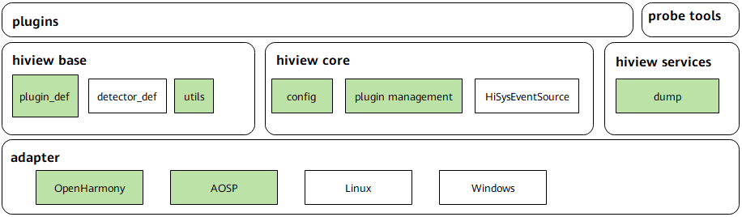
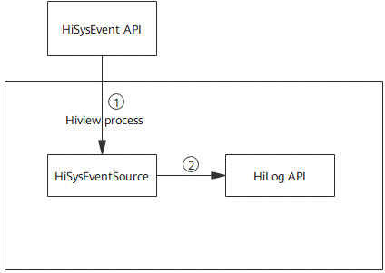

# Hiview<a name="EN-US_TOPIC_0000001162254005"></a>

-   [Introduction](#section1289063163919)
-   [Directory Structure](#section16611433113712)
-   [Constraints](#section7147138193814)
-   [Contribution](#section10404153013381)
-   [Usage](#section1046874983819)
-   [Repositories Involved](#section16647142611396)

## Introduction<a name="section1289063163919"></a>

Hiview is the module of OpenHarmony that provides toolkits for device maintenance across different platforms.

Currently, Hiview opens only the plug-in management platform and system event source capabilities.

**Figure 1**  Architecture of Hiview



Hiview consists of the following components:

adapter: operating system adaptation layer, which adapts APIs of the system services in use

hiview base: Hiview base definition, which provides the plug-in definition, detector definition, and utility class

hiview core: Hiview core module, which provides the plug-in configuration, plug-in management, and event source functions

hiview services: Hiview services. Currently, only the Hiview run information exporting function is provided.

plugins: Independent service modules.

Hiview works in event-driven mode. The core of Hiview is a collection of HiSysEvent stubs distributed in the system.

Formatted events are reported to Hiview through the  **HiSysEvent**  API for processing. Figure 2 shows the data interaction process.

**Figure 2**  Data interaction between Hiview modules



1. The application framework and system services report system events using the  **HiSysEvent**  API.

2. HiSysEventSource reads events and prints the events to logs.

## Directory Structure<a name="section16611433113712"></a>

The code directory structure of Hiview is as follows:

```
/base/hiviewdfx/hiview
├── adapter             # Platform adaptation code
│   ├── service        # Service adaptation code
│   └── system_service # System API adaptation code
├── base                # Module definition and utility class
│   └── utility
├── build               # Compilation scripts
├── include             # Common definitions
├── core                # Plug-in management
└── service             # Platform services
```

## Constraints<a name="section7147138193814"></a>

Use of C++14 features requires libc of C++14 or later.

## Contribution<a name="section10404153013381"></a>

If you are interested in Hiview and want to become a contributor, refer to the  _Code Contribution Guide_.

## Usage<a name="section1046874983819"></a>

Hiview automatically starts with the device and loads plug-ins based on the configuration file.

## Repositories Involved<a name="section16647142611396"></a>

[DFX subsystem](https://gitee.com/openharmony/docs/blob/master/en/readme/dfx.md)

**hiviewdfx\_hiview**

[hiviewdfx\_hilog](https://gitee.com/openharmony/hiviewdfx_hilog/blob/master/README.md)

[hiviewdfx\_hiappevent](https://gitee.com/openharmony/hiviewdfx_hiappevent/blob/master/README.md)

[hiviewdfx\_hisysevent](https://gitee.com/openharmony/hiviewdfx_hisysevent/blob/master/README.md)

[hiviewdfx\_faultloggerd](https://gitee.com/openharmony/hiviewdfx_faultloggerd/blob/master/README.md)

[hiviewdfx\_hilog\_lite](https://gitee.com/openharmony/hiviewdfx_hilog_lite/blob/master/README.md)

[hiviewdfx\_hievent\_lite](https://gitee.com/openharmony/hiviewdfx_hievent_lite/blob/master/README.md)

[hiviewdfx\_hiview\_lite](https://gitee.com/openharmony/hiviewdfx_hiview_lite/blob/master/README.md)

