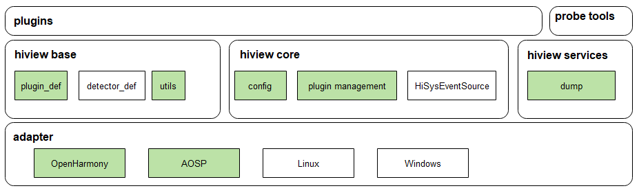
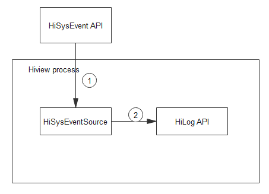

# Hiview组件<a name="ZH-CN_TOPIC_0000001162254005"></a>

-   [简介](#section1289063163919)
-   [目录](#section16611433113712)
-   [约束](#section7147138193814)
-   [贡献](#section10404153013381)
-   [使用](#section1046874983819)
-   [相关仓](#section16647142611396)

## 简介<a name="section1289063163919"></a>

Hiview是一个跨平台的终端设备维测服务集。

目前开源部分仅包含插件管理平台和系统事件源。

**图1**.Hiview模块架构图



Hiview由框架和插件组成，分别为：

操作系统适配层\(adapter\)，对使用的系统服务的接口进行适配。

Hiview基础定义\(hiview base\)，包括插件的定义，检测器的定义以及工具类。

Hiview的核心模块\(hiview core\)，包括插件配置，插件管理以及事件源。

Hiview服务\(hiview services\)，目前仅包括hiview运行信息导出功能。

Hiview插件\(plugins\)，为独立功能的业务模块。

Hiview维测服务是由事件驱动的，其核心为分布在系统各处的HiSysEvent桩点。

格式化的事件通过HiSysEvent API上报至hiview进行处理，其基本流程如图2。

**图2**.Hiview模块数据交互图



1.应用框架、系统服务使用HiSysEvent组件上报系统事件信息。

2.Hiview中HiSysEventSource读取事件，并打印到流水日志中。

## 目录<a name="section16611433113712"></a>

Hiview源代码目录结构如下：

```
/base/hiviewdfx/hiview.
├── adapter             #平台适配
│   ├── service        #服务适配
│   └── system_service #系统接口适配
├── base                #模块定义，工具类
│   └── utility
├── build               #编译脚本
├── include             #公共定义
├── core                #插件管理
└── service             #平台服务 
```

## 约束<a name="section7147138193814"></a>

使用C++14的特性，依赖C++14及以上的libc实现。

## 贡献<a name="section10404153013381"></a>

如果您对Hiview感兴趣并想加入Hiview的开发并成为代码贡献者，请参考代码贡献指南。

## 使用<a name="section1046874983819"></a>

Hiview服务随设备启动自动启动，按配置文件加载插件。

详细使用见[HiView插件开发指导](hiview_zh.md)

## 相关仓<a name="section16647142611396"></a>

[DFX子系统](https://gitee.com/openharmony/docs/blob/master/zh-cn/readme/DFX%E5%AD%90%E7%B3%BB%E7%BB%9F.md)

**hiviewdfx\_hiview**

[hiviewdfx\_hilog](https://gitee.com/openharmony/hiviewdfx_hilog/blob/master/README_zh.md)

[hiviewdfx\_hiappevent](https://gitee.com/openharmony/hiviewdfx_hiappevent/blob/master/README_zh.md)

[hiviewdfx\_hisysevent](https://gitee.com/openharmony/hiviewdfx_hisysevent/blob/master/README_zh.md)

[hiviewdfx\_faultloggerd](https://gitee.com/openharmony/hiviewdfx_faultloggerd/blob/master/README_zh.md)

[hiviewdfx\_hilog\_lite](https://gitee.com/openharmony/hiviewdfx_hilog_lite/blob/master/README_zh.md)

[hiviewdfx\_hievent\_lite](https://gitee.com/openharmony/hiviewdfx_hievent_lite/blob/master/README_zh.md)

[hiviewdfx\_hiview\_lite](https://gitee.com/openharmony/hiviewdfx_hiview_lite/blob/master/README_zh.md)

