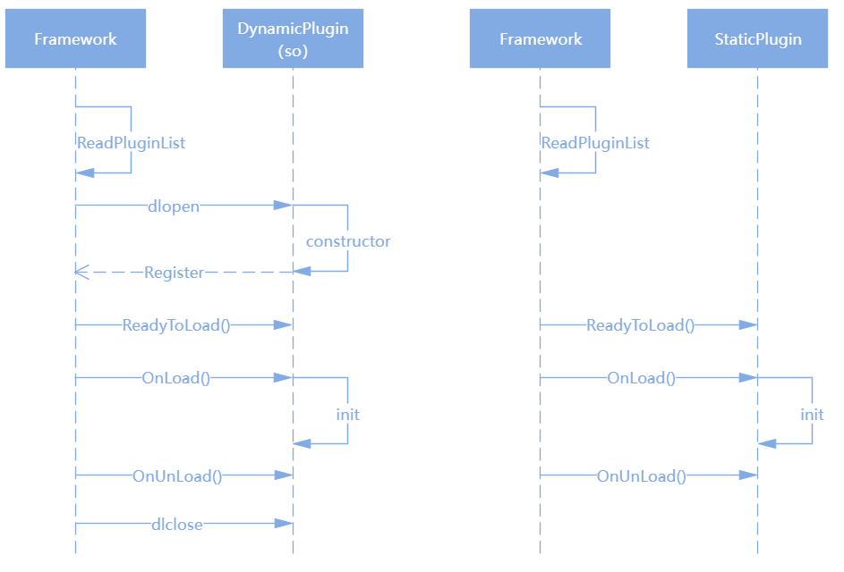

# HiView插件开发指导</a>

-   [概述](#概述)
-   [插件的概念](#插件的概念)
    -   [插件的定义](#插件的定义)
    -   [插件的生命周期](#插件的生命周期)
    -   [插件的注册方式](#插件的注册方式)
    -   [事件源的定义](#事件源的定义)
    -   [插件包的概念](#插件包的概念)
-   [流水线的概念](#流水线的概念)
-   [hiview配置文件](#hiview配置文件)
    -   [平台配置文件](#平台配置文件)
    -   [插件配置文件](#插件配置文件)
-   [插件平台提供的能力](#插件平台提供的能力)
    -   [事件](#事件)
    -   [事件订阅](#事件订阅)
    -   [平台提供的功能接口](#平台提供的功能接口) 
-   [实例解析](#实例解析)
## 概述

Hiview是一个跨平台的终端设备维测服务集，其中是由插件管理平台和插件实现的各自功能构成整套系统。
本文描述了hiview插件开发的全部流程。

## 插件的概念

整节部分包括了插件的概念，事件源的概念，流水线的概念等基本概念

###  插件的定义

hiview插件可以理解为运行在hiview进程中，随hiview二进制一同交付的完成独立功能的维测、故障管理模块。

插件可以是自驱动的事件源，也可以是由外部事件驱动的一般插件。其中事件驱动有两种方式：流水线驱动和订阅查询驱动。

单个插件可以静态加载（永远不会被卸载）和插件代理加载，代理加载其中包含：开机不加载运行时动态加载卸载、开机加载之后再动态卸载加载。

插件选择被代理时插件可以被动态卸载和加载，在已经被卸载的情况下，当外部驱动事件到来以后被加载。

特定的插件是通过继承Plugin这个类实现特定的插件功能，其相对应的插件由多态的形式存在并且流转在插件管理平台中。

事件处理或者驱动插件根据不同需求，需要继承Plugin并且实现如下方法或者使用如下的接口：
```
class Plugin {
public:
    /* 插件生命周期中，当前插件被平台加载起来后调用，可以用于初始化一些数据 */
    virtual void OnLoad();

    /* 插件生命周期中，当前插件被平台卸载前调用，可以用于回收一些数据 */
    virtual void OnUnload();

    /* 运行期判断当前插件是否被加载，返回true是被需要被平台加载；false是将永远不会被平台加载。Plugin默认返回true */
    virtual bool ReadyToLoad()；

    /* 当前插件在流水线上时，接收流水线上外部驱动事件，或者当前插件自己设置的延时事件，并且处理事件。其处理过程是当前插件定义是的线程中，若没有指定则在当前线程进行 */
    virtual bool OnEvent(std::shared_ptr<Event>& event) override;

    /* 当前插件在流水线上，且是当前流水线上第一个插件时，判断是否流转整条流水线。返回true是流转整条流水线；false是不流转整条流水线 */
    virtual bool CanProcessEvent(std::shared_ptr<Event> event) override;

    /* 当前插件在流水线上时，判断当前事件源是否进入暂停状态。返回true是进行处理，将会继续调用插件的OnEvent方法；false将进入事件源PauseDispatch方法，进行处理，然后继续执行后续操作 */
    virtual bool CanProcessMoreEvents() override;

    /* 可以通过hidumper命令行查询当前插件的dump信息，该接口就是实现能dump出来那些内容 */
    virtual void Dump(int fd, const std::vector<std::string>& cmds);

    /* 当前插件最为一个事件动态订阅者，接收通过动态订阅来的外部驱动事件，并且处理事件 */
    virtual void OnEventListeningCallback(const Event &msg);

    // 以下为接口
    /* 当前插件作为动态订阅者时，添加需要订阅的事件。订阅的事件分为依靠eventName订阅和EventIdRange（eventId范围也可以是全范围或者单一id）订阅。type是事件类型 */
    void AddEventListenerInfo(uint32_t type, const EventListener::EventIdRange &range = EventListener::EventIdRange(0));
    void AddEventListenerInfo(uint32_t type, const std::set<EventListener::EventIdRange> &listenerInfo);
    void AddEventListenerInfo(uint32_t type, const std::string& eventName);
    void AddEventListenerInfo(uint32_t type, const std::set<std::string> &eventNames);

    /* 设置延时执行事件 等时间到了以后在OnEvent中执行 */
    void DelayProcessEvent(std::shared_ptr<Event> event, uint64_t delay);

    /* 得到hiview插件管理平台接口的上下文 */
    HiviewContext* GetHiviewContext();

    const std::string& GetName();
    const std::string& GetVersion();
    void SetVersion(const std::string& version);
}
```
### 插件的生命周期

插件目前只有OnLoad和OnUnload两个生命周期回调。

这里的dynamic插件仅仅表示单一插件实体是以so的形式体现，名称为libxxx.z.so。

dynamic插件与上文的动态加载卸载插件没有关系。dynamic插件的so也与[插件包](#插件包的概念)的so也没有关系。

dynamic插件与静态插件没有功能上面的区别，只区别插件的实现形式。

其生命周期调用逻辑如下



### 插件的注册方式：

插件的注册方式有三种：

| 名称 | 说明 | 实例 |
| -------- | -------- | -------- |
| 静态注册 | 通过使用宏定义REGISTER(xxx);注册，该种注册方式的插件不能被卸载 | 实例详见test/plugins/examples/event_processor_example1中的插件 |
| 代理注册 | 通过使用宏定义REGISTER_PROXY(xxx);注册，开机不加载运行时动态加载卸载 | 实例详见test/plugins/examples/event_processor_example3中的插件 |
| 代理注册且开机加载 | 通过使用宏定义REGISTER_PROXY_WITH_LOADED(xxx);注册，开机加载之后再动态卸载加载 | 实例详见test/plugins/examples/event_processor_example4中的插件 |

### 事件源的定义

事件源是继承于EventSource实现特定的事件源功能。事件源也是一种特殊的插件，EventSource继承于[Plugin](#插件的定义)可以实现或者使用其中公共的方法。事件源作为事件的驱动者，不能被代理加载，只能静态加载。

事件源需要继承EventSource这个类实现如下方法或者使用如下的接口，根据需求也需实现[Plugin](#插件的定义)类中的虚方法：
```
class EventSource : public PipelineEventProducer, public Plugin {
public:

    /* 开启事件源，当平台加载完成，加载事件源之后执行，可以用于初始化或者开启一些事件源数据或者事件 */
    virtual void StartEventSource();

    /* 通知事件生产者事件已完成其传递 */
    virtual void Recycle(PipelineEvent* event);

    /* 暂停调度并安排恢复调度 */
    virtual void PauseDispatch(std::weak_ptr<Plugin> plugin);

    //以下为接口
    /* 将事件下发到各个流水线，开始当前事件源下流水线的运作 */
    bool PublishPipelineEvent(std::shared_ptr<PipelineEvent> event);

    /* 动态添加流水线到当前事件源 */
    void AddPipeline(std::shared_ptr<Pipeline> pipeline);
};
```

事件源实例详见test/plugins/examples/event_source_example或者test/plugins/examples_bundle/bundle_event_source_example

### 插件包的概念

根据业务的需求，插件可以不用全部编译在hiview二进制中。支持将若干个插件编译成为独立的插件包，以独立so的形式提供，并且一个so对应于一个plugin_config文件。
例如libxxx.z.so，对应于xxx_plugin_config配置文件。

hiview插件管理平台插件包做如下说明：

1、插件包作为一个独立的个体在插件管理平台中运行，内部插件、流水线或者事件源都与在hiview二进制中的插件没有功能上的差异。

2、插件包中的插件可以插入到hiview二进制中的流水线中。

3、无论在何处的订阅者，根据其订阅的规则都可以收到全平台发送出来的相应事件。

插件包实例详见test/plugins/examples_bundle/，其[插件配置文件](#插件配置文件)详见test/resource/base/bundleplugintest_plugin_config

插件跨包注册流水线实例详见test/plugins/examples_bundle/bundle_plugin_example2中的插件

## 流水线的概念

流水线是用于处理多个插件协同完成任务。流水线上面可以对应多个插件，流水线上面的执行插件的顺序是根据配置文件上写的先后顺序执行。

事件源与流水线的概念对应，关系为一对多关系。一个事件源可以有n个流水线，一个流水线可以有n个插件。

事件源在平台初始化后可以循环的调用PublishPipelineEvent方法将事件源新建的事件向绑定的流水线分发，分发前会向流水线询问是否处理该事件，这里默认使用流水线中的第一个插件的CanProcessEvent接口。如果返回true处理该事件，则会进行后续的处理；如果返回false则当前整条流水线不处理该事件。

流水线处理流程详见整个test/plugins/examples模块，其[插件配置文件](#插件配置文件)详见test/resource/base/holistic_platform/plugin_config

## hiview配置文件

hiview插件管理平台通过“[平台配置文件](#平台配置文件)”配置相关“[插件配置文件](#插件配置文件)”的路径信息、生成日志路径等信息。

### 平台配置文件

“平台配置文件”默认在设备/system/etc/hiview/下面的hiview_platform_config，具体内容如下：
```
DEFAULT_PLUGIN_CONFIG_NAME = "plugin_config"
PLUGIN_CONFIG_FILE_DIR = "/system/etc/hiview/"
DYNAMIC_LIB_SEARCH_DIR = "/system/lib/"
DYNAMIC_LIB64_SEARCH_DIR = "/system/lib64/"
CLOUD_UPDATE_CONFIG_DIR = "/data/system/hiview/"
WORK_DIR = "/data/log/LogService/"
COMMERCIAL_WORK_DIR = "/log/LogService/"
PERSIST_DIR = "/log/hiview/"
```

| 名称 | 说明 |
| -------- | -------- |
| DEFAULT_PLUGIN_CONFIG_NAME | 表示默认的插件配置文件名字，plugin_config表示编译在hiview二进制中插件的配置文件名字，基于此名字 |
| DEFAULT_PLUGIN_CONFIG_NAME | xxx_plugin_config表示编译在libxxx.z.so中插件的配置文件名字 |
| PLUGIN_CONFIG_FILE_DIR | 表示插件配置文件所在的位置 |
| DYNAMIC_LIB_SEARCH_DIR | 表示插件包在32位系统中的位置 |
| DYNAMIC_LIB64_SEARCH_DIR | 表示插件包在64位系统中的位置 |
| CLOUD_UPDATE_CONFIG_DIR | 云更新目录 |
| WORK_DIR | 工作日志路径 |
| PERSIST_DIR | 持久日志路径 |

### 插件配置文件

在hiview二进制中的插件需要通过编写build/plugin_build.json文件来配置相关信息，编译的时候会自动生成plugin_config文件。

插件配置需要考虑下面几个部分的内容：

| 名称 | 说明 |
| -------- | -------- |
| 插件信息 | 包含插件类的名称、插件对应的gn的路径、gn中编译的名称 |
| 平台配置规则 | 包含对应的rom、ram、加载时间等信息 |
| 插件加载的顺序 | 平台将安装配置的先后顺序加载。优先根据加载时间排序，若加载时间相同、则按照配置的顺序加载。 |
| 流水线配置 | 如果插件参与流水线，将插件配置到相应的流水线下 |
| 流水线组（事件源）的配置 | 将流水线配置到对应的事件源下面 |
| 线程配置模型 | 配置插件是否需要线程 |

实例plugin_build.json如下：
```
{
    "plugins": {                                # 插件列表信息
        "SysEventSource": {                     # 插件名，必须为对应的类名（事件源也是插件，也需要在此配置）
            "path": "core",                     # 插件位置，插件gn所在的位置
            "name": "sysevent_source"           # 插件的编译名，在gn中插件所对应的部分的编译名
        },
        "SysEventService": {
            "path": "plugins/eventservice",
            "name": "sys_event_service"
        },
        "Faultlogger": {
            "path": "plugins/faultlogger",
            "name": "faultlogger"
        },
        "EventLogger": {
            "path": "plugins/eventlogger",
            "name": "eventlogger"
        },
    },
    "rules": [                                  # 平台平台配置规则列表
        {
            "rule": [
                {
                    "rom": "1G",                # rom规则
                    "ram": "1G"                 # ram规则
                }
            ],
            "info": {
                "loadorder": {                  # 插件的载入时间配置列表
                    "SysEventSource": {         # 插件名称，与上面"plugins"列表中的插件名称对应
                        "loadtime": 0           # 当前插件延时多少时间之后加载，为0就是立即加载
                    },                          # 插件加载顺序，先按加载时间先后加载，然后按照当前列表顺序加载。
                    "Faultlogger": {
                        "loadtime": 0
                    },
                    "EventLogger": {
                        "loadtime": 0
                    },
                    "SysEventService": {
                        "loadtime": 0
                    }
                },
                "pipelines": {                  # 流水线配置列表
                    "SysEventPipeline": [       # 流水线名称
                        "SysEventService",      # 流水线中的插件，与上面"plugins"列表中的插件名称对应
                        "Faultlogger",          # 流水线中插件的执行顺序按照列表中先后顺序执行
                        "EventLogger"
                    ]
                },
                "pipelinegroups": {             # 流水线组（事件源）配置列表
                    "SysEventSource": [         # 事件源名称，与上面"plugins"列表中的插件名称对应
                        "SysEventPipeline"
                    ]
                },
                "threads": {                                    # 流线程配置模型列表
                    "singledthread": {                          # 独享线程模式
                        "SysEventSource": "sysevent_source",    # 将对应插件配置，名为"sysevent_source"的线程
                        "SysEventService": "sysevent_service",  # 独享线程模式
                    },
                    "sharedthread": {
                        "sharedthread1": ["Faultlogger", "EventLogger"]    #当前两个插件共享一个名为"sharedthread1"的线程
                    }
                }
            }
        }
    ]
}
```

在独立插件包的插件配置文件，由于插件实体可以不参与整体hiview的编译，所以直接编写xxx_plugin_config配置文件。不编写plugin_build.json

plugin_config实例完整文件可以参考test/resource/base/plugin_config，文件讲解如下：
```
plugins:7                                                       // 插件总数是七个，与下面插件个数必须对应
EventProcessorExample4[thread:t-example-2]:0 static             // 插件名称[thread:线程名称]:加载时间 插件模式
EventProcessorExample1[thread:t-example-4]:0 static             // 插件名称必须是类名
EventProcessorExample2[thread:t-example-1]:0 static             // 线程名称一样表示这两个插件共享线程，中括号内为空表示不配置线程
EventProcessorExample3[thread:t-example-4]:0 static             // 加载时间，延时多长时间以后加载，0为立马加载
EventProcessorExample5[]:0 static                               // 插件加载的顺序先按照加载时间顺序，然后在按照当前配置顺序加载
EventSourceExample[thread:t-example-3]:0 static                 // 插件模式，static表示当前插件实体静态的编译在hiview二进制中
DynamicLoadPluginExample[thread:t-example-5]:0 dynamic          // 插件模式，dynamic表示当前插件实体是以so的形式体现，名称为libDynamicLoadPluginExample.z.so
pipelines:3                                                     // 表示当前流水线有三个，与下面流水线个数必须对应
NormalPipeline:EventProcessorExample1 EventProcessorExample2 EventProcessorExample3 EventProcessorExample4      // 流水线名称:插件1 插件2 插件3 插件4（插件名需要与上面定义的插件对应）
ReversePipeline:EventProcessorExample4 EventProcessorExample3 EventProcessorExample2 EventProcessorExample1     // 流水线上插件的执行顺序是按照这个的先后顺序
SimplePipeline:EventProcessorExample3 EventProcessorExample2                                                    // 流水线名称注意不要跟其他包的流水线重复
pipelinegroups:1                                                    // 流水线组（事件源）列表，该表示，事件源有1个
EventSourceExample:NormalPipeline ReversePipeline SimplePipeline    // 事件源:流水线1 流水线2 流水线3 （流水线名需要与上面定义的流水线对应）
                                                                    // 事件源执行流程，按照先后顺序执行流水线，每个流水线按其在的插件的顺序执行
                                                                    // 前一个插件流水线中所以的插件执行完毕，才能只能下一个流水线
```

## 插件平台提供的能力

### 事件

插件与插件之间，插件与平台之间的交互均采用事件驱动的模式，事件定义请参考文件base/include/event.h，这里不详细讲解。

事件预定义的若干类型，在Event::MessageType中，业务也可以在\include\public_defines.h中定义自己的事件类型。

### 事件订阅

插件与插件之间，或者插件与单独的订阅者模块之间，可以通过事件订阅的方式进行交互。

事件订阅分为两种：

一种是单独的订阅者模式EventListener，该模式可以单独形成一个EventListener模块专门订阅事件、处理事件的小模块；也可以被插件继承用于插件监听事件，当插件选择这种监听模式将不能被动态加载和卸载

需要继承EventListener并且实现如下方法或者使用如下的接口：
```
class EventListener {
public:
    /* 该方法已经弃用，为了兼容以前的代码没有删除，新代码中不需要实现 */
    virtual bool OnOrderedEvent(const Event &msg);

    /* 该方法为接收订阅来的外部驱动事件，并且处理事件 */
    virtual void OnUnorderedEvent(const Event &msg) = 0;

    /* 该方法为定义当前订阅者的名字 */
    virtual std::string GetListenerName() = 0;

    // 以下为接口
    /* 添加需要订阅的事件。订阅的事件分为依靠eventName订阅和EventIdRange（eventId范围也可以是全范围或者单一id）订阅。type是事件类型 */
    void AddListenerInfo(uint32_t type, const EventListener::EventIdRange &range = EventListener::EventIdRange(0));
    void AddListenerInfo(uint32_t type, const std::set<EventListener::EventIdRange> &listenerInfo);
    void AddListenerInfo(uint32_t type, const std::string& eventName);
    void AddListenerInfo(uint32_t type, const std::set<std::string> &eventNames);

    /* 可以获取当前订阅者订阅的事件信息 */
    bool GetListenerInfo(uint32_t type, std::set<std::string> &eventNames);  
    bool GetListenerInfo(uint32_t type, std::set<EventListener::EventIdRange> &listenerInfo);
};
```

EventListener订阅者实例详见test/plugins/examples/event_processor_example2中的插件

另一种是在插件中动态订阅者，可以被动态卸载和加载。当插件是在代理模式的时候，订阅的事件到来可以动态加载起来插件进行执行，过一点时间以后动态插件再被卸载。
具体的实现详见[插件的定义](#插件的定义)一节。

插件中动态订阅者实例详见test/plugins/examples/event_processor_example4中的插件

**注意：区分两种订阅模式的接口，不要混合调用了，混合调用添加的订阅事件将不会被另一种方式监听到。**

### 平台提供的功能接口

平台提供的功能在插件中可以通过调用GetHiviewContext()获得平台接口上下文。平台提供的主要的功能接口如下：
```
class HiviewContext {
public:
    
    /* 将继承了EventListener类的订阅者，注册到平台中，开启订阅 */
    void RegisterUnorderedEventListener(std::weak_ptr<EventListener> listener);

    /* 将作为插件中的动态订阅者，注册到平台中，开启订阅。动态插件和静态插件只要是想通过插件内部接口和方法定义的订阅者都可以使用这个注册 */
    void RegisterDynamicListenerInfo(std::weak_ptr<Plugin> listener);

    /* 发送事件到订阅者，该接口发送的事件，无论那种订阅方式都可以按规则被订阅到 */
     void PostUnorderedEvent(std::shared_ptr<Plugin> plugin, std::shared_ptr<Event> event);

    /* 卸载并从平台移除插件，之后再也不能被加载起来，慎用 */
    void RequestUnloadPlugin(std::shared_ptr<Plugin> caller);

    /* 获得平台中共享的EventLoop线程 */
    std::shared_ptr<EventLoop> GetSharedWorkLoop()；

    /* 按照流水线名称获得流水线当中的插件 */
    std::list<std::weak_ptr<Plugin>> GetPipelineSequenceByName(const std::string& name);

    /* 检测平台是否已经全部加载完毕，返回true是全部初始化和加载完毕，返回false就是平台没有初始化和加载完成 */
    bool IsReady();

    /* 按照key值获得平台参数 */
    std::string GetHiviewProperty(const std::string& key, const std::string& defaultValue);

    /* 可以向平台中设置平台参数 key-value形式 */
    bool SetHiviewProperty(const std::string& key, const std::string& value, bool forceUpdate);

    /* 向平台的特定流水线中添加特定插件 */
    void AppendPluginToPipeline(const std::string& pluginName, const std::string& pipelineName);

    /* 通过插件名称获取插件或者插件的代理 */
    std::shared_ptr<Plugin> GetPluginByName(const std::string& name);
};
```

## 实例解析

这里以test/plugins/examples/event_source_example事件源为例讲解其注册、流转、监控等机制。

```
//event_source_example.h
// 该类继承FileDescriptorEventCallback，可以监听文件夹文件的变化,使用该类方法必须配置线程
class EventSourceExample : public FileDescriptorEventCallback, public EventSource {
public:
    EventSourceExample();
    ~EventSourceExample();

    /* 为了记录当前全局的插件构造和析构的数据结构 */
    static std::set<std::string> count;

    /* 重载事件源相关的虚方法，详情参考[事件源的定义]一节 */
    void OnLoad() override;
    void OnUnload() override;
    void Recycle(PipelineEvent* event) override;
    void PauseDispatch(std::weak_ptr<Plugin> plugin) override;
    void StartEventSource() override
    {
        /* 添加文件监听到eventLoop线程 */
        GetWorkLoop()->AddFileDescriptorEventCallback("Example",
            std::static_pointer_cast<EventSourceExample>(shared_from_this()));
    }
    

    /* 监听的文件夹文件发生变化的回调 */
    bool OnFileDescriptorEvent(int fd, int type) override;

    /* 初始化需要监听的文件夹文件 */
    int32_t GetPollFd() override;

    /* 返回Poll类型 */
    int32_t GetPollType() override;

    const static inline int PIPELINE_EVENT_ID_AAA = 901000000;
    const static inline int PIPELINE_EVENT_ID_BBB = 901000001;
    const static inline int PIPELINE_EVENT_ID_CCC = 901000002;
    const static inline int PIPELINE_EVENT_ID_TAA = 901000010;

private:
    /* 文件创建方法 */
    void CreateWatchFile(const std::string& path);

    /* 创建事件方法 */
    void CreateAndPublishEvent(const std::string& file);

    const static inline std::string SYSTEM_FAULT_LOG_PATH = "/data/test/faultlog";
    int inotifyFd_;
    std::map<std::string, int> fileMap_;
};
```