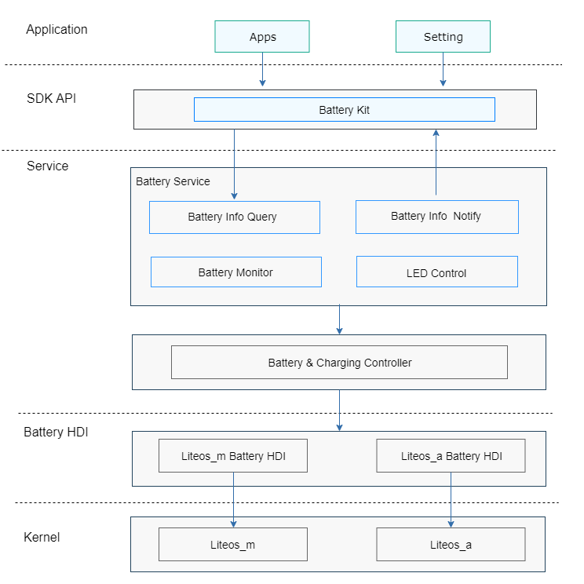

# 轻量级电池管理组件<a name="ZH-CN_TOPIC_0000001174637973"></a>

-   [简介](#section11660541593)
-   [目录](#section19472752217)
-   [说明](#section146636391856)
    -   [接口说明](#section481251394)
    -   [使用说明](#section12620311012)

-   [相关仓](#section63151229062)

## 简介<a name="section11660541593"></a>

电池服务组件提供如下功能：

1.  电池信息查询。
2.  充放电状态查询。
3.  电池健康状态监测。
4.  充电指示灯控制。

**图 1**  轻量级电池管理组件架构图<a name="fig106301571239"></a>




## 目录<a name="section19472752217"></a>

```
base/powermgr/battery_lite
├── frameworks        # Framework层
│   ├── include       # Framework层头文件
│   └── src           # Framework层源文件
├── interfaces        # 接口层
│   ├── innerkits     # 内部接口层
│   └── kits          # 外部接口层
└── services          # 服务层
    ├── include       # 服务层头文件
    └── src           # 服务层源文件
```

## 说明<a name="section146636391856"></a>

### 接口说明<a name="section481251394"></a>

轻量电池管理组件对外提供的接口，如下表：

<a name="table45171237103112"></a>
<table><thead align="left"><tr id="row12572123793117"><th class="cellrowborder" valign="top" width="38.71%" id="mcps1.1.3.1.1"><p id="p19572937163116"><a name="p19572937163116"></a><a name="p19572937163116"></a><strong id="b18552135014316"><a name="b18552135014316"></a><a name="b18552135014316"></a>接口名</strong></p>
</th>
<th class="cellrowborder" valign="top" width="61.29%" id="mcps1.1.3.1.2"><p id="p157213711313"><a name="p157213711313"></a><a name="p157213711313"></a><strong id="b193891558123118"><a name="b193891558123118"></a><a name="b193891558123118"></a>描述</strong></p>
</th>
</tr>
</thead>
<tbody><tr id="row14574143723119"><td class="cellrowborder" valign="top" width="38.71%" headers="mcps1.1.3.1.1 "><p id="p169098161437"><a name="p169098161437"></a><a name="p169098161437"></a>int32_t GetBatSoc()</p>
</td>
<td class="cellrowborder" valign="top" width="61.29%" headers="mcps1.1.3.1.2 "><p id="p105741337153115"><a name="p105741337153115"></a><a name="p105741337153115"></a>获取电池剩余电量（SOC）。</p>
</td>
</tr>
<tr id="row19195203919318"><td class="cellrowborder" valign="top" width="38.71%" headers="mcps1.1.3.1.1 "><p id="p46911925104319"><a name="p46911925104319"></a><a name="p46911925104319"></a>BatteryChargeState GetChargingStatus()</p>
</td>
<td class="cellrowborder" valign="top" width="61.29%" headers="mcps1.1.3.1.2 "><p id="p1619618397312"><a name="p1619618397312"></a><a name="p1619618397312"></a>获取当前充电状态。</p>
</td>
</tr>
<tr id="row9397121153216"><td class="cellrowborder" valign="top" width="38.71%" headers="mcps1.1.3.1.1 "><p id="p1339731103216"><a name="p1339731103216"></a><a name="p1339731103216"></a>BatteryHealthState GetHealthStatus()</p>
</td>
<td class="cellrowborder" valign="top" width="61.29%" headers="mcps1.1.3.1.2 "><p id="p113972183214"><a name="p113972183214"></a><a name="p113972183214"></a>获取电池健康状态。</p>
</td>
</tr>
<tr id="row1721311920324"><td class="cellrowborder" valign="top" width="38.71%" headers="mcps1.1.3.1.1 "><p id="p321412915320"><a name="p321412915320"></a><a name="p321412915320"></a>BatteryPluggedType GetPluggedType()</p>
</td>
<td class="cellrowborder" valign="top" width="61.29%" headers="mcps1.1.3.1.2 "><p id="p32141298323"><a name="p32141298323"></a><a name="p32141298323"></a>获取当前连接的充电器类型。</p>
</td>
</tr>
<tr id="row269082112447"><td class="cellrowborder" valign="top" width="38.71%" headers="mcps1.1.3.1.1 "><p id="p16690202119449"><a name="p16690202119449"></a><a name="p16690202119449"></a>int32_t GetBatVoltage()</p>
</td>
<td class="cellrowborder" valign="top" width="61.29%" headers="mcps1.1.3.1.2 "><p id="p1869014214445"><a name="p1869014214445"></a><a name="p1869014214445"></a>获取电池电压。</p>
</td>
</tr>
<tr id="row3654173318447"><td class="cellrowborder" valign="top" width="38.71%" headers="mcps1.1.3.1.1 "><p id="p11654173374412"><a name="p11654173374412"></a><a name="p11654173374412"></a>bool IsBatPresent()</p>
</td>
<td class="cellrowborder" valign="top" width="61.29%" headers="mcps1.1.3.1.2 "><p id="p13654123354416"><a name="p13654123354416"></a><a name="p13654123354416"></a>检查电池是否在位。</p>
</td>
</tr>
<tr id="row12187141584413"><td class="cellrowborder" valign="top" width="38.71%" headers="mcps1.1.3.1.1 "><p id="p718841504418"><a name="p718841504418"></a><a name="p718841504418"></a>char* GetBatTechnology()</p>
</td>
<td class="cellrowborder" valign="top" width="61.29%" headers="mcps1.1.3.1.2 "><p id="p181881615194414"><a name="p181881615194414"></a><a name="p181881615194414"></a>获取电池类型。</p>
</td>
</tr>
<tr id="row18381310134520"><td class="cellrowborder" valign="top" width="38.71%" headers="mcps1.1.3.1.1 "><p id="p18838610114516"><a name="p18838610114516"></a><a name="p18838610114516"></a>int32_t GetBatTemperature()</p>
</td>
<td class="cellrowborder" valign="top" width="61.29%" headers="mcps1.1.3.1.2 "><p id="p13838121064515"><a name="p13838121064515"></a><a name="p13838121064515"></a>获取电池温度。</p>
</td>
</tr>
</tbody>
</table>

### 使用说明<a name="section12620311012"></a>

电池管理组件提供了获取电池剩余电量、充电状态、电池健康状态等接口。

代码示例如下：

```
int32_t capacity = GetBatSoc();
BatteryChargeState chargState = GetChargingStatus();
```

## 相关仓<a name="section63151229062"></a>

[电源管理子系统](https://gitee.com/openharmony/docs/blob/master/zh-cn/readme/%E7%94%B5%E6%BA%90%E7%AE%A1%E7%90%86%E5%AD%90%E7%B3%BB%E7%BB%9F.md)

[powermgr_power_manager](https://gitee.com/openharmony/powermgr_power_manager)

[powermgr_display_manager](https://gitee.com/openharmony/powermgr_display_manager)

[powermgr_battery_manager](https://gitee.com/openharmony/powermgr_battery_manager)

[powermgr_thermal_manager](https://gitee.com/openharmony/powermgr_thermal_manager)

[powermgr_battery_statistics](https://gitee.com/openharmony/powermgr_battery_statistics)

**powermgr_battery_lite**

[powermgr_powermgr_lite](https://gitee.com/openharmony/powermgr_powermgr_lite)
