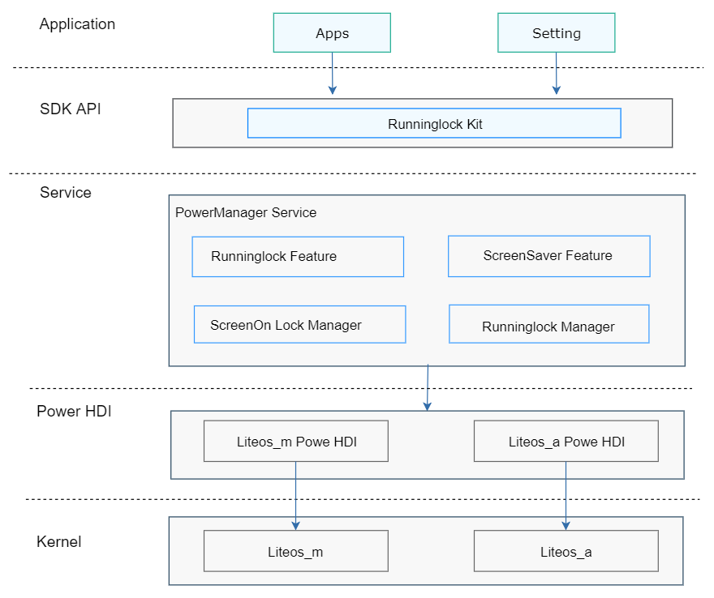

# 轻量级电源管理组件<a name="ZH-CN_TOPIC_0000001126247025"></a>

-   [简介](#section11660541593)
-   [目录](#section19472752217)
-   [说明](#section146636391856)
    -   [接口说明](#section481251394)
    -   [使用说明](#section12620311012)

-   [相关仓](#section63151229062)

## 简介<a name="section11660541593"></a>

轻量级电源组件提供如下功能：

1.  休眠唤醒锁管理。
2.  亮灭屏控制锁。

**图 1**  轻量级电源管理组件架构图<a name="fig106301571239"></a>  




## 目录<a name="section19472752217"></a>

```
base/powermgr/powermgr_lite
├── frameworks        # Framework层
│   ├── include       # Framework层头文件
│   └── src           # Framework层源文件
├── interfaces        # 接口层
│   ├── innerkits     # 内部接口层
│   └── kits          # 外部接口层
├── services          # 服务层
│   ├── include       # 服务层头文件
│   └── src           # 服务层源文件
└── utils             # 工具和通用层
    ├── include       # 工具和通用层头文件
    └── src           # 工具和通用层源文件
```

## 说明<a name="section146636391856"></a>

### 接口说明<a name="section481251394"></a>

轻量电源管理服务对外提供的接口，如下表：

<a name="table45171237103112"></a>
<table><thead align="left"><tr id="row12572123793117"><th class="cellrowborder" valign="top" width="38.71%" id="mcps1.1.3.1.1"><p id="p19572937163116"><a name="p19572937163116"></a><a name="p19572937163116"></a><strong id="b18552135014316"><a name="b18552135014316"></a><a name="b18552135014316"></a>接口名</strong></p>
</th>
<th class="cellrowborder" valign="top" width="61.29%" id="mcps1.1.3.1.2"><p id="p157213711313"><a name="p157213711313"></a><a name="p157213711313"></a><strong id="b193891558123118"><a name="b193891558123118"></a><a name="b193891558123118"></a>描述</strong></p>
</th>
</tr>
</thead>
<tbody><tr id="row14574143723119"><td class="cellrowborder" valign="top" width="38.71%" headers="mcps1.1.3.1.1 "><p id="p67351028124111"><a name="p67351028124111"></a><a name="p67351028124111"></a>RunningLock *CreateRunningLock(const char *name, RunningLockType type, RunningLockFlag flag)</p>
</td>
<td class="cellrowborder" valign="top" width="61.29%" headers="mcps1.1.3.1.2 "><p id="p105741337153115"><a name="p105741337153115"></a><a name="p105741337153115"></a>创建Runninglock对象。</p>
</td>
</tr>
<tr id="row19195203919318"><td class="cellrowborder" valign="top" width="38.71%" headers="mcps1.1.3.1.1 "><p id="p219643914313"><a name="p219643914313"></a><a name="p219643914313"></a>void DestroyRunningLock(const RunningLock *lock)</p>
</td>
<td class="cellrowborder" valign="top" width="61.29%" headers="mcps1.1.3.1.2 "><p id="p1619618397312"><a name="p1619618397312"></a><a name="p1619618397312"></a>销毁Runninglock对象。</p>
</td>
</tr>
<tr id="row9397121153216"><td class="cellrowborder" valign="top" width="38.71%" headers="mcps1.1.3.1.1 "><p id="p1339731103216"><a name="p1339731103216"></a><a name="p1339731103216"></a>BOOL AcquireRunningLock(const RunningLock *lock)</p>
</td>
<td class="cellrowborder" valign="top" width="61.29%" headers="mcps1.1.3.1.2 "><p id="p113972183214"><a name="p113972183214"></a><a name="p113972183214"></a>获取Runninglock锁。</p>
</td>
</tr>
<tr id="row1721311920324"><td class="cellrowborder" valign="top" width="38.71%" headers="mcps1.1.3.1.1 "><p id="p321412915320"><a name="p321412915320"></a><a name="p321412915320"></a>BOOL ReleaseRunningLock(const RunningLock *lock)</p>
</td>
<td class="cellrowborder" valign="top" width="61.29%" headers="mcps1.1.3.1.2 "><p id="p32141298323"><a name="p32141298323"></a><a name="p32141298323"></a>释放Runninglock锁。</p>
</td>
</tr>
<tr id="row879512416482"><td class="cellrowborder" valign="top" width="38.71%" headers="mcps1.1.3.1.1 "><p id="p20796124184815"><a name="p20796124184815"></a><a name="p20796124184815"></a>BOOL IsRunningLockAcquired(const RunningLock *lock);</p>
</td>
<td class="cellrowborder" valign="top" width="61.29%" headers="mcps1.1.3.1.2 "><p id="p18796104115482"><a name="p18796104115482"></a><a name="p18796104115482"></a>判断当前锁是否已经释放</p>
</td>
</tr>
</tbody>
</table>

### 使用说明<a name="section12620311012"></a>

**Runninglock管理**

电源管理组件提供了创建Runninglock对象、获取锁、释放锁等接口。

代码示例如下：

```
const RunningLock *lock = CreateRunningLock("runinglock_example", RUNNINGLOCK_BACKGROUND, RUNNINGLOCK_FLAG_NONE);
if (lock == NULL) {
   return;
}
BOOL ret = AcquireRunningLock(lock);
if (ret == FLASE) {
   DestroyRunningLock(lock);
   return;
}
ReleaseRunningLock(lock);
DestroyRunningLock(lock); // Must release runninglock before destroyed
```

## 相关仓<a name="section63151229062"></a>

[电源管理子系统](https://gitee.com/openharmony/docs/blob/master/zh-cn/readme/%E7%94%B5%E6%BA%90%E7%AE%A1%E7%90%86%E5%AD%90%E7%B3%BB%E7%BB%9F.md)

[powermgr_power_manager](https://gitee.com/openharmony/powermgr_power_manager)

[powermgr_display_manager](https://gitee.com/openharmony/powermgr_display_manager)

[powermgr_battery_manager](https://gitee.com/openharmony/powermgr_battery_manager)

[powermgr_thermal_manager](https://gitee.com/openharmony/powermgr_thermal_manager)

[powermgr_battery_statistics](https://gitee.com/openharmony/powermgr_battery_statistics)

[powermgr_battery_lite](https://gitee.com/openharmony/powermgr_battery_lite)

**powermgr_powermgr_lite**

