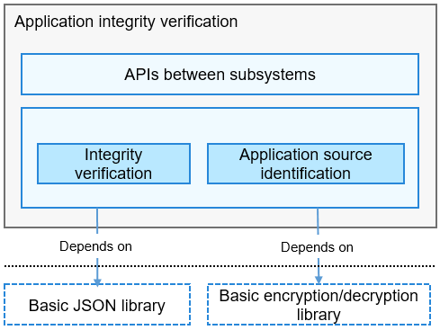

# appverify<a name="EN-US_TOPIC_0000001096592945"></a>

-   [Introduction](#section11660541593)
-   [Architecture](#section9498162413412)
-   [Directory Structure](#section161941989596)
-   [Constraints](#section119744591305)
-   [Usage](#section1312121216216)
    -   [Available APIs](#section1551164914237)
    -   [Usage Guidelines](#section129654513264)

-   [Repositories Involved](#section1371113476307)

## Introduction<a name="section11660541593"></a>

To ensure the integrity and trustworthiness of the applications to be installed in OpenHarmony, the applications must be signed and their signatures must be verified.

-   **In application development**: After developing an application, you need to sign its installation package to ensure that the installation package is not tampered with when it is released on devices. To sign the application package, you can use the signature tools and the public key certificates and follow the signing certificate generation specifications provided by the application integrity verification module. For your convenience, a public key certificate and a corresponding private key are preset in OpenHarmony. You need to replace the public key certificate and private key in your commercial version of OpenHarmony.

-   **In application installation**: The Application Framework subsystem of OpenHarmony installs applications. Upon receiving an application installation package, the Application Framework subsystem parses the signature of the installation package, and verifies the signature using the application integrity verification APIs. The application can be installed only after the verification succeeds. During the verification, the application integrity verification module uses the preset public key certificate to verify the signature.

## Architecture<a name="section9498162413412"></a>

**Figure  1**  Application integrity verification architecture<a name="fig78941174427"></a>  


-   **APIs between subsystems**: APIs provided by the application integrity verification module for other modules

-   **Integrity verification**: ensures the integrity of application bundles and prevents tampering through signature verification.

-   **Application source identification**: identifies the application source by matching the signature certificate chain with the trusted source list.

## Directory Structure<a name="section161941989596"></a>

```
/base/security/appverify
├── interfaces/innerkits/appverify         # Application integrity verification module
│       ├── config                         # Application signature root certificates and configuration files for the trusted source list
│       ├── include                        # Header files
│       ├── src                            # Source code
│       ├── test                           # Automated test cases
├── test/resource                          # Test resources
```

## Constraints<a name="section119744591305"></a>

The certificates used for application integrity verification are specific to OpenHarmony. The corresponding public key certificates and private keys are preset in the open-source code repositories of OpenHarmony to provide offline signing and verification capabilities for the open-source community. The public key certificates and the corresponding private keys need to be replaced in commercial versions that are based on OpenHarmony.

## Usage<a name="section1312121216216"></a>

The application integrity verification module provides an inter-subsystem API, which is called by the Bundle Manager Service \(BMS\) during application installation.

### Available APIs<a name="section1551164914237"></a>

<a name="table775715438253"></a>
<table><thead align="left"><tr id="row12757154342519"><th class="cellrowborder" valign="top" width="50.22%" id="mcps1.1.3.1.1"><p id="p1075794372512"><a name="p1075794372512"></a><a name="p1075794372512"></a>API</p>
</th>
<th class="cellrowborder" valign="top" width="49.78%" id="mcps1.1.3.1.2"><p id="p375844342518"><a name="p375844342518"></a><a name="p375844342518"></a>Description</p>
</th>
</tr>
</thead>
<tbody><tr id="row1348165765318"><td class="cellrowborder" valign="top" width="50.22%" headers="mcps1.1.3.1.1 "><p id="p154855755315"><a name="p154855755315"></a><a name="p154855755315"></a>int HapVerify(const std::string&amp; filePath, HapVerifyResult&amp; hapVerifyResult)</p>
</td>
<td class="cellrowborder" valign="top" width="49.78%" headers="mcps1.1.3.1.2 "><p id="p64845775315"><a name="p64845775315"></a><a name="p64845775315"></a>Verifies application integrity and identifies the application source.</p>
</td>
</tr>
</tbody>
</table>

### Usage Guidelines<a name="section129654513264"></a>

The  **HapVerify\(\)**  API provided by the application integrity verification module is an inter-subsystem API. This API can be called with the HAP file path passed to verify the integrity of an application, and the verification result can be obtained from the return value. The signature of the application can be obtained from the input parameter  **hapVerifyResult**.

```
Security::Verify::HapVerifyResult verifyResult;
int32_t res = Security::Verify::HapVerify(hapPath, verifyResult);
if (res != Security::Verify::HapVerifyResultCode::VERIFY_SUCCESS) {
    // processing error
}
```

## Repositories Involved<a name="section1371113476307"></a>

Security subsystem

hmf/security/appverify

