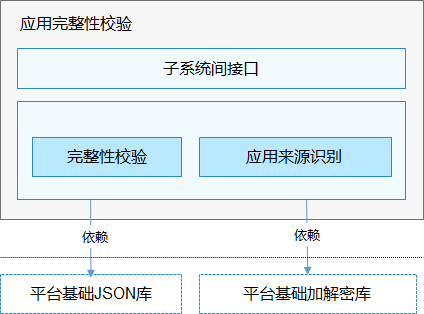

# 应用完整性校验<a name="ZH-CN_TOPIC_0000001096592945"></a>

-   [简介](#section11660541593)
-   [系统架构图](#section9498162413412)
-   [目录](#section161941989596)
-   [约束](#section119744591305)
-   [说明](#section1312121216216)
    -   [接口说明](#section1551164914237)
    -   [使用说明](#section129654513264)

-   [相关仓](#section1371113476307)

## 简介<a name="section11660541593"></a>

为了确保应用的完整性和来源可靠，OpenHarmony需要对应用进行签名和验签。

-   **应用开发阶段：** 开发者完成开发并生成安装包后，需要开发者对安装包进行签名，以证明安装包发布到设备的过程中没有被篡改。OpenHarmony的应用完整性校验模块提供了签名工具、签名证书生成规范，以及签名所需的公钥证书等完整的机制，支撑开发者对应用安装包签名。为了方便开源社区开发者，版本中预置了公钥证书和对应的私钥，为开源社区提供离线签名和校验能力；在OpenHarmony商用版本中应替换此公钥证书和对应的私钥。

-   **应用安装阶段：** OpenHarmony用户程序框架子系统负责应用的安装。在接收到应用安装包之后，应用程序框架子系统需要解析安装包的签名数据，然后使用应用完整性校验模块的API对签名进行验证，只有校验成功之后才允许安装此应用.  应用完整性校验模块在校验安装包签名数据时，会使用系统预置的公钥证书进行验签。

## 系统架构图<a name="section9498162413412"></a>

**图 1**  应用完整性校验架构图<a name="fig78941174427"></a>


-   **子系统间接口：** 应用完整性校验模块给其他模块提供的接口；

-   **完整性校验：** 通过验签，保障应用包完整性，防篡改；

-   **应用来源识别：** 通过匹配签名证书链与可信源列表，识别应用来源。

## 目录<a name="section161941989596"></a>

```
/base/security/appverify
├── interfaces/innerkits/appverify         # 应用完整性校验模块代码
│       ├── config                         # 应用签名根证书和可信源列表配置文件存放目录
│       ├── include                        # 头文件存放目录
│       ├── src                            # 源代码存放目录
│       ├── test                           # 模块自动化测试用例存放目录
├── test/resource                          # 测试资源存放目录
```

## 约束<a name="section119744591305"></a>

应用完整性校验在OpenHarmony中使用的证书，是专为OpenHarmony生成的，涉及的公钥证书和对应的私钥均预置在OpenHarmony开源代码仓中，为开源社区提供离线签名和校验能力；在商用版本中应替换此公钥证书和对应的私钥。

## 说明<a name="section1312121216216"></a>

应用完整性校验模块提供一个子系统间接口，由包管理服务在安装应用时调用。

### 接口说明<a name="section1551164914237"></a>

<a name="table775715438253"></a>
<table><thead align="left"><tr id="row12757154342519"><th class="cellrowborder" valign="top" width="50.22%" id="mcps1.1.3.1.1"><p id="p1075794372512"><a name="p1075794372512"></a><a name="p1075794372512"></a>接口名</p>
</th>
<th class="cellrowborder" valign="top" width="49.78%" id="mcps1.1.3.1.2"><p id="p375844342518"><a name="p375844342518"></a><a name="p375844342518"></a>说明</p>
</th>
</tr>
</thead>
<tbody><tr id="row1348165765318"><td class="cellrowborder" valign="top" width="50.22%" headers="mcps1.1.3.1.1 "><p id="p154855755315"><a name="p154855755315"></a><a name="p154855755315"></a>int HapVerify(const std::string&amp; filePath, HapVerifyResult&amp; hapVerifyResult)</p>
</td>
<td class="cellrowborder" valign="top" width="49.78%" headers="mcps1.1.3.1.2 "><p id="p64845775315"><a name="p64845775315"></a><a name="p64845775315"></a>校验应用完整性，识别应用来源</p>
</td>
</tr>
</tbody>
</table>

### 使用说明<a name="section129654513264"></a>

应用完整性校验提供的是子系统间接口，仅提供底层能力，不对开发者开放。以应用文件路径作为输入，调用HapVerify接口即可校验应用完整性，通过接口返回值可以获取校验结果，通过引用传参hapVerifyResult获取签名相关信息。

```
Security::Verify::HapVerifyResult verifyResult;
int32_t res = Security::Verify::HapVerify(hapPath, verifyResult);
if (res != Security::Verify::HapVerifyResultCode::VERIFY_SUCCESS) {
    // processing error
}
```

## 相关仓<a name="section1371113476307"></a>

安全子系统

hmf/security/appverify

