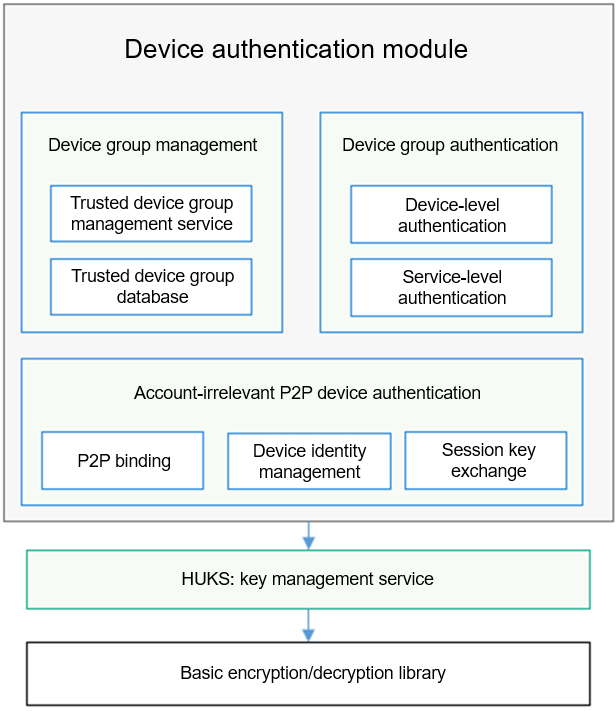

# deviceauth<a name="EN-US_TOPIC_0000001150002727"></a>

-   [Introduction](#section11660541593)
-   [Directory Structure](#section161941989596)
-   [Usage](#section1312121216216)
    -   [Available APIs](#section1551164914237)

-   [Repositories Involved](#section1371113476307)

## Introduction<a name="section11660541593"></a>

The device authentication module belongs to the security subsystem of OpenHarmony. It manages the entire lifecycle of trust relationships between devices, including establishment, maintenance, use, and cancellation, and implements authentication and secure session key exchange between trusted devices. It provides basic capabilities for trusted interconnections between devices that run OpenHarmony.

The device authentication module provides the following capabilities:

-   Device trust relationship management: manages the establishment, maintenance, and cancellation of trust relationships between devices in a unified manner; allows the isolation and controllable sharing of trust relationships created by different services.
-   Device trust relationship authentication: authenticates trust relationships between devices, allows trusted devices to exchange secure session keys with each other, and sets up connections between trusted devices through the DSoftBus.

The device authentication module consists of three submodules: device group management, device group authentication, and account-irrelevant P2P device authentication. The following figure shows the logical architecture of the device authentication module.

**Figure  1**  Architecture of the device authentication module<a name="fig4460722185514"></a>  




In the architecture:

-   Device group management: allows you to manage the trust relationships between the local device and other devices created by different services in a unified manner, create trust relationships between devices using the provided APIs, create an account-irrelevant device group, add trusted devices to the group, and create a trust relationship between isolated devices.
-   Device group authentication: allows devices to authenticate the trust relationships that have been established between them and exchange session keys.
-   Account-irrelevant P2P device authentication: allows two devices to establish a trust relationship based on a shared secret, and exchange a session key for secure communication based on the trusted relationship.

## Directory Structure<a name="section161941989596"></a>

```
/base/security/deviceauth
├── frameworks                   # Device authentication framework code
├── hals                         # HAL code for the tool library
│   ├── inc                      # Tool library header files
│   └── src                      # Tool library source files
├── interfaces                   # APIs exposed externally
└── services                     # Device authentication services
    ├── common                   # Common code
    ├── group_auth               # Device group authentication
    ├── group_manager            # Device group management
    ├── module                   # Authenticator module (including the account-irrelevant P2P device authenticator)
    └── session                  # Scheduling and session management module
```

## Usage<a name="section1312121216216"></a>

### Available APIs<a name="section1551164914237"></a>

The device group management sub-module abstracts trust relationships established by different services between devices into trust groups and provides unified APIs for creating, deleting, and querying groups. The device group authentication sub-module provides trusted device authentication and end-to-end session key exchange based on the trust groups.

**Table  1**  APIs in DeviceGroupManager

<a name="table1731550155318"></a>
<table><thead align="left"><tr id="row4419501537"><th class="cellrowborder" valign="top" width="57.38999999999999%" id="mcps1.2.3.1.1"><p id="p54150165315"><a name="p54150165315"></a><a name="p54150165315"></a>API</p>
</th>
<th class="cellrowborder" valign="top" width="42.61%" id="mcps1.2.3.1.2"><p id="p941150145313"><a name="p941150145313"></a><a name="p941150145313"></a>Description</p>
</th>
</tr>
</thead>
<tbody><tr id="row34145016535"><td class="cellrowborder" valign="top" width="57.38999999999999%" headers="mcps1.2.3.1.1 "><p id="p1487722894416"><a name="p1487722894416"></a><a name="p1487722894416"></a>const DeviceGroupManager *GetGmInstance()</p>
</td>
<td class="cellrowborder" valign="top" width="42.61%" headers="mcps1.2.3.1.2 "><p id="p13562171015712"><a name="p13562171015712"></a><a name="p13562171015712"></a>Obtains a <strong id="b4999346135811"><a name="b4999346135811"></a><a name="b4999346135811"></a>DeviceGroupManager</strong> instance.</p>
</td>
</tr>
<tr id="row1027292610453"><td class="cellrowborder" valign="top" width="57.38999999999999%" headers="mcps1.2.3.1.1 "><p id="p1227312634518"><a name="p1227312634518"></a><a name="p1227312634518"></a>int32_t RegCallback(const char *appId, const DeviceAuthCallback *callback)</p>
</td>
<td class="cellrowborder" valign="top" width="42.61%" headers="mcps1.2.3.1.2 "><p id="p7488141134613"><a name="p7488141134613"></a><a name="p7488141134613"></a>Registers a callback.</p>
</td>
</tr>
<tr id="row1746172917474"><td class="cellrowborder" valign="top" width="57.38999999999999%" headers="mcps1.2.3.1.1 "><p id="p9758144610285"><a name="p9758144610285"></a><a name="p9758144610285"></a>int32_t CreateGroup(int64_t requestId, const char *appId, const char *createParams)</p>
</td>
<td class="cellrowborder" valign="top" width="42.61%" headers="mcps1.2.3.1.2 "><p id="p2431455765"><a name="p2431455765"></a><a name="p2431455765"></a>Creates a group of trusted devices.</p>
</td>
</tr>
<tr id="row10992232154714"><td class="cellrowborder" valign="top" width="57.38999999999999%" headers="mcps1.2.3.1.1 "><p id="p1310363994713"><a name="p1310363994713"></a><a name="p1310363994713"></a>int32_t DeleteGroup(int64_t requestId, const char *appId, const char *disbandParams)</p>
</td>
<td class="cellrowborder" valign="top" width="42.61%" headers="mcps1.2.3.1.2 "><p id="p126575774517"><a name="p126575774517"></a><a name="p126575774517"></a>Deletes a group of trusted devices.</p>
</td>
</tr>
<tr id="row1440154863415"><td class="cellrowborder" valign="top" width="57.38999999999999%" headers="mcps1.2.3.1.1 "><p id="p19702122715481"><a name="p19702122715481"></a><a name="p19702122715481"></a>int32_t AddMemberToGroup(int64_t requestId, const char *appId, const char *addParams)</p>
</td>
<td class="cellrowborder" valign="top" width="42.61%" headers="mcps1.2.3.1.2 "><p id="p240224817343"><a name="p240224817343"></a><a name="p240224817343"></a>Adds a member to a specified group.</p>
</td>
</tr>
<tr id="row495164812345"><td class="cellrowborder" valign="top" width="57.38999999999999%" headers="mcps1.2.3.1.1 "><p id="p1872417515488"><a name="p1872417515488"></a><a name="p1872417515488"></a>int32_t DeleteMemberFromGroup(int64_t requestId, const char *appId, const char *deleteParams);</p>
</td>
<td class="cellrowborder" valign="top" width="42.61%" headers="mcps1.2.3.1.2 "><p id="p1995144893411"><a name="p1995144893411"></a><a name="p1995144893411"></a>Deletes a member from a specified group.</p>
</td>
</tr>
<tr id="row4107114933418"><td class="cellrowborder" valign="top" width="57.38999999999999%" headers="mcps1.2.3.1.1 "><p id="p794617473016"><a name="p794617473016"></a><a name="p794617473016"></a>int32_t ProcessData(int64_t requestId, const uint8_t *data, uint32_t dataLen)</p>
</td>
<td class="cellrowborder" valign="top" width="42.61%" headers="mcps1.2.3.1.2 "><p id="p11107849113418"><a name="p11107849113418"></a><a name="p11107849113418"></a>Processes data that is bound or unbound.</p>
</td>
</tr>
<tr id="row3270349193419"><td class="cellrowborder" valign="top" width="57.38999999999999%" headers="mcps1.2.3.1.1 "><p id="p179130216514"><a name="p179130216514"></a><a name="p179130216514"></a>int32_t GetGroupInfo(const char *appId, const char *queryParams, char **returnGroupVec, uint32_t *groupNum)</p>
</td>
<td class="cellrowborder" valign="top" width="42.61%" headers="mcps1.2.3.1.2 "><p id="p12701049183411"><a name="p12701049183411"></a><a name="p12701049183411"></a>Obtains information about a trusted group of devices.</p>
</td>
</tr>
</tbody>
</table>

**Table  2**  APIs in GroupAuthManager

<a name="table12330133114308"></a>
<table><thead align="left"><tr id="row15330631193013"><th class="cellrowborder" valign="top" width="57.38999999999999%" id="mcps1.2.3.1.1"><p id="p73319319302"><a name="p73319319302"></a><a name="p73319319302"></a>API</p>
</th>
<th class="cellrowborder" valign="top" width="42.61%" id="mcps1.2.3.1.2"><p id="p133312317305"><a name="p133312317305"></a><a name="p133312317305"></a>Description</p>
</th>
</tr>
</thead>
<tbody><tr id="row15331183193010"><td class="cellrowborder" valign="top" width="57.38999999999999%" headers="mcps1.2.3.1.1 "><p id="p19743328133620"><a name="p19743328133620"></a><a name="p19743328133620"></a>const GroupAuthManager *GetGaInstance()</p>
</td>
<td class="cellrowborder" valign="top" width="42.61%" headers="mcps1.2.3.1.2 "><p id="p16742028153611"><a name="p16742028153611"></a><a name="p16742028153611"></a>Obtains a <strong id="b13399173415119"><a name="b13399173415119"></a><a name="b13399173415119"></a>GroupAuthManager</strong> instance.</p>
</td>
</tr>
<tr id="row7331133163017"><td class="cellrowborder" valign="top" width="57.38999999999999%" headers="mcps1.2.3.1.1 "><p id="p118111117133514"><a name="p118111117133514"></a><a name="p118111117133514"></a>int32_t AuthDevice(int64_t authReqId, const char *authParams, const DeviceAuthCallback *gaCallback)</p>
</td>
<td class="cellrowborder" valign="top" width="42.61%" headers="mcps1.2.3.1.2 "><p id="p151481335193817"><a name="p151481335193817"></a><a name="p151481335193817"></a>Authenticates a peer device.</p>
</td>
</tr>
<tr id="row633283153012"><td class="cellrowborder" valign="top" width="57.38999999999999%" headers="mcps1.2.3.1.1 "><p id="p12534111115352"><a name="p12534111115352"></a><a name="p12534111115352"></a>int32_t ProcessData(int64_t authReqId, const uint8_t *data, uint32_t dataLen,</p>
<p id="p16534181113358"><a name="p16534181113358"></a><a name="p16534181113358"></a>const DeviceAuthCallback *gaCallback)</p>
</td>
<td class="cellrowborder" valign="top" width="42.61%" headers="mcps1.2.3.1.2 "><p id="p1633173173012"><a name="p1633173173012"></a><a name="p1633173173012"></a>Processes authentication data.</p>
</td>
</tr>
</tbody>
</table>

## Repositories Involved<a name="section1371113476307"></a>

**Security subsystem**

security\_deviceauth

