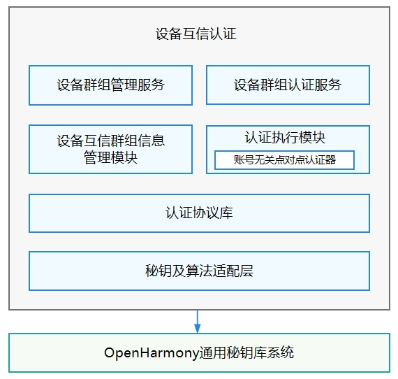

# 设备互信认证<a name="ZH-CN_TOPIC_0000001150002727"></a>

-   [简介](#section11660541593)
-   [目录](#section161941989596)
-   [说明](#section1312121216216)
    -   [接口说明](#section1551164914237)

-   [相关仓](#section1371113476307)

## 简介<a name="section11660541593"></a>

在OpenHarmony中，设备互信认证模块作为安全子系统的子模块，负责设备间可信关系的建立、维护、使用、撤销等全生命周期的管理，实现可信设备间的互信认证和安全会话密钥协商，是搭载OpenHarmony的设备进行可信互联的基础平台能力。

设备互信认证模块当前提供如下功能：

-   设备互信关系管理功能：统一管理设备互信关系的建立、维护、撤销过程；支持各个业务创建的设备互信关系的隔离和可控共享。
-   设备互信关系认证功能：提供认证设备间互信关系、进行安全会话密钥协商的能力，支持分布式软总线实现互信设备间的组网。

为实现上述功能，设备互信认证模块当前包含设备群组管理、设备群组认证和帐号无关点对点认证三个子模块，其部署逻辑如下图：

**图 1**  子系统架构图<a name="fig4460722185514"></a>  




其中，

-   设备群组管理服务：统一管理不同业务建立的本设备与其他设备间的互信关系，并对外提供设备互信关系的创建入口 ，完成信任建立后创建帐号无关设备群组，并将信任对象设备添加进群组；OpenHarmony上各业务可独立创建相互隔离的设备间可信关系。
-   设备群组认证服务：支持已建立可信关系的设备间完成互信关系的认证及会话密钥的协商。
-   帐号无关点对点设备互信认证：提供设备间基于共享秘密建立一对一互信关系的功能，并支持基于这种互信关系的认证密钥协商。

## 目录<a name="section161941989596"></a>

```
/base/security/deviceauth
├── frameworks                   # 设备互信认证IPC代码
├── interfaces                   # 对外接口目录
├── test                         # 设备互信认证的接口测试用例
├── common_lib                   # C语言公共基础库
├── deps_adapter                 # 依赖组件适配器代码
│   ├── key_management_adapter   # 秘钥及算法适配层
│   └── os_adapter               # 系统能力适配层
└── services                     # 设备互信认证服务层代码
    ├── frameworks               # 设备互信认证框架层代码
    ├── data_manager             # 设备互信群组信息管理模块
    ├── group_auth               # 设备群组认证服务
    ├── group_manager            # 设备群组管理服务
    ├── authenticators           # 认证执行模块（包括帐号无关点对点认证器）
    └── protocol                 # 认证协议库
```

## 说明<a name="section1312121216216"></a>

### 接口说明<a name="section1551164914237"></a>

设备互信认证组件中，设备群组管理服务负责将不同业务建立的设备间可信关系抽象成一个个可信群组，对外提供统一的接口，包含群组创建、删除、查询等功能；设备群组认证服务基于已经建立过可信关系的设备群组，提供设备可信认证与端到端会话密钥协商功能。

**表 1**  设备群组管理服务提供的API接口\(DeviceGroupManager\)功能介绍

<a name="table1731550155318"></a>
<table><thead align="left"><tr id="row4419501537"><th class="cellrowborder" valign="top" width="57.38999999999999%" id="mcps1.2.3.1.1"><p id="p54150165315"><a name="p54150165315"></a><a name="p54150165315"></a>接口名</p>
</th>
<th class="cellrowborder" valign="top" width="42.61%" id="mcps1.2.3.1.2"><p id="p941150145313"><a name="p941150145313"></a><a name="p941150145313"></a>描述</p>
</th>
</tr>
</thead>
<tbody><tr id="row34145016535"><td class="cellrowborder" valign="top" width="57.38999999999999%" headers="mcps1.2.3.1.1 "><p id="p1487722894416"><a name="p1487722894416"></a><a name="p1487722894416"></a>const DeviceGroupManager *GetGmInstance()</p>
</td>
<td class="cellrowborder" valign="top" width="42.61%" headers="mcps1.2.3.1.2 "><p id="p13562171015712"><a name="p13562171015712"></a><a name="p13562171015712"></a>获取设备群组管理的实例。</p>
</td>
</tr>
<tr id="row1027292610453"><td class="cellrowborder" valign="top" width="57.38999999999999%" headers="mcps1.2.3.1.1 "><p id="p1227312634518"><a name="p1227312634518"></a><a name="p1227312634518"></a>int32_t RegCallback(const char *appId, const DeviceAuthCallback *callback)</p>
</td>
<td class="cellrowborder" valign="top" width="42.61%" headers="mcps1.2.3.1.2 "><p id="p7488141134613"><a name="p7488141134613"></a><a name="p7488141134613"></a>注册业务的监听回调。</p>
</td>
</tr>
<tr id="row1746172917474"><td class="cellrowborder" valign="top" width="57.38999999999999%" headers="mcps1.2.3.1.1 "><p id="p9758144610285"><a name="p9758144610285"></a><a name="p9758144610285"></a>int32_t CreateGroup(int32_t osAccountId, int64_t requestId, const char *appId, const char *createParams)</p>
</td>
<td class="cellrowborder" valign="top" width="42.61%" headers="mcps1.2.3.1.2 "><p id="p2431455765"><a name="p2431455765"></a><a name="p2431455765"></a>创建一个可信设备群组。</p>
</td>
</tr>
<tr id="row10992232154714"><td class="cellrowborder" valign="top" width="57.38999999999999%" headers="mcps1.2.3.1.1 "><p id="p1310363994713"><a name="p1310363994713"></a><a name="p1310363994713"></a>int32_t DeleteGroup(int32_t osAccountId, int64_t requestId, const char *appId, const char *disbandParams)</p>
</td>
<td class="cellrowborder" valign="top" width="42.61%" headers="mcps1.2.3.1.2 "><p id="p126575774517"><a name="p126575774517"></a><a name="p126575774517"></a>删除一个可信设备群组。</p>
</td>
</tr>
<tr id="row1440154863415"><td class="cellrowborder" valign="top" width="57.38999999999999%" headers="mcps1.2.3.1.1 "><p id="p19702122715481"><a name="p19702122715481"></a><a name="p19702122715481"></a>int32_t AddMemberToGroup(int32_t osAccountId, int64_t requestId, const char *appId, const char *addParams)</p>
</td>
<td class="cellrowborder" valign="top" width="42.61%" headers="mcps1.2.3.1.2 "><p id="p240224817343"><a name="p240224817343"></a><a name="p240224817343"></a>添加成员到指定群组ID的可信设备群组。</p>
</td>
</tr>
<tr id="row495164812345"><td class="cellrowborder" valign="top" width="57.38999999999999%" headers="mcps1.2.3.1.1 "><p id="p1872417515488"><a name="p1872417515488"></a><a name="p1872417515488"></a>int32_t DeleteMemberFromGroup(int32_t osAccountId, int64_t requestId, const char *appId, const char *deleteParams);</p>
</td>
<td class="cellrowborder" valign="top" width="42.61%" headers="mcps1.2.3.1.2 "><p id="p1995144893411"><a name="p1995144893411"></a><a name="p1995144893411"></a>从指定可信设备群组里删除可信成员。</p>
</td>
</tr>
<tr id="row4107114933418"><td class="cellrowborder" valign="top" width="57.38999999999999%" headers="mcps1.2.3.1.1 "><p id="p794617473016"><a name="p794617473016"></a><a name="p794617473016"></a>int32_t ProcessData(int64_t requestId, const uint8_t *data, uint32_t dataLen)</p>
</td>
<td class="cellrowborder" valign="top" width="42.61%" headers="mcps1.2.3.1.2 "><p id="p11107849113418"><a name="p11107849113418"></a><a name="p11107849113418"></a>处理绑定或者解绑的数据。</p>
</td>
</tr>
<tr id="row3270349193419"><td class="cellrowborder" valign="top" width="57.38999999999999%" headers="mcps1.2.3.1.1 "><p id="p179130216514"><a name="p179130216514"></a><a name="p179130216514"></a>int32_t GetGroupInfo(int32_t osAccountId, const char *appId, const char *queryParams, char **returnGroupVec, uint32_t *groupNum)</p>
</td>
<td class="cellrowborder" valign="top" width="42.61%" headers="mcps1.2.3.1.2 "><p id="p12701049183411"><a name="p12701049183411"></a><a name="p12701049183411"></a>查询可信设备群组信息。</p>
</td>
</tr>
</tbody>
</table>

**表 2**  设备群组认证模块提供的API接口\(GroupAuthManager\)功能介绍

<a name="table12330133114308"></a>
<table><thead align="left"><tr id="row15330631193013"><th class="cellrowborder" valign="top" width="57.38999999999999%" id="mcps1.2.3.1.1"><p id="p73319319302"><a name="p73319319302"></a><a name="p73319319302"></a>接口名</p>
</th>
<th class="cellrowborder" valign="top" width="42.61%" id="mcps1.2.3.1.2"><p id="p133312317305"><a name="p133312317305"></a><a name="p133312317305"></a>描述</p>
</th>
</tr>
</thead>
<tbody><tr id="row15331183193010"><td class="cellrowborder" valign="top" width="57.38999999999999%" headers="mcps1.2.3.1.1 "><p id="p19743328133620"><a name="p19743328133620"></a><a name="p19743328133620"></a>const GroupAuthManager *GetGaInstance()</p>
</td>
<td class="cellrowborder" valign="top" width="42.61%" headers="mcps1.2.3.1.2 "><p id="p16742028153611"><a name="p16742028153611"></a><a name="p16742028153611"></a>获取设备群组认证的实例。</p>
</td>
</tr>
<tr id="row7331133163017"><td class="cellrowborder" valign="top" width="57.38999999999999%" headers="mcps1.2.3.1.1 "><p id="p118111117133514"><a name="p118111117133514"></a><a name="p118111117133514"></a>int32_t AuthDevice(int32_t osAccountId, int64_t authReqId, const char *authParams, const DeviceAuthCallback *gaCallback)</p>
</td>
<td class="cellrowborder" valign="top" width="42.61%" headers="mcps1.2.3.1.2 "><p id="p151481335193817"><a name="p151481335193817"></a><a name="p151481335193817"></a>认证可信设备。</p>
</td>
</tr>
<tr id="row633283153012"><td class="cellrowborder" valign="top" width="57.38999999999999%" headers="mcps1.2.3.1.1 "><p id="p12534111115352"><a name="p12534111115352"></a><a name="p12534111115352"></a>int32_t ProcessData(int64_t authReqId, const uint8_t *data, uint32_t dataLen, const DeviceAuthCallback *gaCallback)</p>
</td>
<td class="cellrowborder" valign="top" width="42.61%" headers="mcps1.2.3.1.2 "><p id="p1633173173012"><a name="p1633173173012"></a><a name="p1633173173012"></a>处理认证的数据。</p>
</td>
</tr>
</tbody>
</table>

## 相关仓<a name="section1371113476307"></a>

**安全子系统**

security\_deviceauth
