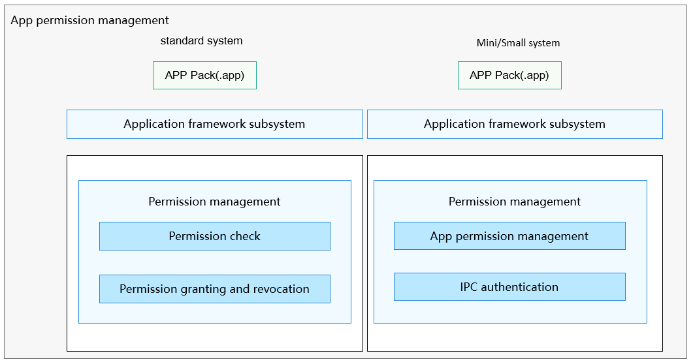

# security\_permission<a name="EN-US_TOPIC_0000001101239136"></a>

-   [Introduction](#section11660541593)
-   [Directory Structure](#section161941989596)
-   [Constraints](#section119744591305)
-   [Usage](#section137768191623)
    -   [Available APIs](#section1551164914237)
    -   [Usage Guidelines](#section129654513264)

-   [Repositories Involved](#section1371113476307)

## Introduction<a name="section11660541593"></a>

In OpenHarmony, apps and system services run in independent sandboxes. Both processes and data are isolated from each other to protect the security of app data. However, services or apps running in the sandboxes provide some APIs to implement specific functionalities. To access these APIs across processes, apps in other sandboxes need the required permissions, which are granted and managed based on a permission management mechanism.

-   App permission management provides a mechanism for defining permissions, allowing system services and apps to define new permissions for their sensitive APIs. To access these APIs, other apps need the required permissions.

-   App permission management also allows apps to request permissions that are defined by the system or other apps. Upon obtaining the permissions, apps can access the sensitive APIs provided by the system or other apps.
-   In addition, app permission management allows users to view and manage the permission granting status.

**Figure  1**  App permission management architecture<a name="fig4460722185514"></a>




App permission management provides permission management for the application framework subsystem and provides APIs for apps to request permissions and query the permission granting status. Currently, app permission management is available for mini, small and standard systems.

-   Mini system: refers to the system running on the devices whose memory is greater than or equal to 128 KiB and that are equipped with MCU processors such as ARM Cortex-M and 32-bit RISC-V. This system provides multiple lightweight network protocols and graphics frameworks, and a wide range of read/write components for the IoT bus. Typical products include connection modules, sensors, and wearables for smart home.
-   Small system: refers to the system running on the devices whose memory is greater than or equal to 1 MiB and that are equipped with app processors such as ARM Cortex-A. This system provides higher security capabilities, standard graphics frameworks, and video encoding and decoding capabilities. Typical products include smart home IP cameras, electronic cat eyes, and routers, and event data recorders \(EDRs\) for smart travel.
-   Standard system: refers to the system running on the devices whose memory is greater than or equal to 128 MiB and that are equipped with app processors such as ARM Cortex-A. This system provides a complete application framework supporting the enhanced interaction, 3D GPU, hardware composer, diverse components, and rich animations. This system applies to high-end refrigerator displays.

## Directory Structure<a name="section161941989596"></a>

```
/base/security/permission
├── frameworks                         # Frameworks
│   └── permission_standard            # Permission management framework for the standard system
├── interfaces                         # APIs
│   ├── innerkits                      # Internal APIs
│   │   ├── permission_lite            # Internal permission management APIs for the mini and small systems
│   │   └── permission_standard        # Internal permission management APIs for the standard system
│   └── kits                           # External APIs
│       ├── permission_lite            # External permission management APIs for the mini and small systems
│       └── permission_standard        # External permission management APIs for the standard system
└── services                           # Services
    ├── permission_lite                # Permission management services for the mini and small systems
    └── permission_standard            # Permission management services for the standard system
```

## Constraints<a name="section119744591305"></a>

-   Currently, C++ APIs are available only for local permission management in the standard system. Distributed permission management APIs are not provided yet.

## Usage<a name="section137768191623"></a>

### Available APIs<a name="section1551164914237"></a>

**App permission management for a standard system**: provides basic permission management and verification capabilities for the application framework subsystem of a standard system and is unavailable for third-party apps. The following table describes the available APIs.

<a name="table17351104911243"></a>
<table><thead align="left"><tr id="row43512497244"><th class="cellrowborder" valign="top" width="73.41%" id="mcps1.1.3.1.1"><p id="p8351104918247"><a name="p8351104918247"></a><a name="p8351104918247"></a>API</p>
</th>
<th class="cellrowborder" valign="top" width="26.590000000000003%" id="mcps1.1.3.1.2"><p id="p7351174913247"><a name="p7351174913247"></a><a name="p7351174913247"></a>Description</p>
</th>
</tr>
</thead>
<tbody><tr id="row143511494244"><td class="cellrowborder" valign="top" width="73.41%" headers="mcps1.1.3.1.1 "><p id="p2504174918322"><a name="p2504174918322"></a><a name="p2504174918322"></a>int VerifyPermission(const string&amp; bundleName, const string&amp; permissionName, int userId)</p>
</td>
<td class="cellrowborder" valign="top" width="26.590000000000003%" headers="mcps1.1.3.1.2 "><p id="p14504549163217"><a name="p14504549163217"></a><a name="p14504549163217"></a>Checks whether a specified app has been granted the given permission.</p>
</td>
</tr>
<tr id="row217303717326"><td class="cellrowborder" valign="top" width="73.41%" headers="mcps1.1.3.1.1 "><p id="p8504849123210"><a name="p8504849123210"></a><a name="p8504849123210"></a>bool CanRequestPermission(const string&amp; bundleName, const string&amp; permissionName, int userId)</p>
</td>
<td class="cellrowborder" valign="top" width="26.590000000000003%" headers="mcps1.1.3.1.2 "><p id="p850417499329"><a name="p850417499329"></a><a name="p850417499329"></a>Checks whether a specified app can request the given permission through a pop-up window.</p>
</td>
</tr>
<tr id="row677573713220"><td class="cellrowborder" valign="top" width="73.41%" headers="mcps1.1.3.1.1 "><p id="p16504124933210"><a name="p16504124933210"></a><a name="p16504124933210"></a>int GrantUserGrantedPermission(const string&amp; bundleName, const string&amp; permissionName, int userId)</p>
</td>
<td class="cellrowborder" valign="top" width="26.590000000000003%" headers="mcps1.1.3.1.2 "><p id="p115042494327"><a name="p115042494327"></a><a name="p115042494327"></a>Grants a specified user_grant permission to the given app.</p>
</td>
</tr>
<tr id="row722533813329"><td class="cellrowborder" valign="top" width="73.41%" headers="mcps1.1.3.1.1 "><p id="p9504114963210"><a name="p9504114963210"></a><a name="p9504114963210"></a>int GrantSystemGrantedPermission(const string&amp; bundleName, const string&amp; permissionName)</p>
</td>
<td class="cellrowborder" valign="top" width="26.590000000000003%" headers="mcps1.1.3.1.2 "><p id="p850412493329"><a name="p850412493329"></a><a name="p850412493329"></a>Grants a specified system_grant permission to the given app.</p>
</td>
</tr>
<tr id="row1354353873216"><td class="cellrowborder" valign="top" width="73.41%" headers="mcps1.1.3.1.1 "><p id="p450414919328"><a name="p450414919328"></a><a name="p450414919328"></a>int RevokeUserGrantedPermission(const string&amp; bundleName, const string&amp; permissionName, int userId)</p>
</td>
<td class="cellrowborder" valign="top" width="26.590000000000003%" headers="mcps1.1.3.1.2 "><p id="p1050411498327"><a name="p1050411498327"></a><a name="p1050411498327"></a>Revokes a specified user_grant permission from the given app.</p>
</td>
</tr>
<tr id="row1073519380323"><td class="cellrowborder" valign="top" width="73.41%" headers="mcps1.1.3.1.1 "><p id="p1850484933212"><a name="p1850484933212"></a><a name="p1850484933212"></a>int RevokeSystemGrantedPermission(const string&amp; bundleName, const string&amp; permissionName)</p>
</td>
<td class="cellrowborder" valign="top" width="26.590000000000003%" headers="mcps1.1.3.1.2 "><p id="p35048492326"><a name="p35048492326"></a><a name="p35048492326"></a>Revokes a specified system_grant permission from the given app.</p>
</td>
</tr>
<tr id="row1692163820325"><td class="cellrowborder" valign="top" width="73.41%" headers="mcps1.1.3.1.1 "><p id="p9504134953215"><a name="p9504134953215"></a><a name="p9504134953215"></a>int AddUserGrantedReqPermissions(const string&amp; bundleName, const std::vector&lt;string&gt;&amp; permList, int userId)</p>
</td>
<td class="cellrowborder" valign="top" width="26.590000000000003%" headers="mcps1.1.3.1.2 "><p id="p250424993212"><a name="p250424993212"></a><a name="p250424993212"></a>Adds user_grant permissions requested by a specified app.</p>
</td>
</tr>
<tr id="row1890399325"><td class="cellrowborder" valign="top" width="73.41%" headers="mcps1.1.3.1.1 "><p id="p1950413498329"><a name="p1950413498329"></a><a name="p1950413498329"></a>int AddSystemGrantedReqPermissions(const string&amp; bundleName, const std::vector&lt;string&gt;&amp; permList)</p>
</td>
<td class="cellrowborder" valign="top" width="26.590000000000003%" headers="mcps1.1.3.1.2 "><p id="p1150444943210"><a name="p1150444943210"></a><a name="p1150444943210"></a>Adds system_grant permissions requested by a specified app.</p>
</td>
</tr>
<tr id="row13257153973215"><td class="cellrowborder" valign="top" width="73.41%" headers="mcps1.1.3.1.1 "><p id="p2505184917329"><a name="p2505184917329"></a><a name="p2505184917329"></a>int RemoveUserGrantedReqPermissions(const string&amp; bundleName, int userId)</p>
</td>
<td class="cellrowborder" valign="top" width="26.590000000000003%" headers="mcps1.1.3.1.2 "><p id="p950514973212"><a name="p950514973212"></a><a name="p950514973212"></a>Removes all the user_grant permissions requested by a specified app.</p>
</td>
</tr>
<tr id="row144437398322"><td class="cellrowborder" valign="top" width="73.41%" headers="mcps1.1.3.1.1 "><p id="p205051049103214"><a name="p205051049103214"></a><a name="p205051049103214"></a>int RemoveSystemGrantedReqPermissions(const string&amp; bundleName)</p>
</td>
<td class="cellrowborder" valign="top" width="26.590000000000003%" headers="mcps1.1.3.1.2 "><p id="p125051349123213"><a name="p125051349123213"></a><a name="p125051349123213"></a>Removes all the system_grant permissions requested by a specified app.</p>
</td>
</tr>
<tr id="row13617183915329"><td class="cellrowborder" valign="top" width="73.41%" headers="mcps1.1.3.1.1 "><p id="p16505049173217"><a name="p16505049173217"></a><a name="p16505049173217"></a>int AddDefPermissions(const std::vector&lt;PermissionDef&gt;&amp; permList)</p>
</td>
<td class="cellrowborder" valign="top" width="26.590000000000003%" headers="mcps1.1.3.1.2 "><p id="p13505849103215"><a name="p13505849103215"></a><a name="p13505849103215"></a>Adds the permissions defined by the app.</p>
</td>
</tr>
<tr id="row117857394324"><td class="cellrowborder" valign="top" width="73.41%" headers="mcps1.1.3.1.1 "><p id="p105059492325"><a name="p105059492325"></a><a name="p105059492325"></a>int GetDefPermission(const string&amp; permissionName, PermissionDef&amp; permissionDefResult)</p>
</td>
<td class="cellrowborder" valign="top" width="26.590000000000003%" headers="mcps1.1.3.1.2 "><p id="p11505349103220"><a name="p11505349103220"></a><a name="p11505349103220"></a>Obtains the definition of the permission with a specified name.</p>
</td>
</tr>
</tbody>
</table>

**App permission management for a mini or small system**: The following table lists the available APIs, which can be called only by system apps and services.

<a name="table9789027162518"></a>
<table><thead align="left"><tr id="row9789427112518"><th class="cellrowborder" valign="top" width="55.66%" id="mcps1.1.3.1.1"><p id="p9790102717251"><a name="p9790102717251"></a><a name="p9790102717251"></a>API</p>
</th>
<th class="cellrowborder" valign="top" width="44.34%" id="mcps1.1.3.1.2"><p id="p779032715251"><a name="p779032715251"></a><a name="p779032715251"></a>Description</p>
</th>
</tr>
</thead>
<tbody><tr id="row187901627112516"><td class="cellrowborder" valign="top" width="55.66%" headers="mcps1.1.3.1.1 "><p id="p138014275353"><a name="p138014275353"></a><a name="p138014275353"></a>int CheckPermission(int uid, const char *permissionName)</p>
</td>
<td class="cellrowborder" valign="top" width="44.34%" headers="mcps1.1.3.1.2 "><p id="p57901727202510"><a name="p57901727202510"></a><a name="p57901727202510"></a>Checks whether the app with a specified UID has the permission to access system service APIs.</p>
</td>
</tr>
<tr id="row19341734164410"><td class="cellrowborder" valign="top" width="55.66%" headers="mcps1.1.3.1.1 "><p id="p123453412448"><a name="p123453412448"></a><a name="p123453412448"></a>int CheckSelfPermission(const char *permissionName)</p>
</td>
<td class="cellrowborder" valign="top" width="44.34%" headers="mcps1.1.3.1.2 "><p id="p937645212447"><a name="p937645212447"></a><a name="p937645212447"></a>Checks whether the caller has the permission to access system service APIs.</p>
</td>
</tr>
<tr id="row879032715258"><td class="cellrowborder" valign="top" width="55.66%" headers="mcps1.1.3.1.1 "><p id="p13071135133514"><a name="p13071135133514"></a><a name="p13071135133514"></a>int QueryPermission(const char *identifier, PermissionSaved **permissions, int *permNum)</p>
</td>
<td class="cellrowborder" valign="top" width="44.34%" headers="mcps1.1.3.1.2 "><p id="p1379072718259"><a name="p1379072718259"></a><a name="p1379072718259"></a>Queries all permissions requested by the app and checks whether the requested permissions have been granted.</p>
</td>
</tr>
<tr id="row877239193516"><td class="cellrowborder" valign="top" width="55.66%" headers="mcps1.1.3.1.1 "><p id="p878133903516"><a name="p878133903516"></a><a name="p878133903516"></a>int GrantPermission(const char *identifier, const char *permName)</p>
</td>
<td class="cellrowborder" valign="top" width="44.34%" headers="mcps1.1.3.1.2 "><p id="p678143943515"><a name="p678143943515"></a><a name="p678143943515"></a>Grants a specified permission to the app.</p>
</td>
</tr>
<tr id="row3616164223510"><td class="cellrowborder" valign="top" width="55.66%" headers="mcps1.1.3.1.1 "><p id="p1617142163517"><a name="p1617142163517"></a><a name="p1617142163517"></a>int RevokePermission(const char *identifier, const char *permName)</p>
</td>
<td class="cellrowborder" valign="top" width="44.34%" headers="mcps1.1.3.1.2 "><p id="p06171242143517"><a name="p06171242143517"></a><a name="p06171242143517"></a>Revokes a specified permission from the app.</p>
</td>
</tr>
<tr id="row13790122742516"><td class="cellrowborder" valign="top" width="55.66%" headers="mcps1.1.3.1.1 "><p id="p23273123365"><a name="p23273123365"></a><a name="p23273123365"></a>int GrantRuntimePermission(int uid, const char *permissionName)</p>
</td>
<td class="cellrowborder" valign="top" width="44.34%" headers="mcps1.1.3.1.2 "><p id="p177908273259"><a name="p177908273259"></a><a name="p177908273259"></a>Grants a specified runtime permission to the app.</p>
</td>
</tr>
<tr id="row18566191217452"><td class="cellrowborder" valign="top" width="55.66%" headers="mcps1.1.3.1.1 "><p id="p169891916194512"><a name="p169891916194512"></a><a name="p169891916194512"></a>int RevokeRuntimePermission(int uid, const char *permissionName)</p>
</td>
<td class="cellrowborder" valign="top" width="44.34%" headers="mcps1.1.3.1.2 "><p id="p937132011440"><a name="p937132011440"></a><a name="p937132011440"></a>Revokes a specified runtime permission from the app.</p>
</td>
</tr>
<tr id="row18566191217452"><td class="cellrowborder" valign="top" width="55.66%" headers="mcps1.1.3.1.1 "><p id="p169891916194512"><a name="p169891916194512"></a><a name="p169891916194512"></a>int UpdatePermissionFlags(const char *identifier, const char *permissionName, const int flags)</p>
</td>
<td class="cellrowborder" valign="top" width="44.34%" headers="mcps1.1.3.1.2 "><p id="p937132011440"><a name="p937132011440"></a><a name="p937132011440"></a>Updates the flags for the specified permission to the app.</p>
</td>
</tr>
</tbody>
</table>


**IPC authentication for a mini or small system**

<a name="table10494122145517"></a>

<table><thead align="left"><tr id="row1494152195511"><th class="cellrowborder" valign="top" width="50%" id="mcps1.1.3.1.1"><p id="p14941221135515"><a name="p14941221135515"></a><a name="p14941221135515"></a>API</p>
</th>
<th class="cellrowborder" valign="top" width="50%" id="mcps1.1.3.1.2"><p id="p8494172116555"><a name="p8494172116555"></a><a name="p8494172116555"></a>Description</p>
</th>
</tr>
</thead>
<tbody><tr id="row1849482118555"><td class="cellrowborder" valign="top" width="50%" headers="mcps1.1.3.1.1 "><p id="p1414381815720"><a name="p1414381815720"></a><a name="p1414381815720"></a>int GetCommunicationStrategy(RegParams params, PolicyTrans **policies, unsigned int *policyNum)</p>
</td>
<td class="cellrowborder" valign="top" width="50%" headers="mcps1.1.3.1.2 "><p id="p749582195510"><a name="p749582195510"></a><a name="p749582195510"></a>Obtains the access policies of a service API.</p>
</td>
</tr>
<tr id="row8495521115517"><td class="cellrowborder" valign="top" width="50%" headers="mcps1.1.3.1.1 "><p id="p966319247576"><a name="p966319247576"></a><a name="p966319247576"></a>int IsCommunicationAllowed(AuthParams params)</p>
</td>
<td class="cellrowborder" valign="top" width="50%" headers="mcps1.1.3.1.2 "><p id="p134951921115511"><a name="p134951921115511"></a><a name="p134951921115511"></a>Checks whether a process has the permission to access an API of another process.</p>
</td>
</tr>
</tbody>
</table>

### Usage Guidelines<a name="section129654513264"></a>

**App permission management for a standard system**

The APIs provided are for internal use and unavailable to developers. During the authentication, you only need to call  **VerifyPermission**.

1.  Determine the app UID and the name of the permission to verify.
2.  Obtain the app bundle name based on the app UID.
3.  Obtain the user ID of the app based on the UID.
4.  Pass the permission name, bundle name, and user ID to  **VerifyPermission\(string permissionName, string bundleName, int userId\)**.
5.  Obtain the verification result.

**App permission management for a mini or small system**

This section uses the bundle manager as an example to describe the app permission development. Before starting development, you need to declare the required sensitive permissions in the  **config.json**  file. During app installation, the BMS calls APIs of the app permission management component to check whether the required permissions have been granted. If yes, the installation proceeds; if not, the installation fails.

1.  Declare the required permission \(**ohos.permission.INSTALL\_BUNDLE**\) in the  **config.json**  file.

    ```
    {
      ...
      "module": {
          "package": "ohos.demo.kitframework",
          "deviceType": [
              "phone", "tv","tablet", "car","smartWatch","sportsWatch","smartCamera", "smartVision"
          ],
          "reqPermissions": [{
            // Declare the ohos.permission.INSTALL_BUNDLE permission required for installing the app.
            "name": "ohos.permission.INSTALL_BUNDLE",
            "reason": "install bundle",
            "usedScene": {
              "ability": [
                "KitFramework"
                ],
              "when": "always"
            }
          },
          {
            "name": "ohos.permission.LISTEN_BUNDLE_CHANGE",
            "reason": "install bundle",
            "usedScene": {
              "ability": [
                "KitFramework"
                ],
              "when": "always"
            }
          },
          {
            "name": "ohos.permission.GET_BUNDLE_INFO",
            "reason": "install bundle",
            "usedScene": {
              "ability": [
                "KitFramework"
                ],
              "when": "always"
            }
          }
          ],
        ...
    }
    ```

2.  The BMS calls the corresponding API of the app permission management component \(for example, the  **CheckPermission**  function with  **ohos.permission.INSTALL\_BUNDLE**  as an input parameter\) to check whether the BMS has the permission to install the app. If yes, the installation proceeds; if not, the installation fails.

    ```
    constexpr static char PERMISSION_INSTALL_BUNDLE[] = "ohos.permission.INSTALL_BUNDLE";
    
    bool Install(const char *hapPath, const InstallParam *installParam, InstallerCallback installerCallback)
    {
        if ((hapPath == nullptr) || (installerCallback == nullptr) || (installParam == nullptr)) {
            HILOG_ERROR(HILOG_MODULE_APP, "BundleManager install failed due to nullptr parameters");
            return false;
        }
        // Check whether the ohos.permission.INSTALL_BUNDLE permission has been granted.
        if (CheckPermission(0, static_cast<const char *>(PERMISSION_INSTALL_BUNDLE)) != GRANTED) {
            HILOG_ERROR(HILOG_MODULE_APP, "BundleManager install failed due to permission denied");
            return false;  // App installation fails.
        }
        // App installation process
        ...
    }
    ```


**IPC authentication for a mini or small system**

This section uses the bundle manager as an example to describe how to configure access policies for APIs provided by the IPC authentication component. In this example, the service registered by BMS with Samgr is  **bundlems**, and the feature registered for open APIs is  **BmsFeature**.

1.  <a name="li15901515152517"></a>Configure access policies in the  **base/security/permission/services/permission\_lite/ipc\_auth/include/policy\_preset.h**  file. Access policies are classified into the following three types:

    1.  **RANGE**: Processes with a specified range of UIDs can access BMS APIs.  **uidMin**  and  **uidMax**  must be specified.

    2.  **FIXED**: Processes with specified UIDs can access BMS APIs.  **fixedUid**  must be specified, and a maximum of eight UIDs are allowed.

    3.  **BUNDLENAME**: An app with a specified  **bundleName**  can access BMS APIs.

    ```
    FeaturePolicy bmsFeature[] = {
        {
            "BmsFeature",
            {
                {
                    .type=FIXED,    // Processes with specified UIDs can access BMS APIs.
                    .fixedUid={2, 3, 8}
                },
                {
                    .type=RANGE,    // Processes with a specified range of UIDs can access BMS APIs.
                    .uidMin=100,
                    .uidMax=__INT_MAX__,
                },
            }
        },
        {
            "BmsInnerFeature",
            {
                {
                    .type=FIXED,     // Processes with specified UIDs can access BMS APIs.
                    .fixedUid={2, 3, 8}
                },
                {
                    .type=RANGE,
                    .uidMin=100,
                    .uidMax=999,
                },
            }
        },
    };
    ```

2.  Add the policies configured for the features in  [Step 1](#li15901515152517)  to the global policy settings. You need to set the number of features.

    ```
    static PolicySetting g_presetPolicies[] = {
        {"permissionms", pmsFeature, 1},
        {"abilityms", amsFeature, 2},
        {"bundlems", bmsFeature, 2},  // Add the policies configured for the two features in [Step 1](#li15901515152517) to the global policy settings.
        {"dtbschedsrv", dmsFeature, 1},
        {"samgr", samgrFeature, 1},
        {"appspawn", appspawnFeature, 1},
        {"WMS", wmsFeature, 1},
        {"bundle_daemon", bdsFeature, 1},
    };
    ```

3.  Register the  **BmsFeature**  defined in  [Step 1](#li15901515152517)  with Samgr.

    ```
    const char BMS_SERVICE[] = "bundlems";
    const char BMS_FEATURE[] = "BmsFeature";
    static void Init()
    {
        SamgrLite *sm = SAMGR_GetInstance();
        if (sm == nullptr) {
            return;
        }
        // Register the BmsFeature with Samgr.
        sm->RegisterFeature(BMS_SERVICE, reinterpret_cast<Feature *>(BundleMsFeature::GetInstance()));
        sm->RegisterFeatureApi(BMS_SERVICE, BMS_FEATURE,
            GetBmsFeatureApi(reinterpret_cast<Feature *>(BundleMsFeature::GetInstance())));
        HILOG_DEBUG(HILOG_MODULE_APP, "BundleMS feature start success");
    }
    APP_FEATURE_INIT(Init);
    ```


When you register a service with Samgr, Samgr calls the  **GetCommunicationStrategy**  function of the IPC authentication component to obtain access policies of the service. When other services or apps access this service through IPC, Samgr calls the  **IsCommunicationAllowed**  function of the IPC authentication component to check whether the services or apps have the access permission.

## Repositories Involved<a name="section1371113476307"></a>
security
security\_permission

