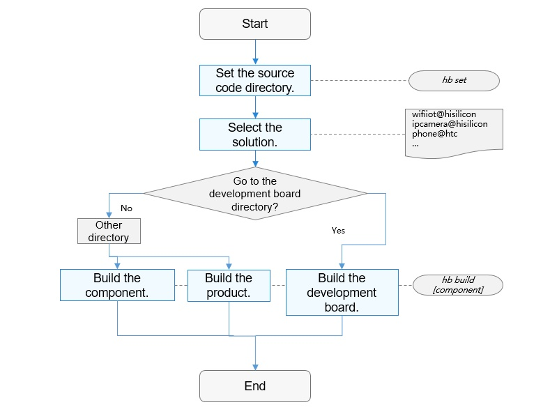

# Compilation and Building \(for Mini and Small Systems\)<a name="EN-US_TOPIC_0000001130006475"></a>

-   [Introduction](#section11660541593)
-   [Directory Structure](#section161941989596)
-   [Usage](#section1312121216216)
    -   [Usage Guidelines](#section129654513264)

-   [Repositories Involved](#section1371113476307)

## Introduction<a name="section11660541593"></a>

The compilation and building subsystem is a build framework based on Generate Ninja \(GN\) and Ninja, which supports component-based OpenHarmony development. This subsystem can be used to:

-   Build products.

-   Build chipset vendor components independently.
-   Build a single component independently.

It is considered best practice to learn the following basic concepts before you start development and build:

-   **Component**

    A component is a reusable software unit that can contain source code, configuration files, resource files, and build scripts.

-   **GN**

    GN is short for Generate Ninja, which is a build system used to generate Ninja files.

-   **Ninja**

    Ninja is a small high-speed build system.


**Build Process**

The following figure shows the build process.

**Figure  1**  Build process<a name="fig1531311552204"></a>  


1.  **hb set**: Set the OpenHarmony source code directory and the product to build.
2.  **hb build**: Build the product, development board, or component. The process to build the solution is as follows:
    -   **Reading configuration**: Read the development board configuration, which covers the toolchain, linking commands, and build options.
    -   **Running gn**: Run the  **gn gen**  command to read the product configuration \(related to the development board, kernel, and system components\) and generate the  **out**  directory and  **ninja**  files for the solution.
    -   **Running Ninja**: Run  **ninja -C out/company/product**  to start build.
    -   **Packaging**: Package the build result to create a file system image.


## Directory Structure<a name="section161941989596"></a>

```
build/lite                      # Primary directory
├── components                  # Component description file
├── hb                          # hb pip installation package
├── make_rootfs                 # make script for the file system
├── config                      # Build configuration items
│   ├── component               # Definitions of component-related templates, including static libraries, dynamic libraries, extension components, and emulator libraries
│   ├── kernel                  # Build configuration parameters of the kernel
│   └── subsystem               # Subsystem template
├── ndk                          # NDK-related build scripts and configuration parameters
└── toolchain                   # Build toolchain, which contain the compiler directories, build options, and linking options
```

## Usage<a name="section1312121216216"></a>

### Usage Guidelines<a name="section129654513264"></a>

1.  **Prerequisites**
    -   Server and OS version: Linux server running 64-bit Ubuntu 16.04 or later
    -   Python version: 3.7.4 or later
    -   Repository:  **build\_lite**  of OpenHarmony source code

2.  **Installing hb**
    -   Run the following command in the root directory of the source code:

        ```
        python3 -m pip install --user build/lite
        ```

    -   Run the  **hb -h**  command. If the following information is displayed, the installation is successful:

        ```
        usage: hb
        
        OHOS build system
        
        positional arguments:
          {build,set,env,clean}
            build               Build source code
            set                 OHOS build settings
            env                 Show OHOS build env
            clean               Clean output
        
        optional arguments:
          -h, --help            Show this help message and exit
        ```

    -   **Uninstalling hb**

        Run the following command to uninstall hb:

        ```
        python3 -m pip uninstall ohos-build
        ```


3.  **Build Commands**
    1.  **hb set**

        ```
        hb set -h
        usage: hb set [-h] [-root [ROOT_PATH]] [-p]
        
        optional arguments:
          -h, --help            Show this help message and exit.
          -root [ROOT_PATH], --root_path [ROOT_PATH]
                                Set OHOS root path.
          -p, --product         Set OHOS board and kernel.
        ```

        -   If you run  **hb set**  with no argument, the default setting process starts.
        -   You can run  **hb set -root** _\[ROOT\_PATH\]_  to set the root directory of the source code.
        -   **hb set -p --product**  is used to set the product to build.

    2.  **hb env**

        View the current configuration.

        ```
        hb env
        [OHOS INFO] root path: xxx
        [OHOS INFO] board: hispark_taurus
        [OHOS INFO] kernel: liteos
        [OHOS INFO] product: ipcamera
        [OHOS INFO] product path: xxx/vendor/hisilicon/ipcamera
        [OHOS INFO] device path: xxx/device/hisilicon/hispark_taurus/sdk_linux_4.19
        ```

    3.  **hb build**

        ```
        hb build -h
        usage: hb build [-h] [-b BUILD_TYPE] [-c COMPILER] [-t [TEST [TEST ...]]]
                        [--dmverity] [-p PRODUCT] [-f] [-n]
                        [component [component ...]]
        
        positional arguments:
          component             Name of the component.
        
        optional arguments:
          -h, --help            Show this help message and exit.
          -b BUILD_TYPE, --build_type BUILD_TYPE
                                Release or debug version.
          -c COMPILER, --compiler COMPILER
                                Specify compiler.
          -t [TEST [TEST ...]], --test [TEST [TEST ...]]
                                Compile test suit.
          --dmverity            Enable dmverity.
          -p PRODUCT, --product PRODUCT
                                Build a specified product with
                                {product_name}@{company}, eg: ipcamera@hisilcon.
          -f, --full            Full code compilation.
          -T [TARGET [TARGET ...]], --target [TARGET [TARGET ...]]
                                Compile single target
        ```

        -   If you run  **hb build**  with no argument, the previously configured code directory, product, and options are used for build.
        -   You can run  **hb build** _\{component\}_  to build product components separately based on the development board and kernel set for the product, for example,  **hb build kv\_store**.
        -   You can run  **hb build -p PRODUCT**  to skip the setting step and build the product directly.
        -   You can run  **hb build**  in  **device/device\_company/board**  to select the kernel and start build based on the current development board and the selected kernel to generate an image that contains the kernel and driver only.

    4.  **hb clean**

        Clear the build result of the product in the  **out**  directory, and leave the  **args.gn**  and  **build.log**  files only. To clear files in a specified directory, add the directory parameter to the command, for example,  **hb clean** _xxx_**/out/**_xxx_.

        ```
        hb clean
        usage: hb clean [-h] [out_path]
        
        positional arguments:
          out_path    Clean a specified path.
        
        optional arguments:
          -h, --help  Show this help message and exit.
        ```


## Repositories Involved<a name="section1371113476307"></a>

Compilation and building subsystem

**[build\_lite](https://gitee.com/openharmony/build_lite)**