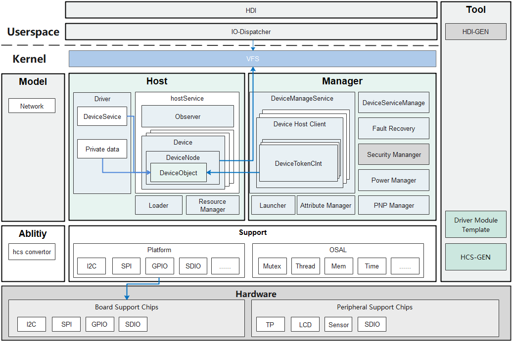

# Hdf Framework<a name="ZH-CN_TOPIC_0000001078041442"></a>

-   [简介](#section11660541593)
-   [目录](#section161941989596)
-   [说明](#section1312121216216)
    -   [驱动框架使用说明](#section129654513264)
    -   [Sensor框架模型说明](#section188637474417)
    -   [Display框架模型说明](#section161502341317)
    -   [Input框架模型说明](#section12629164020115)
    -   [WLAN框架模型说明](#section11408103183114)

-   [相关仓](#section1371113476307)

## 简介<a name="section11660541593"></a>

该仓主要存放OpenHarmony驱动子系统核心源码信息（包括驱动框架、配置管理、配置解析、驱动通用框架模型、硬件通用平台能力接口等），旨在为开发者提供更精准、更高效的开发环境，力求做到一次开发，多系统部署。

**图 1**  驱动框架的架构图<a name="fig1181155517618"></a>  


## 目录<a name="section161941989596"></a>

```
/drivers/framework
├── ability        #提供驱动开发的能力支持，如消息模型库等
│   ├── config     #配置解析代码
│   └── sbuf       #数据序列化代码
├── core           #实现驱动框架的核心代码
│   ├── adapter    #实现对内核操作接口适配，提供抽象化的接口供开发者使用
│   ├── common     #驱动框架公共基础代码
│   ├── host       #驱动宿主环境模块
│   ├── manager    #驱动框架管理模块
│   └── shared     #host和manager共享模块代码
├── include        #驱动框架对外提供能力的头文件
│   ├── config     #提供配置解析能力的头文件
│   ├── core       #驱动框架对外提供的头文件
│   ├── net        #网络数据操作相关的头文件
│   ├── osal       #系统适配相关接口的头文件
│   ├── platform   #平台设备相关接口的头文件
│   ├── utils      #驱动框架公共能力的头文件
│   └── wifi       #WLAN对外提供能力的头文件
├── model          #提供驱动通用框架模型
│   ├── display    #显示框架模型
│   ├── input      #输入框架模型
│   ├── network    #WLAN框架模型
│   └── sensor     #Sensor驱动模型
├── support        #提系统的基础能力 
│   └── platform   #平台设备驱动框架及访问接口，范围包括GPIO、I2C、SPI等
├── tools          #hdf框架工具相关的源码
│   └── hc-gen     #配置管理工具源码
└── utils          #提供基础数据结构和算法等
```

## 说明<a name="section1312121216216"></a>

### 驱动框架使用说明<a name="section129654513264"></a>

基于HDF（驱动框架）开发驱动，用户只需注册自己所需的接口和配置，然后驱动框架就会解析配置的内容，完成驱动加载和初始化动作。

开发者基于HDF驱动框架开发的驱动主要包含三大部分：

1、驱动程序部分----完成驱动的功能逻辑。

2、驱动配置信息----指示驱动的加载信息内容。

3、驱动资源配置----配置驱动的硬件配置信息。

驱动程序主要是完成驱动功能的逻辑代码：

对于开发者首先看到的是驱动入口部分，驱动入口部分通过DriverEntry进行描述。

其中主要包含Bind, Init 和Release三个接口。

```
struct HdfDriverEntry g_deviceSample = {
    .moduleVersion = 1,
    .moduleName = "sample_driver", 
    .Bind = SampleDriverBind,
    .Init = SampleDriverInit,
    .Release = SampleDriverRelease,
};
```

Bind接口描述：该接口的作用主要是完成驱动设备和设备服务接口的bind动作。

```
int32_t SampleDriverBind(struct HdfDeviceObject *deviceObject)
{
    return HDF_SUCCESS;
}
```

Init接口描述：当框架完成设备绑定动作后，就开始调用驱动初始化接口，当初始化成功后，驱动框架根据配置文件决定是否对外创建设备服务接口，还是只是对当前服务接口可见。如果Init初始化失败的话，驱动框架就会主动释放创建的设备接口等信息。

```
int32_t SampleDriverInit(struct HdfDeviceObject *deviceObject)
{
    return HDF_SUCCESS;
}
```

Release接口描述：当用户需要卸载驱动时，驱动框架先通过该接口通知驱动程序释放资源。然后在执行其他内部资源释放。

```
void SampleDriverRelease(struct HdfDeviceObject *deviceObject)
{
    // Release all resources.
    return;
}
```

HDF驱动框架详细开发请参考[驱动开发指南](https://gitee.com/openharmony/docs/blob/master/zh-cn/device-dev/driver/driver-hdf.md)。

### Sensor框架模型说明<a name="section188637474417"></a>

基于HDF（**H**ardware  **D**river  **F**oundation）驱动框架开发的Sensor驱动模型，实现跨操作系统迁移，器件差异配置等功能，具体包括下面两部分：

-   Sensor驱动模型基础能力部分：依赖HDF驱动框架实现Sensor器件驱动的注册，加载，去注册，器件探测等能力，提供同一类型Sensor器件驱动归一接口, 寄存器配置解析操作接口，总线访问抽象接口，平台抽象接口。
-   开发者实现的部分：依赖HDF驱动框架的HCS\(**H**DF  **C**onfiguration  **S**ource\)配置管理，根据同类型Sensor差异化配置，实现Sensor器件参数序列化配置和器件部分操作接口，简化Sensor器件驱动开发。

基于Sensor驱动模型开发Sensor器件驱动请参考[Sensor驱动开发指南](https://gitee.com/openharmony/docs/blob/master/zh-cn/device-dev/driver/driver-peripherals-sensor-des.md)。

### Display框架模型说明<a name="section161502341317"></a>

基于OpenHarmony驱动框架的Display驱动模型，对上屏蔽了芯片平台差异，方便操作系统跨平台迁移；向下抽象外设驱动公共业务逻辑，通过配置或差异化适配接口，实现一套驱动模型可兼容不同的外设器件，使得三方厂商可以高效、便捷的切入鸿蒙驱动生态。

-   Display驱动模型基础能力部分：包括HDI（**H**ardware  **D**river  **I**nterfaces）接口的定义及其实现框架，以及芯片平台对HDI接口的适配实现；内核驱动部分抽象了Panel驱动的公共业务，提供基础的Panel初始化、器件配置信息获取、上下电、背光设置等公共流程。
-   驱动开发者实现的部分：需要完成板级的HCS配置及Panel私有数据配置，或者实现部分器件差异化接口，保证显示屏驱动开发高效便捷。

基于Display驱动模型开发LCD器件驱动请参考[LCD驱动开发指南](https://gitee.com/openharmony/docs/blob/master/zh-cn/device-dev/driver/driver-peripherals-lcd-des.md)。

### Input框架模型说明<a name="section12629164020115"></a>

基于OpenHarmony驱动框架的Input驱动模型，不依赖于芯片平台，对上层输入服务提供统一的驱动接口；在具体的驱动模型实现中，针对不同类别的输入设备，抽象出几类公共的平台驱动，通过配置及差异化的适配接口，使得驱动模型可兼容不同的输入设备。

-   Input驱动模型基础能力部分：包括Input HDI层的接口定义及公共实现，对上层输入服务提供设备管理、业务控制、数据上报等驱动能力接口；而Input驱动模型提供不同类型Input设备的归一化驱动, 包括输入设备的注册和注销、event数据的上报通道、配置信息的解析、公共驱动的加载等能力。
-   开发者实现的部分：根据驱动模型提供的平台驱动，需要完成设备描述配置及器件私有配置，以及实现预留的器件差异化接口，借由此驱动模型，可大幅缩减Input设备驱动的开发周期。

基于Input驱动模型开发Touchscreen器件驱动请参考[Touchscreen驱动开发指南](https://gitee.com/openharmony/docs/blob/master/zh-cn/device-dev/driver/driver-peripherals-touch-des.md)。

### WLAN框架模型说明<a name="section11408103183114"></a>

基于OpenHarmony驱动框架的WLAN驱动模型，可实现跨操作系统迁移，自适应器件差异，模块化拼装编译等功能。各WLAN厂商驱动开发人员可根据WLAN模块提供的向下统一接口适配各自的驱动代码，HDI层开发人员可根据WLAN模块提供的向上统一接口获取如下能力：建立/关闭WLAN热点、扫描、关联WLAN热点等。

-   WLAN驱动模型基础能力部分：包括WLAN HDI层的接口定义及公共实现，对上层输入服务提供如设置MAC地址，获取设备的MAC地址，获取特性的类型，设置发射功率等能力；对驱动开发者提供创建/释放WifiModule，关联/取消关联，申请/释放NetBuf等能力。
-   驱动开发者实现的部分：根据驱动模型提供的平台驱动，需要完成板级的HCS配置及WLAN芯片的私有配置，以及实现预留的初始化/注销网络设备、打开/关闭网络设备等相关接口。

基于WLAN驱动模型开发WLAN器件驱动请参考[WLAN驱动开发指南](https://gitee.com/openharmony/docs/blob/master/zh-cn/device-dev/driver/driver-peripherals-external-des.md)。

## 相关仓<a name="section1371113476307"></a>

[驱动子系统](https://gitee.com/openharmony/docs/blob/master/zh-cn/readme/%E9%A9%B1%E5%8A%A8%E5%AD%90%E7%B3%BB%E7%BB%9F.md)

[drivers\_framework](https://gitee.com/openharmony/drivers_framework/blob/master/README.md)

[drivers\_adapter](https://gitee.com/openharmony/drivers_adapter/blob/master/README_zh.md)

[drivers\_adapter\_khdf\_linux](https://gitee.com/openharmony/drivers_adapter_khdf_linux/blob/master/README_zh.md)

[drivers\_peripheral](https://gitee.com/openharmony/drivers_peripheral/blob/master/README_zh.md)

