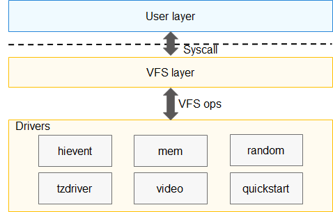

# Drivers<a name="EN-US_TOPIC_0000001096875497"></a>

-   [Introduction](#section7301810197)
-   [Directory Structure](#section161941989596)
-   [Constraints](#section119744591305)
    -   [Available APIs](#section1551164914237)
    -   [Usage](#section129654513264)

-   [Repositories Involved](#section1371113476307)

## Introduction<a name="section7301810197"></a>

A kernel driver acts as a bridge between software and hardware. It allows accessing hardware resources of the OpenHarmony kernel through file system APIs, providing a mode of communication between the user space and kernel space and between processes. The main kernel drivers include  **mem**,  **random**,  **video**,  **quickstart**,  **hievent**, and  **tzdriver**. The preceding four types of drivers are stored in the  **kernel/liteos\_a/drivers/char**  directory, and the last two types  **hievent**  and  **tzdriver**  are stored in the  **drivers/liteos**  directory. Each type of driver represents a capability. You can select a driver as required to transmit data. The following figure shows the kernel driver architecture.

**Figure  1**  Kernel driver architecture<a name="fig2996151913212"></a>  


Wherein:

-   **mem**  indicates the driver for accessing physical input/output \(I/O\) devices in user space. It is used together with the  **mmap**  function.
-   **random**  indicates the driver for devices to obtain random numbers, including true random number generators \(TRNGs\) and pseudorandom number generators \(PRNGs\). The device nodes for a TRNG and a PRNG are  **/dev/random**  and  **/dev/urandom**, respectively. Comparatively, TRNGs provide a higher randomness.
-   **video**  indicates the framebuffer driver framework. You need to initialize APIs, register the framebuffer driver, and operate the framebuffer driver through file system APIs.

## Directory Structure<a name="section161941989596"></a>

```
/drivers/liteos
├── hievent         # Driver for event log management
├── include         # Header files exposed externally
├── tzdriver        # Used for switching and communication between the rich execution environment (REE) and trusted execution environment (TEE) and provides device nodes that can be accessed from the application layer.
```

## Constraints<a name="section119744591305"></a>

Since the  **tzdriver**  implementation is not completely open-source, third-party vendors need to obtain the support for it through cooperation.

The hievent-related capabilities are not supported currently and will be opened in the future. In addition, do not modify APIs and the format of their parameters defined in the  **hievent**  folder.

The video-related source code is stored in the  **video/fb.c**  and  **video/fb.h**  files under the  **third\_party/NuttX**  directory.

### Available APIs<a name="section1551164914237"></a>

As shown in the preceding kernel driver architecture, a kernel driver can be taken as a special file. You can call standard file system APIs, such as  **open**,  **close**,  **read**,  **write**, and  **ioctl**  to perform operations on the driver. The following lists related APIs:

-   fb\_register

    **Function prototype:**

    int fb\_register\(int display, int plane\);

    **Function description:**  Loads the framebuffer driver and registers the  **/dev/fb0**  device node. If the operation is successful,  **0**  is returned. Otherwise, an error code is returned.

    **Parameter description**

    <a name="table13709103919318"></a>
    <table><thead align="left"><tr id="row1170923910316"><th class="cellrowborder" valign="top" width="11.92%" id="mcps1.1.3.1.1"><p id="p1709123911313"><a name="p1709123911313"></a><a name="p1709123911313"></a>Parameter</p>
    </th>
    <th class="cellrowborder" valign="top" width="88.08%" id="mcps1.1.3.1.2"><p id="p1970910395313"><a name="p1970910395313"></a><a name="p1970910395313"></a>Description</p>
    </th>
    </tr>
    </thead>
    <tbody><tr id="row7709113923117"><td class="cellrowborder" valign="top" width="11.92%" headers="mcps1.1.3.1.1 "><p id="p1870983993114"><a name="p1870983993114"></a><a name="p1870983993114"></a>display</p>
    </td>
    <td class="cellrowborder" valign="top" width="88.08%" headers="mcps1.1.3.1.2 "><p id="p870963913111"><a name="p870963913111"></a><a name="p870963913111"></a>Indicates the display layer number. The value is usually <strong id="b832218348241"><a name="b832218348241"></a><a name="b832218348241"></a>0</strong>. If the hardware supports multiple display layers, this parameter can be set to other values.</p>
    </td>
    </tr>
    <tr id="row0709163973120"><td class="cellrowborder" valign="top" width="11.92%" headers="mcps1.1.3.1.1 "><p id="p170993918319"><a name="p170993918319"></a><a name="p170993918319"></a>plane</p>
    </td>
    <td class="cellrowborder" valign="top" width="88.08%" headers="mcps1.1.3.1.2 "><p id="p9294182194420"><a name="p9294182194420"></a><a name="p9294182194420"></a>Indicates the color plane. The value is usually <strong id="b135661135142019"><a name="b135661135142019"></a><a name="b135661135142019"></a>0</strong>.</p>
    </td>
    </tr>
    </tbody>
    </table>


-   fb\_unregister

    **Function prototype:**

    int fb\_unregister\(int display\);

    **Function description:**  Uninstalls the framebuffer driver. If the operation is successful,  **0**  is returned. Otherwise, an error code is returned.

    **Parameter description**

    <a name="table1616493545014"></a>
    <table><thead align="left"><tr id="row181651335105012"><th class="cellrowborder" valign="top" width="11.92%" id="mcps1.1.3.1.1"><p id="p4165123514507"><a name="p4165123514507"></a><a name="p4165123514507"></a>Parameter</p>
    </th>
    <th class="cellrowborder" valign="top" width="88.08%" id="mcps1.1.3.1.2"><p id="p6165103514502"><a name="p6165103514502"></a><a name="p6165103514502"></a>Description</p>
    </th>
    </tr>
    </thead>
    <tbody><tr id="row71650351503"><td class="cellrowborder" valign="top" width="11.92%" headers="mcps1.1.3.1.1 "><p id="p11651835145015"><a name="p11651835145015"></a><a name="p11651835145015"></a>display</p>
    </td>
    <td class="cellrowborder" valign="top" width="88.08%" headers="mcps1.1.3.1.2 "><p id="p16165183519506"><a name="p16165183519506"></a><a name="p16165183519506"></a>Indicates the display layer number.</p>
    </td>
    </tr>
    </tbody>
    </table>


-   up\_fbinitialize

    **Function prototype:**

    int up\_fbinitialize\(int display\);

    **Function description:**  Initializes the framebuffer driver. This function needs your implementation by calling  **fb\_register**  to register a device node for providing the framebuffer hardware driver capability. If the operation is successful,  **0**  is returned. Otherwise, an error code is returned.

    **Parameter description**

    <a name="table6333115110543"></a>
    <table><thead align="left"><tr id="row1333315117540"><th class="cellrowborder" valign="top" width="11.92%" id="mcps1.1.3.1.1"><p id="p1233320514548"><a name="p1233320514548"></a><a name="p1233320514548"></a>Parameter</p>
    </th>
    <th class="cellrowborder" valign="top" width="88.08%" id="mcps1.1.3.1.2"><p id="p12334125165413"><a name="p12334125165413"></a><a name="p12334125165413"></a>Description</p>
    </th>
    </tr>
    </thead>
    <tbody><tr id="row16334155113548"><td class="cellrowborder" valign="top" width="11.92%" headers="mcps1.1.3.1.1 "><p id="p18334145115546"><a name="p18334145115546"></a><a name="p18334145115546"></a>display</p>
    </td>
    <td class="cellrowborder" valign="top" width="88.08%" headers="mcps1.1.3.1.2 "><p id="p15334951125417"><a name="p15334951125417"></a><a name="p15334951125417"></a>Indicates the display layer number.</p>
    </td>
    </tr>
    </tbody>
    </table>


-   up\_fbuninitialize

    **Function prototype:**

    void up\_fbuninitialize\(int display\);

    **Function description:**  Uninstalls the framebuffer driver. This function needs your implementation by calling  **fb\_unregister**  to unregister the device node. No value is returned for this function.

    **Parameter description**

    <a name="table18929574553"></a>
    <table><thead align="left"><tr id="row1993012716553"><th class="cellrowborder" valign="top" width="11.92%" id="mcps1.1.3.1.1"><p id="p1593012795510"><a name="p1593012795510"></a><a name="p1593012795510"></a>Parameter</p>
    </th>
    <th class="cellrowborder" valign="top" width="88.08%" id="mcps1.1.3.1.2"><p id="p1693014715516"><a name="p1693014715516"></a><a name="p1693014715516"></a>Description</p>
    </th>
    </tr>
    </thead>
    <tbody><tr id="row4930076554"><td class="cellrowborder" valign="top" width="11.92%" headers="mcps1.1.3.1.1 "><p id="p18930147105517"><a name="p18930147105517"></a><a name="p18930147105517"></a>display</p>
    </td>
    <td class="cellrowborder" valign="top" width="88.08%" headers="mcps1.1.3.1.2 "><p id="p89309705512"><a name="p89309705512"></a><a name="p89309705512"></a>Indicates the display layer number.</p>
    </td>
    </tr>
    </tbody>
    </table>


-   up\_fbgetvplane

    **Function prototype:**

    struct fb\_vtable\_s \*up\_fbgetvplane\(int display, int vplane\);

    **Function description:**  Obtains a framebuffer driver handle, which needs your implementation. If the operation is successful, a valid pointer is returned. Otherwise,  **NULL**  is returned.

    **Parameter description**

    <a name="table0350124169"></a>
    <table><thead align="left"><tr id="row183519416611"><th class="cellrowborder" valign="top" width="11.92%" id="mcps1.1.3.1.1"><p id="p7351184160"><a name="p7351184160"></a><a name="p7351184160"></a>Parameter</p>
    </th>
    <th class="cellrowborder" valign="top" width="88.08%" id="mcps1.1.3.1.2"><p id="p18351347614"><a name="p18351347614"></a><a name="p18351347614"></a>Description</p>
    </th>
    </tr>
    </thead>
    <tbody><tr id="row8351174461"><td class="cellrowborder" valign="top" width="11.92%" headers="mcps1.1.3.1.1 "><p id="p143519414618"><a name="p143519414618"></a><a name="p143519414618"></a>display</p>
    </td>
    <td class="cellrowborder" valign="top" width="88.08%" headers="mcps1.1.3.1.2 "><p id="p1035110419612"><a name="p1035110419612"></a><a name="p1035110419612"></a>Indicates the display layer number.</p>
    </td>
    </tr>
    <tr id="row187413238610"><td class="cellrowborder" valign="top" width="11.92%" headers="mcps1.1.3.1.1 "><p id="p118752231869"><a name="p118752231869"></a><a name="p118752231869"></a>vplane</p>
    </td>
    <td class="cellrowborder" valign="top" width="88.08%" headers="mcps1.1.3.1.2 "><p id="p16875102311611"><a name="p16875102311611"></a><a name="p16875102311611"></a>Indicates the specified color plane.</p>
    </td>
    </tr>
    </tbody>
    </table>


-   pse\_ran\_dev\_register

    **Function prototype:**

    int pse\_ran\_dev\_register\(void\);

    **Function description:**  Initializes the PRNG device driver and registers the  **/dev/random**  device node. If the operation is successful,  **0**  is returned. Otherwise, an error code is returned.

    **Parameter description:**  none


-   ran\_dev\_register

    **Function prototype:**

    int ran\_dev\_register\(void\);

    **Function description:**  Initializes the TRNG driver and registers the  **/dev/urandom**  device node. If the operation is successful,  **0**  is returned. Otherwise, an error code is returned.

    **Parameter description:**  none


-   mem\_dev\_register

    **Function prototype:**

    int mem\_dev\_register\(void\);

    **Function description:**  Initializes the mem driver and registers the  **/dev/mem**  device node. If the operation is successful,  **0**  is returned. Otherwise, an error code is returned.

    **Parameter description:**  none


### Usage<a name="section129654513264"></a>

-   The following uses the framebuffer driver as an example:

```
int up_fbinitialize(int display)
{
    // Provide framebuffer hardware driver capabilities. The specific code logic needs your implementation.
}

void up_fbuninitialize(int display)
{
    // This function is used together with up_fbinitialize. The specific code logic needs your implementation.
}

struct fb_vtable_s *up_fbgetvplane(int display, int vplane)
{
    // Register a hardware driver based on information described by the fb_vtable_s structure. You can use the driver capabilities through the video framework layer. The specific code logic needs your implementation.
}

int FrameBufferFunc(void)
{
    int ret;
    int fd = -1;
    struct hifb_info info;
    char *pShowScreen = NULL;

    ret = fb_register(0, 0); // Register the /dev/fb0 device node. This function will call the preceding functions to enable hardware driver capabilities.
    if (ret != 0) {
        return -1;
    }

    fd = open(file, O_RDWR, 0);  
    if (fd < 0) {
        return -1;
    }
 
    if (ioctl(fd, FBIOGET_SCREENINFO_HIFB, &info) < 0) {
        return -1;
    }
    info.vinfo.xres = 1920;
    info.vinfo.yres = 1080;
    info.oinfo.sarea.w = 1920;
    info.oinfo.sarea.h = 1080;
    info.oinfo.bpp = 16;
    info.activate = 0;
    info.vinfo.fmt = HIFB_FMT_ARGB1555;

    if (ioctl(fd, FBIOPUT_SCREENINFO_HIFB, &info) < 0) {
        return -1;
    }

    if (ioctl(fd, FBIOGET_SCREENINFO_HIFB, &info) < 0) {
        return -1;
    }

    pShowScreen = mmap(HI_NULL, info.oinfo.fblen, PROT_READ | PROT_WRITE, MAP_SHARED, pstInfo->fd, 0);
    if (pShowScreen == -1) {
        return -1;
    }

    // Fill in the memory to which pShowScreen points and display the graphics through the ioctl call.

    munmap(pShowScreen, info.oinfo.fblen); 
  
    close(fd);

    ret = fb_unregister(0);
    if (ret != 0) {
        return -1;
    }
}
```

## Repositories Involved<a name="section1371113476307"></a>

[Kernel subsystem](https://gitee.com/openharmony/docs/blob/HEAD/en/readme/kernel.md)

[drivers\_liteos](https://gitee.com/openharmony/drivers_liteos/blob/master/README.md)

[kernel\_liteos\_a](https://gitee.com/openharmony/kernel_liteos_a/blob/HEAD/README.md)

