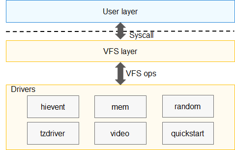

# 驱动<a name="ZH-CN_TOPIC_0000001096875497"></a>

-   [简介](#section7301810197)
-   [目录](#section161941989596)
-   [约束](#section119744591305)
    -   [接口说明](#section1551164914237)
    -   [使用说明](#section129654513264)

-   [相关仓](#section1371113476307)

## 简介<a name="section7301810197"></a>

内核驱动是软件与硬件交互的桥梁，通过文件系统接口访问OpenHarmony内核的硬件资源，是用户与内核之间、进程与进程之间通信的一种方式。每类驱动代表一种能力，用户可以根据需求选择对应驱动，完成数据的传输。内核初始化驱动并注册设备节点，用户通过文件系统接口操作该设备节点。内核驱动主要包括mem、random、video、quickstart、hievent和tzdriver，其中mem、random、video和quickstart位于kernel/liteos\_a/drivers/char目录下，hievent和tzdrivert位于drivers/liteos目录下。驱动架构图如下所示：

**图 1**  内核驱动架构图<a name="fig2996151913212"></a>  


其中：

-   mem驱动用于用户态访问物理IO设备，与mmap接口结合使用；
-   random驱动用于获取随机数，包括真随机和伪随机两种设备驱动，设备节点分别为/dev/random和/dev/urandom，通过真随机设备节点获取的数据随机性相对较高；
-   video相关实现是framebuffer驱动框架，用户需要实现初始化接口完成驱动注册，通过文件系统接口操作framebuffer驱动。

## 目录<a name="section161941989596"></a>

```
/drivers/liteos
├── hievent         # 事件日志管理驱动
├── include         # 对外头文件存放目录
├── tzdriver        # 用于ree/tee切换、通讯，提供应用层访问的设备节点
```

## 约束<a name="section119744591305"></a>

tzdriver驱动实现部分尚未开源，三方厂商需要通过合作方式获取该组件的支持。

hievent驱动的配套功能暂不支持，待后续开源，请勿修改该驱动定义的接口和接口参数格式。

video源码实现在third\_party/NuttX下面：video/fb.c和video/fb.h。

### 接口说明<a name="section1551164914237"></a>

由上文内核驱动框架图可以看出，内核驱动可以看成特殊的文件，用户调用文件系统标准接口，即可完成对驱动的读写操作，有open、close、read、write和ioctl等标准接口，不再阐述。下面列举各个驱动相关接口：

-   fb\_register

    **函数原型：**

    int fb\_register\(int display, int plane\);

    **函数功能：** 加载framebuffer驱动，注册设备节点/dev/fb0；若成功则返回0， 否则返回相应的错误码。

    **参数说明：**

    <a name="table13709103919318"></a>
    <table><thead align="left"><tr id="row1170923910316"><th class="cellrowborder" valign="top" width="11.92%" id="mcps1.1.3.1.1"><p id="p1709123911313"><a name="p1709123911313"></a><a name="p1709123911313"></a>参数</p>
    </th>
    <th class="cellrowborder" valign="top" width="88.08%" id="mcps1.1.3.1.2"><p id="p1970910395313"><a name="p1970910395313"></a><a name="p1970910395313"></a>描述</p>
    </th>
    </tr>
    </thead>
    <tbody><tr id="row7709113923117"><td class="cellrowborder" valign="top" width="11.92%" headers="mcps1.1.3.1.1 "><p id="p1870983993114"><a name="p1870983993114"></a><a name="p1870983993114"></a>display</p>
    </td>
    <td class="cellrowborder" valign="top" width="88.08%" headers="mcps1.1.3.1.2 "><p id="p870963913111"><a name="p870963913111"></a><a name="p870963913111"></a>显示层编号，通常为0。若硬件支持多显示层，该变量可设置成其他值。</p>
    </td>
    </tr>
    <tr id="row0709163973120"><td class="cellrowborder" valign="top" width="11.92%" headers="mcps1.1.3.1.1 "><p id="p170993918319"><a name="p170993918319"></a><a name="p170993918319"></a>plane</p>
    </td>
    <td class="cellrowborder" valign="top" width="88.08%" headers="mcps1.1.3.1.2 "><p id="p9294182194420"><a name="p9294182194420"></a><a name="p9294182194420"></a>标识颜色平面，通常为0。</p>
    </td>
    </tr>
    </tbody>
    </table>


-   fb\_unregister

    **函数原型：**

    int fb\_unregister\(int display\);

    **函数功能：** 卸载framebuffer驱动；若成功则返回0， 否则返回相应的错误码。

    **参数说明：**

    <a name="table1616493545014"></a>
    <table><thead align="left"><tr id="row181651335105012"><th class="cellrowborder" valign="top" width="11.92%" id="mcps1.1.3.1.1"><p id="p4165123514507"><a name="p4165123514507"></a><a name="p4165123514507"></a>参数</p>
    </th>
    <th class="cellrowborder" valign="top" width="88.08%" id="mcps1.1.3.1.2"><p id="p6165103514502"><a name="p6165103514502"></a><a name="p6165103514502"></a>描述</p>
    </th>
    </tr>
    </thead>
    <tbody><tr id="row71650351503"><td class="cellrowborder" valign="top" width="11.92%" headers="mcps1.1.3.1.1 "><p id="p11651835145015"><a name="p11651835145015"></a><a name="p11651835145015"></a>display</p>
    </td>
    <td class="cellrowborder" valign="top" width="88.08%" headers="mcps1.1.3.1.2 "><p id="p16165183519506"><a name="p16165183519506"></a><a name="p16165183519506"></a>显示层编号。</p>
    </td>
    </tr>
    </tbody>
    </table>


-   up\_fbinitialize

    **函数原型：**

    int up\_fbinitialize\(int display\);

    **函数功能：** 初始化framebuffer驱动，这个接口需要用户通过调用fb\_register注册设备节点来实现，以提供framebuffer硬件驱动功能；若成功则返回0，否则返回相应的错误码。

    **参数说明：**

    <a name="table6333115110543"></a>
    <table><thead align="left"><tr id="row1333315117540"><th class="cellrowborder" valign="top" width="11.92%" id="mcps1.1.3.1.1"><p id="p1233320514548"><a name="p1233320514548"></a><a name="p1233320514548"></a>参数</p>
    </th>
    <th class="cellrowborder" valign="top" width="88.08%" id="mcps1.1.3.1.2"><p id="p12334125165413"><a name="p12334125165413"></a><a name="p12334125165413"></a>描述</p>
    </th>
    </tr>
    </thead>
    <tbody><tr id="row16334155113548"><td class="cellrowborder" valign="top" width="11.92%" headers="mcps1.1.3.1.1 "><p id="p18334145115546"><a name="p18334145115546"></a><a name="p18334145115546"></a>display</p>
    </td>
    <td class="cellrowborder" valign="top" width="88.08%" headers="mcps1.1.3.1.2 "><p id="p15334951125417"><a name="p15334951125417"></a><a name="p15334951125417"></a>显示层编号。</p>
    </td>
    </tr>
    </tbody>
    </table>


-   up\_fbuninitialize

    **函数原型：**

    void up\_fbuninitialize\(int display\);

    **函数功能：** 卸载framebuffer硬件驱动，这个接口需要用户通过调用fb\_unregister注销设备节点来实现；无返回值。

    **参数说明：**

    <a name="table18929574553"></a>
    <table><thead align="left"><tr id="row1993012716553"><th class="cellrowborder" valign="top" width="11.92%" id="mcps1.1.3.1.1"><p id="p1593012795510"><a name="p1593012795510"></a><a name="p1593012795510"></a>参数</p>
    </th>
    <th class="cellrowborder" valign="top" width="88.08%" id="mcps1.1.3.1.2"><p id="p1693014715516"><a name="p1693014715516"></a><a name="p1693014715516"></a>描述</p>
    </th>
    </tr>
    </thead>
    <tbody><tr id="row4930076554"><td class="cellrowborder" valign="top" width="11.92%" headers="mcps1.1.3.1.1 "><p id="p18930147105517"><a name="p18930147105517"></a><a name="p18930147105517"></a>display</p>
    </td>
    <td class="cellrowborder" valign="top" width="88.08%" headers="mcps1.1.3.1.2 "><p id="p89309705512"><a name="p89309705512"></a><a name="p89309705512"></a>显示层编号。</p>
    </td>
    </tr>
    </tbody>
    </table>


-   up\_fbgetvplane

    **函数原型：**

    struct fb\_vtable\_s \*up\_fbgetvplane\(int display, int vplane\);

    **函数功能：** 获取framebuffer硬件驱动的句柄，这个接口需要用户实现；若成功则返回有效指针，否则返回NULL。

    **参数说明：**

    <a name="table0350124169"></a>
    <table><thead align="left"><tr id="row183519416611"><th class="cellrowborder" valign="top" width="11.92%" id="mcps1.1.3.1.1"><p id="p7351184160"><a name="p7351184160"></a><a name="p7351184160"></a>参数</p>
    </th>
    <th class="cellrowborder" valign="top" width="88.08%" id="mcps1.1.3.1.2"><p id="p18351347614"><a name="p18351347614"></a><a name="p18351347614"></a>描述</p>
    </th>
    </tr>
    </thead>
    <tbody><tr id="row8351174461"><td class="cellrowborder" valign="top" width="11.92%" headers="mcps1.1.3.1.1 "><p id="p143519414618"><a name="p143519414618"></a><a name="p143519414618"></a>display</p>
    </td>
    <td class="cellrowborder" valign="top" width="88.08%" headers="mcps1.1.3.1.2 "><p id="p1035110419612"><a name="p1035110419612"></a><a name="p1035110419612"></a>显示层编号。</p>
    </td>
    </tr>
    <tr id="row187413238610"><td class="cellrowborder" valign="top" width="11.92%" headers="mcps1.1.3.1.1 "><p id="p118752231869"><a name="p118752231869"></a><a name="p118752231869"></a>vplane</p>
    </td>
    <td class="cellrowborder" valign="top" width="88.08%" headers="mcps1.1.3.1.2 "><p id="p16875102311611"><a name="p16875102311611"></a><a name="p16875102311611"></a>指定的颜色平面。</p>
    </td>
    </tr>
    </tbody>
    </table>


-   pse\_ran\_dev\_register

    **函数原型：**

    int pse\_ran\_dev\_register\(void\);

    **函数功能：** 初始化软随机设备驱动，注册设备节点/dev/random；若成功则返回0， 否则返回相应的错误码。

    **参数说明：** 无


-   ran\_dev\_register

    **函数原型：**

    int ran\_dev\_register\(void\);

    **函数功能：** 初始化硬随机设备驱动，注册设备节点/dev/urandom；若成功则返回0， 否则返回相应的错误码。

    **参数说明：** 无


-   mem\_dev\_register

    **函数原型：**

    int mem\_dev\_register\(void\);

    **函数功能：** 初始化mem驱动，注册设备节点/dev/mem；若成功则返回0，否则返回相应的错误码。

    **参数说明：** 无


### 使用说明<a name="section129654513264"></a>

-   以framebuffer驱动操作为例：

```
int up_fbinitialize(int display)
{
    //具体代码逻辑由用户实现，提供framebuffer硬件驱动能力；
}

void up_fbuninitialize(int display)
{
    //具体代码逻辑由用户实现，与up_fbinitialize匹配；
}

struct fb_vtable_s *up_fbgetvplane(int display, int vplane)
{
    //具体代码逻辑由用户实现，根据fb_vtable_s结构体类型信息注册硬件设备驱动，用户通过video框架层调用这些能力；
}

int FrameBufferFunc(void)
{
    int ret;
    int fd = -1;
    struct hifb_info info;
    char *pShowScreen = NULL;

    ret = fb_register(0, 0); //注册/dev/fb0设备节点，该接口会调用上述接口，完成硬件驱动能力使能；
    if (ret != 0) {
        return -1;
    }

    fd = open(file, O_RDWR, 0);  
    if (fd < 0) {
        return -1;
    }
 
    if (ioctl(fd, FBIOGET_SCREENINFO_HIFB, &info) < 0) {
        return -1;
    }
    info.vinfo.xres = 1920;
    info.vinfo.yres = 1080;
    info.oinfo.sarea.w = 1920;
    info.oinfo.sarea.h = 1080;
    info.oinfo.bpp = 16;
    info.activate = 0;
    info.vinfo.fmt = HIFB_FMT_ARGB1555;

    if (ioctl(fd, FBIOPUT_SCREENINFO_HIFB, &info) < 0) {
        return -1;
    }

    if (ioctl(fd, FBIOGET_SCREENINFO_HIFB, &info) < 0) {
        return -1;
    }

    pShowScreen = mmap(HI_NULL, info.oinfo.fblen, PROT_READ | PROT_WRITE, MAP_SHARED, pstInfo->fd, 0);
    if (pShowScreen == -1) {
        return -1;
    }

    //填充pShowScreen指针指向的内存，通过ioctl命令，显示图形；

    munmap(pShowScreen, info.oinfo.fblen); 
  
    close(fd);

    ret = fb_unregister(0);
    if (ret != 0) {
        return -1;
    }
}
```

## 相关仓<a name="section1371113476307"></a>

[内核子系统](https://gitee.com/openharmony/docs/blob/HEAD/zh-cn/readme/%E5%86%85%E6%A0%B8%E5%AD%90%E7%B3%BB%E7%BB%9F.md)

[drivers\_liteos](https://gitee.com/openharmony/drivers_liteos/blob/master/README_zh.md)

[kernel\_liteos\_a](https://gitee.com/openharmony/kernel_liteos_a/blob/HEAD/README_zh.md)

