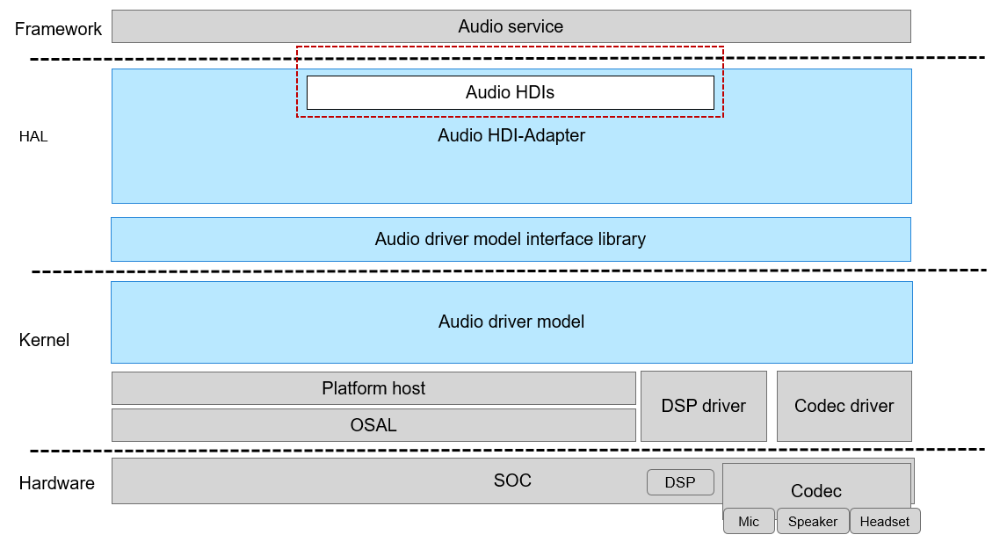

# audio<a name="EN-US_TOPIC_0000001078525242"></a>

-   [Introduction](#section11660541593)
-   [Directory Structure](#section161941989596)
    -   [Available APIs](#section1551164914237)
    -   [Usage Guidelines](#section129654513264)

-   [Repositories Involved](#section1371113476307)

## Introduction<a name="section11660541593"></a>

This repository contains a set of HDIs that can be used to:

-   Manage loading and unloading of sound card drivers.
-   Create audio renderer and capturer.
-   Select an audio scene.
-   Set audio properties.
-   Set the audio volume and gain.
-   Start or stop audio playback and recording.

**Figure  1**  Logic view of modules related to this repository<a name="fig3672817152110"></a>


## Directory Structure<a name="section161941989596"></a>

The source code directory structure in this repository is as follows:

```
drivers/peripheral/audio/
└── interfaces         # External interfaces provided by the audio driver module
    └── include        # HDIs provided by the audio driver module for application development
```

### Available APIs<a name="section1551164914237"></a>

The audio driver module provides functions that can be directly called by the audio service. The APIs are used to load or unload an audio adapter, create audio renderer and capturer, start or stop audio playback and recording, and adjust the audio volume.

[Table 1](#table1513255710559)  describes major HDIs provided by the audio driver module.

**Table  1**  Audio HDIs

<a name="table1513255710559"></a>
<table><thead align="left"><tr id="row171321857155517"><th class="cellrowborder" valign="top" width="10.721072107210723%" id="mcps1.2.4.1.1"><p id="p6132957115511"><a name="p6132957115511"></a><a name="p6132957115511"></a>Header File</p>
</th>
<th class="cellrowborder" valign="top" width="66.36663666366637%" id="mcps1.2.4.1.2"><p id="p14132125715552"><a name="p14132125715552"></a><a name="p14132125715552"></a>API</p>
</th>
<th class="cellrowborder" valign="top" width="22.912291229122914%" id="mcps1.2.4.1.3"><p id="p18132205755516"><a name="p18132205755516"></a><a name="p18132205755516"></a>Description</p>
</th>
</tr>
</thead>
<tbody><tr id="row13132357165514"><td class="cellrowborder" rowspan="3" valign="top" width="10.721072107210723%" headers="mcps1.2.4.1.1 "><p id="p15132185775510"><a name="p15132185775510"></a><a name="p15132185775510"></a>audio_manager.h</p>
<p id="p18132157175510"><a name="p18132157175510"></a><a name="p18132157175510"></a></p>
<p id="p2133757135510"><a name="p2133757135510"></a><a name="p2133757135510"></a></p>
</td>
<td class="cellrowborder" valign="top" width="66.36663666366637%" headers="mcps1.2.4.1.2 "><p id="p11132857135517"><a name="p11132857135517"></a><a name="p11132857135517"></a>int32_t (*GetAllAdapters)(struct AudioManager *manager, struct AudioAdapterDescriptor **descs, int32_t *size);</p>
</td>
<td class="cellrowborder" valign="top" width="22.912291229122914%" headers="mcps1.2.4.1.3 "><p id="p213285715558"><a name="p213285715558"></a><a name="p213285715558"></a>Obtains the list of all adapters supported by an audio driver.</p>
</td>
</tr>
<tr id="row9132135715515"><td class="cellrowborder" valign="top" headers="mcps1.2.4.1.1 "><p id="p16133957155517"><a name="p16133957155517"></a><a name="p16133957155517"></a>int32_t (*LoadAdapter)(struct AudioManager *manager, const struct AudioAdapterDescriptor *desc, struct AudioAdapter **adapter);</p>
</td>
<td class="cellrowborder" valign="top" headers="mcps1.2.4.1.2 "><p id="p113315745519"><a name="p113315745519"></a><a name="p113315745519"></a>Loads the driver for an audio adapter.</p>
</td>
</tr>
<tr id="row171330575555"><td class="cellrowborder" valign="top" headers="mcps1.2.4.1.1 "><p id="p913315573557"><a name="p913315573557"></a><a name="p913315573557"></a>void (*UnloadAdapter)(struct AudioManager *manager, struct AudioAdapter *adapter);</p>
</td>
<td class="cellrowborder" valign="top" headers="mcps1.2.4.1.2 "><p id="p1413365765514"><a name="p1413365765514"></a><a name="p1413365765514"></a>Unloads the driver for an audio adapter.</p>
</td>
</tr>
<tr id="row1513316577554"><td class="cellrowborder" rowspan="6" valign="top" width="10.721072107210723%" headers="mcps1.2.4.1.1 "><p id="p15133657185517"><a name="p15133657185517"></a><a name="p15133657185517"></a>audio_adapter.h</p>
<p id="p1513315717555"><a name="p1513315717555"></a><a name="p1513315717555"></a></p>
<p id="p81331057125513"><a name="p81331057125513"></a><a name="p81331057125513"></a></p>
<p id="p18703206155812"><a name="p18703206155812"></a><a name="p18703206155812"></a></p>
<p id="p17186692581"><a name="p17186692581"></a><a name="p17186692581"></a></p>
<p id="p28322099581"><a name="p28322099581"></a><a name="p28322099581"></a></p>
</td>
<td class="cellrowborder" valign="top" width="66.36663666366637%" headers="mcps1.2.4.1.2 "><p id="p1213365714550"><a name="p1213365714550"></a><a name="p1213365714550"></a>int32_t (*InitAllPorts)(struct AudioAdapter *adapter);</p>
</td>
<td class="cellrowborder" valign="top" width="22.912291229122914%" headers="mcps1.2.4.1.3 "><p id="p201331557185512"><a name="p201331557185512"></a><a name="p201331557185512"></a>Initializes all ports of an audio adapter.</p>
</td>
</tr>
<tr id="row171331657185514"><td class="cellrowborder" valign="top" headers="mcps1.2.4.1.1 "><p id="p913305715553"><a name="p913305715553"></a><a name="p913305715553"></a>int32_t (*CreateRender)(struct AudioAdapter *adapter, const struct AudioDeviceDescriptor *desc, const struct AudioSampleAttributes *attrs, struct AudioRender **render);</p>
</td>
<td class="cellrowborder" valign="top" headers="mcps1.2.4.1.2 "><p id="p161332570553"><a name="p161332570553"></a><a name="p161332570553"></a>Creates an <strong id="b110819501338"><a name="b110819501338"></a><a name="b110819501338"></a>AudioRender</strong> object.</p>
</td>
</tr>
<tr id="row41331557165518"><td class="cellrowborder" valign="top" headers="mcps1.2.4.1.1 "><p id="p6133145713559"><a name="p6133145713559"></a><a name="p6133145713559"></a>int32_t (*DestroyRender)(struct AudioAdapter *adapter, struct AudioRender *render);</p>
</td>
<td class="cellrowborder" valign="top" headers="mcps1.2.4.1.2 "><p id="p131331557175510"><a name="p131331557175510"></a><a name="p131331557175510"></a>Destroys an <strong id="b1528712211157"><a name="b1528712211157"></a><a name="b1528712211157"></a>AudioRender</strong> object.</p>
</td>
</tr>
<tr id="row77021769584"><td class="cellrowborder" valign="top" headers="mcps1.2.4.1.1 "><p id="p77031566584"><a name="p77031566584"></a><a name="p77031566584"></a>int32_t (*GetPortCapability)(struct AudioAdapter *adapter, const struct AudioPort *port, struct AudioPortCapability *capability);</p>
</td>
<td class="cellrowborder" valign="top" headers="mcps1.2.4.1.2 "><p id="p1470315695811"><a name="p1470315695811"></a><a name="p1470315695811"></a>Obtains the capability set of the port driver for the audio adapter.</p>
</td>
</tr>
<tr id="row71857914585"><td class="cellrowborder" valign="top" headers="mcps1.2.4.1.1 "><p id="p1318619155811"><a name="p1318619155811"></a><a name="p1318619155811"></a>int32_t (*SetPassthroughMode)(struct AudioAdapter *adapter, const struct AudioPort *port, enum AudioPortPassthroughMode mode);</p>
</td>
<td class="cellrowborder" valign="top" headers="mcps1.2.4.1.2 "><p id="p1186597589"><a name="p1186597589"></a><a name="p1186597589"></a>Sets the passthrough data transmission mode of the audio port driver.</p>
</td>
</tr>
<tr id="row18831119115815"><td class="cellrowborder" valign="top" headers="mcps1.2.4.1.1 "><p id="p48323975814"><a name="p48323975814"></a><a name="p48323975814"></a>int32_t (*GetPassthroughMode)(struct AudioAdapter *adapter, const struct AudioPort *port, enum AudioPortPassthroughMode *mode);</p>
</td>
<td class="cellrowborder" valign="top" headers="mcps1.2.4.1.2 "><p id="p15832129135813"><a name="p15832129135813"></a><a name="p15832129135813"></a>Obtains the passthrough data transmission mode of the audio port driver.</p>
</td>
</tr>
<tr id="row1452521025813"><td class="cellrowborder" rowspan="8" valign="top" width="10.721072107210723%" headers="mcps1.2.4.1.1 "><p id="p12525910165811"><a name="p12525910165811"></a><a name="p12525910165811"></a>audio_render.h</p>
<p id="p1929018168192"><a name="p1929018168192"></a><a name="p1929018168192"></a></p>
<p id="p99515179192"><a name="p99515179192"></a><a name="p99515179192"></a></p>
<p id="p11331918201913"><a name="p11331918201913"></a><a name="p11331918201913"></a></p>
<p id="p209341981918"><a name="p209341981918"></a><a name="p209341981918"></a></p>
<p id="p1996019191197"><a name="p1996019191197"></a><a name="p1996019191197"></a></p>
<p id="p2812720131919"><a name="p2812720131919"></a><a name="p2812720131919"></a></p>
<p id="p942322013262"><a name="p942322013262"></a><a name="p942322013262"></a></p>
</td>
<td class="cellrowborder" valign="top" width="66.36663666366637%" headers="mcps1.2.4.1.2 "><p id="p105259109581"><a name="p105259109581"></a><a name="p105259109581"></a>int32_t (*RenderFrame)(struct AudioRender *render, const void *frame, uint64_t requestBytes, uint64_t *replyBytes);</p>
</td>
<td class="cellrowborder" valign="top" width="22.912291229122914%" headers="mcps1.2.4.1.3 "><p id="p752531095814"><a name="p752531095814"></a><a name="p752531095814"></a>Writes a frame of output data (downlink data) into the audio driver for rendering.</p>
</td>
</tr>
<tr id="row172902161193"><td class="cellrowborder" valign="top" headers="mcps1.2.4.1.1 "><p id="p16290141681918"><a name="p16290141681918"></a><a name="p16290141681918"></a>int32_t (*GetRenderPosition)(struct AudioRender *render, uint64_t *frames, struct AudioTimeStamp *time);</p>
</td>
<td class="cellrowborder" valign="top" headers="mcps1.2.4.1.2 "><p id="p1929141611198"><a name="p1929141611198"></a><a name="p1929141611198"></a>Obtains the last number of output audio frames.</p>
</td>
</tr>
<tr id="row1948179195"><td class="cellrowborder" valign="top" headers="mcps1.2.4.1.1 "><p id="p1395181710193"><a name="p1395181710193"></a><a name="p1395181710193"></a>int32_t (*SetRenderSpeed)(struct AudioRender *render, float speed);</p>
</td>
<td class="cellrowborder" valign="top" headers="mcps1.2.4.1.2 "><p id="p169531741912"><a name="p169531741912"></a><a name="p169531741912"></a>Sets the audio playback speed.</p>
</td>
</tr>
<tr id="row1331121813197"><td class="cellrowborder" valign="top" headers="mcps1.2.4.1.1 "><p id="p533121871912"><a name="p533121871912"></a><a name="p533121871912"></a>int32_t (*GetRenderSpeed)(struct AudioRender *render, float *speed);</p>
</td>
<td class="cellrowborder" valign="top" headers="mcps1.2.4.1.2 "><p id="p4331131817195"><a name="p4331131817195"></a><a name="p4331131817195"></a>Obtains the current playback speed.</p>
</td>
</tr>
<tr id="row1393181951920"><td class="cellrowborder" valign="top" headers="mcps1.2.4.1.1 "><p id="p79410191191"><a name="p79410191191"></a><a name="p79410191191"></a>int32_t (*SetChannelMode)(struct AudioRender *render, enum AudioChannelMode mode);</p>
</td>
<td class="cellrowborder" valign="top" headers="mcps1.2.4.1.2 "><p id="p17948193197"><a name="p17948193197"></a><a name="p17948193197"></a>Sets the channel mode for audio rendering.</p>
</td>
</tr>
<tr id="row12422102092613"><td class="cellrowborder" valign="top" headers="mcps1.2.4.1.1 "><p id="p194231720102610"><a name="p194231720102610"></a><a name="p194231720102610"></a>int32_t (*GetChannelMode)(struct AudioRender *render, enum AudioChannelMode *mode);</p>
</td>
<td class="cellrowborder" valign="top" headers="mcps1.2.4.1.2 "><p id="p342315202267"><a name="p342315202267"></a><a name="p342315202267"></a>Obtains the current channel mode for audio rendering.</p>
</td>
</tr>
</tbody>
</table>

### Usage Guidelines<a name="section129654513264"></a>

The core functionalities of this repository are as follows:

1.  Provides audio HDIs for audio services to implement basic audio features on applications.
2.  Provides standard interfaces for device developers to ensure that the OEM vendor can comply with the HDI adapter standard. This promises a healthy evolution of the ecosystem.

For details about the invocation and implementation, see the API reference.

## Repositories Involved<a name="section1371113476307"></a>

[Driver subsystem](https://gitee.com/openharmony/docs/blob/master/en/readme/driver-subsystem.md)

[drivers\_framework](https://gitee.com/openharmony/drivers_framework/blob/master/README.md)

[drivers\_adapter](https://gitee.com/openharmony/drivers_adapter/blob/master/README.md)

[drivers\_adapter\_khdf\_linux](https://gitee.com/openharmony/drivers_adapter_khdf_linux/blob/master/README.md)

[drivers\_peripheral](https://gitee.com/openharmony/drivers_peripheral)

