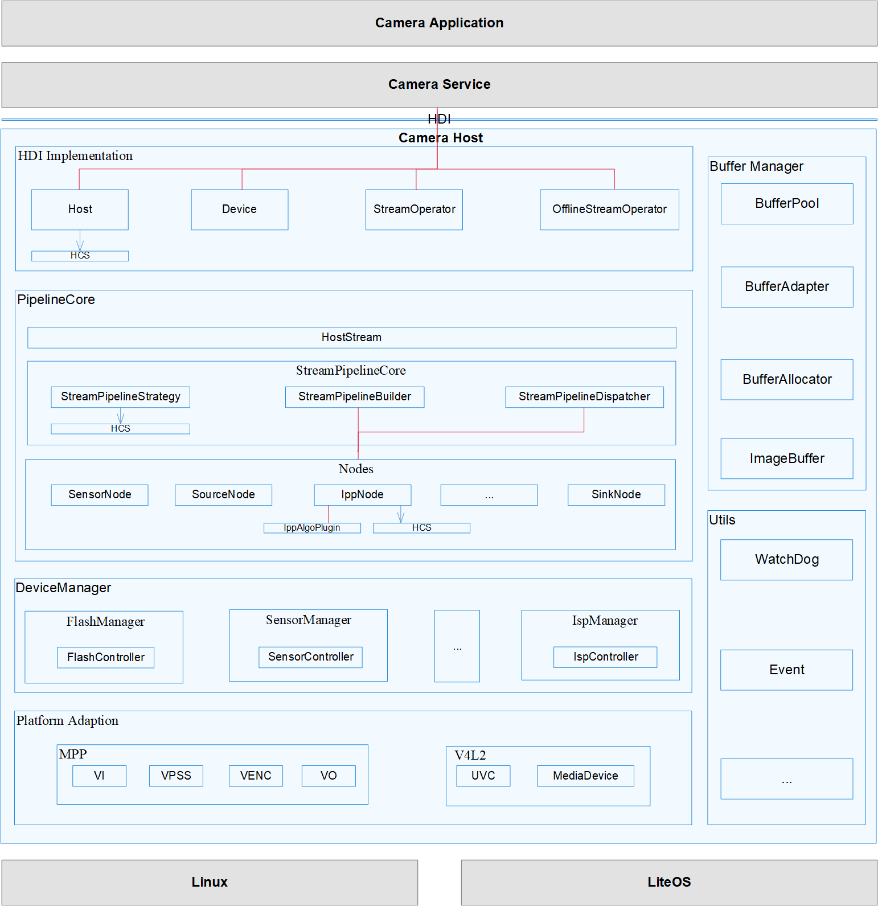

# Camera<a name="ZH-CN_TOPIC_0000001078436908"></a>

-   [简介](#section11660541593)
-   [目录](#section161941989596)
-   [接口说明](#section1564411661810)
-   [使用说明](#section19806524151819)
-   [相关仓](#section1371113476307)

## 简介<a name="section11660541593"></a>

OHOS相机驱动框架模型对上实现相机HDI接口，对下实现相机Pipeline模型，管理相机各个硬件设备。
各层的基本概念如下：

1.  HDI实现层，对上实现OHOS相机标准南向接口。

2.  框架层，对接HDI实现层的控制、流的转发，实现数据通路的搭建、管理相机各个硬件设备等功能。

3.  适配层，屏蔽底层芯片和OS差异，支持多平台适配。

**图 1**  Camera驱动模块架构图<a name="fig14142101381112"></a>





## 目录<a name="section161941989596"></a>


```
/drivers/peripheral/input
    ├── hal                         # camera模块的hal层代码
    │   ├── adapter                 # camera hal平台适配层的实现
    │   ├── buffer_manager          # camera hal统一的Buffer管理
    │   ├── device_manager          # 提供camera hal层设备管理能力，包括设备枚举、设备能力查询等
    │   ├── hdi_impl                # camera hal HDI的具体实现
    │   ├── include                 # camera hal层内部的头文件
    │   ├── init                    # camera hal层HDI接口使用样例实现
    │   ├── pipeline_core           # camera hal层pipeline核心代码 
    │   ├── test                    # camera hal层测试代码实现
    │   └── utils                   # camera hal层工具类代码，目前提供的是watchdog
    ├── hal_c                       # 提供C实现的HAL接口
    │   ├── hdi_cif                 # C实现的HDI接口适配代码
    │   └── include                 # C形式的HDI接口
    └── interfaces                  # camera hal对上层服务提供的驱动能力接口
        ├── hdi_ipc                 # IPC模式的HDI实现
        ├── hdi_passthrough         # 直通模式的HDI实现
        └── include                 # camera hal对外提供的HDI定义


```

## 接口说明<a name="section1564411661810"></a>

<table border=0 cellpadding=0 cellspacing=0 width=1119 style='border-collapse:
 collapse;table-layout:fixed;width:839pt'>
 <col width=119 style='mso-width-source:userset;mso-width-alt:3797;width:89pt'>
 <col width=568 style='mso-width-source:userset;mso-width-alt:18176;width:426pt'>
 <col width=363 style='mso-width-source:userset;mso-width-alt:11605;width:272pt'>
 <col width=69 style='width:52pt'>
 <tr height=19 style='height:14.0pt'>
  <td height=19 width=119 style='height:14.0pt;width:89pt'>头文件</td>
  <td width=568 style='width:426pt'><a name=p14132125715552>接口名称</a></td>
  <td width=363 style='width:272pt'><a name=p18132205755516>功能描述</a>
</td>
 </tr>
 <tr height=37 style='height:28.0pt'>
  <td rowspan=7 height=160 class=xl66 style='height:112.0pt'>icamera_device.h</td>
  <td class=xl65 width=568 style='width:426pt'>CamRetCode
  GetStreamOperator(<br>
    <span style='mso-spacerun:yes'>&nbsp;&nbsp;&nbsp;&nbsp;&nbsp;&nbsp;&nbsp;
  </span>const OHOS::sptr&lt;IStreamOperatorCallback&gt; &amp;callback,<br>
    <span style='mso-spacerun:yes'>&nbsp;&nbsp;&nbsp;&nbsp;&nbsp;&nbsp;&nbsp;
  </span>OHOS::sptr&lt;IStreamOperator&gt; &amp;streamOperator)</td>
  <td>获取流控制器</td>
 </tr>
 <tr height=37 style='height:28.0pt'>
  <td height=37 style='height:28.0pt'>CamRetCode UpdateSettings(const
      std::shared_ptr&lt;CameraSetting&gt; &amp;settings<span
  style='display:none'>s)</span></td>
 <td>更新设备控制参数</td
 </tr>
 <tr height=19 style='height:14.0pt'>
  <td height=19 style='height:14.0pt'>CamRetCode SetResultMode(const ResultCallbackMode &amp;mode)</td>
  <td>设置Result回调模式和回调函数</td>
 </tr>
 <tr height=19 style='height:14.0pt'>
  <td height=19 class=xl65 width=568 style='height:14.0pt;width:426pt'>CamRetCode
  GetEnabledResults(std::vector&lt;MetaType&gt; &amp;results)</td>
 <td>获取使能的ResultMeta</td>
 </tr>
 <tr height=19 style='height:14.0pt'>
  <td height=19 class=xl65 width=568 style='height:14.0pt;width:426pt'>CamRetCode
  EnableResult(const std::vector&lt;MetaType&gt; &amp;results)</td>
  <td>使能具体的ResultMeta</td>
 </tr>
 <tr height=19 style='height:14.0pt'>
  <td height=19 class=xl65 width=568 style='height:14.0pt;width:426pt'>CamRetCode
  DisableResult(const std::vector&lt;MetaType&gt; &amp;results)</td>
  <td>禁止具体的ResultMeta</td>
 </tr>
 <tr height=19 style='height:14.0pt'>
  <td height=19 class=xl65 width=568 style='height:14.0pt;width:426pt'>void
  Close()</td>
  <td>关闭Camera设备</td>
 </tr>
 <tr height=19 style='height:14.0pt'>
  <td rowspan=2 height=38 class=xl66 style='height:28.0pt'>icamera_device_callback.h</td>
  <td class=xl65 width=568 style='width:426pt'>void OnError(ErrorType type,
  int32_t errorCode)</td>
  <td>设备发生错误时调用，由调用者实现，用于返回错误信息给调用者</td>
 </tr>
 <tr height=19 style='height:14.0pt'>
  <td height=19 class=xl65 width=568 style='height:14.0pt;width:426pt'>void
  OnResult(uint64_t timestamp, const std::shared_ptr&lt;CameraMetadata&gt;
  &amp;result)</td>
  <td class=xl65 width=363 style='width:272pt'>上报camera设备相关的metadata的回调</td>
 </tr>
 <tr height=19 style='height:14.0pt'>
  <td rowspan=5 height=150 class=xl66 style='height:112.0pt'>icamera_host.h</td>
  <td class=xl65 width=568 style='width:426pt'>CamRetCode SetCallback(const
  OHOS::sptr&lt;ICameraHostCallback&gt; &amp;callback)</td>
  <td>设置ICameraHost回调接口</td>
 </tr>
 <tr height=19 style='height:14.0pt'>
  <td height=19 style='height:14.0pt'>CamRetCode
  GetCameraIds(std::vector&lt;std::string&gt; &amp;cameraIds)</td>
  <td>获取当前可用的Camera设备ID列表</td>
 </tr>
 <tr height=37 style='height:28.0pt'>
  <td height=37 class=xl65 width=568 style='height:28.0pt;width:426pt'>CamRetCode
  GetCameraAbility(const std::string &amp;cameraId,<br>
    <span style='mso-spacerun:yes'>&nbsp;&nbsp;&nbsp;&nbsp;&nbsp;&nbsp;&nbsp;
  </span>std::shared_ptr&lt;CameraAbility&gt; &amp;ability)</td>
  <td>获取Camera设备能力集合</td>
 </tr>
 <tr height=56 style='height:42.0pt'>
  <td height=56 class=xl65 width=568 style='height:42.0pt;width:426pt'>CamRetCode
  OpenCamera(const std::string &amp;cameraId,<br>
    <span style='mso-spacerun:yes'>&nbsp;&nbsp;&nbsp;&nbsp;&nbsp;&nbsp;&nbsp;
  </span>const OHOS::sptr&lt;ICameraDeviceCallback&gt; &amp;callback,<br>
    <span style='mso-spacerun:yes'>&nbsp;&nbsp;&nbsp;&nbsp;&nbsp;&nbsp;&nbsp;
  </span>OHOS::sptr&lt;ICameraDevice&gt; &amp;device)</td>
  <td>打开Camera设备</td>
 </tr>
 <tr height=19 style='height:14.0pt'>
  <td height=19 class=xl65 width=568 style='height:14.0pt;width:426pt'>CamRetCode
  SetFlashlight(const std::string &amp;cameraId, bool &amp;isEnable)</td>
  <td>打开或关闭闪光灯</td>
 </tr>
 <tr height=19 style='height:14.0pt'>
  <td rowspan=2 height=38 class=xl66 style='height:28.0pt'>icamera_host_callback.h</td>
  <td class=xl65 width=568 style='width:426pt'>void OnCameraStatus(const
  std::string &amp;cameraId, CameraStatus status)</td>
  <td>Camera设备状态变化上报</td>
 </tr>
 <tr height=19 style='height:14.0pt'>
  <td height=19 class=xl65 width=568 style='height:14.0pt;width:426pt'>void
  OnFlashlightStatus(const std::string &amp;cameraId, FlashlightStatus status)</td>
  <td>闪光灯状态变化回调</td>
 </tr>
 <tr height=19 style='height:14.0pt'>
  <td rowspan=3 height=57 class=xl66 style='height:42.0pt'>ioffline_stream_operator.h</td>
  <td class=xl65 width=568 style='width:426pt'><span
  style='mso-spacerun:yes'>&nbsp;</span>CamRetCode CancelCapture(int captureId)</td>
  <td>取消捕获请求</td>
 </tr>
 <tr height=19 style='height:14.0pt'>
  <td height=19 class=xl65 width=568 style='height:14.0pt;width:426pt'>CamRetCode
  ReleaseStreams(const std::vector&lt;int&gt; &amp;streamIds)</td>
  <td>释放流</td>
 </tr>
 <tr height=19 style='height:14.0pt'>
  <td height=19 class=xl65 width=568 style='height:14.0pt;width:426pt'>CamRetCode
  Release()</td>
  <td>释放所有离线流</td>
 </tr>
 <tr height=93 style='height:70.0pt'>
  <td rowspan=10 height=783 class=xl66 style='height:588.0pt'>istream_operator.h</td>
  <td class=xl65 width=568 style='width:426pt'>CamRetCode
  IsStreamsSupported(<br>
    <span style='mso-spacerun:yes'>&nbsp;&nbsp;&nbsp;&nbsp;&nbsp;&nbsp;&nbsp;
  </span>OperationMode mode,<br>
    <span style='mso-spacerun:yes'>&nbsp;&nbsp;&nbsp;&nbsp;&nbsp;&nbsp;&nbsp;
  </span>const std::shared_ptr&lt;CameraStandard::CameraMetadata&gt; &amp;modeSetting,<br>
    <span style='mso-spacerun:yes'>&nbsp;&nbsp;&nbsp;&nbsp;&nbsp;&nbsp;&nbsp;
  </span>const std::vector&ltstd::shared_ptr&ltStreamInfo&gt&gt; &amp;info,<br>
    <span style='mso-spacerun:yes'>&nbsp;&nbsp;&nbsp;&nbsp;&nbsp;&nbsp;&nbsp;
  </span>StreamSupportType &amp;type)</td>
  <td>查询是否支持添加参数对应的流</td>
 </tr>
 <tr height=37 style='height:28.0pt'>
  <td height=37 class=xl65 width=568 style='height:28.0pt;width:426pt'>CamRetCode
  CreateStreams(const std::vector&lt;std::shared_ptr&lt;StreamInfo&gt;&gt;
  &amp;streamInfos)</td>
  <td>创建流</td>
 </tr>
 <tr height=19 style='height:14.0pt'>
  <td height=19 class=xl65 width=568 style='height:14.0pt;width:426pt'>CamRetCode
  ReleaseStreams(const std::vector&lt;int&gt; &amp;streamIds)</td>
  <td>释放流</td>
 </tr>
 <tr height=37 style='height:28.0pt'>
  <td height=37 class=xl65 width=568 style='height:28.0pt;width:426pt'>CamRetCode
  CommitStreams(OperationMode mode,<br>
    <span style='mso-spacerun:yes'>&nbsp;&nbsp;&nbsp;&nbsp;&nbsp;&nbsp;&nbsp;
  </span>const std::shared_ptr&lt;CameraMetadata&gt; &amp;modeSetting)</td>
  <td class=xl65 width=363 style='width:272pt'><br>
    配置流</td>
 </tr>
 <tr height=37 style='height:28.0pt'>
  <td height=37 class=xl65 width=568 style='height:28.0pt;width:426pt'>CamRetCode
  GetStreamAttributes(<br>
    <span style='mso-spacerun:yes'>&nbsp;&nbsp;&nbsp;&nbsp;&nbsp;&nbsp;&nbsp;
  </span>std::vector&lt;std::shared_ptr&lt;StreamAttribute&gt;&gt;
  &amp;attributes)</td>
  <td>获取流的属性</td>
 </tr>
 <tr height=37 style='height:28.0pt'>
  <td height=37 class=xl65 width=568 style='height:28.0pt;width:426pt'>CamRetCode
  AttachBufferQueue(int streamId, const OHOS::sptr&lt;OHOS::IBufferProducer&gt;
  &amp;producer)</td>
  <td>绑定生产者句柄和指定流</td>
 </tr>
 <tr height=19 style='height:14.0pt'>
  <td height=19 class=xl65 width=568 style='height:14.0pt;width:426pt'><span
  style='mso-spacerun:yes'>&nbsp;</span>CamRetCode DetachBufferQueue(int
  streamId)</td>
  <td>解除生产者句柄和指定流的绑定关系</td>
 </tr>
 <tr height=429 style='height:322.0pt'>
  <td height=429 class=xl65 width=568 style='height:322.0pt;width:426pt'>CamRetCode
  Capture(int captureId,<br>
    <span style='mso-spacerun:yes'>&nbsp;&nbsp;&nbsp;&nbsp;&nbsp;&nbsp;&nbsp;
  </span>const std::shared_ptr&lt;CaptureInfo&gt; &amp;info,<span
  style='mso-spacerun:yes'>&nbsp; </span>bool isStreaming)</td>
  <td class=xl65 width=363 style='width:272pt'>捕获图像<br>
    <span style='mso-spacerun:yes'>&nbsp;&nbsp;&nbsp;&nbsp; </span>*<br>
    <span style='mso-spacerun:yes'>&nbsp;&nbsp;&nbsp;&nbsp; </span>* 本接口必须在调用
  {@link CommitStreams} 配置流之后调用。<br>
    <span style='mso-spacerun:yes'>&nbsp;&nbsp;&nbsp;&nbsp; </span>*
  图像捕获有两种模式，分别是连续捕获和单次捕获。连续捕获即触发之后模块内部进行连续的捕获，<br>
    	 * 消费者可以连续收到图像数据，不需要多次调用本接口，若再次调用了本接口，<br>
    	 * 则停止当前捕获，更新捕获信息，再进行一次新的捕获，多用于预览、录像或者连拍场景。<br>
    <span style='mso-spacerun:yes'>&nbsp;&nbsp;&nbsp;&nbsp; </span>*
  单次捕获即触发之后只捕获一帧图像数据，用于单次拍照场景。<br>
    <span style='mso-spacerun:yes'>&nbsp;&nbsp;&nbsp;&nbsp; </span>* 捕获启动时，会调用
  {@link OnCaptureStarted}来通知调用者捕获已经启动。<br>
    <span style='mso-spacerun:yes'>&nbsp;&nbsp;&nbsp;&nbsp; </span>* 连续捕获需调用
  {@link CancelCapture} 来停止捕获。<br>
    <span style='mso-spacerun:yes'>&nbsp;&nbsp;&nbsp;&nbsp; </span>* 捕获结束时，会调用
  {@link OnCaptureEnded}来通知调用者捕获的帧计数等信息。<br>
    <span style='mso-spacerun:yes'>&nbsp;&nbsp;&nbsp;&nbsp; </span>* {@link
  CaptureInfo} 的 enableShutterCallback_ 使能 {@link OnFrameShutter}，使能后每次捕获触发
  {@link OnFrameShutter}<br>
    <span style='mso-spacerun:yes'>&nbsp;&nbsp;&nbsp;&nbsp; </span>*
  对于多个流同时捕获的场景，本模块内部保证同时上报多路流捕获数据。</td>
 </tr>
 <tr height=19 style='height:14.0pt'>
  <td height=19 class=xl65 width=568 style='height:14.0pt;width:426pt'>CamRetCode
  CancelCapture(int captureId)</td>
  <td>取消捕获</td>
 </tr>
 <tr height=56 style='height:42.0pt'>
  <td height=56 class=xl65 width=568 style='height:42.0pt;width:426pt'>CamRetCode
  ChangeToOfflineStream(const std::vector&lt;int&gt; &amp;streamIds,<br>
    <span style='mso-spacerun:yes'>&nbsp;&nbsp;&nbsp;&nbsp;&nbsp;&nbsp;&nbsp;
  </span>OHOS::sptr&lt;IStreamOperatorCallback&gt; &amp;callback,<br>
    <span style='mso-spacerun:yes'>&nbsp;&nbsp;&nbsp;&nbsp;&nbsp;&nbsp;&nbsp;
  </span>OHOS::sptr&lt;IOfflineStreamOperator&gt; &amp;offlineOperator)</td>
  <td>将指定流转换成离线流</td>
 </tr>
 <tr height=19 style='height:14.0pt'>
  <td rowspan=4 height=130 class=xl66 style='height:98.0pt'>istream_operator_callback.h</td>
  <td class=xl65 width=568 style='width:426pt'>void OnCaptureStarted(int32_t
  captureId, const std::vector&lt;int32_t&gt; &amp;streamIds)</td>
  <td>捕获开始回调，在捕获开始时调用</td>
 </tr>
 <tr height=37 style='height:28.0pt'>
  <td height=37 class=xl65 width=568 style='height:28.0pt;width:426pt'>void
  OnCaptureEnded(int32_t captureId,<br>
    <span style='mso-spacerun:yes'>&nbsp;&nbsp;&nbsp;&nbsp;&nbsp;&nbsp;&nbsp;
  </span>const std::vector&lt;std::shared_ptr&lt;CaptureEndedInfo&gt;&gt;
  &amp;infos)</td>
  <td>捕获结束回调，在捕获结束时调用</td>
 </tr>
 <tr height=37 style='height:28.0pt'>
  <td height=37 class=xl65 width=568 style='height:28.0pt;width:426pt'>void
  OnCaptureError(int32_t captureId,<br>
    <span style='mso-spacerun:yes'>&nbsp;&nbsp;&nbsp;&nbsp;&nbsp;&nbsp;&nbsp;
  </span>const std::vector&lt;std::shared_ptr&lt;CaptureErrorInfo&gt;&gt;
  &amp;infos)</td>
  <td>捕获错误回调，在捕获过程中发生错误时调用</td>
 </tr>
 <tr height=37 style='height:28.0pt'>
  <td height=37 class=xl65 width=568 style='height:28.0pt;width:426pt'>void
  OnFrameShutter(int32_t captureId,<br>
    <span style='mso-spacerun:yes'>&nbsp;&nbsp;&nbsp;&nbsp;&nbsp;&nbsp;&nbsp;
  </span>const std::vector&lt;int32_t&gt; &amp;streamIds, uint64_t timestamp)</td>
  <td>帧捕获回调</td>
</table>

## 使用方法

### 获取CameraHost

    std::shared_ptr<Camera::CameraHost> cameraHost = Camera::CameraHost::CreateCameraHost();

### 获取配置的cameraId

    std::vector<std::string> cameraIds;
cameraHost->GetCameraIds(cameraIds); #

### 打开camera设备并获取到device

    const std::shared_ptr<Camera::ICameraDeviceCallback> callback = std::make_shared<Camera::ICameraDeviceCallback>();
    
    std::shared_ptr<Camera::CameraDevice> device;
    
    std::cout << "cameraIds.front() = " << cameraIds.front() << std::endl;
    
    Camera::CamRetCode rc = cameraHost->OpenCamera(cameraIds.front(), callback, device);


### 调用device的GetStreamOperator函数获取streamOperator

    std::make_shared<Camera::IStreamOperatorCallback>();
    std::shared_ptr<Camera::StreamOperator> streamOperator = nullptr;
    rc = device->GetStreamOperator(streamOperatorCallback, streamOperator);`
### 批量创建数据流
    std::vector<std::shared_ptr<Camera::StreamInfo>> streamInfos;
    std::shared_ptr<Camera::StreamInfo> streamInfo = std::make_shared<Camera::StreamInfo>();
    streamInfo->streamId_ = 1001;
    streamInfo->width_ = 1280;
    streamInfo->height_ = 720;
    streamInfo->format_ = 2;
    streamInfo->datasapce_ = 10;
    streamInfo->intent_ = Camera::PREVIEW;
    streamInfo->tunneledMode_ = 5;
    streamInfos.push_back(streamInfo);
    rc = streamOperator->CreateStreams(streamInfos);
### 配流起流
    rc = streamOperator->CommitStreams(Camera::NORMAL, nullptr);

## 相关仓<a name="section1371113476307"></a>
[驱动子系统](https://gitee.com/openharmony/docs/blob/master/zh-cn/readme/%E9%A9%B1%E5%8A%A8%E5%AD%90%E7%B3%BB%E7%BB%9F.md)

[vendor_hisilicon/tree/master/Hi3516DV300/hdf_config](https://gitee.com/openharmony/vendor_hisilicon/blob/master/README_zh.md)

[drivers\_peripheral](https://gitee.com/openharmony/drivers_peripheral)
