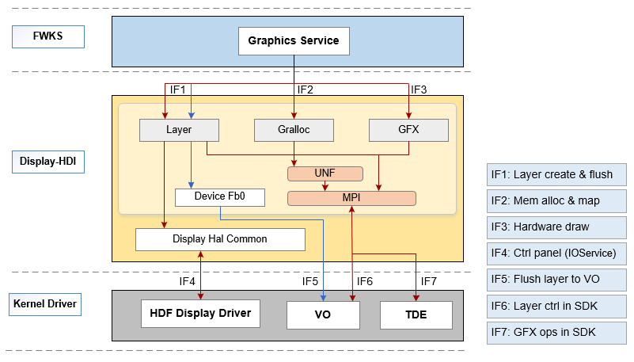

# Display<a name="ZH-CN_TOPIC_0000001124650033"></a>

-   [简介](#section11660541593)
-   [目录](#section161941989596)
    -   [接口说明](#section1551164914237)
    -   [使用说明](#section129654513264)

-   [相关仓](#section1371113476307)

## 简介<a name="section11660541593"></a>

该仓下主要包含Display模块HDI（Hardware Driver Interface）接口定义及其实现，对上层图形服务提供显示驱动能力接口，HDI接口主要包括如下三大类：

-   DisplayLayer：负责显示图层的管理， 包括图层创建、显示属性设置、图层填充及刷新等操作；
-   DisplayGralloc：负责显示模块内存的管理，包括内存的申请和释放、内存映射等操作；
-   DisplayGfx：提供硬件加速接口，包括硬件加速模块的初始化、位图搬移、规则图形的画线及填充等操作。

**图 1**  DISPLAY模块HDI接口层框架图<a name="fig7690246193216"></a> 


## 目录<a name="section161941989596"></a>

该仓下源代码目录结构如下所示

```
/drivers/peripheral/display
├── hal                # display模块的hal层代码
│   └── default       # display模块hdi的默认实现
├── interfaces         # display模块对上层服务提供的驱动能力接口
│   └── include       # display模块对外提供的接口定义
├── test               # display模块的测试代码
│   └── unittest      # display模块的单元测试代码
```

### 接口说明<a name="section1551164914237"></a>

Display驱动提供给系统服务WMS可直接调用的驱动能力接口，按照功能分类三大类：显示图层子模块、显示内存子模块、硬件加速子模块，可以提供图层的创建和销毁、图层属性的设置，内存的申请和释放、映射和缓冲，矩形填充和位图搬移等能力。

提供的部分接口说明如[表1 Display HDI接口列表](#table1513255710559)所示：

**表 1**  Display HDI接口列表

<a name="table1513255710559"></a>
<table><thead align="left"><tr id="row171321857155517"><th class="cellrowborder" align="center" valign="top" width="12.121212121212123%" id="mcps1.2.4.1.1"><p id="p6132957115511"><a name="p6132957115511"></a><a name="p6132957115511"></a>头文件</p>
</th>
<th class="cellrowborder" align="center" valign="top" width="64.95649564956496%" id="mcps1.2.4.1.2"><p id="p14132125715552"><a name="p14132125715552"></a><a name="p14132125715552"></a>接口名称</p>
</th>
<th class="cellrowborder" align="center" valign="top" width="22.922292229222922%" id="mcps1.2.4.1.3"><p id="p18132205755516"><a name="p18132205755516"></a><a name="p18132205755516"></a>功能描述</p>
</th>
</tr>
</thead>
<tbody><tr id="row13132357165514"><td class="cellrowborder" rowspan="9" valign="top" width="12.121212121212123%" headers="mcps1.2.4.1.1 "><p id="p829618389386"><a name="p829618389386"></a><a name="p829618389386"></a></p>
<p id="p35261387384"><a name="p35261387384"></a><a name="p35261387384"></a></p>
<p id="p776383812388"><a name="p776383812388"></a><a name="p776383812388"></a></p>
<p id="p11950123812382"><a name="p11950123812382"></a><a name="p11950123812382"></a></p>
<p id="p13168103915381"><a name="p13168103915381"></a><a name="p13168103915381"></a></p>
<p id="p825185015460"><a name="p825185015460"></a><a name="p825185015460"></a>display_layer.h</p>
<p id="p2133757135510"><a name="p2133757135510"></a><a name="p2133757135510"></a></p>
<p id="p1476175815372"><a name="p1476175815372"></a><a name="p1476175815372"></a></p>
</td>
<td class="cellrowborder" valign="top" width="64.95649564956496%" headers="mcps1.2.4.1.2 "><p id="p1365411515117"><a name="p1365411515117"></a><a name="p1365411515117"></a>int32_t (*InitDisplay)(uint32_t devId);</p>
</td>
<td class="cellrowborder" align="center" valign="top" width="22.922292229222922%" headers="mcps1.2.4.1.3 "><p id="p041814588404"><a name="p041814588404"></a><a name="p041814588404"></a>显示屏初始化</p>
</td>
</tr>
<tr id="row9132135715515"><td class="cellrowborder" valign="top" headers="mcps1.2.4.1.1 "><p id="p1398804043612"><a name="p1398804043612"></a><a name="p1398804043612"></a>int32_t (*DeinitDisplay)(uint32_t devId);</p>
</td>
<td class="cellrowborder" align="center" valign="top" headers="mcps1.2.4.1.2 "><p id="p1341845816404"><a name="p1341845816404"></a><a name="p1341845816404"></a>显示屏反初始化</p>
</td>
</tr>
<tr id="row171330575555"><td class="cellrowborder" valign="top" headers="mcps1.2.4.1.1 "><p id="p1974125024812"><a name="p1974125024812"></a><a name="p1974125024812"></a>int32_t (*GetDisplayInfo)(uint32_t devId, DisplayInfo *dispInfo);</p>
</td>
<td class="cellrowborder" align="center" valign="top" headers="mcps1.2.4.1.2 "><p id="p1041815816403"><a name="p1041815816403"></a><a name="p1041815816403"></a>获取显示信息</p>
</td>
</tr>
<tr id="row576145883720"><td class="cellrowborder" valign="top" headers="mcps1.2.4.1.1 "><p id="p8761658183714"><a name="p8761658183714"></a><a name="p8761658183714"></a>int32_t (*OpenLayer)(uint32_t devId, const LayerInfo *layerInfo, uint32_t *layerId);</p>
</td>
<td class="cellrowborder" align="center" valign="top" headers="mcps1.2.4.1.2 "><p id="p15418165812409"><a name="p15418165812409"></a><a name="p15418165812409"></a>创建layer图层</p>
</td>
</tr>
<tr id="row1957862120383"><td class="cellrowborder" valign="top" headers="mcps1.2.4.1.1 "><p id="p55781217381"><a name="p55781217381"></a><a name="p55781217381"></a>int32_t (*CloseLayer)(uint32_t devId, uint32_t layerId);</p>
</td>
<td class="cellrowborder" align="center" valign="top" headers="mcps1.2.4.1.2 "><p id="p1641875834010"><a name="p1641875834010"></a><a name="p1641875834010"></a>销毁layer图层</p>
</td>
</tr>
<tr id="row127635162380"><td class="cellrowborder" valign="top" headers="mcps1.2.4.1.1 "><p id="p3763916143816"><a name="p3763916143816"></a><a name="p3763916143816"></a>int32_t (*SetLayerVisible)(uint32_t devId, uint32_t layerId, bool visible);</p>
</td>
<td class="cellrowborder" align="center" valign="top" headers="mcps1.2.4.1.2 "><p id="p10418195874019"><a name="p10418195874019"></a><a name="p10418195874019"></a>设置layer是否可见</p>
</td>
</tr>
<tr id="row14230131383819"><td class="cellrowborder" valign="top" headers="mcps1.2.4.1.1 "><p id="p1723081310386"><a name="p1723081310386"></a><a name="p1723081310386"></a>int32_t (*SetLayerDirtyRegion)(uint32_t devId, uint32_t layerId, IRect *region);</p>
</td>
<td class="cellrowborder" align="center" valign="top" headers="mcps1.2.4.1.2 "><p id="p10418658184012"><a name="p10418658184012"></a><a name="p10418658184012"></a>设置layer刷新区域</p>
</td>
</tr>
<tr id="row159636983816"><td class="cellrowborder" valign="top" headers="mcps1.2.4.1.1 "><p id="p89635916383"><a name="p89635916383"></a><a name="p89635916383"></a>int32_t (*Flush)(uint32_t devId, uint32_t layerId, LayerBuffer *buffer);</p>
</td>
<td class="cellrowborder" align="center" valign="top" headers="mcps1.2.4.1.2 "><p id="p19418205894012"><a name="p19418205894012"></a><a name="p19418205894012"></a>刷新图层</p>
</td>
</tr>
<tr id="row76872047153720"><td class="cellrowborder" valign="top" headers="mcps1.2.4.1.1 "><p id="p1368818472376"><a name="p1368818472376"></a><a name="p1368818472376"></a>int32_t (*GetLayerBuffer)(uint32_t devId, uint32_t layerId, LayerBuffer *buffer);</p>
</td>
<td class="cellrowborder" align="center" valign="top" headers="mcps1.2.4.1.2 "><p id="p144182582405"><a name="p144182582405"></a><a name="p144182582405"></a>获取图层buffer</p>
</td>
</tr>
<tr id="row1513316577554"><td class="cellrowborder" rowspan="7" valign="top" width="12.121212121212123%" headers="mcps1.2.4.1.1 "><p id="p14171441118"><a name="p14171441118"></a><a name="p14171441118"></a></p>
<p id="p154814318410"><a name="p154814318410"></a><a name="p154814318410"></a></p>
<p id="p3481154311418"><a name="p3481154311418"></a><a name="p3481154311418"></a></p>
<p id="p57063567463"><a name="p57063567463"></a><a name="p57063567463"></a>display_gralloc.h</p>
<p id="p7909447418"><a name="p7909447418"></a><a name="p7909447418"></a></p>
</td>
<td class="cellrowborder" valign="top" width="64.95649564956496%" headers="mcps1.2.4.1.2 "><p id="p228510326414"><a name="p228510326414"></a><a name="p228510326414"></a>int32_t AllocMem(GrallocBuffer *buffer);</p>
</td>
<td class="cellrowborder" align="center" valign="top" width="22.922292229222922%" headers="mcps1.2.4.1.3 "><p id="p17421321134612"><a name="p17421321134612"></a><a name="p17421321134612"></a>显示内存分配</p>
</td>
</tr>
<tr id="row171331657185514"><td class="cellrowborder" valign="top" headers="mcps1.2.4.1.1 "><p id="p12841932114117"><a name="p12841932114117"></a><a name="p12841932114117"></a>void FreeMem(GrallocBuffer *buffer);</p>
</td>
<td class="cellrowborder" align="center" valign="top" headers="mcps1.2.4.1.2 "><p id="p1874202174615"><a name="p1874202174615"></a><a name="p1874202174615"></a>显示内存释放</p>
</td>
</tr>
<tr id="row41331557165518"><td class="cellrowborder" valign="top" headers="mcps1.2.4.1.1 "><p id="p92831132184119"><a name="p92831132184119"></a><a name="p92831132184119"></a>void *Mmap(GrallocBuffer *buffer);</p>
</td>
<td class="cellrowborder" align="center" valign="top" headers="mcps1.2.4.1.2 "><p id="p474262184610"><a name="p474262184610"></a><a name="p474262184610"></a>内存映射</p>
</td>
</tr>
<tr id="row77021769584"><td class="cellrowborder" valign="top" headers="mcps1.2.4.1.1 "><p id="p8283123284110"><a name="p8283123284110"></a><a name="p8283123284110"></a>void *MmapCache(GrallocBuffer *buffer);</p>
</td>
<td class="cellrowborder" align="center" valign="top" headers="mcps1.2.4.1.2 "><p id="p107422021204615"><a name="p107422021204615"></a><a name="p107422021204615"></a>内存映射为cache</p>
</td>
</tr>
<tr id="row71857914585"><td class="cellrowborder" valign="top" headers="mcps1.2.4.1.1 "><p id="p4282032114118"><a name="p4282032114118"></a><a name="p4282032114118"></a>int32_t Unmap(GrallocBuffer *buffer);</p>
</td>
<td class="cellrowborder" align="center" valign="top" headers="mcps1.2.4.1.2 "><p id="p374210219468"><a name="p374210219468"></a><a name="p374210219468"></a>取消内存映射</p>
</td>
</tr>
<tr id="row884115357415"><td class="cellrowborder" valign="top" headers="mcps1.2.4.1.1 "><p id="p68421035114115"><a name="p68421035114115"></a><a name="p68421035114115"></a>int32_t FlushCache(GrallocBuffer *buffer);</p>
</td>
<td class="cellrowborder" valign="top" headers="mcps1.2.4.1.2 "><p id="p1674212113467"><a name="p1674212113467"></a><a name="p1674212113467"></a>刷新cache里的内容到内存并且使cache里的内容无效</p>
</td>
</tr>
<tr id="row18831119115815"><td class="cellrowborder" valign="top" headers="mcps1.2.4.1.1 "><p id="p172641732134117"><a name="p172641732134117"></a><a name="p172641732134117"></a>int32_t FlushMCache(GrallocBuffer *buffer);</p>
</td>
<td class="cellrowborder" valign="top" headers="mcps1.2.4.1.2 "><p id="p10742182114462"><a name="p10742182114462"></a><a name="p10742182114462"></a>刷新Mmap映射的cache里的内容到内存并且使cache里的内容无效</p>
</td>
</tr>
<tr id="row1452521025813"><td class="cellrowborder" rowspan="4" valign="top" width="12.121212121212123%" headers="mcps1.2.4.1.1 "><p id="p033128174618"><a name="p033128174618"></a><a name="p033128174618"></a></p>
<p id="p4252162854616"><a name="p4252162854616"></a><a name="p4252162854616"></a></p>
<p id="p10421192894615"><a name="p10421192894615"></a><a name="p10421192894615"></a></p>
<p id="p12525910165811"><a name="p12525910165811"></a><a name="p12525910165811"></a>display_gfx.h</p>
</td>
<td class="cellrowborder" valign="top" width="64.95649564956496%" headers="mcps1.2.4.1.2 "><p id="p16761419154811"><a name="p16761419154811"></a><a name="p16761419154811"></a>int32_t InitGfx(void);</p>
</td>
<td class="cellrowborder" align="center" valign="top" width="22.922292229222922%" headers="mcps1.2.4.1.3 "><p id="p1675964994818"><a name="p1675964994818"></a><a name="p1675964994818"></a>初始化硬件加速</p>
</td>
</tr>
<tr id="row172902161193"><td class="cellrowborder" valign="top" headers="mcps1.2.4.1.1 "><p id="p1249042564815"><a name="p1249042564815"></a><a name="p1249042564815"></a>int32_t DeinitGfx(void);</p>
</td>
<td class="cellrowborder" align="center" valign="top" headers="mcps1.2.4.1.2 "><p id="p17591149104819"><a name="p17591149104819"></a><a name="p17591149104819"></a>反初始化硬件加速</p>
</td>
</tr>
<tr id="row1948179195"><td class="cellrowborder" valign="top" headers="mcps1.2.4.1.1 "><p id="p5783143154816"><a name="p5783143154816"></a><a name="p5783143154816"></a>int32_t Blit(ISurface *srcSurface, IRect *srcRect, ISurface *dstSurface, IRect *dstRect);</p>
</td>
<td class="cellrowborder" align="center" valign="top" headers="mcps1.2.4.1.2 "><p id="p1759749134818"><a name="p1759749134818"></a><a name="p1759749134818"></a>位图搬移</p>
</td>
</tr>
<tr id="row1331121813197"><td class="cellrowborder" valign="top" headers="mcps1.2.4.1.1 "><p id="p2728173711481"><a name="p2728173711481"></a><a name="p2728173711481"></a>int32_t FillRect(ISurface *surface, IRect *rect, uint32_t color, GfxOpt *opt);</p>
</td>
<td class="cellrowborder" align="center" valign="top" headers="mcps1.2.4.1.2 "><p id="p107591749104810"><a name="p107591749104810"></a><a name="p107591749104810"></a>绘制矩形框</p>
</td>
</tr>
</tbody>
</table>

### 使用说明<a name="section129654513264"></a>

该仓核心功能是提供显示驱动能力接口供上层图形系统服务调用，提供的驱动能力接口统一归属为HDI接口层。

通过如下简要示例代码说明Display HDI接口的使用：

```
#include "display_gfx.h"
#include "display_gralloc.h"
#include "display_layer.h"
#include "display_type.h"

#define DEVID 0
DisplayTest g_displayTest;
static GrallocBuffer g_buffer;

static int32_t GetDisplayInterfaces(void)
{
    int32_t ret;
    ret = LayerInitialize(&g_displayTest.layerFuncs);
    if (ret != DISPLAY_SUCCESS || g_displayTest.layerFuncs == NULL) {
        HDF_LOGE("initialize layer failed");
        return DISPLAY_FAILURE;
    }
    ret = GrallocInitialize(&g_displayTest.grallocFuncs);
    if (ret != DISPLAY_SUCCESS || g_displayTest.layerFuncs == NULL) {
        HDF_LOGE("initialize gralloc failed");
        return DISPLAY_FAILURE;
    }
    ret = GfxInitialize(&g_displayTest.gfxFuncs);
    if (ret != DISPLAY_SUCCESS || g_displayTest.gfxFuncs == NULL) {
        HDF_LOGE("initialize gralloc failed");
        return DISPLAY_FAILURE;
    }
    return DISPLAY_SUCCESS;
}

static int32_t DisplayUninit(void)
{
    LayerUninitialize(g_displayTest.layerFuncs);
    GrallocUninitialize(g_displayTest.grallocFuncs);
    GfxUninitialize(g_displayTest.gfxFuncs);
    return DISPLAY_SUCCESS;
}

static void GetLayerInfo(LayerInfo *layInfo)
{
    layInfo->width = g_displayTest.displayInfo.width;
    layInfo->height = g_displayTest.displayInfo.height;
    layInfo->bpp = LAYER_BPP;
    layInfo->pixFormat = PIXEL_FMT_RGBA_5551;
    layInfo->type = LAYER_TYPE_GRAPHIC;
}

static void WriteDataToBuf(int32_t width, int32_t height, uint16_t *pBuf)
{
    int32_t x;
    int32_t y;

    for (y = ((height / LINE_WIDTH) - LINE_WIDTH); y < ((height / LINE_WIDTH) + LINE_WIDTH); y++) {
        for (x = 0; x < width; x++) {
            *((uint16_t*)pBuf + y * width + x) = HIFB_RED_1555;
        }
    }
    for (y = 0; y < height; y++) {
        for (x = ((width / LINE_WIDTH) - LINE_WIDTH); x < ((width / LINE_WIDTH) + LINE_WIDTH); x++) {
            *((uint16_t*)pBuf + y * width + x) = HIFB_RED_1555;
        }
    }
}

int DisplayServiceSample(void)
{    
    int32_t ret;
    g_displayTest.devId = DEVID;

    /* 获取display驱动接口 */
    ret = GetDisplayInterfaces();
    if (ret != DISPLAY_SUCCESS) {
        HDF_LOGE("get display interfaces ops failed");
        return ret;
    }
    /* 初始化显示设备 */
    if (g_displayTest.layerFuncs->InitDisplay != NULL) {
        ret = g_displayTest.layerFuncs->InitDisplay(g_displayTest.devId);
        if (ret != DISPLAY_SUCCESS) {
            HDF_LOGE("initialize display failed");
            return DISPLAY_FAILURE;
        }
    }
    /* 获取显示设备的信息 */
    if (g_displayTest.layerFuncs->GetDisplayInfo != NULL) {
        ret = g_displayTest.layerFuncs->GetDisplayInfo(g_displayTest.devId, &g_displayTest.displayInfo);
        if (ret != DISPLAY_SUCCESS) {
            HDF_LOGE("get disp info failed");
            return DISPLAY_FAILURE;
        }
    }
    /* 打开显示设备的特定图层 */
    if (g_displayTest.layerFuncs->OpenLayer != NULL) {
        LayerInfo layInfo;
        GetLayerInfo(&layInfo);
        ret = g_displayTest.layerFuncs->OpenLayer(g_displayTest.devId, &layInfo, &g_displayTest.layerId);
        if (ret != DISPLAY_SUCCESS) {
            HDF_LOGE("open layer failed");
            return DISPLAY_FAILURE;
        }
    }
    /* 获取图层buffer并填充buffer */
    if (g_displayTest.layerFuncs->GetLayerBuffer != NULL) {
        ret = g_displayTest.layerFuncs->GetLayerBuffer(g_displayTest.devId, g_displayTest.layerId, &g_displayTest.buffer);
        if (ret != DISPLAY_SUCCESS) {
            HDF_LOGE("get layer buffer failed");
            return DISPLAY_FAILURE;
        }
        uint16_t *pBuf = (uint16_t *)g_displayTest.buffer.data.virAddr;
        WriteDataToBuf(g_displayTest.displayInfo.width, g_displayTest.displayInfo.height, pBuf);
    }
    /* 刷新图层数据进行显示 */
    if (g_displayTest.layerFuncs->Flush != NULL) {
        ret = g_displayTest.layerFuncs->Flush(g_displayTest.devId, g_displayTest.layerId, &g_displayTest.buffer);
        if (ret != DISPLAY_SUCCESS) {
            HDF_LOGE("flush layer failed");
            return DISPLAY_FAILURE;
        }
    }
    /* 关闭显示设备的特定图层 */
    if (g_displayTest.layerFuncs->CloseLayer != NULL) {
        ret = g_displayTest.layerFuncs->CloseLayer(g_displayTest.devId, g_displayTest.layerId);
        if (ret != DISPLAY_SUCCESS) {
            HDF_LOGE("close layer failed");
            return DISPLAY_FAILURE;
        }
    }
    /* 关闭显示设备 */
    if (g_displayTest.layerFuncs->DeinitDisplay != NULL) {
        ret = g_displayTest.layerFuncs->DeinitDisplay(g_displayTest.devId);
        if (ret != DISPLAY_SUCCESS) {
            HDF_LOGE("deinit display failed");
            return DISPLAY_FAILURE;
        }
    }
    /* 注销显示驱动接口 */
    ret = DisplayUninit();
    if (ret != DISPLAY_SUCCESS) {
        HDF_LOGE("DisplayUninit fail");
        return ret;
    }
    return 0;
}
```

## 相关仓<a name="section1371113476307"></a>

[驱动子系统](https://gitee.com/openharmony/docs/blob/master/zh-cn/readme/%E9%A9%B1%E5%8A%A8%E5%AD%90%E7%B3%BB%E7%BB%9F.md)

[drivers\_framework](https://gitee.com/openharmony/drivers_framework/blob/master/README_zh.md)

[drivers\_adapter](https://gitee.com/openharmony/drivers_adapter/blob/master/README_zh.md)

[drivers\_adapter\_khdf\_linux](https://gitee.com/openharmony/drivers_adapter_khdf_linux/blob/master/README_zh.md)

[drivers\_peripheral](https://gitee.com/openharmony/drivers_peripheral)

