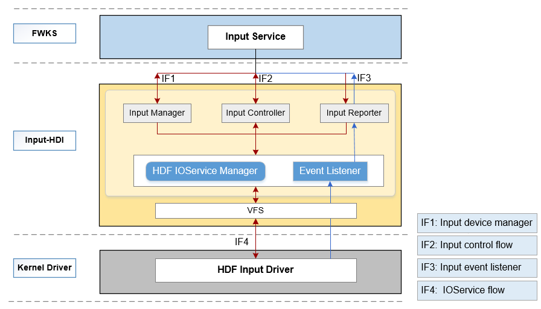

# Input<a name="ZH-CN_TOPIC_0000001124789109"></a>

-   [简介](#section11660541593)
-   [目录](#section161941989596)
    -   [接口说明](#section1551164914237)
    -   [使用说明](#section129654513264)

-   [相关仓](#section1371113476307)

## 简介<a name="section11660541593"></a>

该仓下主要包含Input模块HDI（Hardware Driver Interface）接口定义及其实现，对上层输入服务提供操作input设备的驱动能力接口，HDI接口主要包括如下三大类：

-   InputManager：管理输入设备，包括输入设备的打开、关闭、设备列表信息获取等；
-   InputReporter：负责输入事件的上报，包括注册、注销数据上报回调函数等；
-   InputController：提供input设备的业务控制接口，包括获取器件信息及设备类型、设置电源状态等。

**图 1**  INPUT模块HDI接口层框架图<a name="fig9489629122818"></a>  


## 目录<a name="section161941989596"></a>

该仓下源代码目录结构如下所示

```
/drivers/peripheral/input
├── hal                # input模块的hal层代码
│   └── include       # input模块hal层内部的头文件
│   └── src           # input模块hal层代码的具体实现
├── interfaces         # input模块对上层服务提供的驱动能力接口
│   └── include       # input模块对外提供的接口定义
├── test               # input模块的测试代码
│   └── unittest      # input模块的单元测试代码
```

### 接口说明<a name="section1551164914237"></a>

Input驱动提供给系统服务Input Service可直接调用的驱动能力接口，按照属性分类三类：input设备管理模块、input数据上报模块、input业务控制模块，例如提供输入设备打开及关闭接口、注册设备监听的回调接口、设备信息查询接口、电源状态控制接口等。

提供的部分接口说明如[表1 Input HDI接口列表](#table1513255710559)所示：

**表 1**  Input HDI接口列表

<a name="table1513255710559"></a>
<table><thead align="left"><tr id="row171321857155517"><th class="cellrowborder" align="center" valign="top" width="12.031203120312032%" id="mcps1.2.4.1.1"><p id="p6132957115511"><a name="p6132957115511"></a><a name="p6132957115511"></a>头文件</p>
</th>
<th class="cellrowborder" align="center" valign="top" width="66.006600660066%" id="mcps1.2.4.1.2"><p id="p14132125715552"><a name="p14132125715552"></a><a name="p14132125715552"></a>接口名称</p>
</th>
<th class="cellrowborder" align="center" valign="top" width="21.96219621962196%" id="mcps1.2.4.1.3"><p id="p18132205755516"><a name="p18132205755516"></a><a name="p18132205755516"></a>功能描述</p>
</th>
</tr>
</thead>
<tbody><tr id="row13132357165514"><td class="cellrowborder" rowspan="4" align="left" valign="top" width="12.031203120312032%" headers="mcps1.2.4.1.1 "><p id="p15674038913"><a name="p15674038913"></a><a name="p15674038913"></a></p>
<p id="p825185015460"><a name="p825185015460"></a><a name="p825185015460"></a>input_manager.h</p>
<p id="p2133757135510"><a name="p2133757135510"></a><a name="p2133757135510"></a></p>
</td>
<td class="cellrowborder" valign="top" width="66.006600660066%" headers="mcps1.2.4.1.2 "><p id="p11132857135517"><a name="p11132857135517"></a><a name="p11132857135517"></a>int32_t (*OpenInputDevice)(uint32_t devIndex);</p>
</td>
<td class="cellrowborder" align="center" valign="top" width="21.96219621962196%" headers="mcps1.2.4.1.3 "><p id="p8233134675314"><a name="p8233134675314"></a><a name="p8233134675314"></a>打开input设备</p>
</td>
</tr>
<tr id="row9132135715515"><td class="cellrowborder" valign="top" headers="mcps1.2.4.1.1 "><p id="p106067813482"><a name="p106067813482"></a><a name="p106067813482"></a>int32_t (*CloseInputDevice)(uint32_t devIndex);</p>
</td>
<td class="cellrowborder" align="center" valign="top" headers="mcps1.2.4.1.2 "><p id="p8233144617532"><a name="p8233144617532"></a><a name="p8233144617532"></a>关闭input设备</p>
</td>
</tr>
<tr id="row2973185044814"><td class="cellrowborder" valign="top" headers="mcps1.2.4.1.1 "><p id="p1974125024812"><a name="p1974125024812"></a><a name="p1974125024812"></a>int32_t (*GetInputDevice)(uint32_t devIndex, DeviceInfo **devInfo);</p>
</td>
<td class="cellrowborder" align="center" valign="top" headers="mcps1.2.4.1.2 "><p id="p152331046155310"><a name="p152331046155310"></a><a name="p152331046155310"></a>获取指定ID的设备信息</p>
</td>
</tr>
<tr id="row171330575555"><td class="cellrowborder" valign="top" headers="mcps1.2.4.1.1 "><p id="p913315573557"><a name="p913315573557"></a><a name="p913315573557"></a>int32_t (*GetInputDeviceList)(uint32_t *devNum, DeviceInfo **devList, uint32_t size);</p>
</td>
<td class="cellrowborder" align="center" valign="top" headers="mcps1.2.4.1.2 "><p id="p1523319466539"><a name="p1523319466539"></a><a name="p1523319466539"></a>获取所有设备列表信息</p>
</td>
</tr>
<tr id="row1513316577554"><td class="cellrowborder" rowspan="3" align="left" valign="top" width="12.031203120312032%" headers="mcps1.2.4.1.1 "><p id="p14171441118"><a name="p14171441118"></a><a name="p14171441118"></a></p>
<p id="p57063567463"><a name="p57063567463"></a><a name="p57063567463"></a>input_reporter.h</p>
</td>
<td class="cellrowborder" valign="top" width="66.006600660066%" headers="mcps1.2.4.1.2 "><p id="p14794193010499"><a name="p14794193010499"></a><a name="p14794193010499"></a>int32_t (*RegisterReportCallback)(uint32_t devIndex, InputReportEventCb *callback);</p>
</td>
<td class="cellrowborder" align="center" valign="top" width="21.96219621962196%" headers="mcps1.2.4.1.3 "><p id="p72331046145316"><a name="p72331046145316"></a><a name="p72331046145316"></a>注册input设备的回调</p>
</td>
</tr>
<tr id="row171331657185514"><td class="cellrowborder" valign="top" headers="mcps1.2.4.1.1 "><p id="p123921240124910"><a name="p123921240124910"></a><a name="p123921240124910"></a>int32_t (*UnregisterReportCallback)(uint32_t devIndex);</p>
</td>
<td class="cellrowborder" align="center" valign="top" headers="mcps1.2.4.1.2 "><p id="p19233174675311"><a name="p19233174675311"></a><a name="p19233174675311"></a>注销input设备的回调</p>
</td>
</tr>
<tr id="row41331557165518"><td class="cellrowborder" valign="top" headers="mcps1.2.4.1.1 "><p id="p11499124705012"><a name="p11499124705012"></a><a name="p11499124705012"></a>void (*ReportEventPkgCallback)(const EventPackage **pkgs, uint32_t count);</p>
</td>
<td class="cellrowborder" align="center" valign="top" headers="mcps1.2.4.1.2 "><p id="p52331246135315"><a name="p52331246135315"></a><a name="p52331246135315"></a>上报数据的回调函数</p>
</td>
</tr>
<tr id="row1452521025813"><td class="cellrowborder" rowspan="9" align="left" valign="top" width="12.031203120312032%" headers="mcps1.2.4.1.1 "><p id="p1285144710118"><a name="p1285144710118"></a><a name="p1285144710118"></a></p>
<p id="p854114711117"><a name="p854114711117"></a><a name="p854114711117"></a></p>
<p id="p15741647517"><a name="p15741647517"></a><a name="p15741647517"></a></p>
<p id="p7909447418"><a name="p7909447418"></a><a name="p7909447418"></a></p>
<p id="p12525910165811"><a name="p12525910165811"></a><a name="p12525910165811"></a>input_controller.h</p>
<p id="p942322013262"><a name="p942322013262"></a><a name="p942322013262"></a></p>
<p id="p1040515339526"><a name="p1040515339526"></a><a name="p1040515339526"></a></p>
<p id="p19405533115216"><a name="p19405533115216"></a><a name="p19405533115216"></a></p>
</td>
<td class="cellrowborder" valign="top" width="66.006600660066%" headers="mcps1.2.4.1.2 "><p id="p14402132815113"><a name="p14402132815113"></a><a name="p14402132815113"></a>int32_t (*SetPowerStatus)(uint32_t devIndex, uint32_t status);</p>
</td>
<td class="cellrowborder" align="center" valign="top" width="21.96219621962196%" headers="mcps1.2.4.1.3 "><p id="p1510016065413"><a name="p1510016065413"></a><a name="p1510016065413"></a>设置电源状态</p>
</td>
</tr>
<tr id="row172902161193"><td class="cellrowborder" valign="top" headers="mcps1.2.4.1.1 "><p id="p2062643555111"><a name="p2062643555111"></a><a name="p2062643555111"></a>int32_t (*GetPowerStatus)(uint32_t devIndex, uint32_t *status);</p>
</td>
<td class="cellrowborder" align="center" valign="top" headers="mcps1.2.4.1.2 "><p id="p1323394615539"><a name="p1323394615539"></a><a name="p1323394615539"></a>获取电源状态</p>
</td>
</tr>
<tr id="row1948179195"><td class="cellrowborder" valign="top" headers="mcps1.2.4.1.1 "><p id="p8207194414510"><a name="p8207194414510"></a><a name="p8207194414510"></a>int32_t (*GetDeviceType)(uint32_t devIndex, uint32_t *deviceType);</p>
</td>
<td class="cellrowborder" align="center" valign="top" headers="mcps1.2.4.1.2 "><p id="p18233154655317"><a name="p18233154655317"></a><a name="p18233154655317"></a>获取设备类型</p>
</td>
</tr>
<tr id="row1331121813197"><td class="cellrowborder" valign="top" headers="mcps1.2.4.1.1 "><p id="p1321125217514"><a name="p1321125217514"></a><a name="p1321125217514"></a>int32_t (*GetChipInfo)(uint32_t devIndex, char *chipInfo, uint32_t length);</p>
</td>
<td class="cellrowborder" align="center" valign="top" headers="mcps1.2.4.1.2 "><p id="p14233104614536"><a name="p14233104614536"></a><a name="p14233104614536"></a>获取器件编码信息</p>
</td>
</tr>
<tr id="row1393181951920"><td class="cellrowborder" valign="top" headers="mcps1.2.4.1.1 "><p id="p79410191191"><a name="p79410191191"></a><a name="p79410191191"></a>int32_t (*GetVendorName)(uint32_t devIndex, char *vendorName, uint32_t length);</p>
</td>
<td class="cellrowborder" align="center" valign="top" headers="mcps1.2.4.1.2 "><p id="p7233124695317"><a name="p7233124695317"></a><a name="p7233124695317"></a>获取模组厂商名</p>
</td>
</tr>
<tr id="row8960121911198"><td class="cellrowborder" valign="top" headers="mcps1.2.4.1.1 "><p id="p17712110185218"><a name="p17712110185218"></a><a name="p17712110185218"></a>int32_t (*GetChipName)(uint32_t devIndex, char *chipName, uint32_t length);</p>
</td>
<td class="cellrowborder" align="center" valign="top" headers="mcps1.2.4.1.2 "><p id="p923316468539"><a name="p923316468539"></a><a name="p923316468539"></a>获取芯片厂商名</p>
</td>
</tr>
<tr id="row10812112081919"><td class="cellrowborder" valign="top" headers="mcps1.2.4.1.1 "><p id="p20738171735219"><a name="p20738171735219"></a><a name="p20738171735219"></a>int32_t (*SetGestureMode)(uint32_t devIndex, uint32_t gestureMode);</p>
</td>
<td class="cellrowborder" align="center" valign="top" headers="mcps1.2.4.1.2 "><p id="p5233546175310"><a name="p5233546175310"></a><a name="p5233546175310"></a>设置手势模式</p>
</td>
</tr>
<tr id="row12422102092613"><td class="cellrowborder" valign="top" headers="mcps1.2.4.1.1 "><p id="p56701925155215"><a name="p56701925155215"></a><a name="p56701925155215"></a>int32_t (*RunCapacitanceTest)(uint32_t devIndex, uint32_t testType, char *result, uint32_t length);</p>
</td>
<td class="cellrowborder" align="center" valign="top" headers="mcps1.2.4.1.2 "><p id="p13234346125310"><a name="p13234346125310"></a><a name="p13234346125310"></a>执行容值自检测试</p>
</td>
</tr>
<tr id="row124041233155211"><td class="cellrowborder" valign="top" headers="mcps1.2.4.1.1 "><p id="p16405113375215"><a name="p16405113375215"></a><a name="p16405113375215"></a>int32_t (*RunExtraCommand)(uint32_t devIndex, InputExtraCmd *cmd);</p>
</td>
<td class="cellrowborder" align="center" valign="top" headers="mcps1.2.4.1.2 "><p id="p192341246185314"><a name="p192341246185314"></a><a name="p192341246185314"></a>执行拓展指令</p>
</td>
</tr>
</tbody>
</table>

### 使用说明<a name="section129654513264"></a>

该仓核心功能是提供Input驱动能力接口供上层输入系统服务调用，提供的驱动能力接口统一归属为HDI接口层。

通过如下简要示例代码说明Input HDI接口的使用：

```
#include "input_manager.h"
#define DEV_INDEX 1

IInputInterface *g_inputInterface;
InputReportEventCb g_callback;

/* 定义数据上报的回调函数 */
static void ReportEventPkgCallback(const EventPackage **pkgs, uint32_t count)
{
    if (pkgs == NULL || count > MAX_PKG_NUM) {
        return;
    }
    for (uint32_t i = 0; i < count; i++) {
        HDF_LOGI("%s: pkgs[%d] = 0x%x, 0x%x, %d", __func__, i, pkgs[i]->type, pkgs[i]->code, pkgs[i]->value);
    }
}

int InputServiceSample(void)
{
    uint32_t devType = INIT_DEFAULT_VALUE;

    /* 获取Input驱动能力接口 */
    int ret = GetInputInterface(&g_inputInterface);
    if (ret != INPUT_SUCCESS) {
        HDF_LOGE("%s: get input interfaces failed, ret = %d", __func__, ret);
        return ret;
    }

    INPUT_CHECK_NULL_POINTER(g_inputInterface, INPUT_NULL_PTR);
    INPUT_CHECK_NULL_POINTER(g_inputInterface->iInputManager, INPUT_NULL_PTR);
    /* 打开特定的input设备 */
    ret = g_inputInterface->iInputManager->OpenInputDevice(DEV_INDEX);
    if (ret) {
        HDF_LOGE("%s: open input device failed, ret = %d", __func__, ret);
 	return ret;
    }

    INPUT_CHECK_NULL_POINTER(g_inputInterface->iInputController, INPUT_NULL_PTR);
    /* 获取对应input设备的类型 */
    ret = g_inputInterface->iInputController->GetDeviceType(DEV_INDEX, &devType);
    if (ret) {
        HDF_LOGE("%s: get device type failed, ret: %d", __FUNCTION__, ret);
        return ret;
    }
    HDF_LOGI("%s: device1's type is %u\n", __FUNCTION__, devType);

    /* 给特定的input设备注册数据上报回调函数 */
    g_callback.ReportEventPkgCallback = ReportEventPkgCallback;
    INPUT_CHECK_NULL_POINTER(g_inputInterface->iInputReporter, INPUT_NULL_PTR);
    ret  = g_inputInterface->iInputReporter->RegisterReportCallback(DEV_INDEX, &g_callback);
    if (ret) {
        HDF_LOGE("%s: register callback failed, ret: %d", __FUNCTION__, ret);
	return ret;
    }
    HDF_LOGI("%s: wait 10s for testing, pls touch the panel now", __FUNCTION__);
    OsalMSleep(KEEP_ALIVE_TIME_MS);

    /* 注销特定input设备上的回调函数 */
    ret  = g_inputInterface->iInputReporter->UnregisterReportCallback(DEV_INDEX);
    if (ret) {
        HDF_LOGE("%s: unregister callback failed, ret: %d", __FUNCTION__, ret);
        return ret;
    }

    /* 关闭特定的input设备 */
    ret = g_inputInterface->iInputManager->CloseInputDevice(DEV_INDEX);
    if (ret) {
        HDF_LOGE("%s: close device failed, ret: %d", __FUNCTION__, ret);
	return ret;
    }
    return 0;
}
```

## 相关仓<a name="section1371113476307"></a>

[驱动子系统](https://gitee.com/openharmony/docs/blob/master/zh-cn/readme/%E9%A9%B1%E5%8A%A8%E5%AD%90%E7%B3%BB%E7%BB%9F.md)

[drivers\_framework](https://gitee.com/openharmony/drivers_framework/blob/master/README_zh.md)

[drivers\_adapter](https://gitee.com/openharmony/drivers_adapter/blob/master/README_zh.md)

[drivers\_adapter\_khdf\_linux](https://gitee.com/openharmony/drivers_adapter_khdf_linux/blob/master/README_zh.md)

[drivers\_peripheral](https://gitee.com/openharmony/drivers_peripheral)

