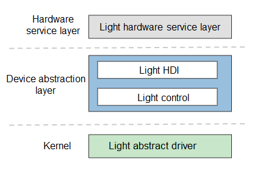

# Light

## Introduction

 The light driver model provides APIs for the upper-layer light hardware service layer to control lights, including obtaining the light type, setting the lighting mode and blinking effect, and turning on or off a light. This model implements functionalities such as cross-OS migration and differentiated configurations based on the Hardware Driver Foundation (HDF) to achieve the goal of "one-time development for cross-system deployment" of the light driver.

**Figure 1** Light driver model



## Directory Structure

The directory structure of the light module is as follows:

```
/drivers/peripheral/misc/light
├── hal              # HAL code
│   ├── include      # HAL header files
│   └── src          # HAL code implementation
├── interfaces       # Driver capability APIs provided for upper-layer services
│   └── include      # APIs exposed externally
└── test             # Test code
    └── unittest     # Unit test code
```

## Usage

### Available APIs

The light driver model provides APIs to obtain information about all the lights in the system and dynamically set the blinking mode and duration. The light hardware service calls the **GetLightInfo** method to obtain basic information about the light and calls the **TurnOnLight** method to make the light blinking. The following table describes these APIs.

**Table 1** Major APIs of the light module

| API                                                      | Description                                                    |
| ------------------------------------------------------------ | ------------------------------------------------------------ |
| int32_t (*GetLightInfo)(struct LightInfo **lightInfo, uint32_t *count) | Obtains information about all lights in the system. **lightInfo** indicates the double pointer to the basic light information. **count** indicates the pointer to the number of lights.|
| int32_t (*TurnOnLight)(uint32_t type, struct LightEffect *effect) | Turns on available lights in the list based on the specified light type. **type** indicates the light type, and **effect** indicates the pointer to the blinking effect.|
| int32_t (*TurnOffLight)(uint32_t type)                       | Turns off available lights in the light list based on the specified light type. **type** indicates the light type.                                          |

### How to Use

The following provides the sample code for the small system.

```c++
#include "light_if.h"

void LightSample(void)
{
	int32_t ret;
    static struct LightInfo *g_lightInfo = nullptr;
    static uint32_t g_count = 0;
    const int32_t g_onTime = 500;
    const int32_t g_offTime = 500;
    const int32_t LIGHT_WAIT_TIME = 30;
    const int32_t g_minLightType = LIGHT_TYPE_NONE;
    const int32_t g_maxLightType = LIGHT_TYPE_BUTT;
    struct LightEffect effect;

	/* Create a LightInterface instance. */
    struct LightInterface *g_lightDev = NewLightInterfaceInstance();
    if (g_lightDev == NULL) {
        return;
    }
	/* Obtain the list of lights supported by the device. */
 	ret = g_lightDev->GetLightInfo(&g_lightInfo, &g_count);

    /* Turn on the available lights of the specified color in the list and make it steady on. */
    effect.lightBrightness = 0x80000000; // Brightness value. The most significant bit indicates the color. Bits16–31 for red, bits 8–15 for green, and bits 0–7 for blue. */
    effect.flashEffect.flashMode = LIGHT_FLASH_NONE;

    for (i = 0; i < g_count; ++i) {
        ret = g_lightDev->TurnOnLight(g_lightInfo[i].lightType, &effect);
        EXPECT_EQ(0, ret);

        OsalSleep(LIGHT_WAIT_TIME);

        ret = g_lightDev->TurnOffLight(g_lightInfo[i].lightType);
        EXPECT_EQ(0, ret);
    }
    /* Turn on the available lights of the specified color in the list and make it blinking. */
    effect.lightBrightness = 0x80000000;
    effect.flashEffect.flashMode = LIGHT_FLASH_TIMED;
    effect.flashEffect.onTime = g_onTime;    // Light on time in a blinking period, in ms
    effect.flashEffect.offTime = g_offTime;    // Light off time in a blinking period, in ms
    
    for (i = 0; i < g_count; ++i) {
        ret = g_lightDev->TurnOnLight(g_lightInfo[i].lightType, &effect);
        EXPECT_EQ(0, ret);

        OsalSleep(LIGHT_WAIT_TIME);

        ret = g_lightDev->TurnOffLight(g_lightInfo[i].lightType);
        EXPECT_EQ(0, ret);
    }

    /* Turn off the light of the specified type in the light list. */
    ret = g_lightDev->TurnOffLight(lightType);
    EXPECT_EQ(0, ret);

    /* Release the LightInterface instance. */
    if (g_lightDev != nullptr) {
        FreeLightInterfaceInstance();
        g_lightDev = nullptr;
    }
}
```

## Repositories Involved

[Drive Subsystem](https://gitee.com/openharmony/docs/blob/master/en/readme/driver-subsystem.md)

[drivers_framework](https://gitee.com/openharmony/drivers_framework/blob/master/README.md)

[drivers_adapter](https://gitee.com/openharmony/drivers_adapter/blob/master/README.md)

[drivers_adapter_khdf_linuk](https://gitee.com/openharmony/drivers_adapter_khdf_linux/blob/master/README.md)
[drivers_peripheral](https://gitee.com/openharmony/drivers_peripheral)

[drivers_interface](https://gitee.com/openharmony/drivers_interface)
