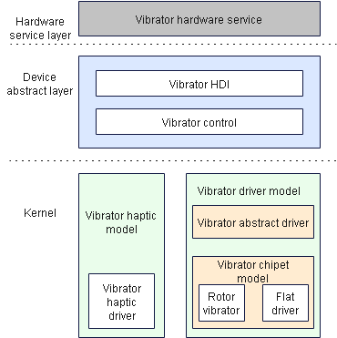

# Vibrator

## Introduction

The vibrator driver model provides and implements vibrator-related Hardware Device Interfaces (HDIs). It supports the time sequence configuration in the static HDF Configuration Source (HCS) and the duration configuration through dynamic parameters. The vibrator hardware service calls **StartOnce** to start one-shot vibration with a given duration and calls **StartEffect** to start vibration with a specified effect.

**Figure 1** Vibrator driver model



## Directory Structure

The directory structure of the vibrator module is as follows:

```
/drivers/peripheral/misc/vibrator
├── hal              # HAL code
│   ├── include      # HAL header files
│   └── src          # HAL code implementation
├── interfaces       # Driver capability APIs provided for upper-layer services
│   └── include      # APIs exposed externally
└── test             # Test code
    └── unittest     # Unit test code
```

## Usage

### Available APIs

The APIs provided for the vibrator are used to trigger and stop vibration. The following table describes these APIs.

**Table 1** Main APIs of the vibrator module

| API                                | Description                                                  |
| -------------------------------------- | ---------------------------------------------------------- |
| int32_t  StartOnce(uint32_t duration)  | Triggers vibration with a given **duration**.        |
| int32_t  Start(const char *effectType) | Triggers vibration with a given effect, which is specified by **effectType**.|
| int32_t  Stop(enum VibratorMode mode)  | Stops vibration.                              |

### How to Use

The sample code is as follows:

```
#include "vibrator_if.h"

enum VibratorMode {
    VIBRATOR_MODE_ONCE   = 0,    // Trigger vibration with a specified period.
    VIBRATOR_MODE_PRESET = 1,    // Trigger periodic vibration with the preset effect.
};

void VibratorSample(void)
{
	int32_t startRet;
	int32_t endRet;
	uint32_t g_duration = 1000;
	uint32_t g_sleepTime1 = 2000;
	uint32_t g_sleepTime2 = 5000;
	const char *g_timeSequence = "haptic.clock.timer";
	/* Create a VibratorInterface instance. */
    struct VibratorInterface *g_vibratorDev = NewVibratorInterfaceInstance();
    if (g_vibratorDev == NULL) {
        return;
    }
	/* Trigger vibration with the specified duration.*/
	startRet = g_vibratorDev->StartOnce(g_duration);
    if (startRet != 0) {
        return;
    }
    OsalMSleep(g_sleepTime1);
    /* Stop vibration based on the specified vibration mode. */
    endRet = g_vibratorDev->Stop(VIBRATOR_MODE_ONCE);
    if (endRet != 0) {
        return;
    }
    /* Release the VibratorInterface instance. */
    ret = FreeVibratorInterfaceInstance();
    if (ret != 0) {
        return;
    }
    /* Create a VibratorInterface instance. */
    struct VibratorInterface *g_vibratorDev = NewVibratorInterfaceInstance();
    if (g_vibratorDev == NULL) {
        return;
    }
    /* Trigger vibration with the preset effect. */
    startRet = g_vibratorDev->Start(g_timeSequence);
    if (endRet != 0) {
        return;
    }
    OsalMSleep(g_sleepTime2);
	/* Stop vibration based on the specified vibration mode. */
    endRet = g_vibratorDev->Stop(VIBRATOR_MODE_PRESET);
    if (endRet != 0) {
        return;
    }
    /* Release the VibratorInterface instance. */
    ret = FreeVibratorInterfaceInstance();
    if (ret != 0) {
        return;
    }
}
```

## Repositories Involved

[Drive Subsystem](https://gitee.com/openharmony/docs/blob/master/en/readme/driver-subsystem.md)

[drivers_framework](https://gitee.com/openharmony/drivers_framework/blob/master/README.md)

[drivers_adapter](https://gitee.com/openharmony/drivers_adapter/blob/master/README.md)

[drivers_adapter_khdf_linuk](https://gitee.com/openharmony/drivers_adapter_khdf_linux/blob/master/README.md)

[drivers_peripheral](https://gitee.com/openharmony/drivers_peripheral)
