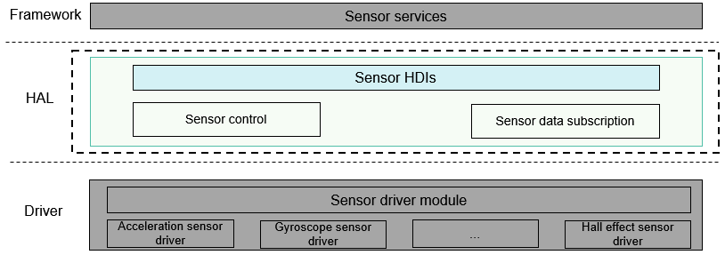

# sensor<a name="EN-US_TOPIC_0000001078202098"></a>

-   [Introduction](#section11660541593)
-   [Directory Structure](#section161941989596)
-   [Usage](#section45490312053)
    -   [Available APIs](#section14840627279)
    -   [Usage Guidelines](#section460510231888)

-   [Repositories Involved](#section12495154795416)

## Introduction<a name="section11660541593"></a>

The sensor driver module provides and implements sensor-related Hardware Driver Interfaces \(HDIs\), including obtaining sensor information, enabling or disabling a sensor, subscribing to or unsubscribing from sensor data, and setting sensor options. These APIs make service development easier.

**Figure  1**  Sensor driver module architecture<a name="fig1292918466322"></a>  


## Directory Structure<a name="section161941989596"></a>

The directory structure of the sensor driver module is as follows:

```
/drivers/peripheral/sensor
├── hal                # HAL code
│   └── include       # HAL header files
│   └── src           # HAL code implementation
├── interfaces         # Driver capability APIs provided for upper-layer services
│   └── include       # APIs exposed externally
├── test               # Test code
│   └── unittest      # Unit test code
```

## Usage<a name="section45490312053"></a>

This section uses the acceleration sensor as an example to describe how to use sensor APIs.

### Available APIs<a name="section14840627279"></a>

The HAL module of the sensor driver provides APIs that can be directly called by sensor services to obtain, set, and subscribe to or unsubscribe from sensor data. The following table lists the APIs provided by the sensor driver module.

**Table  1**  Major HDIs of the sensor module

<a name="table132511511499"></a>
<table><thead align="left"><tr id="row22545164911"><th class="cellrowborder" valign="top" width="9.85098509850985%" id="mcps1.2.4.1.1"><p id="p17401913133218"><a name="p17401913133218"></a><a name="p17401913133218"></a>Category</p>
</th>
<th class="cellrowborder" valign="top" width="53.88538853885388%" id="mcps1.2.4.1.2"><p id="p20921103144918"><a name="p20921103144918"></a><a name="p20921103144918"></a>API</p>
</th>
<th class="cellrowborder" valign="top" width="36.26362636263626%" id="mcps1.2.4.1.3"><p id="p109216317495"><a name="p109216317495"></a><a name="p109216317495"></a>Description</p>
</th>
</tr>
</thead>
<tbody><tr id="row9256564919"><td class="cellrowborder" valign="top" width="9.85098509850985%" headers="mcps1.2.4.1.1 "><p id="p8437193673211"><a name="p8437193673211"></a><a name="p8437193673211"></a>Query</p>
</td>
<td class="cellrowborder" valign="top" width="53.88538853885388%" headers="mcps1.2.4.1.2 "><p id="p11001322173912"><a name="p11001322173912"></a><a name="p11001322173912"></a>int32_t <strong id="b935414557240"><a name="b935414557240"></a><a name="b935414557240"></a>GetAllSensors</strong>(struct SensorInformation **sensorInfo, int32_t *count)</p>
</td>
<td class="cellrowborder" valign="top" width="36.26362636263626%" headers="mcps1.2.4.1.3 "><p id="p199227318499"><a name="p199227318499"></a><a name="p199227318499"></a>Obtains information about all sensors in the system. The information about a sensor generally includes the sensor name, sensor vendor, firmware version, hardware version, sensor type ID, sensor ID, maximum measurement range, accuracy, and power.</p>
</td>
</tr>
<tr id="row1026352493"><td class="cellrowborder" rowspan="5" valign="top" width="9.85098509850985%" headers="mcps1.2.4.1.1 "><p id="p06071477324"><a name="p06071477324"></a><a name="p06071477324"></a>Setting</p>
</td>
<td class="cellrowborder" valign="top" width="53.88538853885388%" headers="mcps1.2.4.1.2 "><p id="p38874252376"><a name="p38874252376"></a><a name="p38874252376"></a>int32_t <strong id="b199602219271"><a name="b199602219271"></a><a name="b199602219271"></a>Enable</strong>(int32_t sensorId)</p>
</td>
<td class="cellrowborder" valign="top" width="36.26362636263626%" headers="mcps1.2.4.1.3 "><p id="p5922331114916"><a name="p5922331114916"></a><a name="p5922331114916"></a>Enables the sensor that has been subscribed to. The subscriber can obtain the sensor data only after the sensor is enabled.</p>
</td>
</tr>
<tr id="row42612518492"><td class="cellrowborder" valign="top" headers="mcps1.2.4.1.1 "><p id="p6923143184914"><a name="p6923143184914"></a><a name="p6923143184914"></a>int32_t <strong id="b84601875330"><a name="b84601875330"></a><a name="b84601875330"></a>Disable</strong>(int32_t sensorId)</p>
</td>
<td class="cellrowborder" valign="top" headers="mcps1.2.4.1.2 "><p id="p139231531184912"><a name="p139231531184912"></a><a name="p139231531184912"></a>Disables a sensor.</p>
</td>
</tr>
<tr id="row14261659498"><td class="cellrowborder" valign="top" headers="mcps1.2.4.1.1 "><p id="p992473112496"><a name="p992473112496"></a><a name="p992473112496"></a>int32_t <strong id="b16691194511438"><a name="b16691194511438"></a><a name="b16691194511438"></a>SetBatch</strong>(iint32_t sensorId, int64_t samplingInterval, int64_t reportInterval)</p>
</td>
<td class="cellrowborder" valign="top" headers="mcps1.2.4.1.2 "><p id="p14924203134910"><a name="p14924203134910"></a><a name="p14924203134910"></a>Sets the data sampling interval and data reporting interval for the specified sensor.</p>
</td>
</tr>
<tr id="row82615144912"><td class="cellrowborder" valign="top" headers="mcps1.2.4.1.1 "><p id="p170411511281"><a name="p170411511281"></a><a name="p170411511281"></a>int32_t <strong id="b170414153284"><a name="b170414153284"></a><a name="b170414153284"></a>SetMode</strong>(int32_t sensorTypeId, SensorUser *user, int32_t mode)</p>
</td>
<td class="cellrowborder" valign="top" headers="mcps1.2.4.1.2 "><p id="p107051159281"><a name="p107051159281"></a><a name="p107051159281"></a>Sets the data reporting mode for the specified sensor.</p>
</td>
</tr>
<tr id="row7260574918"><td class="cellrowborder" valign="top" headers="mcps1.2.4.1.1 "><p id="p492513120494"><a name="p492513120494"></a><a name="p492513120494"></a>int32_t <strong id="b7501191019330"><a name="b7501191019330"></a><a name="b7501191019330"></a>SetOption</strong>(int32_t sensorId, uint32_t option)</p>
</td>
<td class="cellrowborder" valign="top" headers="mcps1.2.4.1.2 "><p id="p5926031124914"><a name="p5926031124914"></a><a name="p5926031124914"></a>Sets options for the specified sensor, including its measurement range and accuracy.</p>
</td>
</tr>
<tr id="row5261957493"><td class="cellrowborder" rowspan="2" valign="top" width="9.85098509850985%" headers="mcps1.2.4.1.1 "><p id="p1039815743211"><a name="p1039815743211"></a><a name="p1039815743211"></a>Data subscription and unsubscription</p>
</td>
<td class="cellrowborder" valign="top" width="53.88538853885388%" headers="mcps1.2.4.1.2 "><p id="p11530101054411"><a name="p11530101054411"></a><a name="p11530101054411"></a>int32_t <strong id="b0569161217334"><a name="b0569161217334"></a><a name="b0569161217334"></a>Register</strong>(RecordDataCallback cb)</p>
</td>
<td class="cellrowborder" valign="top" width="36.26362636263626%" headers="mcps1.2.4.1.3 "><p id="p892633118493"><a name="p892633118493"></a><a name="p892633118493"></a>Registers the callback for reporting sensor data to the subscriber.</p>
</td>
</tr>
<tr id="row10900102644918"><td class="cellrowborder" valign="top" headers="mcps1.2.4.1.1 "><p id="p196491214133110"><a name="p196491214133110"></a><a name="p196491214133110"></a>int32_t <strong id="b13758151483317"><a name="b13758151483317"></a><a name="b13758151483317"></a>Unregister</strong>(void)</p>
</td>
<td class="cellrowborder" valign="top" headers="mcps1.2.4.1.2 "><p id="p5817133119"><a name="p5817133119"></a><a name="p5817133119"></a>Unregisters the callback for reporting sensor data.</p>
</td>
</tr>
<tr id="row0353356768"><td class="cellrowborder" rowspan="2" valign="top" width="9.85098509850985%" headers="mcps1.2.4.1.1 "><p id="p6596162112564"><a name="p6596162112564"></a><a name="p6596162112564"></a>Instance creation</p>
</td>
<td class="cellrowborder" valign="top" width="53.88538853885388%" headers="mcps1.2.4.1.2 "><p id="p13679191616561"><a name="p13679191616561"></a><a name="p13679191616561"></a>const struct SensorInterface *<strong id="b334310134717"><a name="b334310134717"></a><a name="b334310134717"></a>NewSensorInterfaceInstance</strong>(void)</p>
</td>
<td class="cellrowborder" valign="top" width="36.26362636263626%" headers="mcps1.2.4.1.3 "><p id="p19679181612563"><a name="p19679181612563"></a><a name="p19679181612563"></a>Creates a <strong id="b166561232174515"><a name="b166561232174515"></a><a name="b166561232174515"></a>SensorInterface</strong> instance.</p>
</td>
</tr>
<tr id="row53542561265"><td class="cellrowborder" valign="top" headers="mcps1.2.4.1.1 "><p id="p15680111655611"><a name="p15680111655611"></a><a name="p15680111655611"></a>int32_t <strong id="b99024181871"><a name="b99024181871"></a><a name="b99024181871"></a>FreeSensorInterfaceInstance</strong>(void)</p>
</td>
<td class="cellrowborder" valign="top" headers="mcps1.2.4.1.2 "><p id="p18680916165620"><a name="p18680916165620"></a><a name="p18680916165620"></a>Releases the <strong id="b1067184719453"><a name="b1067184719453"></a><a name="b1067184719453"></a>SensorInterface</strong> instance.</p>
</td>
</tr>
</tbody>
</table>

### Usage Guidelines<a name="section460510231888"></a>

Sample code

```
#include "sensor_if.h"

/* Create a callback. */
void SensorDataCallback(struct SensorEvents *event)
{
    if(event == NULL){
        return;
    }
    float *sensorData=(float *)event->data;
    printf("sensor data[%f]", *sensorData);
}

void SensorSample(void)
{
    int ret;
    struct SensorInformation *sensorInfo = NULL;
    int32_t count = 0;
    int32_t sensorInterval = 200000000; /* Set the data sampling rate to 200000000, in the unit of nanoseconds (200 ms). */

    /* 1. Create a SensorInterface instance. */
    struct SensorInterface *sensorDev = NewSensorInterfaceInstance();
    if (sensorDev == NULL) {
        return;
    }
     /* 2. Register a sensor data callback. */
    ret = sensorDev->Register(0, SensorDataCallback);
    if (ret != 0) {
        return;
    }
    /* 3. Obtain the list of sensors supported by the device. */
    ret = GetAllSensors(&sensorInfo, &count);
    if (ret != 0) {
        return;
    }
    /* 4. Set the sensor sampling rate. */
    ret = SetBatch(SENSOR_TYPE_ACCELEROMETER, sensorInterval, 0);
    if (ret != 0) {
        return;
    }
    /* 5. Enable the sensor. */
    ret = Enable(SENSOR_TYPE_ACCELEROMETER);
    if (ret != 0) {
        return;
    }
      /* 6. Disable the sensor. */
    ret = Disable(SENSOR_TYPE_ACCELEROMETER);
    if (ret != 0) {
        return;
    }
    /* 7. Unregister the sensor data callback. */
    ret = Unregister(0);
    if (ret != 0) {
        return;
    }
    /* 8. Release the SensorInterface instance.
    ret = FreeSensorInterfaceInstance();
    if (ret != 0) {
        return;
    }
}
```

## Repositories Involved<a name="section12495154795416"></a>

[Driver subsystem](https://gitee.com/openharmony/docs/blob/master/en/readme/driver-subsystem.md)

[drivers\_framework](https://gitee.com/openharmony/drivers_framework/blob/master/README.md)

[drivers\_adapter](https://gitee.com/openharmony/drivers_adapter/blob/master/README.md)

[drivers\_adapter\_khdf\_linux](https://gitee.com/openharmony/drivers_adapter_khdf_linux/blob/master/README.md)

[drivers\_peripheral](https://gitee.com/openharmony/drivers_peripheral)

