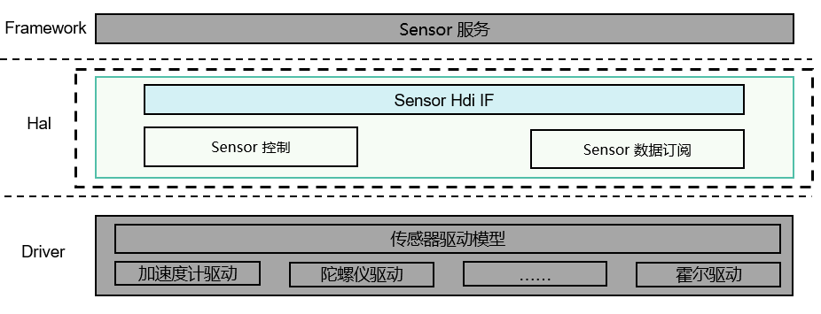

# sensor<a name="ZH-CN_TOPIC_0000001078202098"></a>

-   [简介](#section11660541593)
-   [目录](#section161941989596)
-   [说明](#section45490312053)
    -   [接口说明](#section14840627279)
    -   [使用说明](#section460510231888)

-   [相关仓](#section12495154795416)

## 简介<a name="section11660541593"></a>

Sensor驱动模型主要包含Sensor（传感器）相关HDI接口与实现，提供Sensor HDI（**H**ardware  **D**river  **I**nterface）能力接口，主要包括所有Sensor信息查询、Sensor启停、Sensor订阅/去订阅、Sensor参数配置等稳定的接口，简化服务开发。

**图 1**  Sensor驱动模块架构图<a name="fig1292918466322"></a>


## 目录<a name="section161941989596"></a>

Sensor驱动下源代码目录结构如下所示：

```
/drivers/peripheral/sensor
├── hal                # sensor模块hal层代码
│   └── include       # sensor模块hal层内部头文件
│   └── src           # sensor模块hal层代码的实现
├── interfaces         # sensor模块对上层服务提供的驱动能力接口
│   └── include       # sensor模块对外提供的接口定义
├── test               # sensor模块测试代码
│   └── unittest      # sensor模块单元测试代码
```

## 说明<a name="section45490312053"></a>

本节以订阅加速度传感器数据为例进行介绍。

### 接口说明<a name="section14840627279"></a>

Sensor驱动HAL模块提供给Sensor服务可直接调用的能力接口，主要功能有：查询，配置，数据订阅等操作。Sensor驱动模型对HDI开放的API接口功能如表1：

**表 1**  Sensor HDI 接口列表

<a name="table132511511499"></a>
<table><thead align="left"><tr id="row22545164911"><th class="cellrowborder" valign="top" width="9.85098509850985%" id="mcps1.2.4.1.1"><p id="p17401913133218"><a name="p17401913133218"></a><a name="p17401913133218"></a>功能分类</p>
</th>
<th class="cellrowborder" valign="top" width="53.88538853885388%" id="mcps1.2.4.1.2"><p id="p20921103144918"><a name="p20921103144918"></a><a name="p20921103144918"></a>接口名</p>
</th>
<th class="cellrowborder" valign="top" width="36.26362636263626%" id="mcps1.2.4.1.3"><p id="p109216317495"><a name="p109216317495"></a><a name="p109216317495"></a>功能描述</p>
</th>
</tr>
</thead>
<tbody><tr id="row9256564919"><td class="cellrowborder" valign="top" width="9.85098509850985%" headers="mcps1.2.4.1.1 "><p id="p8437193673211"><a name="p8437193673211"></a><a name="p8437193673211"></a>查询操作</p>
</td>
<td class="cellrowborder" valign="top" width="53.88538853885388%" headers="mcps1.2.4.1.2 "><p id="p11001322173912"><a name="p11001322173912"></a><a name="p11001322173912"></a>int32_t <strong id="b935414557240"><a name="b935414557240"></a><a name="b935414557240"></a>GetAllSensors</strong>(struct SensorInformation **sensorInfo, int32_t *count)</p>
</td>
<td class="cellrowborder" valign="top" width="36.26362636263626%" headers="mcps1.2.4.1.3 "><p id="p199227318499"><a name="p199227318499"></a><a name="p199227318499"></a>获取系统中注册的所有传感器信息，一种类型传感器信息包括传感器名字、设备厂商、固件版本号、硬件版本号、传感器类型编号、传感器标识、最大量程、精度、功耗。</p>
</td>
</tr>
<tr id="row1026352493"><td class="cellrowborder" rowspan="5" valign="top" width="9.85098509850985%" headers="mcps1.2.4.1.1 "><p id="p06071477324"><a name="p06071477324"></a><a name="p06071477324"></a>配置操作</p>
</td>
<td class="cellrowborder" valign="top" width="53.88538853885388%" headers="mcps1.2.4.1.2 "><p id="p38874252376"><a name="p38874252376"></a><a name="p38874252376"></a>int32_t <strong id="b199602219271"><a name="b199602219271"></a><a name="b199602219271"></a>Enable</strong>(int32_t sensorId)</p>
</td>
<td class="cellrowborder" valign="top" width="36.26362636263626%" headers="mcps1.2.4.1.3 "><p id="p5922331114916"><a name="p5922331114916"></a><a name="p5922331114916"></a>使能一种传感器设备，只有数据订阅者使能传感器后，才能获取订阅的传感器数据。</p>
</td>
</tr>
<tr id="row42612518492"><td class="cellrowborder" valign="top" headers="mcps1.2.4.1.1 "><p id="p6923143184914"><a name="p6923143184914"></a><a name="p6923143184914"></a>int32_t <strong id="b84601875330"><a name="b84601875330"></a><a name="b84601875330"></a>Disable</strong>(int32_t sensorId)</p>
</td>
<td class="cellrowborder" valign="top" headers="mcps1.2.4.1.2 "><p id="p139231531184912"><a name="p139231531184912"></a><a name="p139231531184912"></a>去使能一种传感器设备。</p>
</td>
</tr>
<tr id="row14261659498"><td class="cellrowborder" valign="top" headers="mcps1.2.4.1.1 "><p id="p992473112496"><a name="p992473112496"></a><a name="p992473112496"></a>int32_t <strong id="b16691194511438"><a name="b16691194511438"></a><a name="b16691194511438"></a>SetBatch</strong>(iint32_t sensorId, int64_t samplingInterval, int64_t reportInterval)</p>
</td>
<td class="cellrowborder" valign="top" headers="mcps1.2.4.1.2 "><p id="p14924203134910"><a name="p14924203134910"></a><a name="p14924203134910"></a>设置一种传感器的数据采样间隔和数据上报间隔。</p>
</td>
</tr>
<tr id="row82615144912"><td class="cellrowborder" valign="top" headers="mcps1.2.4.1.1 "><p id="p170411511281"><a name="p170411511281"></a><a name="p170411511281"></a>int32_t <strong id="b170414153284"><a name="b170414153284"></a><a name="b170414153284"></a>SetMode</strong>(int32_t sensorTypeId, SensorUser *user, int32_t mode)</p>
</td>
<td class="cellrowborder" valign="top" headers="mcps1.2.4.1.2 "><p id="p107051159281"><a name="p107051159281"></a><a name="p107051159281"></a>设置一种传感器的工作模式，不同的工作模式，上报数据方式不同。</p>
</td>
</tr>
<tr id="row7260574918"><td class="cellrowborder" valign="top" headers="mcps1.2.4.1.1 "><p id="p492513120494"><a name="p492513120494"></a><a name="p492513120494"></a>int32_t <strong id="b7501191019330"><a name="b7501191019330"></a><a name="b7501191019330"></a>SetOption</strong>(int32_t sensorId, uint32_t option)</p>
</td>
<td class="cellrowborder" valign="top" headers="mcps1.2.4.1.2 "><p id="p5926031124914"><a name="p5926031124914"></a><a name="p5926031124914"></a>设置一种传感器量程，精度等可选配置。</p>
</td>
</tr>
<tr id="row5261957493"><td class="cellrowborder" rowspan="2" valign="top" width="9.85098509850985%" headers="mcps1.2.4.1.1 "><p id="p1039815743211"><a name="p1039815743211"></a><a name="p1039815743211"></a>数据订阅操作</p>
</td>
<td class="cellrowborder" valign="top" width="53.88538853885388%" headers="mcps1.2.4.1.2 "><p id="p11530101054411"><a name="p11530101054411"></a><a name="p11530101054411"></a>int32_t <strong id="b0569161217334"><a name="b0569161217334"></a><a name="b0569161217334"></a>Register</strong>(RecordDataCallback cb)</p>
</td>
<td class="cellrowborder" valign="top" width="36.26362636263626%" headers="mcps1.2.4.1.3 "><p id="p892633118493"><a name="p892633118493"></a><a name="p892633118493"></a>订阅者注册传感器数据回调函数，系统会将获取到的传感器数据上报给订阅者。</p>
</td>
</tr>
<tr id="row10900102644918"><td class="cellrowborder" valign="top" headers="mcps1.2.4.1.1 "><p id="p196491214133110"><a name="p196491214133110"></a><a name="p196491214133110"></a>int32_t <strong id="b13758151483317"><a name="b13758151483317"></a><a name="b13758151483317"></a>Unregister</strong>(void)</p>
</td>
<td class="cellrowborder" valign="top" headers="mcps1.2.4.1.2 "><p id="p5817133119"><a name="p5817133119"></a><a name="p5817133119"></a>订阅者去注册传感器数据回调函数。</p>
</td>
</tr>
<tr id="row0353356768"><td class="cellrowborder" rowspan="2" valign="top" width="9.85098509850985%" headers="mcps1.2.4.1.1 "><p id="p6596162112564"><a name="p6596162112564"></a><a name="p6596162112564"></a>接口实例</p>
</td>
<td class="cellrowborder" valign="top" width="53.88538853885388%" headers="mcps1.2.4.1.2 "><p id="p13679191616561"><a name="p13679191616561"></a><a name="p13679191616561"></a>const struct SensorInterface *<strong id="b334310134717"><a name="b334310134717"></a><a name="b334310134717"></a>NewSensorInterfaceInstance</strong>(void)</p>
</td>
<td class="cellrowborder" valign="top" width="36.26362636263626%" headers="mcps1.2.4.1.3 "><p id="p19679181612563"><a name="p19679181612563"></a><a name="p19679181612563"></a>创建传感器接口实例。</p>
</td>
</tr>
<tr id="row53542561265"><td class="cellrowborder" valign="top" headers="mcps1.2.4.1.1 "><p id="p15680111655611"><a name="p15680111655611"></a><a name="p15680111655611"></a>int32_t <strong id="b99024181871"><a name="b99024181871"></a><a name="b99024181871"></a>FreeSensorInterfaceInstance</strong>(void)</p>
</td>
<td class="cellrowborder" valign="top" headers="mcps1.2.4.1.2 "><p id="p18680916165620"><a name="p18680916165620"></a><a name="p18680916165620"></a>释放传感器接口实例。</p>
</td>
</tr>
</tbody>
</table>

### 使用说明<a name="section460510231888"></a>

代码示例

```
#include "sensor_if.h"

/* 创建回调函数 */
void SensorDataCallback(struct SensorEvents *event)
{
    if(event == NULL){
        return;
    }
    float *sensorData=(float *)event->data;
    printf("sensor data[%f]", *sensorData);
}

void SensorSample(void)
{
    int ret;
    struct SensorInformation *sensorInfo = NULL;
    int32_t count = 0;
    int32_t sensorInterval = 200000000; /* 数据采样率设置200毫秒，单位纳秒 */

    /* 1.创建传感器接口实例 */
    struct SensorInterface *sensorDev = NewSensorInterfaceInstance();
    if (sensorDev == NULL) {
        return;
    }
    /* 2.订阅者注册传感器数据回调处理函数 */
    ret = sensorDev->Register(0, SensorDataCallback);
    if (ret != 0) {
        return;
    }
    /* 3.获取设备支持的Sensor列表 */
    ret = GetAllSensors(&sensorInfo, &count);
    if (ret != 0) {
        return;
    }
    /* 4.设置传感器采样率 */
    ret = SetBatch(SENSOR_TYPE_ACCELEROMETER, sensorInterval, 0);
    if (ret != 0) {
        return;
    }
    /* 5.使能传感器 */
    ret = Enable(SENSOR_TYPE_ACCELEROMETER);
    if (ret != 0) {
        return;
    }
    /* 6.去使能传感器 */
    ret = Disable(SENSOR_TYPE_ACCELEROMETER);
    if (ret != 0) {
        return;
    }
    /* 7.取消传感器数据订阅函数 */
    ret = Unregister(0);
    if (ret != 0) {
        return;
    }
    /* 8.释放传感器接口实例 */
    ret = FreeSensorInterfaceInstance();
    if (ret != 0) {
        return;
    }
}
```

## 相关仓<a name="section12495154795416"></a>

[驱动子系统](https://gitee.com/openharmony/docs/blob/master/zh-cn/readme/%E9%A9%B1%E5%8A%A8%E5%AD%90%E7%B3%BB%E7%BB%9F.md)

[drivers\_framework](https://gitee.com/openharmony/drivers_framework/blob/master/README_zh.md)

[drivers\_adapter](https://gitee.com/openharmony/drivers_adapter/blob/master/README_zh.md)

[drivers\_adapter\_khdf\_linux](https://gitee.com/openharmony/drivers_adapter_khdf_linux/blob/master/README_zh.md)

[drivers\_peripheral](https://gitee.com/openharmony/drivers_peripheral)

