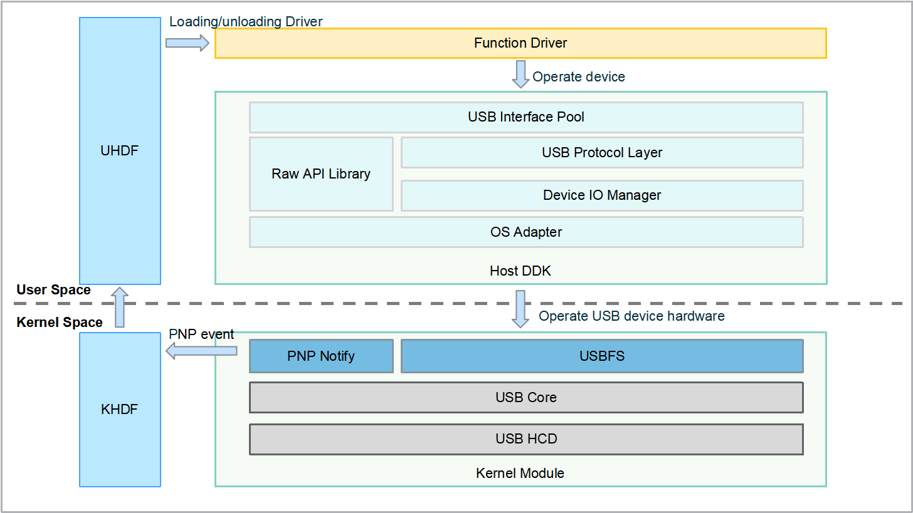
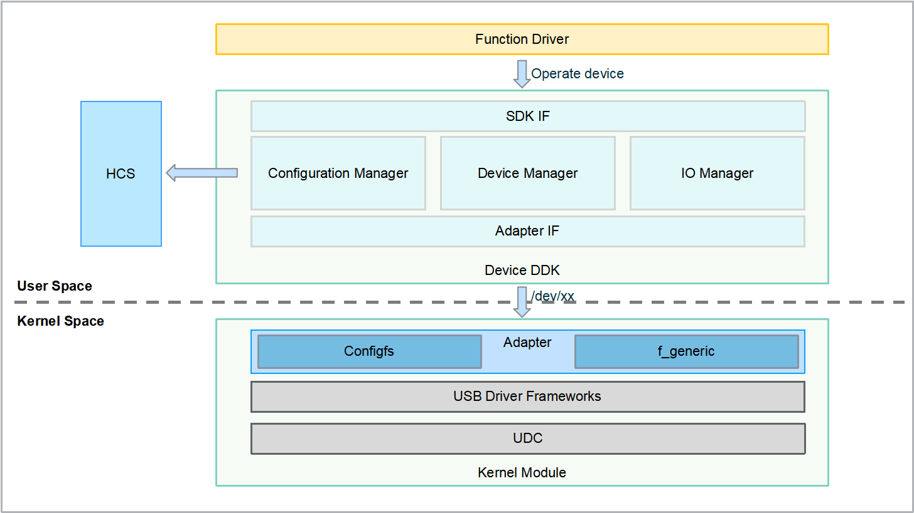

# USB<a name="ZH-CN_TOPIC_0000001078525242"></a>

-   [简介](#section11660541593)
-   [目录](#section161941989596)
    -   [接口说明](#section1551164914237)
    -   [使用说明](#section129654513264)

-   [相关仓](#section1371113476307)

## 简介<a name="section11660541593"></a>

该仓下主要包含USB Host DDK和USB Device DDK接口定义及其实现，提供的主要功能如下：

-   Usb Host DDK：负责提供用户态第三方功能驱动的USB设备数据读写接口，向内核USB驱动框架注册的设备插拔时间通知接口，提供移除USB逻辑设备的接口；

**图 1**  USB仓HOST侧相关模块逻辑视图<a name="fig3672817152110"></a>


-   Usb Device DDK：负责创建和删除USB设备，接口的事件获取、打开、关闭等，管道同步异步读写通信，设置Usb自定义属性等；

**图 2**  USB仓Device侧相关模块逻辑视图<a name="fig3672817152110"></a>


## 目录<a name="section161941989596"></a>

该仓下源代码目录结构如下所示

```
/drivers/peripheral/usb
├── ddk             # USB模块DDK代码
│   └── device      # USB模块Device侧DDK实现
│   └── host        # USB模块Host侧DDK实现
├── gadget          # USB模块Device侧驱动Demo实现
│   └── function    # USB模块Device侧驱动Demo，包括ACM和ECM驱动
├── interfaces      # USB模块对用户态提供的驱动能力接口
│   └── ddk         # USB模块Device侧和Host侧对外提供的接口定义
├── net             # USB模块Host侧ECM驱动Demo实现
├── sample          # USB模块应用测试程序实现
│   └── device      # USB模块Device侧ACM驱动读写和测速应用程序实现，适配Linux和LiteOS系统
│   └── host        # USB模块Host侧ACM驱动读写和测速应用程序实现，适配Linux和LiteOS系统
├── serial          # USB模块Host侧ACM驱动Demo实现
├── test            # USB模块的测试代码
│   └── unittest    # USB模块的单元测试代码，包括Host侧和Device侧
```

### 接口说明<a name="section1551164914237"></a>

Usb Host DDK提供给用户态可直接调用的驱动能力接口，按照功能分类三大类：DDK初始化类、对interface对象操作类、对request对象操作类，可以提供DDK初始化、interface绑定和释放，打开和关闭操作，request的申请和释放，同步和异步传输等。

提供的部分接口说明如[表1 USB Host DDK接口](#table1513255710559)所示：

**表 1**  USB HOST DDK接口

<a name="table1513255710559"></a>
<table><thead align="left"><tr id="row171321857155517"><th class="cellrowborder" valign="top" width="10.721072107210723%" id="mcps1.2.4.1.1"><p id="p6132957115511"><a name="p6132957115511"></a><a name="p6132957115511"></a>头文件</p>
</th>
<th class="cellrowborder" valign="top" width="66.36663666366637%" id="mcps1.2.4.1.2"><p id="p14132125715552"><a name="p14132125715552"></a><a name="p14132125715552"></a>接口名称</p>
</th>
<th class="cellrowborder" valign="top" width="22.912291229122914%" id="mcps1.2.4.1.3"><p id="p18132205755516"><a name="p18132205755516"></a><a name="p18132205755516"></a>功能描述</p>
</th>
</tr>
</thead>
<tbody><tr id="row13132357165514"><td class="cellrowborder" rowspan="16" valign="top" width="10.721072107210723%" headers="mcps1.2.4.1.1 "><p id="p15132185775510"><a name="p15132185775510"></a><a name="p15132185775510"></a>usb_ddk_interface.h</p>
<p id="p18132157175510"><a name="p18132157175510"></a><a name="p18132157175510"></a></p>
<p id="p2133757135510"><a name="p2133757135510"></a><a name="p2133757135510"></a></p>
</td>
<td class="cellrowborder" valign="top" width="66.36663666366637%" headers="mcps1.2.4.1.2 "><p id="p1213365714550"><a name="p1213365714550"></a><a name="p1213365714550"></a>int32_t UsbInitHostSdk(struct UsbSession **session);</p>
</td>
<td class="cellrowborder" valign="top" width="22.912291229122914%" headers="mcps1.2.4.1.3 "><p id="p201331557185512"><a name="p201331557185512"></a><a name="p201331557185512"></a>USB主机端驱动开发工具包初始化</p>
</td>
</tr>
<tr id="row171331657185514"><td class="cellrowborder" valign="top" headers="mcps1.2.4.1.1 "><p id="p913305715553"><a name="p913305715553"></a><a name="p913305715553"></a>int32_t UsbExitHostSdk(const struct UsbSession *session);</p>
</td>
<td class="cellrowborder" valign="top" headers="mcps1.2.4.1.2 "><p id="p161332570553"><a name="p161332570553"></a><a name="p161332570553"></a>USB主机端驱动开发工具包退出</p>
</td>
</tr>
<tr id="row41331557165518"><td class="cellrowborder" valign="top" headers="mcps1.2.4.1.1 "><p id="p6133145713559"><a name="p6133145713559"></a><a name="p6133145713559"></a>struct UsbInterface *UsbClaimInterface(const struct UsbSession *session, uint8_t busNum, uint8_t usbAddr, uint8_t interfaceIndex);</p>
</td>
<td class="cellrowborder" valign="top" headers="mcps1.2.4.1.2 "><p id="p131331557175510"><a name="p131331557175510"></a><a name="p131331557175510"></a>获取USB接口对象</p>
</td>
</tr>
<tr id="row77021769584"><td class="cellrowborder" valign="top" headers="mcps1.2.4.1.1 "><p id="p77031566584"><a name="p77031566584"></a><a name="p77031566584"></a>int UsbReleaseInterface(const struct UsbInterface *interfaceObj);</p>
</td>
<td class="cellrowborder" valign="top" headers="mcps1.2.4.1.2 "><p id="p1470315695811"><a name="p1470315695811"></a><a name="p1470315695811"></a>释放USB接口对象</p>
</td>
</tr>
<tr id="row71857914585"><td class="cellrowborder" valign="top" headers="mcps1.2.4.1.1 "><p id="p1318619155811"><a name="p1318619155811"></a><a name="p1318619155811"></a>int UsbAddOrRemoveInterface(const struct UsbSession *session, uint8_t busNum, uint8_t usbAddr, uint8_t interfaceIndex, UsbInterfaceStatus status);</p>
</td>
<td class="cellrowborder" valign="top" headers="mcps1.2.4.1.2 "><p id="p1186597589"><a name="p1186597589"></a><a name="p1186597589"></a>增加移除接口</p>
</td>
</tr>
<tr id="row18831119115815"><td class="cellrowborder" valign="top" headers="mcps1.2.4.1.1 "><p id="p48323975814"><a name="p48323975814"></a><a name="p48323975814"></a>UsbInterfaceHandle *UsbOpenInterface(const struct UsbInterface *interfaceObj);</p>
</td>
<td class="cellrowborder" valign="top" headers="mcps1.2.4.1.2 "><p id="p15832129135813"><a name="p15832129135813"></a><a name="p15832129135813"></a>打开USB对象接口</p>
</td>
</tr>
<tr id="row71857914585"><td class="cellrowborder" valign="top" headers="mcps1.2.4.1.1 "><p id="p1318619155811"><a name="p1318619155811"></a><a name="p1318619155811"></a>int32_t UsbCloseInterface(const UsbInterfaceHandle *interfaceHandle);</p>
</td>
<td class="cellrowborder" valign="top" headers="mcps1.2.4.1.2 "><p id="p1186597589"><a name="p1186597589"></a><a name="p1186597589"></a>关闭USB接口对象</p>
</td>
</tr>
<tr id="row18831119115815"><td class="cellrowborder" valign="top" headers="mcps1.2.4.1.1 "><p id="p48323975814"><a name="p48323975814"></a><a name="p48323975814"></a>int32_t UsbSelectInterfaceSetting(const UsbInterfaceHandle *interfaceHandle, uint8_t settingIndex, struct UsbInterface **interfaceObj);</p>
</td>
<td class="cellrowborder" valign="top" headers="mcps1.2.4.1.2 "><p id="p15832129135813"><a name="p15832129135813"></a><a name="p15832129135813"></a>设置可选配置</p>
</td>
</tr>
<tr id="row71857914585"><td class="cellrowborder" valign="top" headers="mcps1.2.4.1.1 "><p id="p1318619155811"><a name="p1318619155811"></a><a name="p1318619155811"></a>int32_t UsbGetPipeInfo(const UsbInterfaceHandle *interfaceHandle, uint8_t settingIndex, uint8_t pipeId, struct UsbPipeInfo *pipeInfo);</p>
</td>
<td class="cellrowborder" valign="top" headers="mcps1.2.4.1.2 "><p id="p1186597589"><a name="p1186597589"></a><a name="p1186597589"></a>获取指定可选设置的管道信息</p>
</td>
</tr>
<tr id="row18831119115815"><td class="cellrowborder" valign="top" headers="mcps1.2.4.1.1 "><p id="p48323975814"><a name="p48323975814"></a><a name="p48323975814"></a>int32_t UsbClearInterfaceHalt(const UsbInterfaceHandle *interfaceHandle, uint8_t pipeAddress);</p>
</td>
<td class="cellrowborder" valign="top" headers="mcps1.2.4.1.2 "><p id="p15832129135813"><a name="p15832129135813"></a><a name="p15832129135813"></a>清除指定索引的管道状态</p>
</td>
</tr>
<tr id="row71857914585"><td class="cellrowborder" valign="top" headers="mcps1.2.4.1.1 "><p id="p1318619155811"><a name="p1318619155811"></a><a name="p1318619155811"></a>struct UsbRequest *UsbAllocRequest(const UsbInterfaceHandle *interfaceHandle, int isoPackets, int length);</p>
</td>
<td class="cellrowborder" valign="top" headers="mcps1.2.4.1.2 "><p id="p1186597589"><a name="p1186597589"></a><a name="p1186597589"></a>分配请求对象</p>
</td>
</tr>
<tr id="row18831119115815"><td class="cellrowborder" valign="top" headers="mcps1.2.4.1.1 "><p id="p48323975814"><a name="p48323975814"></a><a name="p48323975814"></a>int UsbFreeRequest(const struct UsbRequest *request);</p>
</td>
<td class="cellrowborder" valign="top" headers="mcps1.2.4.1.2 "><p id="p15832129135813"><a name="p15832129135813"></a><a name="p15832129135813"></a>释放请求对象</p>
</td>
</tr>
<tr id="row71857914585"><td class="cellrowborder" valign="top" headers="mcps1.2.4.1.1 "><p id="p1318619155811"><a name="p1318619155811"></a><a name="p1318619155811"></a>int UsbSubmitRequestAsync(const struct UsbRequest *request);</p>
</td>
<td class="cellrowborder" valign="top" headers="mcps1.2.4.1.2 "><p id="p1186597589"><a name="p1186597589"></a><a name="p1186597589"></a>发送异步请求</p>
</td>
</tr>
<tr id="row18831119115815"><td class="cellrowborder" valign="top" headers="mcps1.2.4.1.1 "><p id="p48323975814"><a name="p48323975814"></a><a name="p48323975814"></a>int32_t UsbFillRequest(const struct UsbRequest *request, const UsbInterfaceHandle *interfaceHandle, const struct UsbRequestParams *params);</p>
</td>
<td class="cellrowborder" valign="top" headers="mcps1.2.4.1.2 "><p id="p15832129135813"><a name="p15832129135813"></a><a name="p15832129135813"></a>填充请求</p>
</td>
</tr>
<tr id="row71857914585"><td class="cellrowborder" valign="top" headers="mcps1.2.4.1.1 "><p id="p1318619155811"><a name="p1318619155811"></a><a name="p1318619155811"></a>sint UsbCancelRequest(const struct UsbRequest *request);</p>
</td>
<td class="cellrowborder" valign="top" headers="mcps1.2.4.1.2 "><p id="p1186597589"><a name="p1186597589"></a><a name="p1186597589"></a>取消异步请求</p>
</td>
</tr>
<tr id="row18831119115815"><td class="cellrowborder" valign="top" headers="mcps1.2.4.1.1 "><p id="p48323975814"><a name="p48323975814"></a><a name="p48323975814"></a>int UsbSubmitRequestSync(const struct UsbRequest *request);</p>
</td>
<td class="cellrowborder" valign="top" headers="mcps1.2.4.1.2 "><p id="p15832129135813"><a name="p15832129135813"></a><a name="p15832129135813"></a>发送同步请求</p>
</td>
</tr>
<tr id="row1513316577554"><td class="cellrowborder" rowspan="27" valign="top" width="10.721072107210723%" headers="mcps1.2.4.1.1 "><p id="p15133657185517"><a name="p15133657185517"></a><a name="p15133657185517"></a>usb_raw_api.h</p>
<p id="p1513315717555"><a name="p1513315717555"></a><a name="p1513315717555"></a></p>
<p id="p81331057125513"><a name="p81331057125513"></a><a name="p81331057125513"></a></p>
<p id="p18703206155812"><a name="p18703206155812"></a><a name="p18703206155812"></a></p>
<p id="p17186692581"><a name="p17186692581"></a><a name="p17186692581"></a></p>
<p id="p28322099581"><a name="p28322099581"></a><a name="p28322099581"></a></p>
</td>
<td class="cellrowborder" valign="top" width="66.36663666366637%" headers="mcps1.2.4.1.2 "><p id="p105259109581"><a name="p105259109581"></a><a name="p105259109581"></a>int UsbRawInit(struct UsbSession **session);</p>
</td>
<td class="cellrowborder" valign="top" width="22.912291229122914%" headers="mcps1.2.4.1.3 "><p id="p752531095814"><a name="p752531095814"></a><a name="p752531095814"></a>USB驱动开发工具包专家模式初始化</p>
</td>
</tr>
<tr id="row172902161193"><td class="cellrowborder" valign="top" headers="mcps1.2.4.1.1 "><p id="p16290141681918"><a name="p16290141681918"></a><a name="p16290141681918"></a>int UsbRawExit(const struct UsbSession *session);</p>
</td>
<td class="cellrowborder" valign="top" headers="mcps1.2.4.1.2 "><p id="p1929141611198"><a name="p1929141611198"></a><a name="p1929141611198"></a>USB驱动开发工具包专家模式退出</p>
</td>
</tr>
<tr id="row1948179195"><td class="cellrowborder" valign="top" headers="mcps1.2.4.1.1 "><p id="p1395181710193"><a name="p1395181710193"></a><a name="p1395181710193"></a>UsbRawHandle *UsbRawOpenDevice(const struct UsbSession *session, uint8_t busNum, uint8_t usbAddr);</p>
</td>
<td class="cellrowborder" valign="top" headers="mcps1.2.4.1.2 "><p id="p169531741912"><a name="p169531741912"></a><a name="p169531741912"></a>打开USB设备对象</p>
</td>
</tr>
<tr id="row1331121813197"><td class="cellrowborder" valign="top" headers="mcps1.2.4.1.1 "><p id="p533121871912"><a name="p533121871912"></a><a name="p533121871912"></a>int UsbRawCloseDevice(const UsbRawHandle *devHandle);</p>
</td>
<td class="cellrowborder" valign="top" headers="mcps1.2.4.1.2 "><p id="p4331131817195"><a name="p4331131817195"></a><a name="p4331131817195"></a>关闭USB设备对象</p>
</td>
</tr>
<tr id="row1393181951920"><td class="cellrowborder" valign="top" headers="mcps1.2.4.1.1 "><p id="p79410191191"><a name="p79410191191"></a><a name="p79410191191"></a>int UsbRawSendControlRequest(const struct UsbRawRequest *request, const UsbRawHandle *devHandle, const struct UsbControlRequestData *requestData);</p>
</td>
<td class="cellrowborder" valign="top" headers="mcps1.2.4.1.2 "><p id="p17948193197"><a name="p17948193197"></a><a name="p17948193197"></a>执行同步控制传输</p>
</td>
</tr>
<tr id="row12422102092613"><td class="cellrowborder" valign="top" headers="mcps1.2.4.1.1 "><p id="p194231720102610"><a name="p194231720102610"></a><a name="p194231720102610"></a>int UsbRawSendBulkRequest(const struct UsbRawRequest *request, const UsbRawHandle *devHandle, const struct UsbRequestData *requestData);</p>
</td>
<td class="cellrowborder" valign="top" headers="mcps1.2.4.1.2 "><p id="p342315202267"><a name="p342315202267"></a><a name="p342315202267"></a>执行同步批量传输</p>
</td>
</tr>
<tr id="row1393181951920"><td class="cellrowborder" valign="top" headers="mcps1.2.4.1.1 "><p id="p79410191191"><a name="p79410191191"></a><a name="p79410191191"></a>int UsbRawSendInterruptRequest(const struct UsbRawRequest *request, const UsbRawHandle *devHandle, const struct UsbRequestData *requestData);</p>
</td>
<td class="cellrowborder" valign="top" headers="mcps1.2.4.1.2 "><p id="p17948193197"><a name="p17948193197"></a><a name="p17948193197"></a>执行同步中断传输</p>
</td>
</tr>
<tr id="row12422102092613"><td class="cellrowborder" valign="top" headers="mcps1.2.4.1.1 "><p id="p194231720102610"><a name="p194231720102610"></a><a name="p194231720102610"></a>int UsbRawGetConfigDescriptor(const UsbRawDevice *rawDev, uint8_t configIndex, struct UsbRawConfigDescriptor **config);</p>
</td>
<td class="cellrowborder" valign="top" headers="mcps1.2.4.1.2 "><p id="p342315202267"><a name="p342315202267"></a><a name="p342315202267"></a>获取给定设备指定ID的设备配置描述符</p>
</td>
</tr>
<tr id="row1393181951920"><td class="cellrowborder" valign="top" headers="mcps1.2.4.1.1 "><p id="p79410191191"><a name="p79410191191"></a><a name="p79410191191"></a>void UsbRawFreeConfigDescriptor(const struct UsbRawConfigDescriptor *config);</p>
</td>
<td class="cellrowborder" valign="top" headers="mcps1.2.4.1.2 "><p id="p17948193197"><a name="p17948193197"></a><a name="p17948193197"></a>释放配置描述符内存空间</p>
</td>
</tr>
<tr id="row12422102092613"><td class="cellrowborder" valign="top" headers="mcps1.2.4.1.1 "><p id="p194231720102610"><a name="p194231720102610"></a><a name="p194231720102610"></a>int UsbRawGetConfiguration(const UsbRawHandle *devHandle, int *config);</p>
</td>
<td class="cellrowborder" valign="top" headers="mcps1.2.4.1.2 "><p id="p342315202267"><a name="p342315202267"></a><a name="p342315202267"></a>获取当前激活配置</p>
</td>
</tr>
<tr id="row1393181951920"><td class="cellrowborder" valign="top" headers="mcps1.2.4.1.1 "><p id="p79410191191"><a name="p79410191191"></a><a name="p79410191191"></a>int UsbRawSetConfiguration(const UsbRawHandle *devHandle, int config);</p>
</td>
<td class="cellrowborder" valign="top" headers="mcps1.2.4.1.2 "><p id="p17948193197"><a name="p17948193197"></a><a name="p17948193197"></a>设置当前激活配置</p>
</td>
</tr>
<tr id="row12422102092613"><td class="cellrowborder" valign="top" headers="mcps1.2.4.1.1 "><p id="p194231720102610"><a name="p194231720102610"></a><a name="p194231720102610"></a>int UsbRawGetDescriptor(const struct UsbRawRequest *request, const UsbRawHandle *devHandle, const struct UsbRawDescriptorParam *param, const unsigned char *data);</p>
</td>
<td class="cellrowborder" valign="top" headers="mcps1.2.4.1.2 "><p id="p342315202267"><a name="p342315202267"></a><a name="p342315202267"></a>获取描述符信息</p>
</td>
</tr>
<tr id="row1393181951920"><td class="cellrowborder" valign="top" headers="mcps1.2.4.1.1 "><p id="p79410191191"><a name="p79410191191"></a><a name="p79410191191"></a>UsbRawDevice *UsbRawGetDevice(const UsbRawHandle *devHandle);</p>
</td>
<td class="cellrowborder" valign="top" headers="mcps1.2.4.1.2 "><p id="p17948193197"><a name="p17948193197"></a><a name="p17948193197"></a>由设备句柄获取设备指针</p>
</td>
</tr>
<tr id="row12422102092613"><td class="cellrowborder" valign="top" headers="mcps1.2.4.1.1 "><p id="p194231720102610"><a name="p194231720102610"></a><a name="p194231720102610"></a>int UsbRawGetDeviceDescriptor(const UsbRawDevice *rawDev, struct UsbDeviceDescriptor *desc);</p>
</td>
<td class="cellrowborder" valign="top" headers="mcps1.2.4.1.2 "><p id="p342315202267"><a name="p342315202267"></a><a name="p342315202267"></a>获取给定设备的USB设备描述符</p>
</td>
</tr>
<tr id="row1393181951920"><td class="cellrowborder" valign="top" headers="mcps1.2.4.1.1 "><p id="p79410191191"><a name="p79410191191"></a><a name="p79410191191"></a>int UsbRawClaimInterface(const UsbRawHandle *devHandle, int interfaceNumber);</p>
</td>
<td class="cellrowborder" valign="top" headers="mcps1.2.4.1.2 "><p id="p17948193197"><a name="p17948193197"></a><a name="p17948193197"></a>声明给定设备句柄上的接口</p>
</td>
</tr>
<tr id="row12422102092613"><td class="cellrowborder" valign="top" headers="mcps1.2.4.1.1 "><p id="p194231720102610"><a name="p194231720102610"></a><a name="p194231720102610"></a>int UsbRawReleaseInterface(const UsbRawHandle *devHandle, int interfaceNumber);</p>
</td>
<td class="cellrowborder" valign="top" headers="mcps1.2.4.1.2 "><p id="p342315202267"><a name="p342315202267"></a><a name="p342315202267"></a>释放之前声明的接口</p>
</td>
</tr>
<tr id="row1393181951920"><td class="cellrowborder" valign="top" headers="mcps1.2.4.1.1 "><p id="p79410191191"><a name="p79410191191"></a><a name="p79410191191"></a>int UsbRawResetDevice(const UsbRawHandle *devHandle);</p>
</td>
<td class="cellrowborder" valign="top" headers="mcps1.2.4.1.2 "><p id="p17948193197"><a name="p17948193197"></a><a name="p17948193197"></a>复位设备</p>
</td>
</tr>
<tr id="row12422102092613"><td class="cellrowborder" valign="top" headers="mcps1.2.4.1.1 "><p id="p194231720102610"><a name="p194231720102610"></a><a name="p194231720102610"></a>struct UsbRawRequest *UsbRawAllocRequest(const UsbRawHandle *devHandle, int isoPackets, int length);</p>
</td>
<td class="cellrowborder" valign="top" headers="mcps1.2.4.1.2 "><p id="p342315202267"><a name="p342315202267"></a><a name="p342315202267"></a>分配一个带有指定数量的同步包描述符的传输请求</p>
</td>
</tr>
<tr id="row1393181951920"><td class="cellrowborder" valign="top" headers="mcps1.2.4.1.1 "><p id="p79410191191"><a name="p79410191191"></a><a name="p79410191191"></a>int UsbRawFreeRequest(const struct UsbRawRequest *request);</p>
</td>
<td class="cellrowborder" valign="top" headers="mcps1.2.4.1.2 "><p id="p17948193197"><a name="p17948193197"></a><a name="p17948193197"></a>释放之前分配的传输请求</p>
</td>
</tr>
<tr id="row12422102092613"><td class="cellrowborder" valign="top" headers="mcps1.2.4.1.1 "><p id="p194231720102610"><a name="p194231720102610"></a><a name="p194231720102610"></a>int UsbRawFillBulkRequest(const struct UsbRawRequest *request, const UsbRawHandle *devHandle, const struct UsbRawFillRequestData *fillData);</p>
</td>
<td class="cellrowborder" valign="top" headers="mcps1.2.4.1.2 "><p id="p342315202267"><a name="p342315202267"></a><a name="p342315202267"></a>填充批量传输请求所需信息</p>
</td>
</tr>
<tr id="row1393181951920"><td class="cellrowborder" valign="top" headers="mcps1.2.4.1.1 "><p id="p79410191191"><a name="p79410191191"></a><a name="p79410191191"></a>int UsbRawFillControlSetup(const unsigned char *setup, const struct UsbControlRequestData *requestData);</p>
</td>
<td class="cellrowborder" valign="top" headers="mcps1.2.4.1.2 "><p id="p17948193197"><a name="p17948193197"></a><a name="p17948193197"></a>填充控制传输设置包所需信息</p>
</td>
</tr>
<tr id="row12422102092613"><td class="cellrowborder" valign="top" headers="mcps1.2.4.1.1 "><p id="p194231720102610"><a name="p194231720102610"></a><a name="p194231720102610"></a>int UsbRawFillControlRequest(const struct UsbRawRequest *request, const UsbRawHandle *devHandle, const struct UsbRawFillRequestData *fillData);</p>
</td>
<td class="cellrowborder" valign="top" headers="mcps1.2.4.1.2 "><p id="p342315202267"><a name="p342315202267"></a><a name="p342315202267"></a>填充控制传输请求所需信息</p>
</td>
</tr>
<tr id="row1393181951920"><td class="cellrowborder" valign="top" headers="mcps1.2.4.1.1 "><p id="p79410191191"><a name="p79410191191"></a><a name="p79410191191"></a>int UsbRawFillInterruptRequest(const struct UsbRawRequest *request, const UsbRawHandle *devHandle, const struct UsbRawFillRequestData *fillData);</p>
</td>
<td class="cellrowborder" valign="top" headers="mcps1.2.4.1.2 "><p id="p17948193197"><a name="p17948193197"></a><a name="p17948193197"></a>填充中断传输请求所需信息</p>
</td>
</tr>
<tr id="row12422102092613"><td class="cellrowborder" valign="top" headers="mcps1.2.4.1.1 "><p id="p194231720102610"><a name="p194231720102610"></a><a name="p194231720102610"></a>int UsbRawFillIsoRequest(const struct UsbRawRequest *request, const UsbRawHandle *devHandle, const struct UsbRawFillRequestData *fillData);</p>
</td>
<td class="cellrowborder" valign="top" headers="mcps1.2.4.1.2 "><p id="p342315202267"><a name="p342315202267"></a><a name="p342315202267"></a>填充同步传输（Isochronous Transfers）请求所需信息</p>
</td>
</tr>
<tr id="row1393181951920"><td class="cellrowborder" valign="top" headers="mcps1.2.4.1.1 "><p id="p79410191191"><a name="p79410191191"></a><a name="p79410191191"></a>int UsbRawSubmitRequest(const struct UsbRawRequest *request);</p>
</td>
<td class="cellrowborder" valign="top" headers="mcps1.2.4.1.2 "><p id="p17948193197"><a name="p17948193197"></a><a name="p17948193197"></a>提交一个传输请求</p>
</td>
</tr>
<tr id="row12422102092613"><td class="cellrowborder" valign="top" headers="mcps1.2.4.1.1 "><p id="p194231720102610"><a name="p194231720102610"></a><a name="p194231720102610"></a>int UsbRawCancelRequest(const struct UsbRawRequest *request);</p>
</td>
<td class="cellrowborder" valign="top" headers="mcps1.2.4.1.2 "><p id="p342315202267"><a name="p342315202267"></a><a name="p342315202267"></a>取消一个传输请求</p>
</td>
</tr>
<tr id="row1393181951920"><td class="cellrowborder" valign="top" headers="mcps1.2.4.1.1 "><p id="p79410191191"><a name="p79410191191"></a><a name="p79410191191"></a>int UsbRawHandleRequests(const UsbRawHandle *devHandle);</p>
</td>
<td class="cellrowborder" valign="top" headers="mcps1.2.4.1.2 "><p id="p17948193197"><a name="p17948193197"></a><a name="p17948193197"></a>传输请求事件完成处理</p>
</td>
</tr>
</tbody>
</table>

Usb Device DDK提供设备管理、IO管理、配置管理，主要功能有：创建和删除设备、获取和打开接口、同步和异步传输等。

提供的部分接口说明如[表2 USB Device DDK接口](#table1513255710559)所示：

**表 2**  USB Device DDK接口

<a name="table1513255710559"></a>
<table><thead align="left"><tr id="row171321857155517"><th class="cellrowborder" valign="top" width="10.721072107210723%" id="mcps1.2.4.1.1"><p id="p6132957115511"><a name="p6132957115511"></a><a name="p6132957115511"></a>头文件</p>
</th>
<th class="cellrowborder" valign="top" width="66.36663666366637%" id="mcps1.2.4.1.2"><p id="p14132125715552"><a name="p14132125715552"></a><a name="p14132125715552"></a>接口名称</p>
</th>
<th class="cellrowborder" valign="top" width="22.912291229122914%" id="mcps1.2.4.1.3"><p id="p18132205755516"><a name="p18132205755516"></a><a name="p18132205755516"></a>功能描述</p>
</th>
</tr>
</thead>
<tbody><tr id="row13132357165514"><td class="cellrowborder" rowspan="3" valign="top" width="10.721072107210723%" headers="mcps1.2.4.1.1 "><p id="p15132185775510"><a name="p15132185775510"></a><a name="p15132185775510"></a>usbfn_device.h</p>
<p id="p18132157175510"><a name="p18132157175510"></a><a name="p18132157175510"></a></p>
<p id="p2133757135510"><a name="p2133757135510"></a><a name="p2133757135510"></a></p>
</td>
<td class="cellrowborder" valign="top" width="66.36663666366637%" headers="mcps1.2.4.1.2 "><p id="p11132857135517"><a name="p11132857135517"></a><a name="p11132857135517"></a>const struct UsbFnDevice *UsbFnCreateDevice(const char *udcName, const struct UsbFnDescriptorData *descriptor);</p>
</td>
<td class="cellrowborder" valign="top" width="22.912291229122914%" headers="mcps1.2.4.1.3 "><p id="p213285715558"><a name="p213285715558"></a><a name="p213285715558"></a>创建Usb设备</p>
</td>
</tr>
<tr id="row9132135715515"><td class="cellrowborder" valign="top" headers="mcps1.2.4.1.1 "><p id="p16133957155517"><a name="p16133957155517"></a><a name="p16133957155517"></a>int UsbFnRemoveDevice(struct UsbFnDevice *fnDevice);</p>
</td>
<td class="cellrowborder" valign="top" headers="mcps1.2.4.1.2 "><p id="p113315745519"><a name="p113315745519"></a><a name="p113315745519"></a>删除Usb设备</p>
</td>
</tr>
<tr id="row171330575555"><td class="cellrowborder" valign="top" headers="mcps1.2.4.1.1 "><p id="p913315573557"><a name="p913315573557"></a><a name="p913315573557"></a>const struct UsbFnDevice *UsbFnGetDevice(const char *udcName);</p>
</td>
<td class="cellrowborder" valign="top" headers="mcps1.2.4.1.2 "><p id="p1413365765514"><a name="p1413365765514"></a><a name="p1413365765514"></a>获取Usb设备</p>
</td>
</tr>
<tr id="row1513316577554"><td class="cellrowborder" rowspan="6" valign="top" width="10.721072107210723%" headers="mcps1.2.4.1.1 "><p id="p15133657185517"><a name="p15133657185517"></a><a name="p15133657185517"></a>usbfn_interface.h</p>
<p id="p1513315717555"><a name="p1513315717555"></a><a name="p1513315717555"></a></p>
<p id="p81331057125513"><a name="p81331057125513"></a><a name="p81331057125513"></a></p>
<p id="p18703206155812"><a name="p18703206155812"></a><a name="p18703206155812"></a></p>
<p id="p17186692581"><a name="p17186692581"></a><a name="p17186692581"></a></p>
<p id="p28322099581"><a name="p28322099581"></a><a name="p28322099581"></a></p>
</td>
<td class="cellrowborder" valign="top" width="66.36663666366637%" headers="mcps1.2.4.1.2 "><p id="p1213365714550"><a name="p1213365714550"></a><a name="p1213365714550"></a>int UsbFnStartRecvInterfaceEvent(struct UsbFnInterface *interface, uint32_t eventMask, UsbFnEventCallback callback, void *context);</p>
</td>
<td class="cellrowborder" valign="top" width="22.912291229122914%" headers="mcps1.2.4.1.3 "><p id="p201331557185512"><a name="p201331557185512"></a><a name="p201331557185512"></a>开始接受Event事件</p>
</td>
</tr>
<tr id="row171331657185514"><td class="cellrowborder" valign="top" headers="mcps1.2.4.1.1 "><p id="p913305715553"><a name="p913305715553"></a><a name="p913305715553"></a>int UsbFnStopRecvInterfaceEvent(struct UsbFnInterface *interface);</p>
</td>
<td class="cellrowborder" valign="top" headers="mcps1.2.4.1.2 "><p id="p161332570553"><a name="p161332570553"></a><a name="p161332570553"></a>停止接受Event事件</p>
</td>
</tr>
<tr id="row41331557165518"><td class="cellrowborder" valign="top" headers="mcps1.2.4.1.1 "><p id="p6133145713559"><a name="p6133145713559"></a><a name="p6133145713559"></a>UsbFnInterfaceHandle UsbFnOpenInterface(struct UsbFnInterface *interface);</p>
</td>
<td class="cellrowborder" valign="top" headers="mcps1.2.4.1.2 "><p id="p131331557175510"><a name="p131331557175510"></a><a name="p131331557175510"></a>打开一个接口</p>
</td>
</tr>
<tr id="row77021769584"><td class="cellrowborder" valign="top" headers="mcps1.2.4.1.1 "><p id="p77031566584"><a name="p77031566584"></a><a name="p77031566584"></a>int UsbFnCloseInterface(UsbFnInterfaceHandle handle);</p>
</td>
<td class="cellrowborder" valign="top" headers="mcps1.2.4.1.2 "><p id="p1470315695811"><a name="p1470315695811"></a><a name="p1470315695811"></a>关闭一个接口</p>
</td>
</tr>
<tr id="row71857914585"><td class="cellrowborder" valign="top" headers="mcps1.2.4.1.1 "><p id="p1318619155811"><a name="p1318619155811"></a><a name="p1318619155811"></a>int UsbFnGetInterfacePipeInfo(struct UsbFnInterface *interface, uint8_t pipeId, struct UsbFnPipeInfo *info);</p>
</td>
<td class="cellrowborder" valign="top" headers="mcps1.2.4.1.2 "><p id="p1186597589"><a name="p1186597589"></a><a name="p1186597589"></a>获取管道信息</p>
</td>
</tr>
<tr id="row18831119115815"><td class="cellrowborder" valign="top" headers="mcps1.2.4.1.1 "><p id="p48323975814"><a name="p48323975814"></a><a name="p48323975814"></a>int UsbFnSetInterfaceProp(const struct UsbFnInterface *interface, const char *name, const char *value);</p>
</td>
<td class="cellrowborder" valign="top" headers="mcps1.2.4.1.2 "><p id="p15832129135813"><a name="p15832129135813"></a><a name="p15832129135813"></a>设置自定义属性</p>
</td>
</tr>
<tr id="row1452521025813"><td class="cellrowborder" rowspan="8" valign="top" width="10.721072107210723%" headers="mcps1.2.4.1.1 "><p id="p12525910165811"><a name="p12525910165811"></a><a name="p12525910165811"></a>usbfn_request.h</p>
<p id="p1929018168192"><a name="p1929018168192"></a><a name="p1929018168192"></a></p>
<p id="p99515179192"><a name="p99515179192"></a><a name="p99515179192"></a></p>
<p id="p11331918201913"><a name="p11331918201913"></a><a name="p11331918201913"></a></p>
<p id="p209341981918"><a name="p209341981918"></a><a name="p209341981918"></a></p>
<p id="p1996019191197"><a name="p1996019191197"></a><a name="p1996019191197"></a></p>
<p id="p2812720131919"><a name="p2812720131919"></a><a name="p2812720131919"></a></p>
<p id="p942322013262"><a name="p942322013262"></a><a name="p942322013262"></a></p>
</td>
<td class="cellrowborder" valign="top" width="66.36663666366637%" headers="mcps1.2.4.1.2 "><p id="p105259109581"><a name="p105259109581"></a><a name="p105259109581"></a>struct UsbFnRequest *UsbFnAllocCtrlRequest(UsbFnInterfaceHandle handle, uint32_t len);</p>
</td>
<td class="cellrowborder" valign="top" width="22.912291229122914%" headers="mcps1.2.4.1.3 "><p id="p752531095814"><a name="p752531095814"></a><a name="p752531095814"></a>申请一个控制请求</p>
</td>
</tr>
<tr id="row172902161193"><td class="cellrowborder" valign="top" headers="mcps1.2.4.1.1 "><p id="p16290141681918"><a name="p16290141681918"></a><a name="p16290141681918"></a>struct UsbFnRequest *UsbFnAllocRequest(UsbFnInterfaceHandle handle, uint8_t pipe, uint32_t len);</p>
</td>
<td class="cellrowborder" valign="top" headers="mcps1.2.4.1.2 "><p id="p1929141611198"><a name="p1929141611198"></a><a name="p1929141611198"></a>申请一个数据请求</p>
</td>
</tr>
<tr id="row1948179195"><td class="cellrowborder" valign="top" headers="mcps1.2.4.1.1 "><p id="p1395181710193"><a name="p1395181710193"></a><a name="p1395181710193"></a>int UsbFnFreeRequest(struct UsbFnRequest *req);</p>
</td>
<td class="cellrowborder" valign="top" headers="mcps1.2.4.1.2 "><p id="p169531741912"><a name="p169531741912"></a><a name="p169531741912"></a>释放一个请求</p>
</td>
</tr>
<tr id="row1331121813197"><td class="cellrowborder" valign="top" headers="mcps1.2.4.1.1 "><p id="p533121871912"><a name="p533121871912"></a><a name="p533121871912"></a>int UsbFnSubmitRequestAsync(struct UsbFnRequest *req);</p>
</td>
<td class="cellrowborder" valign="top" headers="mcps1.2.4.1.2 "><p id="p4331131817195"><a name="p4331131817195"></a><a name="p4331131817195"></a>发送异步请求</p>
</td>
</tr>
<tr id="row1393181951920"><td class="cellrowborder" valign="top" headers="mcps1.2.4.1.1 "><p id="p79410191191"><a name="p79410191191"></a><a name="p79410191191"></a>int UsbFnSubmitRequestSync(struct UsbFnRequest *req, uint32_t timeout);</p>
</td>
<td class="cellrowborder" valign="top" headers="mcps1.2.4.1.2 "><p id="p17948193197"><a name="p17948193197"></a><a name="p17948193197"></a>发送同步请求</p>
</td>
</tr>
<tr id="row12422102092613"><td class="cellrowborder" valign="top" headers="mcps1.2.4.1.1 "><p id="p194231720102610"><a name="p194231720102610"></a><a name="p194231720102610"></a>int UsbFnCancelRequest(struct UsbFnRequest *req);</p>
</td>
<td class="cellrowborder" valign="top" headers="mcps1.2.4.1.2 "><p id="p342315202267"><a name="p342315202267"></a><a name="p342315202267"></a>取消请求</p>
</td>
</tr>
</tbody>
</table>

### 使用说明<a name="section129654513264"></a>

该仓核心功能包括两个方面：

1.  Usb Host侧，包括DDK API和RAW API两套接口，提供用户态第三方功能驱动的USB设备数据读写接口。
2.  Usb Device接口可以定制不同Usb设备，如串口、网卡、键盘、自定义设备等。

具体接口调用及实现，以接口注释为准。

## 相关仓<a name="section1371113476307"></a>

[驱动子系统](https://gitee.com/openharmony/docs/blob/master/zh-cn/readme/%E9%A9%B1%E5%8A%A8%E5%AD%90%E7%B3%BB%E7%BB%9F.md)

[drivers\_framework](https://gitee.com/openharmony/drivers_framework/blob/master/README_zh.md)

[drivers\_adapter](https://gitee.com/openharmony/drivers_adapter/blob/master/README_zh.md)

[drivers\_adapter\_khdf\_linux](https://gitee.com/openharmony/drivers_adapter_khdf_linux/blob/master/README_zh.md)

[drivers\_peripheral](https://gitee.com/openharmony/drivers_peripheral)

