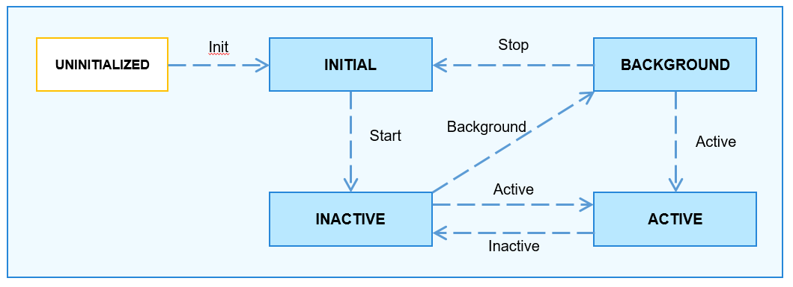

# 元能力组件<a name="ZH-CN_TOPIC_0000001062157546"></a>

-   [简介](#section11660541593)
-   [目录](#section1464106163817)
-   [使用说明](#section1954314201620)
-   [相关仓](#section93061357133720)

## 简介<a name="section11660541593"></a>

**元能力组件**，是OpenHarmony为开发者提供的一套开发鸿蒙应用的开发框架。元能力组件由如下模块组成：

**图1**  元能力组件框架图


-   **AbilityKit**是Ability框架提供给开发者的开发包，开发者基于该开发包可以开发出基于Ability组件的应用。基于Ability组件开发的应用有两种类型：基于Javascript语言开发的Ability（**JS Ability**）和基于C/C++语言开发的Ability（**Native Ability**）。**JS应用开发框架**是开发者开发JS Ability所用到框架，是在AbilityKit基础封装的包含JS UI组件的一套方便开发者能够迅速开发Ability应用的框架。
-   **Ability**是系统调度应用的最小单元，是能够完成一个独立功能的组件，一个应用可以包含一个或多个Ability。Ability分为两种类型：Page类型的Ability和Service类型的Ability
    -   **Page类型的Ability**：带有界面，为用户提供人机交互的能力。
    -   **Service类型的Ability**：不带界面，为用户提供后台任务机制。

-   **AbilitySlice**是单个页面及其控制逻辑的总和，是Page类型Ability特有的组件，一个Page类型的Ability可以包含多个AbilitySlice，此时，这些页面提供的业务能力应当是高度相关的。Page类型的Ability和AbilitySlice的关系如下图2所示：

**图2**  Ability与AbilitySlice的关系图


-   **生命周期**是Ability被调度到启动、激活、隐藏和退出等各个状态的的统称。Ability各生命周期流转如下图所示：

**图3**  Ability生命周期流转图



-   Ability生命周期各状态解析：
    -   **UNINITIALIZED**：未初始状态，为临时状态，Ability被创建后会由UNINITIALIZED状态进入INITIAL状态；

    -   **INITIAL**：初始化状态，也表示停止状态，表示当前Ability未运行，Ability被启动后由INITIAL态进入INACTIVE状态；

    -   **INACTIVE**：未激活状态，表示当前窗口已显示但是无焦点状态。

    -   **ACTIVE**：前台激活状态，表示当前窗口已显示，并获取焦点，Ability在退到后台之前先由ACTIVE状态进入INACTIVE状态；

    -   **BACKGROUND**: 后台状态，表示当前Ability退到后台，Ability在被销毁后由BACKGROUND状态进入INITIAL状态，或者重新被激活后由BACKGROUND状态进入ACTIVE状态。

-   **AbilityLoader**负责注册和加载开发者Ability的模块。开发者开发的Ability先要调用AbilityLoader的注册接口注册到框架中，接着Ability启动时会被实例化。
-   **AbilityManager**负责AbilityKit和Ability管理服务进行IPC的通信。
-   **EventHandler**是AbilityKit提供给开发者的用于在Ability中实现线程间通信的一个模块。
-   **Ability运行管理服务**是用于协调各Ability运行关系、及生命周期进行调度的系统服务。其中，**服务启动**模块负责Ability管理服务的启动、注册等。**服务接口管理模块**负责Ability管理服务对外能力的管理。**进程管理模块**负责Ability应用所在进程的启动和销毁、及其进程信息维护等功能。**Ability栈管理模块**负责维护各个Ability之间跳转的先后关系。**生命周期调度模块**是Ability管理服务根据系统当前的操作调度Ability进入相应的状态的模块。**连接管理模块**是Ability管理服务对Service类型Ability连接管理的模块。
-   **AppSpawn**是负责创建Ability应用所在进程的系统服务，该服务有较高的权限，为Ability应用设置相应的权限，并预加载一些通用的模块，加速应用的启动。

## 目录<a name="section1464106163817"></a>

```
/foundation/aafwk/aafwk_lite
     ├── frameworks
     │      ├── ability_lite               # AbilityKit实现的核心代码
     │      ├── abilitymgr_lite            # 管理AbilityKit与Ability管理服务通信的客户端代码
     │      └── want_lite                  # Ability之间交互的信息载体的实现代码
     ├── interfaces
     │      ├── kits
     │      │     ├── ability_lite        # AbilityKit为开发者提供的接口
     │      │     └── want_lite           # Ability之间交互的信息载体的对外接口
     │      └── innerkits
     │             └── abilitymgr_lite     # Ability管理服务为其它子系统提供的接口
     └── services
             └── abilitymgr_lite            # Ability管理服务的实现代码
```

## 使用说明<a name="section1954314201620"></a>

-   元能力运行管理服务为AbilityMs，服务运行于foudation进程中；
-   AbilityMs注册到sa\_manager中，sa\_manager运行于foundation进程中，sa\_manager为AbilityMs创建线程运行环境。具体创建AbilityMs服务的方式以及使用该服务的方式，可参考系统服务框架子系统；
-   系统启动后，AbilityMs会随系统启动而启动；

-   包安装完成后，通过如下命令（以hispark\_taurus为例，aa工具在系统构建后放置在out/hispark\_taurus/ipcamera\_hispark\_taurus/dev\_tools/bin下），运行Demo启动相应Ability：

```
./bin/aa start -p com.xxxxxx.hiability -n MainAbility
```

## 相关仓<a name="section93061357133720"></a>

[用户程序框架子系统](https://gitee.com/openharmony/docs/blob/master/zh-cn/readme/%E7%94%A8%E6%88%B7%E7%A8%8B%E5%BA%8F%E6%A1%86%E6%9E%B6%E5%AD%90%E7%B3%BB%E7%BB%9F.md)

**aafwk\_aafwk\_lite**

[appexecfwk\_appexecfwk\_lite](https://gitee.com/openharmony/appexecfwk_appexecfwk_lite/blob/master/README_zh.md)

