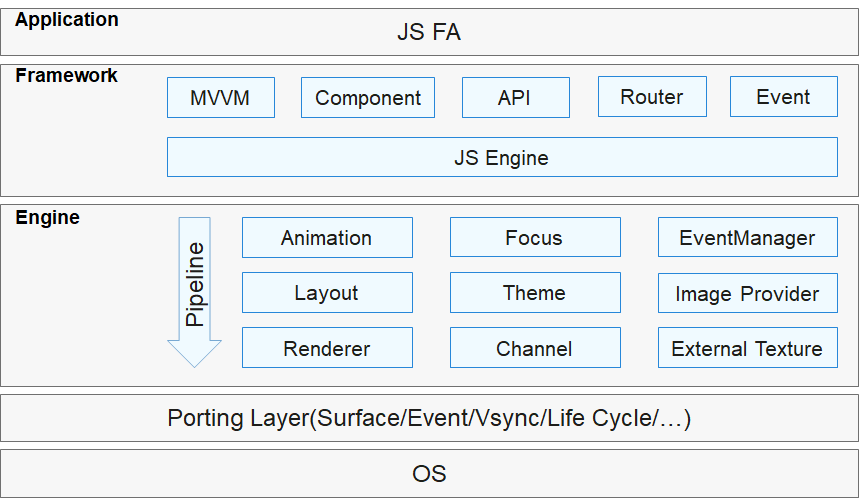

# JS UI框架组件<a name="ZH-CN_TOPIC_0000001076213364"></a>

-   [简介](#section15701932113019)
-   [目录](#section1791423143211)
-   [使用场景](#section171384529150)
-   [接口说明](#section271831717166)
-   [涉及仓](#section1447164910172)

## 简介<a name="section15701932113019"></a>

JS UI框架是OpenHarmony UI开发框架，提供基础类、容器类、画布类等UI组件和标准CSS动画能力，支持类Web范式编程。

-   **类Web范式编程**

    JS UI框架采用类HTML和CSS Web编程语言作为页面布局和页面样式的开发语言，页面业务逻辑则支持ECMAScript规范的JavaScript语言。JS UI框架提供的类Web编程范式，可以让开发者避免编写UI状态切换的代码，视图配置信息更加直观。


**图 1**  JS UI框架架构<a name="fig2606133765017"></a>  


JS UI框架包括应用层（Application）、前端框架层（Framework）、引擎层（Engine）和平台适配层（Porting Layer）。

-   **Application**

    应用层表示开发者使用JS UI框架开发的FA应用，这里的FA应用特指JS FA应用。

-   **Framework**

    前端框架层主要完成前端页面解析，以及提供MVVM（Model-View-ViewModel）开发模式、页面路由机制和自定义组件等能力。

-   **Engine**

    引擎层主要提供动画解析、DOM（Document Object Model）树构建、布局计算、渲染命令构建与绘制、事件管理等能力。

-   **Porting Layer**

    适配层主要完成对平台层进行抽象，提供抽象接口，可以对接到系统平台。比如：事件对接、渲染管线对接和系统生命周期对接等。


## 目录<a name="section1791423143211"></a>

JS UI开发框架源代码在/foundation/ace/ace\_engine下，目录结构如下图所示：

```
/foundation/ace/ace_engine
├── adapter                       # 平台适配目录
│   ├── common
│   └── ohos
├── frameworks                    # 框架代码
│   ├── base                      # 基础库
│   ├── bridge                    # 前后端组件对接层
│   └── core                      # 核心组件目录
```

## 使用场景<a name="section171384529150"></a>

JS UI框架提供了丰富的、功能强大的UI组件、样式定义，组件之间相互独立，随取随用，也可以在需求相同的地方重复使用。开发者还可以通过组件间合理的搭配定义满足业务需求的新组件，减少开发量。

## 接口说明<a name="section271831717166"></a>

**表 1**  组件介绍

<a name="table2347172925617"></a>
<table><thead align="left"><tr id="row5347429155610"><th class="cellrowborder" valign="top" width="28.64%" id="mcps1.2.3.1.1"><p id="p1347102910567"><a name="p1347102910567"></a><a name="p1347102910567"></a>组件类型</p>
</th>
<th class="cellrowborder" valign="top" width="71.36%" id="mcps1.2.3.1.2"><p id="p83475294565"><a name="p83475294565"></a><a name="p83475294565"></a>主要组件</p>
</th>
</tr>
</thead>
<tbody><tr id="row15347122918562"><td class="cellrowborder" valign="top" width="28.64%" headers="mcps1.2.3.1.1 "><p id="p679795614335"><a name="p679795614335"></a><a name="p679795614335"></a>基础组件</p>
</td>
<td class="cellrowborder" valign="top" width="71.36%" headers="mcps1.2.3.1.2 "><p id="p88813982011"><a name="p88813982011"></a><a name="p88813982011"></a>button、text、input、label、image、progress、rating、span、marquee、image-animator、divider、menu、chart、option、picker、picker-view、piece、qrcode、select、slider、switch、toolbar、toolbar-item、toggle</p>
</td>
</tr>
<tr id="row1973535793115"><td class="cellrowborder" valign="top" width="28.64%" headers="mcps1.2.3.1.1 "><p id="p8735195713313"><a name="p8735195713313"></a><a name="p8735195713313"></a>容器组件</p>
</td>
<td class="cellrowborder" valign="top" width="71.36%" headers="mcps1.2.3.1.2 "><p id="p1268024618208"><a name="p1268024618208"></a><a name="p1268024618208"></a>div、list、list-item、list-item-group、stack、swiper、tabs、tab-bar、tab-content、refresh、dialog、badge、panel、popup、stepper、stepper-item</p>
</td>
</tr>
<tr id="row1792218915320"><td class="cellrowborder" valign="top" width="28.64%" headers="mcps1.2.3.1.1 "><p id="p692289163220"><a name="p692289163220"></a><a name="p692289163220"></a>画布组件</p>
</td>
<td class="cellrowborder" valign="top" width="71.36%" headers="mcps1.2.3.1.2 "><p id="p199228910327"><a name="p199228910327"></a><a name="p199228910327"></a>canvas</p>
</td>
</tr>
<tr id="row837615526208"><td class="cellrowborder" valign="top" width="28.64%" headers="mcps1.2.3.1.1 "><p id="p4377752152016"><a name="p4377752152016"></a><a name="p4377752152016"></a>栅格组件</p>
</td>
<td class="cellrowborder" valign="top" width="71.36%" headers="mcps1.2.3.1.2 "><p id="p17377185222019"><a name="p17377185222019"></a><a name="p17377185222019"></a>grid-container、grid-row、grid-col</p>
</td>
</tr>
</tbody>
</table>

## 涉及仓<a name="section1447164910172"></a>

JS UI框架子系统

**ace\_ace\_engine**

ace\_engine\_lite

ace\_napi

