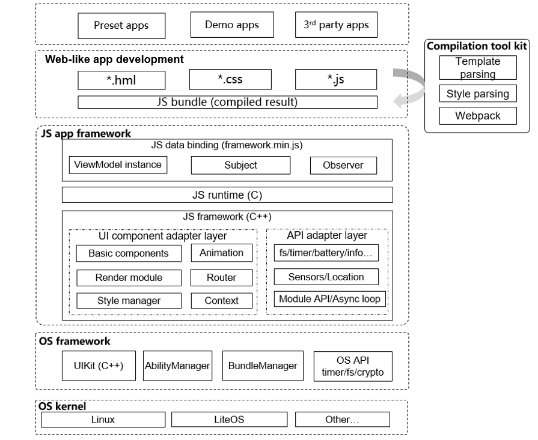

# JS UI Framework<a name="EN-US_TOPIC_0000001125689015"></a>

-   [Introduction](#section11660541593)
-   [Directory Structure](#section1464106163817)
-   [Available APIs](#section1096322014288)
-   [Usage](#section1529834174016)
-   [Repositories Involved](#section11683135113011)

## Introduction<a name="section11660541593"></a>

The JS UI framework is a set of JS-UI frameworks provided for you to develop OpenHarmony applications. The following figure shows the framework architecture.

**Figure  1**  Framework architecture<a name="fig11520531310"></a>



The JS UI framework consists of the JavaScript data binding framework, JavaScript runtime, and JavaScript framework.

-   **JavaScript data binding framework**

    Provides a set of basic data binding capabilities through JavaScript.


-   **JavaScript runtime**

    Supports parsing and execution of JavaScript code.


-   **JavaScript framework**

    Provides the framework mechanism of JavaScript APIs and components through the C++ language.


## Directory Structure<a name="section1464106163817"></a>

The source code of the framework is stored in  **/foundation/ace/ace\_engine\_lite**. The directory structure is as follows:

```
/foundation/ace/ace_engine_lite
├── frameworks         # Framework code
│   ├── common         # Common kits
│   ├── examples       # Sample code
│   ├── include        # Header files
│   ├── module_manager # JS module manager
│   ├── native_engine  # JS engine adapter
│   ├── packages       # JavaScript implementation
│   ├── src            # Source code
│   ├── targets        # Configuration files of target devices
│   └── tools          # Tool code
├── interfaces         # APIs exposed externally
│   └── innerkits      # Header files for internal subsystems
│       └── builtin    # JavaScript third-party module APIs exposed by the JS UI framework
└── test               # Test cases
```

## Available APIs<a name="section1096322014288"></a>

For details about the APIs, see the  [JS Application Development](https://device.harmonyos.com/en/docs/apiref/js-framework-file-0000000000616658).

## Usage<a name="section1529834174016"></a>

For details, go to the  **readme**  repository:

[https://gitee.com/openharmony/docs/blob/master/en/readme/js-ui-framework.md](https://gitee.com/openharmony/docs/blob/master/en/readme/js-ui-framework.md)

## Repositories Involved<a name="section11683135113011"></a>

ace\_engine\_lite

