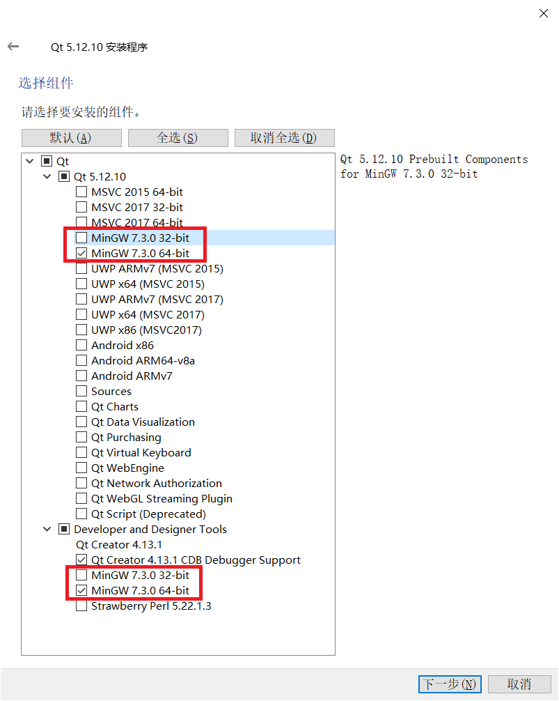

# 模拟器调试使用说明

## 1、环境安装说明

### 1、Qt Creator安装
   本工程基于QT Creator搭建，开发者使用前需要下载和安装QT Creator。

1. **程序下载**

   地址：https://www.qt.io/offline-installers ，安装程序较大，建议下载离线稳定版本。

2. **程序安装**

   双击下载的Qt安装程序，按引导界面完成安装即可。

  ```
  注意事项：
  1. 注册安装界面
     可选择注册账号进行安装，或者断网安装跳过注册界面。
  2. 选择组件界面。
     需勾选Qt x.x.x展开栏（这栏是为qt自动配置构建套件，如果漏选，开发者可后期在Qt控件中自行手动配置）和Developer and Designer Tools展开栏（这栏是编译器组件下载）都要勾选minGW组件（基于当前电脑操作系统选择32-bit还是64-bit）。
  ```



### 2、Git for windows安装

​		为能在windows环境下使用git命令，开发者需安装Git for windows。

1. **程序下载**

   地址：[Git for Windows](https://gitforwindows.org/)

2. **程序安装**

   双击下载的安装程序，按引导界面完成安装即可。

## 2、打开工程

### 场景一：JS应用打开方式：
1. **源码下载**
   建议在Linux下使用 repo 批量下载所涉及到的代码仓到windows盘符下，下载后在windows下打开工程。

   ```
   // 初始化 repo
   repo init -u https://gitee.com/openharmony/manifest.git -b master --no-repo-verify
   // sync 所有相关仓
   repo sync graphic_surface graphic_ui graphic_utils graphic_wms third_party_bounds_checking_function third_party_cJSON third_party_zlib third_party_freetype third_party_harfbuzz third_party_icu third_party_libjpeg third_party_libpng third_party_qrcodegen third_party_zlib utils_native_lite aafwk_aafwk_lite third_party_jerryscript ace_engine_lite global_resmgr_lite
   ```

2. **打开QT Creator**

3. **点击菜单：文件—>打开文件或项目**

   - 弹出的文件选择框中选择工程项目

   - 参考源码路径（请下载到windows本地，不要使用"\\\wsl$"路径映射）：

     [源码工程目录]\foundation\ace\ace_engine_lite\frameworks\tools\qt\simulator\simulator.pro。

     注意：第一次打开项目时，需要在Configure Project界面，kits列表中勾选minGW（仅勾选minGW）。

   - 点击configure project按钮加载工程。

4. **编译**

    依次点击：**构建—>编译项目**，或者直接在项目树中右键，在右键菜单中选择**重新构建**即可。

5. **调试**

    编译完成后，点击调试按钮即可运行调试。

6. **设置JS bundle路径**

    项目第一次启动时，由于未配置JS Bundle路径，无法正常显示应用，需要开发者手动配置路径，配置后再次启动时会根据已配置信息显示应用。

    配置方法：点击界面下方JS Bundle目录选择按钮，选择JS Bundle所在目录，然后点击Start按钮即可启动。

    备注：JS Bundle可通过下载DevEco Studio创建应用后编译生成（编译生成的JS Bundle路径：项目所在目录\entry\build\intermediates\res\debug\lite\assets\js\default），部分应用示例源码可从目录ace_engine_lite\frameworks\examples      
    获取。JS应用开发可参考文档  https://device.harmonyos.com/cn/docs/develop/demo/oem_camera_fa_des-0000001050065839。 

6. **备注**

  1、当前模拟器工程暂时只支持UI调试，不支持JS API，如果项目中使用了部分JS API，可能会导致应用无法正常显示。对JS API的支持会陆续增加完善，敬请期待。

### 场景二：C++ UI应用打开方式：

1. **源码下载**

   如果使用Windows调试，建议不要使用"\\wsl$"路径映射，下载到本地硬盘下。

   下面为拉取UI模拟器最小代码仓的git命令。

   ```
   git clone https://gitee.com/openharmony/graphic_ui.git                           -b   master  foundation/graphic/ui
   git clone https://gitee.com/openharmony/graphic_utils.git                        -b   master  foundation/graphic/utils
   git clone https://gitee.com/openharmony/third_party_zlib.git                     -b   master  third_party/zlib
   git clone https://gitee.com/openharmony/third_party_qrcodegen.git                -b   master  third_party/qrcodegen
   git clone https://gitee.com/openharmony/third_party_libpng.git                   -b   master  third_party/libpng
   git clone https://gitee.com/openharmony/third_party_libjpeg.git                  -b   master  third_party/libjpeg
   git clone https://gitee.com/openharmony/third_party_icu.git                      -b   master  third_party/icu
   git clone https://gitee.com/openharmony/third_party_harfbuzz.git                 -b   master  third_party/harfbuzz
   git clone https://gitee.com/openharmony/third_party_freetype.git                 -b   master  third_party/freetype
   git clone https://gitee.com/openharmony/third_party_bounds_checking_function.git -b   master  third_party/bounds_checking_function
   git clone https://gitee.com/openharmony/third_party_cJSON.git                    -b   master  third_party/cJSON
   ```

   1. 新建一个源码工程目录。
   2. 在新建目录按鼠标右键打开Git Bash Here，复制粘贴上面命令到终端回车等待下载。或者在当前目录新建一个clone.bat文件，将上面命令复制保存，双击运行clone.bat，等待下载完成。

2. **打开QT Creator**

3. **点击菜单：文件—>打开文件或项目**

   - 弹出的文件选择框中选择工程项目

   - 参考源码路径：

     [源码工程目录]\foundation\graphic\ui\tools\qt\simulator\simulator.pro
     
     注意：第一次打开项目时，需要在Configure Project界面，kits列表中勾选minGW（仅勾选minGW）。
     
   - 点击configure project按钮加载工程。

4. **UI Test应用运行入口**

   - 展开项目树

   ```
   simulator
     |-UITest
       |-Sources
         |-main.cpp
   ```

5. **编译**

    依次点击：**构建—>编译项目**，或者直接在项目树中右键，在右键菜单中选择**重新构建**即可。

6. **调试**

    编译完成后，点击调试按钮即可运行调试。
