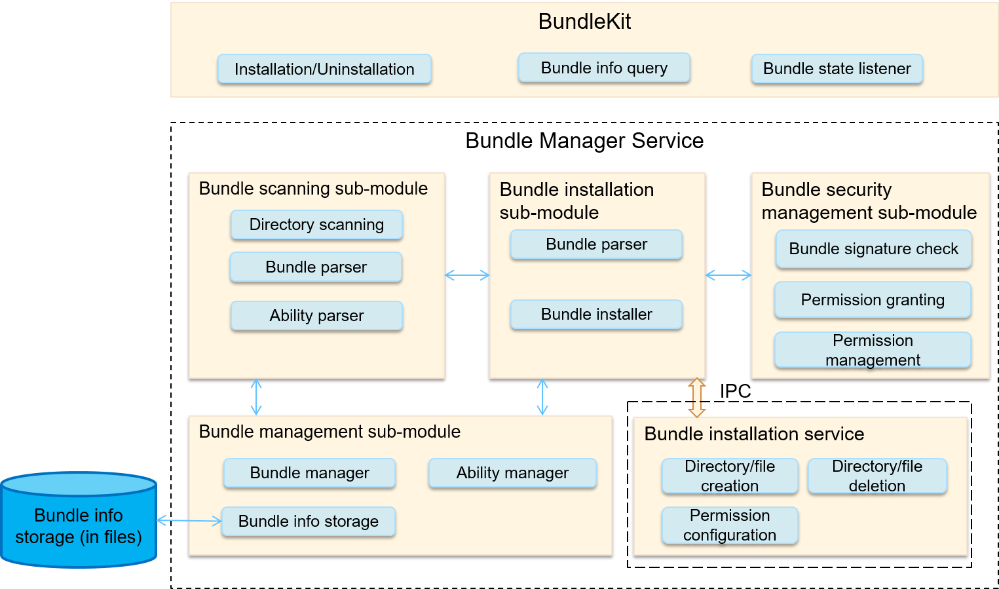

# Bundle Management Framework<a name="EN-US_TOPIC_0000001061838370"></a>

-   [Introduction](#section11660541593)
-   [Directory Structure](#section1464106163817)
-   [Repositories Involved](#section93061357133720)

## Introduction<a name="section11660541593"></a>

The bundle management framework is provided by OpenHarmony for you to manage application bundles \(installation packages\). The following figure shows the architecture of the bundle management framework.

**Figure  1**  Bundle management framework architecture<a name="fig1047932418305"></a>  


-   **BundleKit**  includes external APIs provided by the Bundle Manager Service, including the APIs for application installation and uninstallation, bundle information query, and bundle state change listeners.
-   The  **bundle scanning sub-module**  parses pre-installed or installed bundles on the local device and extracts information from them for the bundle management sub-module to manage and make the information persistent for storage.

-   The  **bundle installation sub-module**  installs, uninstalls, and updates a bundle.
-   The  **bundle installation service**  is an independent process used to create or delete installation directories and has high permissions.

-   The  **bundle management sub-module**  manages information related to application bundles and stores persistent bundle information.

-   The  **bundle security management sub-module**  verifies signatures, and grants and manages permissions.

## Directory Structure<a name="section1464106163817"></a>

```
/foundation/appexecfwk/appexecfwk_lite
     ├── frameworks
     │      └── bundle_lite                # Client code used for communication between the BundleKit and Bundle Manager Service
     ├── interfaces
     │      ├── kits
     │      │     └── bundle_lite         # BundleKit APIs exposed externally
     │      └── innerkits
     │             └── bundlemgr_lite      # Core implementation code of BundleKit and internal APIs provided by the Bundle Manager Service for other subsystems
     ├── services
     │      └── bundlemgr_lite             # Implementation code of the Bundle Manager Service
     └── utils
             └── bundle_lite                # Utility code used during the implementation of the Bundle Manager Service
```

-   The Bundle Manager Service is running in the foundation process.
-   The Bundle Manager Service is registered with  **sa\_manager**.  **sa\_manager**  runs in the foundation process and sets up a thread runtime environment for the service. For details about how to create and use the Bundle Manager Service, see  [SA Framework](en-us_topic_0000001051589563.md).
-   The Bundle Manager Service starts upon OS startup.
-   You can use the bm tool to install the specified HAP. \(Taking  **hispark\_taurus**  as an example, you can obtain the bm tool from the  **out/hispark\_taurus/ipcamera\_hispark\_taurus/dev\_tools/bin directory**  after the version building.\) 

```
./bin/bm install -p /nfs/xxxx.hap
```

## Repositories Involved<a name="section93061357133720"></a>

[Application framework](https://gitee.com/openharmony/docs/blob/master/en/readme/application-framework.md)

[aafwk\_aafwk\_lite](https://gitee.com/openharmony/aafwk_aafwk_lite/blob/master/README.md)

**appexecfwk\_appexecfwk\_lite**

