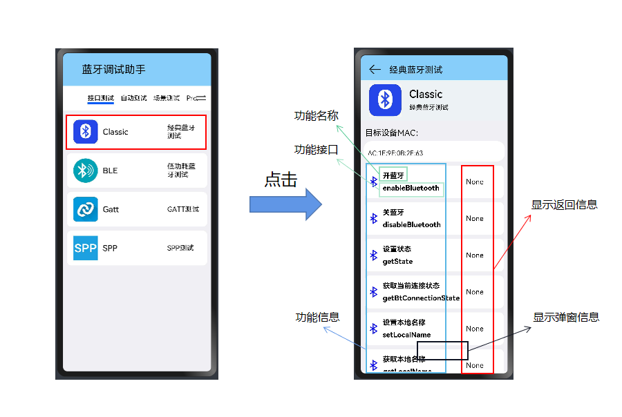

## 经典蓝牙使用说明文档

​		本文档主要介绍蓝牙专项测试程序的经典蓝牙部分的功能使用说明。

#### 从主界面跳转到经典蓝牙部分

---

#### 经典蓝牙的主要接口

|      method名称       |         API名称         |              所需参数              |    返回值     | 备注 |
| :-------------------: | :---------------------: | :--------------------------------: | :-----------: | :--: |
|        开蓝牙         |     enableBluetooth     |                 ()                 |    boolean    |      |
|        关蓝牙         |    disableBluetooth     |                 ()                 |    boolean    |      |
|       获取状态        |        getState         |                 ()                 |    number     |      |
|   获取当前连接状态    |  getBtConnectionState   |                 ()                 |    string     |      |
|     设置本地名称      |      setLocalName       |                 ()                 |    string     |      |
|     获取本地名称      |      getLocalName       |           (name: string)           |    boolean    |      |
|     设置扫描模式      |  setBluetoothScanMode   | (mode: ScanMode, duration: number) |    boolean    |      |
|     获取扫描模式      |  getBluetoothScanMode   |                 ()                 |    string     |      |
|     开始蓝牙发现      | startBluetoothDiscovery |                 ()                 |    boolean    |      |
|     停止蓝牙发现      | stopBluetoothDiscovery  |                 ()                 |    boolean    |      |
|       配对设备        |       pairDevice        |         (deviceId: string)         |    boolean    |      |
|     取消配对设备      |      unpairDevice       |         (deviceId: string          |    boolean    |      |
|   获取远程设备名称    |      getDeviceName      |         (deviceId: string)         |    string     |      |
|   获取远程设备类型    |      getDeviceType      |         (deviceId: string)         |    string     |      |
|     获取配对设备      |   getPairedDeviceIds    |                 ()                 | Array<string> |      |
| 获取配置文件联系状态1 |   getProfileConnState   |       (profileId: ProfileId)       |    string     |      |
| 获取配置文件联系状态2 |     getDeviceState      | (profileId:number,deviceId:string) |     Array     |      |
|     注册状态变化      |     on.stateChange      |  (data: bluetooth.BluetoothState)  |    string     |      |
|     注册pin码变化     |     on.pinRequired      | (data: bluetooth.PinRequiredParam) |    string     |      |
|   注册绑定状态变化    |   on.bondStateChange    |  (data: bluetooth.BondStateParam)  |    string     |      |

#### 验证工具

经典蓝牙的功能 可以使用linux的bluetoothctl命令

1. bluetooth

>**bluetoothctl** — 在 shell 中配对设备是最简单可靠的方法之一。
>
>Bluetoothctl是用于控制蓝牙设备的交互式且易于使用的工具。它是在基于Linux的操作系统上管理蓝牙的主要实用程序。实质上是由bluez源码下的client目录的相关文件编译生成的可执行程序(命令)。bluetoothctl 主要是bluez官方提供的一个命令行交互的一个客户端，用于和bluetooth的通信进行BLE广播包的设置、BLE相关配置、创建服务、特征等. 具体的功能请打开终端，运行bluetoothctl 进行查看。

2. 启动bluetoothctl交互式命令：

> bluetoothctl是一个交互式实用程序。通常应该使用交互式模式，操作起来更快，更容易。要进入交互方式，只需运行不带参数的**bluetoothctl**命令，要退出蓝牙交互模式，只需在提示中键入**exit** 。

$ bluetoothctl

3. help

- 输入help命令以获取可用命令的列表

~~~
[bluetooth]# help
Menu main:
Available commands:
//命令                                             //命令功能的解释    
-------------------
advertise                                         Advertise Options Submenu
scan                                              Scan Options Submenu
gatt                                              Generic Attribute Submenu
list                                              List available controllers
show [ctrl]                                       Controller information
select <ctrl>                                     Select default controller
devices                                           List available devices
paired-devices                                    List paired devices
system-alias <name>                               Set controller alias
reset-alias                                       Reset controller alias
power <on/off>                                    Set controller power
pairable <on/off>                                 Set controller pairable mode
discoverable <on/off>                             Set controller discoverable mode
discoverable-timeout [value]                      Set discoverable timeout
agent <on/off/capability>                         Enable/disable agent with given capability
default-agent                                     Set agent as the default one
advertise <on/off/type>                           Enable/disable advertising with given type
set-alias <alias>                                 Set device alias
scan <on/off>                                     Scan for devices
info [dev]                                        Device information
pair [dev]                                        Pair with device
trust [dev]                                       Trust device
untrust [dev]                                     Untrust device
block [dev]                                       Block device
unblock [dev]                                     Unblock device
remove <dev>                                      Remove device
connect <dev>                                     Connect device
disconnect [dev]                                  Disconnect device
menu <name>                                       Select submenu
version                                           Display version
quit                                              Quit program
exit                                              Quit program
help                                              Display help about this program
export                                            Print environment variables
~~~

#### 功能

1. 开/关蓝牙

   **"蓝牙打开"是其他功能测试的前提**

   - 使用指导：点击后，在设备上启动/关闭蓝牙；根据设备的蓝牙情况，显示返回信息。
   
   - 限制条件：
     - 若蓝牙未开，点击"开蓝牙"，显示信息为"true"；
     - 若蓝牙未开，点击"开蓝牙"，发生错误，显示信息为"false"
     - 若蓝牙已打开，点击"开蓝牙"，显示信息为"蓝牙已经使能";
     - 若蓝牙已打开，点击"关蓝牙"，显示结果为"true"
     - 若蓝牙未打开，点击"关蓝牙"，显示结果为"false"
   
   - 验证方法：可在设备的设置中查看蓝牙的开关情况

2. 获取状态

   - 使用指导：点击后，基于蓝牙的开关状态，判断蓝牙当时的状态。
   - 限制条件：
     - 若本地蓝牙已关闭，返回值为0，显示信息为"STATE_OFF"；
     - 若本地蓝牙正在打开，返回值为1，显示信息为"STATE_TURNING_ON"；
     - 若本地蓝牙已打开，返回值为2，显示信息为"STATE_ON"；
     - 若本地蓝牙正在关闭，返回值为3，显示信息为"STATE_TURNING_OFF"；
     - 若本地蓝牙正在打开LE模式，返回值为4，显示信息为"STATE_BLE_TURNING_ON"；
     - 若本地蓝牙处于仅LE模式，返回值为5，显示信息为"STATE_BLE_ON"；
     - 若本地蓝牙正在关闭仅LE模式，返回值为6，显示信息为"STATE_BLE_TURNING_OFF"。
   - 验证方法：可在设备设置中查看蓝牙的当前状态

3. 获取当前连接状态

   - 使用指导：点击后，基于设备蓝牙的连接情况，判断蓝牙的连接状态。

   - 限制条件：
     - 若本地蓝牙未连接，返回值为0，显示信息为"STATE_DISCONNECTED"
     - 若本地蓝牙正在连接，返回值为1，显示信息为"STATE_CONNECTING"
     - 若本地蓝牙已连接，返回值为2，显示信息为"STATE_CONNECTED"
     - 若本地蓝牙正在断开连接，返回值为3，显示信息为"STATE_DISCONNECTING"

   - 验证方法：可在设备设置中查看蓝牙的连接情况

4. 设置本地名称---->获取本地名称

   - 使用指导：点击"设置本地名称"后，会弹出弹窗，可以设置本地蓝牙名称，也可以保持默认值不变。点击"获取本地名称"，会在信息显示处显示本地当前蓝牙名称。

   - 限制条件：若更改了本地名称，获取时会显示修改后的名称；如果未修改，会直接显示默认名称。

   - 验证方法：可在设备设置中查看本设备蓝牙名称；或是让其他蓝牙设备搜索发现本地设备蓝牙。

5. 设置扫描模式---->获取扫描模式

   - 使用指导：点击"设置扫描模式"后，会弹出弹窗，可以选择本地蓝牙扫描模式，设置延迟时间，也可以保持默认选项不变。点击"获取扫描模式"，会在信息显示处显示本地当前蓝牙扫描模式和延迟时间。

   - 限制条件：扫描模式共五种（保持默认选项:第四个 即可）
     - SCAN_MODE_CONNECTABLE（扫描模式可连接） 
     - SCAN_MODE_GENERAL_DISCOVERABLE（扫描模式通用可发现）
     - SCAN_MODE_LIMITED_DISCOVERABLE（扫描模式受限可发现）
     - **SCAN_MODE_CONNECTABLE_GENERAL_DISCOVERABLE（扫描模式可连接通用可发现）**
     - SCAN_MODE_CONNECTABLE_LIMITED_DISCOVERABLE（扫描模式可连接受限可发现）

   - 验证方法：选择不同的扫描模式，用其他蓝牙设备进行连接、发现来验证是否可被连接，发现与受限。

6. 开始蓝牙发现--->停止蓝牙发现

   - 使用指导：点击后，可以开始/停止蓝牙的搜索发现。
     - 点击"开始蓝牙发现"，进行跳转页面，会显示已发现的可配对设备和已配对设备。
     - 配对列表中会显示设备的名称，MAC地址和配对状态（0：未配对，1：配对中。2：配对成功）。
     - 点击可配对设备列表中的设备进行配对，配对成功后会显示在已配对设备的列表中。
     - 点击已配对设备列表中的取消按钮，可以取消该设备的配对。

   - 限制条件：蓝牙必须打开。

   - 验证方法：蓝牙是否可以正常发现与配对；在设备设置中查看已发现与已配对的设备。

7. 配对设备--->取消配对设备

   - 使用指导：
     - "配对设备"：显示当前配对结果，结果为成功或失败。
     - "取消配对设备"：取消当前的配对。

   - 限制条件：只有配对成功后，"配对设备"的返回信息才会显示"成功"，才能成功取消配对设备。

   - 验证方法：在设备设置中查看设备配对与否。

8. 获取远程设备名称/类型

   - 使用指导：点击后，可以获取当前配对设备的名称和设备类型，并在对应功能的返回信息处显示。

   - 限制条件：必须要与设备配对成功，才能显示配对设备的名称与类型。

   - 验证方法：在设备设置中查看配对设备的名称和类型。

9. 获取配对设备

   - 使用指导：点击后，可以获取当前配对设备的MAC地址。

   - 限制条件：必须要与设备配对成功，才能显示配对设备的MAC地址。

   - 验证方法：在"开始蓝牙发现"功能中查看配对设备的MAC地址；用其他工具，如bluetoothctl查看配对设备的MAC地址。                                                            

10. 获取配置文件连接状态1、获取配置文件连接状态2 

   - 使用指导：
     - 点击"获取配置文件连接状态1"，可获取到配置文件的连接状态。

     - 点击"获取配置文件连接状态2"，可获取设备的配置文件状态。

     - 调用的方法不同，状态结果选项与"获取当前连接状态"的状态选项一样，同为四个。

   - 限制条件：需要进行连接配对。

   - 验证方法：查看连接profile的状态。

11. 注册状态变化  / 注册pin码变化 / 注册绑定变化

    - 使用指导：都为回调函数，用来监听相关类型事件的变化，并弹窗显示信息。

      > 注册状态变化：
      >
      > - 订阅蓝牙状态更改时报告的事件。
      >
      > - type为要侦听的Bluetooth状态更改事件的类型。
      >
      >
      > - callback回调用于侦听Bluetooth状态事件。
      >
      > 注册pin码变化：
      >
      > - 订阅来自远程蓝牙设备的配对请求事件。
      > - type要侦听的配对请求事件的类型。
      > - callback回调用于侦听配对请求事件。
      >
      > 注册绑定变化：
      >
      > - 订阅绑定远程蓝牙设备时报告的事件。
      > - type为要侦听的绑定状态事件的类型。
      > - callback回调用于侦听绑定状态事件。
    
    - 限制条件：需要在相关类型事件发生改变前，开启监听。
    
    - 验证方法：在事件变化后，查看是否有弹窗信息显示。

