## 性能测试部分

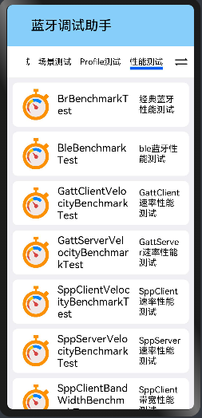

#### 性能测试界面

1. 经典蓝牙发现测试界面

   速率测试：(测试一次，以求出蓝牙的发现时间)

   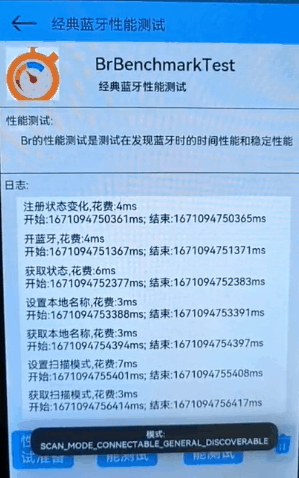

   

   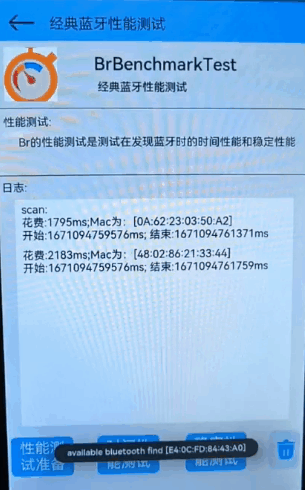

   稳定性测试：(设定为循环测试十次，以求平均的蓝牙发现时间)

   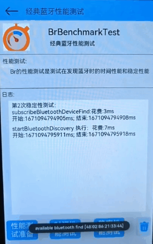

   

2. BLE蓝牙发现测试界面

   速率测试：(测试一次，以求出BLE蓝牙的发现时间)

   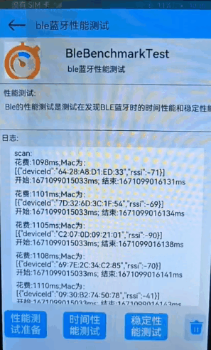

   

   稳定性测试：(设定为循环测试十次，以求平均的BLE蓝牙发现时间)

   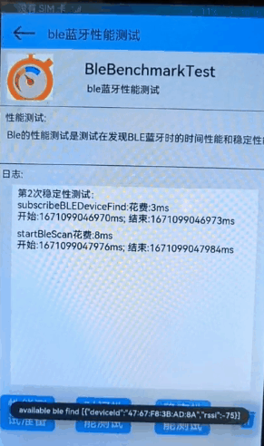

   

**Gatt和Spp测试前需要先配对**

3. Gatt速率测试界面

   测试Gatt两端的收发信息变化的速率

   Server端：

   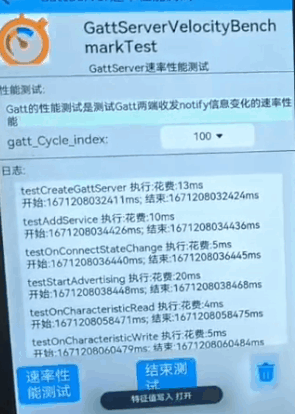

   Client端：

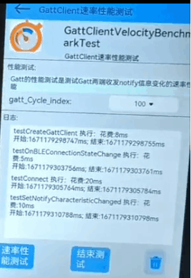

因为softbus的拦截原因，Spp无法正常连接，故将softBus的SppServerAccept部分代码屏蔽掉。

~~~
路径为：foundation/communication/bluetooth/frameworks/inner/c_adapter/ohos_bt_spp.cpp
~~~

4. Spp速率测试界面

   测试Spp两端的收发信息的速率，循环100次，以求平均值

   连接阶段：

   - Client端：

   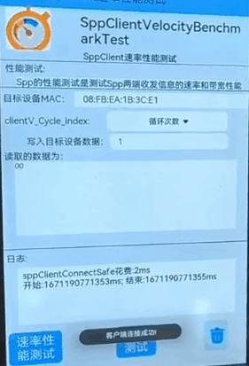

   - Server端：

   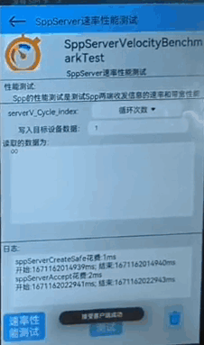

   写入读取阶段：

   - Client端：

   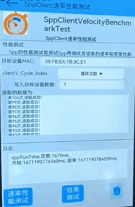

   Server端：

   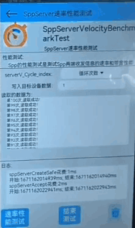

5. Spp带宽测试界面

   测试Spp两端的收发信息的带宽，信息字节较大，以求发送的带宽大小。

   Client端：

   

   Server端：

   