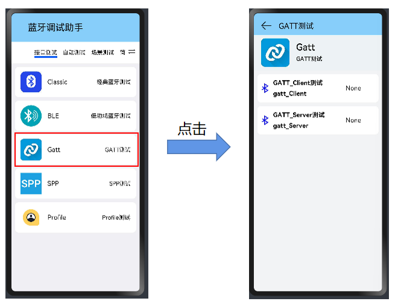
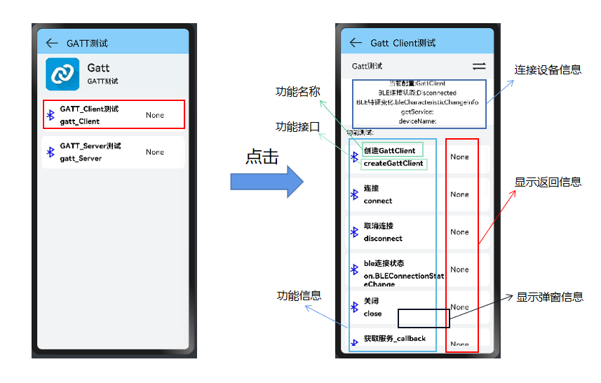
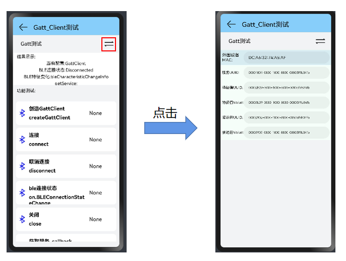
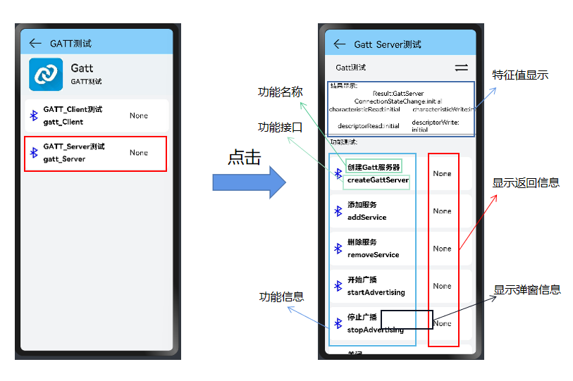
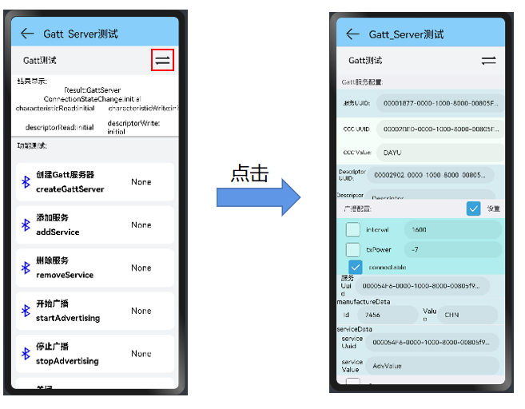

## Gatt测试

### 从主界面跳转到Gatt蓝牙部分

Gatt测试分为Client测试和Server测试

### 验证工具

1. 使用bluez提供的gatttool命令，此命令是一个gatt client命令行工具。
2. APP: 苹果手机上的lightblue，安卓手机上的nRF Connect。

### Gatt客户端

先选择Gatt_Client测试，进行Gatt客户端的测试

点击"switch"图标，可以在setting界面修改MAC地址, ServerUUID, characteristicUuid, descriptorUuid的值。已经设置了默认值。

>Gatt_ClientSetting中参数有：
>
>​	外围设备MAC
>
>​	服务UUID
>
>​	特征值UUID，特征值Value
>
>​	描述符UUID，描述符Value
>

#### GattClient的主要接口

|      method名称       |              API名称              |                           所需参数                           |           返回值            | 备注 |
| :-------------------: | :-------------------------------: | :----------------------------------------------------------: | :-------------------------: | :--: |
|    创建GattClient     |         createGattClient          |                      (deviceId: string)                      |      GattClientDevice       |      |
|         连接          |              connect              |                              ()                              |           boolean           |      |
|       取消连接        |            disconnect             |                              ()                              |           boolean           |      |
|      ble连接状态      |   on.BLEConnectionStatecChange    | (type: "BLEConnectionStateChange", callback: Callback<BLEConnectChangedState>) |            void             |      |
|         关闭          |               close               |                              ()                              |           boolean           |      |
|   获取服务_callback   |       getServices(callback)       |        (callback: AsyncCallback<Array<GattService>>)         |            void             |      |
|   获取服务_promise    |        getServices(pomise)        |                              ()                              | Promise<Array<GattService>> |      |
|  读取特征值_callback  | readCharacteristicValue(callback) | (characteristic: BLECharacteristic, callback: AsyncCallback<BLECharacteristic>) |            void             |      |
|  读取特征值_promise   |  readCharacteristicValue(pomise)  |             (characteristic: BLECharacteristic)              | Promise<BLECharacteristic>  |      |
| 读取描述符值_callback |  readDescripitorValue(callback)   | (descriptor: BLEDescriptor, callback: AsyncCallback<BLEDescriptor>) |            void             |      |
| 读取描述符值_promise  |   readDescripitorValue(promise)   |                 (descriptor: BLEDescriptor)                  |   Promise<BLEDescriptor>    |      |
|      写入特征值       |     writeCharacteristicValue      |             (characteristic: BLECharacteristic)              |           boolean           |      |
|     写入描述符值      |       writeDescripitorValue       |                 (descriptor: BLEDescriptor)                  |           boolean           |      |
|     BLE特征值变化     |    on.BLECharacteristicChange     | (type: "BLECharacteristicChange", callback: Callback<BLECharacteristic>) |            void             |      |
|    设定BLEMtu尺寸     |           setBLEMtuSize           |                        (mtu: number)                         |           boolean           |      |
|   设置通知特性更改    |   setNotifyCharateristicChanged   |     (characteristic: BLECharacteristic, enable: boolean)     |           boolean           |      |
| 获取设备名称_callback |      getDeviceName(callback)      |              (callback: AsyncCallback<string>)               |            void             |      |
| 获取设备名称_promise  |      getDeviceName(promise)       |                              ()                              |       Promise<string>       |      |
|  获取Rssi值_callback  |      getRssiValue(callback)       |              (callback: AsyncCallback<number>)               |            void             |      |
|  获取Rssi值_promise   |       getRssiValue(promise)       |                              ()                              |       Promise<number>       |      |

#### Gatt_Client测试功能

**"蓝牙打开"是其他功能测试的前提**

1. 创造GattClient

   - 使用指导：点击"创造GattClient"后，创建了一个JavaScript网关客户端设备实例。
   - 限制条件：蓝牙状态要打开，且GattClient不存在实例，并且会判断是否输入了MAC地址和MAC地址长度正确与否。
   - 验证方法：尝试可以去连接GattServer端的设备。

2. 连接/取消连接

   - 使用指导：

     > 连接：连接到BLE外围设备。如果连接进程启动，返回信息为true；否则返回false。
     >
     > 订阅“BLEConnectionStateChange”事件（即"ble连接状态"）可以返回连接状态。
     >
     > 取消连接：断开或停止与BLE外围设备的持续连接。如果断开连接过程开始，返回信息为true；否则返回false。
     >

   - 限制条件：只有蓝牙打开且连接成功后，"连接"的返回信息才会显示"成功"，才能成功取消连接设备。

   - 验证方法：在设备设置或gatttool或APP上查看连接状态

3. ble连接状态

   - 使用指导：为回调函数，用来监听相关类型事件的变化，并弹窗显示信息。

     > - 订阅客户端连接状态更改事件。
     > - type为要侦听的连接状态更改事件的类型。
     > - callback回调用于侦听连接状态更改事件

   - 限制条件：需要在相关类型事件发生改变前，开启监听。且需要蓝牙打开，gatt客户端实例存在。

   - 验证方法：在事件变化后，查看是否有弹窗信息显示。

4. 关闭

   - 使用指导：禁用BLE外围设备
   - 限制条件：创立了Gatt客户端实例后，此方法注销设备并清除已注册的callback和handle
   - 验证方法：无法连接server端。

5. 获取服务_callback/promise

   - 使用指导：点击后，开始发现服务。返回的信息为BLE外围设备的服务GattService列表。
   - 限制条件：Gatt客户端实例存在，连接设备的code不为0，ServerUUid正确。
   - 验证方法：查看返回信息与连接的服务是否相同。

6. 读取特征值_callback/promise

   - 使用指导：点击后，读取BLE外围设备的特性。characteristic表示要读取的特征
   - 限制条件：Gatt客户端实例存在，连接设备的errcode为0，特征值UUid正确。
   - 验证方法：查看返回信息与连接的特征值是否相同。

7. 读取描述符值_callback/promise

   - 使用指导：点击后，读取BLE外围设备的描述符。descriptor指示要读取的描述符。
   - 限制条件：Gatt客户端实例存在，连接设备的errcode为0，描述符UUid正确。
   - 验证方法：查看返回信息与连接的描述符值是否相同。

8. 写入特征值

   - 使用指导：写入BLE外围设备的特性。characteristic表示要写入的特征。如果成功写入特征，返回true；否则返回false。
   - 限制条件：Gatt客户端实例存在，有写入的特征值。
   - 验证方法：用验证程序查看写入的特征值。

9. 写入描述符值

   - 使用指导：写入BLE外围设备的描述符。descriptor指示要写入的描述符。如果描述符写入成功，返回true；否则返回false。
   - 限制条件：Gatt客户端实例存在，有写入的描述符值。
   - 验证方法：用验证程序查看写入的描述符值。

10. BLE特征值变化

    - 使用指导：为回调函数，用来监听相关类型事件的变化，并弹窗显示信息。

      >订阅特征值更改事件。
      >
      >type为要侦听的特征值更改事件的类型。
      >
      >callback回调用于侦听特征值更改事件。

    - 限制条件：需要在相关类型事件发生改变前，开启监听。

    - 验证方法：在事件变化后，查看是否有弹窗信息显示。

11. 设定BLEMtu尺寸

    - 使用指导：设置BLE外围设备的mtu大小。mtu最大传输单位。如果设置mtu成功，返回信息为true；否则返回false。
    - 限制条件：蓝牙需要打开，Gatt客户端实例存在。
    - 验证方法：查看显示结果。

12. 设置通知特性更改

    - 使用指导：启用或禁用值更改时的特征通知。enable指定是否启用特征通知。值为true时表示通知已启用，值为false时表示通知已禁用。如果特性通知被启用，返回true；否则返回false。
    - 限制条件：蓝牙需要打开，Gatt客户端实例存在，且需要传入UUid值
    - 验证方法：查看特征值的变化

13. 获取设备名称_callback/promise

    - 使用指导：获取BLE外围设备的名称。如果获得，返回名称的字符串表示形式；如果无法获取名称或名称不存在，则返回null。
    - 限制条件：Gatt客户端实例存在，传入的Name值要正确。
    - 验证方法：查看显示的结果。

14. 获取Rssi值_callback/promise

    - 使用指导：获取此BLE外围设备的RSSI值。return返回RSSI值。
    - 限制条件：Gatt客户端实例存在，传入的Rssi值要正确。
    - 验证方法：查看显示的结果。

---

### Gatt服务器

点击"switch"图标，同样可以在setting界面修改MAC地址,ServerUUID,characteristicUuid,descriptorUuid的值。并且可以设置广播配置。默认值已经设置好，默认"设置"和"connectable"为已勾选的true，其他为false，如果测试时需要，可以手动设置"interval","txPower","Response"

#### GattServer中的主要接口

|   method名称   |        API名称         |                           所需参数                           |   返回值   | 备注 |
| :------------: | :--------------------: | :----------------------------------------------------------: | :--------: | :--: |
| 创建Gatt服务器 |    createGattServer    |                              ()                              | GattServer |      |
|    添加服务    |       addService       |                    (service: GattService)                    |  boolean   |      |
|    删除服务    |     removeService      |                    (serviceUuid: string)                     |  boolean   |      |
|    开始广播    |    startAdvertising    | (setting: AdvertiseSetting, advData: AdvertiseData, advResponse?: AdvertiseData) |    void    |      |
|    停止广播    |    stopAdvertising     |                              ()                              |    void    |      |
|      关闭      |         close          |                              ()                              |    void    |      |
|    连接状态    | on.connectStateChange  | (type: "connectStateChange", callback: Callback<BLEConnectChangedState>) |    void    |      |
|   读取特征值   | on.characteristicRead  | (type: "characteristicRead", callback: Callback<CharacteristicReadReq>) |    void    |      |
|   写入特征值   | on.characteristicWrite | (type: "characteristicWrite", callback: Callback<CharacteristicWriteReq>) |    void    |      |
|   读取描述符   |   on.descriptorRead    | (type: "descriptorRead", callback: Callback<DescriptorReadReq>) |    void    |      |
|   写入描述符   |   on.descriptorWrite   | (type: "descriptorWrite", callback: Callback<DescriptorWriteReq>) |    void    |      |
|                |                        |                                                              |            |      |

#### Gatt_Server测试功能

1. 创建Gatt服务器

   - 使用指导：创建JavaScript网关服务器实例。return返回JavaScript网关服务器实例{@code网关服务器。
   - 限制条件：蓝牙状态要打开，且GattServer不存在实例。
   - 验证方法：尝试可以去搜索本设备的GattServer端。

2. 添加/删除服务

   - 使用指导：

     >添加服务：
     >
     >- 添加要承载的指定服务，添加的服务及其特性由本地设备提供。
     >
     >- service表示要添加的服务。
     >
     >- 如果添加了服务，返回 true；否则返回 false。
     >
     >删除服务：
     >
     >- 从该设备提供的GATT服务列表中删除指定的服务。
     >
     >- serviceUuid表示要删除的服务的UUID。
     >
     >- 如果服务被删除，返回 true；否则返回 false。

   - 限制条件：Gatt服务端实例要存在，并且要传入UUid和value的值。

   - 验证方法：使用验证程序查看服务是否添加/删除成功。

3. 开始/停止广播

   - 使用指导：

     >添加服务：
     >
     >- 启动BLE广播。
     >- setting指示BLE广播的设置。如果需要使用默认值，将此参数设置为null。
     >- advData表示广播数据。advResponse表示与广播数据关联的扫描响应。
     >
     >删除服务：停止BLE广播。

   - 限制条件：配置页面中勾选了"√"，并传入了正确的配置信息。

   - 验证方法：查看显示信息，使用client端设备去尝试搜索广播。

4. 关闭

   - 使用指导：关闭此{GattServer}对象并注销其回调。
   - 限制条件：Server端存在，才可以关闭。
   - 验证方法：无法搜索到本设备的Server端。

5. 连接状态

   - 使用指导：为回调函数，用来监听相关类型事件的变化，并弹窗显示信息。

     > 订阅服务器连接状态更改事件。
     >
     > type为要侦听的连接状态更改事件的类型。
     >
     > callback回调用于侦听连接状态更改事件。

   - 限制条件：需要在相关类型事件发生改变前，开启监听。

   - 验证方法：在事件变化后，查看是否有弹窗信息显示。

6. 读取/写入特征值

   - 使用指导：为回调函数，用来监听相关类型事件的变化，并弹窗显示信息。

     >读取特征值：
     >
     >- 订阅特征读取事件。
     >- type为要侦听的特征读取事件的类型。
     >- callback回调用于侦听特征读取事件。
     >
     >读取特征值：
     >
     >- 订阅特征写入事件。
     >- type为要侦听的特征写入事件的类型。
     >- callback回调用于侦听特征写入事件。

   - 限制条件：需要在相关类型事件发生改变前，开启监听。

   - 验证方法：在事件变化后，查看是否有弹窗信息显示。

7. 读取/写入描述符

   - 使用指导：为回调函数，用来监听相关类型事件的变化，并弹窗显示信息。

     >读取描述符值：
     >
     >- 订阅描述符写入事件。
     >- type为要侦听的描述符写入事件的类型。
     >- callback为回调用于侦听描述符写入事件。
     >
     >写入描述符值：
     >
     >- 订阅描述符读取事件。
     >- type为要侦听的描述符读取事件的类型。
     >- callback回调用于侦听描述符读取事件。

   - 限制条件：需要在相关类型事件发生改变前，开启监听。

   - 验证方法：在事件变化后，查看是否有弹窗信息显示。
