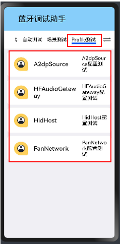
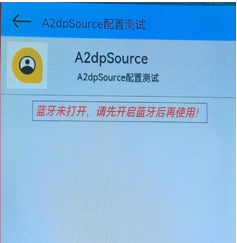
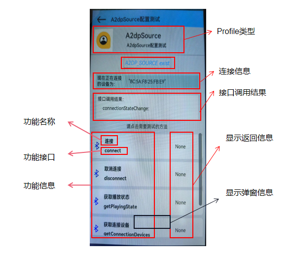
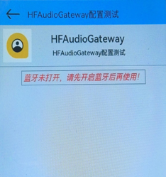
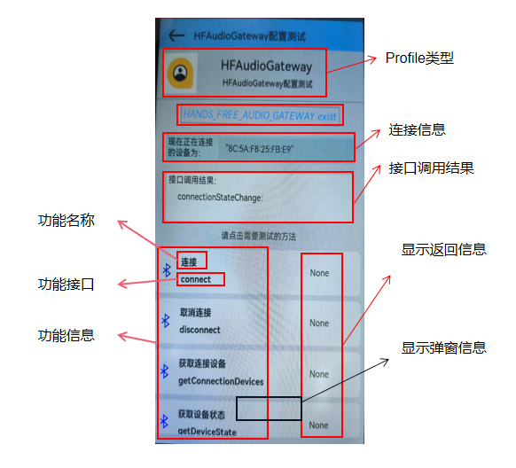
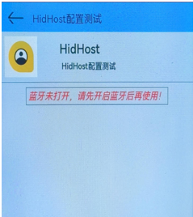
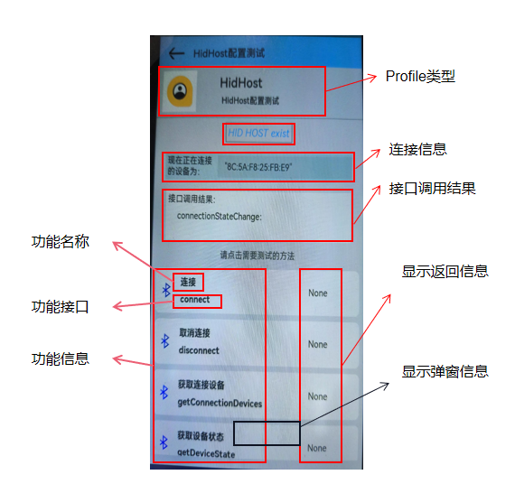
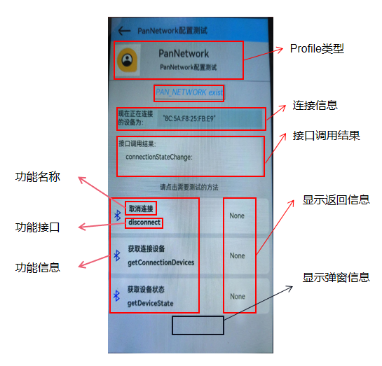

## Profile蓝牙部分

#### Profile的主要接口

|  method名称  |       API名称        |     所需参数     |             返回值             | 备注 |
| :----------: | :------------------: | :--------------: | :----------------------------: | :--: |
| 获取连接状态 | getConnectionDevices |        ()        |         Array<string>          | Base |
| 获取设备状态 |    getDeviceState    | (device: string) | ProfileConnectionState（枚举） | Base |
|     连接     |       connect        | (device: string) |            boolean             |      |
|   取消连接   |      disconnect      | (device: string) |            boolean             |      |
| 获取播放状态 |   getPlayingState    | (device: string) |      PlayingState（枚举）      |      |

>enum ProfileConnectionState {
>
>​    /** the current profile is disconnected */
>
>​    STATE_DISCONNECTED = 0,
>
>​    /** the current profile is being connected */
>
>​    STATE_CONNECTING = 1,
>
>​    /** the current profile is connected */
>
>​    STATE_CONNECTED = 2,
>
>​    /** the current profile is being disconnected */
>
>​    STATE_DISCONNECTING = 3
>
>}
>
>
>
>enum PlayingState {
>
>​    STATE_NOT_PLAYING,
>
>​    STATE_PLAYING,
>
>}

#### 验证工具

使用蓝牙音箱或键盘，连接后可以播放声音，查看显示信息。

#### 补充 

1. A2DP(Advanced Audio Distribution Profile) 高级音频分发模式
   - Source(源)（SRC）–当设备用作数字音频流的源时，即为SRC，该数字音频流被传送到微微网的SNK。
   - Sink(槽)（SNK）–当设备充当同一微微网上从SRC传送的数字音频流的接收器时，它就是SNK。

2. AVRCP(audio vidoe remote control protocol) 协议，用于远程控制音视频设备. 底层传输基于AVCTP传输协议，在蓝牙中，主要用于蓝牙音乐的控制,比如播放/暂停/下一曲/上一曲，以及获取播放状态、音乐信息等。 AVRCP有两个角色CT(contorl devices),TG(target devices).CT通过指令控制TG播放音乐，比如蓝牙耳机是CT,而手机是TG。

注：AVRCP子协议的作用是支持CT控制TG，具体来说如果手机和一个蓝牙音箱设备连接上了，那么音箱可以控制手机播放/暂停/切歌以及获得手机上播放歌曲的信息，如专辑，歌名，歌手，时长等信息。

3. 音频网关（AG）–这是作为音频网关的设备，用于输入和输出。作为音频网关的典型设备是手机。

   免提单元（HF）–这是用作音频网关的远程音频输入和输出机制的设备。它还提供了一些远程控制手段

4. HFP(Hands-Free Profile)，通俗点翻译就是免提协议，说白了就是蓝牙电话协议，可以让蓝牙设备通过协议定义好的AT command控制电话，如接听、挂断、拒接、语音拨号等。

5. HID定义了蓝牙在人机接口设备中的协议、特征和使用规程。典型的应用包括蓝牙鼠标、蓝牙键盘、蓝牙游戏手柄等。

6. 其他功能暂未实现

#### 功能 

BaseProfile：基础通用协议

- getConnectionDevices
  - 使用指导：获取配置文件的已连接设备列表，返回值为已连接设备列表的地址。
  - 限制条件：必须有已连接的设备。
  - 验证方法：查看返回值。

- getDeviceState
  - 使用指导：获取设备的配置文件状态，device为蓝牙设备的地址，返回值为｛连接配置文件的连接状态｝
  - 限制条件：有连接的配置文件
  - 验证方法：查看返回值。

#### A2dpSource配置

未开启蓝牙时：

开启蓝牙时：

- connect

  - 使用指导：使用a2dp连接到设备。device为要连接的远程设备的地址。如果连接正在进行，返回值为true；否则返回 false。

  - 限制条件：之前未成功连接。

  - 验证方法：查看连接的播放设备是否正常使用。

- disconnect

  - 使用指导：用a2dp断开与设备的连接。device为要断开连接的远程设备的地址。如果正在断开连接，则返回true；否则返回 false。

  - 限制条件：已成功连接。

  - 验证方法：查看之前连接的播放设备是否还可以使用。

- getPlayingState

  - 使用指导：获取设备的播放状态。device为远程设备的地址。返回值为远程设备的播放状态。

  - 限制条件：已成功连接。

  - 验证方法：查看之前连接的播放设备是否正常播放。

#### HandsFreeAudioGateway配置

未开启蓝牙时：

开启蓝牙时：

- connect：

  - 使用指导：使用hfp连接到设备。device为要连接的远程设备的地址。如果连接正在进行，返回值为true；否则返回 false。

  - 限制条件：之前未成功连接。

  - 验证方法：查看连接的播放设备是否正常使用。

- disconnect

  - 使用指导：用hfp断开与设备的连接。device为要断开连接的远程设备的地址。如果正在断开连接，则返回true；否则返回 false。

  - 限制条件：已成功连接。

  - 验证方法：查看之前连接的播放设备是否还可以使用。

#### HidHost配置

未开启蓝牙时：

开启蓝牙时：

- connect

  - 使用指导：使用HitHost连接到设备。device为要连接的远程设备的地址。如果连接正在进行，返回值为true；否则返回 false。

  - 限制条件：之前未成功连接。

  - 验证方法：查看连接的播放设备是否正常使用。

- disconnect

  - 使用指导：用HitHost断开与设备的连接。device为要断开连接的远程设备的地址。如果正在断开连接，则返回true；否则返回 false。

  - 限制条件：已成功连接。

  - 验证方法：查看之前连接的播放设备是否还可以使用。

#### PanNetwork配置

未开启蓝牙时：

开启蓝牙时：

- disconnect

  - 使用指导：用PanNetwork断开与设备的连接。device为要断开连接的远程设备的地址。如果正在断开连接，则返回true；否则返回 false。

  - 限制条件：已成功连接。

  - 验证方法：查看之前连接的播放设备是否还可以使用。

