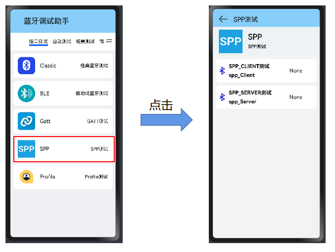
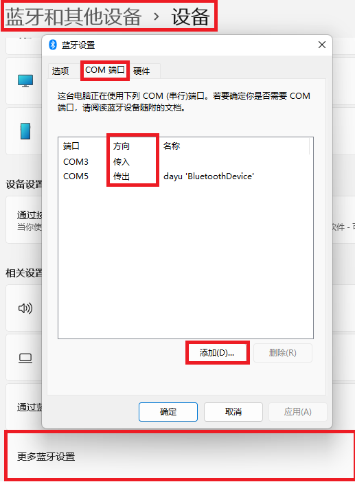
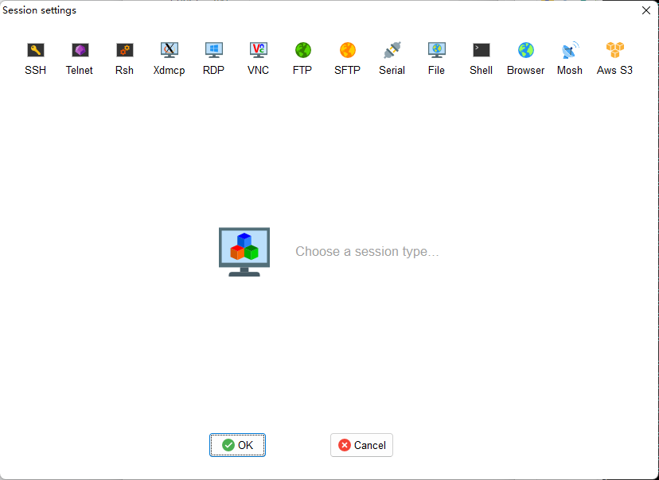
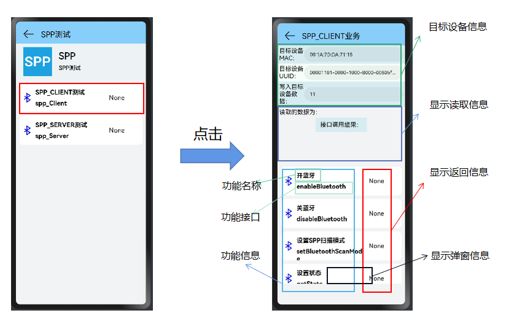
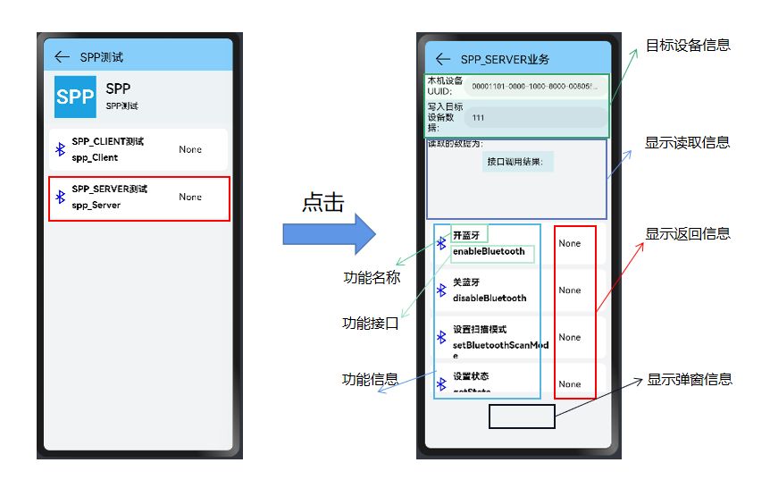

## SPP测试

### 从主界面跳转到SPP蓝牙部分

SPP测试分为SPPClient测试和SPPServer测试

### 验证工具

1. APP:SPP蓝牙串口

2. 使用电脑蓝牙，设置传入传出COM端口，在Moba中查看信息。 

   

3. 使用MobaXterm

   

4. 

### SPPClient

先选择SPP_Client测试，进行SPP客户端的测试

#### SPPClient的主要接口

|         method名称          |       API名称        |                           所需参数                           | 返回值  | 备注 |
| :-------------------------: | :------------------: | :----------------------------------------------------------: | :-----: | :--: |
|           开蓝牙            |    enablBluetooth    |                              ()                              | boolean |      |
|           关蓝牙            |   disableBluetooth   |                              ()                              | boolean |      |
|       设置SPP扫描模式       | setBluetoothScanMode |              (mode: ScanMode, duration: number)              | boolean |      |
|          设置状态           |       getState       |                              ()                              | number  |      |
|        获取扫描模式         | getBluetoothScanMode |                              ()                              | string  |      |
|      获取当前连接状态       | getBtConnectionState |                              ()                              | string  |      |
|  SPP客户端链接（安全模式）  |      sppConnect      | (device: string, option: SppOption, callback: AsyncCallback<number>) |  void   |      |
| SPP客户端连接（非安全模式） |      sppConnect      | (device: string, option: SppOption, callback: AsyncCallback<number>) |  void   |      |
|          配对设备           |      pairDevice      |                      (deviceId: string)                      | boolean |      |
|        SPP客户端写入        |       sppWrite       |          (clientSocket: number, data: ArrayBuffer)           | boolean |      |
|      SPP客户端读取打开      |      on.sppRead      | (type: "sppRead", clientSocket: number, callback: Callback<ArrayBuffer>) |  void   |      |
|      SPP客户端读取关闭      |     off.sppRead      | (type: "sppRead", clientSocket: number, callback?: Callback<ArrayBuffer>) |  void   |      |
|        SPP客户端关闭        | sppCloseClientSocket |                       (socket: number)                       |  void   |      |

#### SPPClient测试功能

1. 开/关蓝牙

   - 同"Br功能界面使用说明文档"中的"开/关蓝牙"功能。

2. 设置SPP扫描模式

   - 同"Br功能界面使用说明文档"中的"设置扫描模式"功能。

3. 设置状态

   - 同"Br功能界面使用说明文档"中的"设置状态"功能。

4. 获取扫描模式

   - 同"Br功能界面使用说明文档"中的"获取扫描模式"功能。

5. 获取当前连接状态

   - 同"Br功能界面使用说明文档"中的"获取当前连接状态"功能。

6. SPP客户端连接（安全）

   - 使用指导：

     > 通过套接字连接到远程设备。
     >
     > device要连接的远程设备的地址。
     >
     > option表示连接参数{@link SppOption}。
     >
     > callback回调用于返回客户端套接字ID。

   - 限制条件：需要在相关类型事件发生改变前，开启监听。

   - 验证方法：在事件变化后，查看是否有弹窗信息显示。

7. SPP客户端连接（非安全）

   - 与"SPP客户端连接（安全）"的区别是 "secure: false"

8. 配对设备

   - 同"Br功能界面使用说明文档"中的"配对设备"功能。

9. SPP客户端写入

   - 使用指导 ：

     > - 通过套接字写入数据。
     >
     > - clientSocket指示客户端套接字ID，sppAccept或sppConnect返回。
     > - data指示要写入的数据。
     > - return如果数据写入成功，则返回true；否则返回false。

   - 限制条件：SPPServer存在。

   - 验证方法：查看显示信息。

10. SPP客户端读取打开

    - 使用指导：为回调函数，用来监听相关类型事件的变化，并弹窗显示信息。

      > 订阅从套接字读取数据时报告的事件。
      >
      > type为要侦听的spp读取事件的类型。
      >
      > callback回调用于侦听spp读取事件。

    - 限制条件：需要在相关类型事件发生改变前，开启监听。

    - 验证方法：在事件变化后，查看是否有弹窗信息显示。

11. SPP客户端读取关闭

    - 使用指导：为回调函数，用来监听相关类型事件的变化，并弹窗显示信息。

      > 取消订阅从套接字读取数据时报告的事件。
      >
      > type为要侦听的spp读取事件的类型。
      >
      > callback回调用于侦听spp读取事件。

    - 限制条件：需要在相关类型事件发生改变前，开启监听。

    - 验证方法：在事件变化后，查看是否有弹窗信息显示。

12. SPP客户端关闭

    - 使用指导：禁用spp客户端套接字并释放相关资源。
    - 限制条件：SPPClient打开。
    - 验证方法：套接字指示客户端套接字ID，由sppAccept或sppConnect返回。

### SPPServer

#### SPPServer的主要接口

|         method名称          |       API名称        |                           所需参数                           |         返回值         | 备注 |
| :-------------------------: | :------------------: | :----------------------------------------------------------: | :--------------------: | ---- |
|           开蓝牙            |   enableBluetooth    |                              ()                              |                        |      |
|           关蓝牙            |   disableBluetooth   |                              ()                              |                        |      |
|        设置扫描模式         | setBluetoothScanMode |              (mode: ScanMode, duration: number)              |        boolean         |      |
|          设置状态           |       getState       |                              ()                              |     BluetoothState     |      |
|        获取扫描模式         | getBluetoothScanMode |                              ()                              |        ScanMode        |      |
|      获取当前连接状态       | getBtConnectionState |                              ()                              | ProfileConnectionState |      |
|  SPP服务器创建（安全模式）  |      sppListen       | (name: string, option: SppOption, callback: AsyncCallback<number>) |          void          |      |
| SPP服务器创建（非安全模式） |      sppListen       | (name: string, option: SppOption, callback: AsyncCallback<number>) |          void          |      |
|        注册pin码变化        |    on.pinRequired    | (type: "pinRequired", callback: Callback<PinRequiredParam>)  |          void          |      |
|        SPP服务器写入        |       sppWrite       |          (clientSocket: number, data: ArrayBuffer)           |        boolean         |      |
|        SPP服务器接受        |      sppAccept       |   (serverSocket: number, callback: AsyncCallback<number>)    |          void          |      |
|      SPP服务器读取打开      |      on.sppRead      | (type: "sppRead", clientSocket: number, callback: Callback<ArrayBuffer>) |          void          |      |
|      SPP服务器读取关闭      |     off.sppRead      | (type: "sppRead", clientSocket: number, callback?: Callback<ArrayBuffer>): void |          void          |      |
|        SPP服务器关闭        | sppCloseServerSocket |                      (socket: number):                       |          void          |      |
|        SPP客户端关闭        | sppCloseClientSocket |                      (socket: number):                       |          void          |      |

#### SPPServer测试功能

1. 开/关蓝牙

   - 同"Br功能界面使用说明文档"中的"开/关蓝牙"功能。

2. 设置SPP扫描模式

   - 同"Br功能界面使用说明文档"中的"设置扫描模式"功能。

3. 设置状态

   - 同"Br功能界面使用说明文档"中的"设置状态"功能。

4. 获取扫描模式

   - 同"Br功能界面使用说明文档"中的"获取扫描模式"功能。

5. 获取当前连接状态

   - 同"Br功能界面使用说明文档"中的"获取当前连接状态"功能。

6. SPP服务器创建（安全）

   - 使用指导：

     > 创建蓝牙服务器侦听套接字。
     >
     > name表示服务名称。option表示侦听参数SppOption。
     >
     > callback回调用于返回服务器套接字ID。

   - 限制条件：需要在相关类型事件发生改变前，开启监听。

   - 验证方法：在事件变化后，查看是否有弹窗信息显示。

7. SPP服务器创建（非安全）

   - 与"SPP服务器创建（安全）"的区别是 "secure: false"

8. 注册pin码变化

   - 同"Br功能界面使用说明文档"中的"注册pin码变化"功能。

9. SPP服务器写入

   - 同"SPPClient"中的"SPP服务器写入"功能。

10. SPP服务器接受

    - 使用指导：

      > 等待远程设备连接。serverSocket表示服务器套接字ID，由sppListen返回。
      >
      > callback回调用于返回客户端套接字ID。

    - 限制条件：发送了clientSocketID。

    - 验证方法：查看显示信息。

11. SPP服务器读取打开

    - 同"SPPClient"中的"SPP服务器读取关闭"功能。

12. SPP服务器读取关闭

    - 同"SPPClient"中的"SPP服务器读取关闭"功能。

13. SPP服务器关闭

    - 使用指导：

      > 禁用spp服务器套接字并释放相关资源。
      >
      > 套接字指示服务器套接字ID，由sppListen返回。

    - 限制条件：SPP服务器打开。

    - 验证方法：无法被搜索到。

14. SPP客户端关闭

    - 同"SPPClient"中的"SPP客户端关闭"功能。