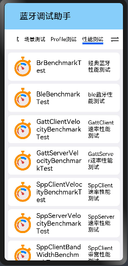

## 使用说明文档

​        本文档主要介绍了蓝牙专项测试程序的所在仓，如何使用DevEco程序导入该项目，如何预览、编译和烧录该程序以及该程序的功能使用说明。

### 安装使用说明（win环境）

#### 下载代码

1. 文件代码所在仓的地址

[communication_bluetooth: 蓝牙服务组件为设备提供接入与使用Bluetooth的相关接口，包括BLE设备gatt相关的操作，以及BLE广播、扫描等功能。 (gitee.com)](https://gitee.com/openharmony/communication_bluetooth)

2. 下载方式

- 使用git下载

  - 安装git。

  - 选择一个空文件夹，右键打开git Bash。（文件夹路径中不要出现中文）

    

  - 使用命令 `git clone {http}`

    

- 直接下载zip

#### 工具

1. DevEco Studio 3.0 Beta4

- HUAWEI DevEco Studio For OpenHarmony是基于IntelliJ IDEA Community开源版本打造，面向OpenHarmony全场景多设备的一站式集成开发环境（IDE），DevEco Studio 3.0支持在HarmonyOS 3.0 Beta版上开发应用及服务，并已适配ArkUI声明式编程范式、ArkCompiler方舟编译，同时提供低代码开发、双向预览、全新构建工具、模拟器、调试调优、信息中心等功能，为开发者提供工程模板创建、开发、编译、调试、发布等E2E的OpenHarmony应用/服务开发。

2. 下载链接: [HUAWEI DevEco Studio和SDK下载和升级 | HarmonyOS开发者](https://developer.harmonyos.com/cn/develop/deveco-studio#download_beta)

3. 安装步骤: [下载与安装软件-快速开始-HUAWEI DevEco Studio For OpenHarmony使用指南-工具-HarmonyOS应用开发 | HarmonyOS](https://developer.harmonyos.com/cn/docs/documentation/doc-guides/ohos-download-software-0000001218760592)  

注：建议在选项界面都勾选DevEco Studio，Add “bin” folder to the PATH，Add "Open Folder as Project"

4. 配置开发环境：[配置开发环境-快速开始-HUAWEI DevEco Studio For OpenHarmony使用指南-工具-HarmonyOS应用开发 | HarmonyOS](https://developer.harmonyos.com/cn/docs/documentation/doc-guides/ohos-setting-up-environment-0000001263160443)

#### 如何导入程序

1. 打开DevEco

2. 在DevEco Studio的欢迎页，选择**Open Project**开始创建一个新工程。

2.选择程序所在的路径

3. 打开程序的homepage

   \communication_bluetooth\test\example\BluetoothTest\entry\src\main\ets\MainAbility\pages\homePage.ets

- **entry**为应用的主模块，类似与Android Studio的app模块，一个APP中，对于同一设备类型必须有且只有一个entry类型的HAP，可独立安装运行。

- 使用**previewer**查看程序的预览图

  点击View > Tool Windows > Project > Previewer 如下图所示：

  - 方法一：

  

  - 方法二：

  

  - 成功预览后会生成.preview结构：

  

- 使用**build**编译程序

  - 点击Build > Rebuild 进行编译; Build > Build Hap(s) /App(s) >Build Hap(s) 生成hap文件
  
  

  - hap文件的生成路径：entry\build\outputs\default

    

- 打开homepage点击预览，会显示蓝牙专项测试程序的主界面，如下图所示

注：在预览中，点击具体的功能模块，能实现页面跳转。具体的方法实现，需要在开发板上完成。

- 将搭载OpenHarmony标准系统的开发板与电脑连接。

- 点击File > Project Structure > Project > Signing Configs界面勾选“Automatically generate signature”，等待自动签名完成即可，点击“OK”。如下图所示：
- 为了保证OpenHarmony应用的完整性和来源可靠，在应用构建时需要对应用进行签名。经过签名的应用才能在真机设备上安装、运行、和调试。如果没有配置签名，会报错：hvigor WARN: Will skip sign ‘hap’,Invalid signingConfig is configured for 'default' product.

程序烧录

---

### 安装使用说明(Open-Harmony)

在开源鸿蒙系统下

- 蓝牙专项应用程序路径为：foundation/communication/bluetooth/test/example/BluetoothTest

- 编译命令

  ~~~
  # 全量编译
  ./build.sh --product-name {product_name}
  
  # 单独编译HAP
  ./build.sh --product-name {product_name} --build-target BluetoothTest

- 生成文件

  - 使用 find out -name "BluetoothTest.hap*" 查找生成文件，或者直接查看config.json所写的生成路径。
  - 将生成文件拷到本地电脑上，连接板子，使用命令 `hdc_std.exe install BluetoothTest`进行安装。
  - 使用命令 `hdc_std uninstall {安装包名}` 进行卸载。
  - 安装包名在 `entry\src\main\config.json` 如：`"bundleName": "com.ohos.bttest"`

- 补充

  在鸿蒙系统下编译，仍存在高版本对低版本的编译不兼容性问题。即在mater版本下编译的hap无法在beta2版本运行；反之则可以。

---

### 程序说明 

测试类型分为接口测试，自动化测试，场景测试，Profile测试，性能测试。

- 接口测试

  >1. 经典蓝牙部分
  >
  >   Br功能界面使用说明文档.md
  >
  >2. BLE蓝牙部分
  >
  >​		BLE功能界面使用说明文档.md
  >
  >3. Gatt测试
  >
  >   Gatt功能界面使用说明文档.md
  >
  >4. SPP测试
  >
  >   SPP功能界面使用说明文档.md
  >

- 自动测试

  >1. 经典蓝牙自动化测试
  >
  >2. BLE蓝牙自动化测试
  >
  >3. Gatt蓝牙自动化测试
  >
  >4. SPP蓝牙自动化测试
  >
  >5. Profile蓝牙自动化测试
  >
  >   自动化测试使用说明文档.md

- 场景测试

  >1. 经典蓝牙发现场景
  >
  >2. BLE蓝牙发现场景
  >
  >3. GattClient
  >
  >4. GattServer
  >
  >5. SppClient
  >
  >6. SppServer
  >
  >   场景测试使用说明文档.md

- Profile测试

  >1. A2dpSourceProfile测试
  >
  >2. HandsFreeAudioGatewayProfile测试
  >
  >3. HidHostProfile测试
  >
  >4. PanNetwork测试
  >
  >​		Profile功能界面使用说明文档.md

- 性能测试

  >1. BrBenchmark测试
  >
  >2. BleBenchmark测试
  >
  >3. GattClientVelocityBenchmark / GattServerVelocityBenchmark测试
  >
  >4. SppClientVelocityBenchmark / SppServerVelocityBenchmark测试
  >
  >5. SppClientBandWidthBenchmark / SppServerBandWidthBenchmark测试
  >
  >​		性能测试功能界面使用说明文档.md

验证工具

APP：

- 其他     

  - nRF connect    / BLE Tool / BLE调试助手

- SPP蓝牙串口  

- LightBlue

电脑端： linux中的bluetoothctl  Gatttool   电脑蓝牙 

> 对应的Br, BLE, Gatt, SPP的测试方法
>
> Br   linux中的bluetoothctl
>
> BLE  nRF Connect  打开广播后 可以在nRF中发现 并连接
>
> Gatt  Gatttool/  sudo hcitool -i hci0 lescan / gatttool -i hci0 -b "MAC地址" --primary ，nRF Connect
>
> SPP SPP蓝牙串口/电脑蓝牙 

