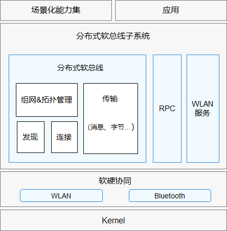

# 分布式软总线组件<a name="ZH-CN_TOPIC_0000001103650648"></a>

-   [简介](#section13587125816351)
-   [系统架构](#section13587185873516)
-   [目录](#section161941989596)
-   [约束](#section119744591305)
-   [说明](#section1312121216216)
    -   [使用说明](#section1698318421816)

-   [相关仓](#section1371113476307)

## 简介<a name="section13587125816351"></a>

现实中多设备间通信方式多种多样\(WIFI、蓝牙等\)，不同的通信方式使用差异大，导致通信问题多；同时还面临设备间通信链路的融合共享和冲突无法处理等挑战。分布式软总线实现近场设备间统一的分布式通信管理能力，提供不区分链路的设备间发现连接、组网和传输能力，主要功能如下：

-   发现连接：提供基于Wifi、蓝牙等通信方式的设备发现连接能力。
-   设备组网：提供统一的设备组网和拓扑管理能力，为数据传输提供已组网设备信息。
-   数据传输：提供数据传输通道，支持消息、字节数据传输等能力。

业务方通过使用分布式软总线提供的API实现设备间的高速通信，不用关心通信细节，进而实现业务平台的高效部署与运行能力。

## 系统架构<a name="section13587185873516"></a>

**图 1**  分布式软总线组件架构图<a name="fig4460722185514"></a>  




## 目录<a name="section161941989596"></a>

分布式软总线组件主要代码目录结构如下：

```
/foundation/communication/dsoftbus
├── interfaces            # 接口代码
├── adapter               # 适配层代码
├── core                  # 核心代码
│   ├── common            # 通用代码
│   ├── authentication    # 认证代码
│   ├── bus_center        # 组网代码
│   ├── connection        # 连接代码
│   ├── discovery         # 发现代码
│   ├── transmission      # 传输代码
│   └── frame             # 框架代码
├── sdk                   # 运行业务进程代码
│   ├── bus_center        # 组网代码
│   ├── discovery         # 发现代码
│   ├── transmission      # 传输代码
│   └── frame             # 框架代码
└── components            # 依赖组件代码
```

## 约束<a name="section119744591305"></a>

-   组网设备需在同一局域网中。
-   组网之前，需先完成设备绑定，绑定流程参见安全子系统中说明。

## 说明<a name="section1312121216216"></a>

### 使用说明<a name="section1698318421816"></a>

>**须知：** 
>使用跨设备通信时，必须添加权限ohos.permission.DISTRIBUTED\_DATASYNC，该权限类型为 _**dangerous**_ 。

>设备主动发现手机时,手机需打开超级终端的允许被“附近设备”发现开关（设置-超级终端-我的设备-允许被发现-附近设备），才能被设备发现。

**1、发现**

-   **发布流程**

1.  上层应用需要对外发布自身能力时，调用服务发布接口发布自身能力。

    ```
    // 发布回调
    typedef struct {
        void (*OnPublishSuccess)(int publishId); //发布成功时回调
        void (*OnPublishFail)(int publishId, PublishFailReason reason);//发布失败时回调
    } IPublishCallback;
    
    // 发布服务
    int PublishService(const char *pkgName, const PublishInfo *info, const IPublishCallback *cb);
    ```

2.  上层应用不再需要对外发布自身能力时，调用UnpublishService接口注销服务。

    ```
    // 注销服务
    int UnPublishService(const char *pkgName, int publishId);
    ```


-   **发现流程**

1.  上层应用需要发现特定能力设备时，调用发现接口启动发现。

    ```
    // 发现回调
    typedef struct {
        void (*OnDeviceFound)(const DeviceInfo *device); //发现设备回调
        void (*OnDiscoverFailed)(int subscribeId, DiscoveryFailReason failReason); //启动发现失败回调
        void (*OnDiscoverySuccess)(int subscribeId); //启动发现成功回调
    } IDiscoveryCallback;
    
    // 发现服务
    int StartDiscovery(const char *pkgName, const SubscribeInfo *info, const IDiscoveryCallback *cb);
    ```

2.  当软总线发现到设备时，通过回调接口通知业务所发现的设备信息。
3.  上层应用不再需要发现时，调用StopDiscovery接口停止设备发现。

    ```
    // 停止服务
    int StopDiscovery(const char *pkgName, int subscribeId);
    ```


**2、组网**

1.  发起组网请求，携带组网连接地址信息，并且提供组网执行结果回调函数。

    ```
    // 组网连接地址
    typedef struct {
        ConnectionAddrType type;
        union {
            struct BrAddr {
                char brMac[BT_MAC_LEN];
            } br;
            struct BleAddr {
                char bleMac[BT_MAC_LEN];
            } ble;
            struct IpAddr {
                char ip[IP_STR_MAX_LEN];
                int port;
            } ip;
        } info;
    } ConnectionAddr;
    
    // 组网连接地址类型
    typedef enum {
        CONNECTION_ADDR_WLAN = 0,
        CONNECTION_ADDR_BR,
        CONNECTION_ADDR_BLE,
        CONNECTION_ADDR_ETH,
        CONNECTION_ADDR_MAX
    } ConnectionAddrType;
    
    // 组网请求执行结果回调
    typedef void (*OnJoinLNNResult)(ConnectionAddr *addr, const char *networkId, int32_t retCode);
    
    // 发起组网请求
    int32_t JoinLNN(ConnectionAddr *target, OnJoinLNNResult cb);
    ```

2.  等待组网结果，JoinLNN\(\)返回成功表示软总线接受了组网请求，组网结果通过回调函数通知业务；组网回调函数中addr参数内容和JoinLNN\(\)的入参互相匹配；retCode如果为0，表示组网成功，此时networkId为有效值，后续传输、退网等接口均需使用该参数；retCode如果不为0，表示组网失败，此时networkId为无效值。
3.  使用传输相关接口进行数据传输。
4.  发送退网请求，携带组网成功后返回的networkId，并且提供退网执行结果回调。

    ```
    // 退网执行结果回调
    typedef void (*OnLeaveLNNResult)(const char *networkId, int32_t retCode);
    
    // 退网请求
    int32_t LeaveLNN(const char *networkId, OnLeaveLNNResult cb);
    ```

5.  等待退网完成，OnLeaveLNNResult\(\)的networkId和退网请求接口中的networkId互相匹配；retCode为0表示退网成功，否则退网失败。退网成功后，networkId变为无效值，后续不应该被继续使用。
6.  使用节点（即设备）注册和注销接口，监听网络中节点状态变化等事件。

    ```
    // 事件掩码
    #define EVENT_NODE_STATE_ONLINE 0x1
    #define EVENT_NODE_STATE_OFFLINE 0x02
    #define EVENT_NODE_STATE_INFO_CHANGED 0x04
    #define EVENT_NODE_STATE_MASK 0x07
    
    // 节点信息
    typedef struct {
        char networkId[NETWORK_ID_BUF_LEN];
        char deviceName[DEVICE_NAME_BUF_LEN];
        uint16_t deviceTypeId;
    } NodeBasicInfo;
    
    // 节点状态事件回调
    typedef struct {
        uint32_t events; // 组网事件掩码
        void (*onNodeOnline)(NodeBasicInfo *info);   // 节点上线事件回调
        void (*onNodeOffline)(NodeBasicInfo *info);  // 节点下线事件回调
        void (*onNodeBasicInfoChanged)(NodeBasicInfoType type, NodeBasicInfo *info); // 节点信息变化事件回调
    } INodeStateCb;
    
    //  注册节点状态事件回调
    int32_t RegNodeDeviceStateCb(INodeStateCb *callback);
    
    // 注销节点状态事件回调
    int32_t UnregNodeDeviceStateCb(INodeStateCb *callback);
    ```


**3、传输**

1.  创建会话服务，并设置会话相关回调，用户可在回调中处理打开/关闭和消息接收事件。

    ```
    // 会话管理回调
    typedef struct {
        int (*OnSessionOpened)(int sessionId, int result);
        void (*OnSessionClosed)(int sessionId);
        void (*OnBytesReceived)(int sessionId, const void *data, unsigned int dataLen);
        void (*OnMessageReceived)(int sessionId, const void *data, unsigned int dataLen);
    } ISessionListener;
    
    // 创建会话服务
    int CreateSessionServer(const char *pkgName, const char *sessionName, const ISessionListener* listener);
    ```

2.  创建会话 ，用于收发数据。

    ```
    // 创建会话
    int OpenSession(const char *mySessionName, const char *peerSessionName, const char *peerDeviceId, const char *groupId, const SessionAttribute* attr);
    ```

3.  通过sessionId向对端设备发送数据。

    ```
    // 发送字节数据
    int SendBytes(int sessionId, const void *data, unsigned int len);
    // 发送消息数据
    int SendMessage(int sessionId, const void *data, unsigned int len);
    ```

4.  通过sessionId关闭会话。

    ```
    // 关闭会话
    void CloseSession(int sessionId);
    ```

5.  删除会话服务。

    ```
    // 删除会话服务
    int RemoveSessionServer(const char *pkgName, const char *sessionName);
    ```


## 相关仓<a name="section1371113476307"></a>

分布式软总线子系统

**communication_dsoftbus**

communication_bluetooth

communication_ipc

communication_wifi
