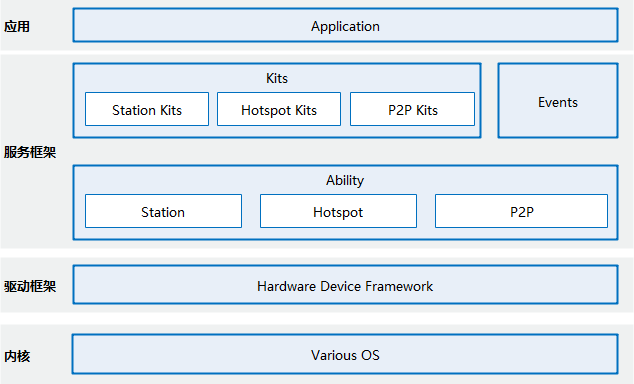

# WLAN组件<a name="ZH-CN_TOPIC_0000001162030287"></a>

-   [简介](#section11660541593)
-   [系统架构](#section342962219551)
-   [目录](#section161941989596)
-   [说明](#section1312121216216)
    -   [接口说明](#section1551164914237)
    -   [使用说明](#section129654513264)

-   [相关仓](#section1371113476307)

## 简介<a name="section11660541593"></a>

无线局域网（Wireless Local Area Networks，WLAN），是通过无线电、红外光信号或者其他技术发送和接收数据的局域网，用户可以通过WLAN实现结点之间无物理连接的网络通讯。常用于用户携带可移动终端的办公、公众环境中。

WLAN组件子系统为用户提供WLAN基础功能、P2P（peer-to-peer）功能和WLAN消息通知的相应服务，让应用可以通过WLAN和其他设备互联互通。

## 系统架构<a name="section342962219551"></a>

**图 1**  WLAN组件架构图<a name="fig356513281301"></a>  




## 目录<a name="section161941989596"></a>

```
/foundation/communication/wifi
├── figures            # 图片资源目录
├── interfaces         # 接口适配目录
│   ├── innerkits      # 内部接口适配目录
│   └── kits           # WLAN组件接口的适配代码存放目录
├── services           # service适配目录
│   └── wifi_standard  # service实现目录
├── tests              # 测试代码目录
│   └── wifi_standard  # service实现模块测试代码
└── utils              # 实用函数目录
    ├── inc            # 实用函数头文件目录
    └── src            # 实用函数实现目录
```

## 说明<a name="section1312121216216"></a>

### 接口说明<a name="section1551164914237"></a>

WLAN基础功能由@ohos.wifi类提供，其接口\(JS接口\)说明如下。

**表 1**  WLAN基础功能的主要接口\(JS接口\)

<a name="t96d5b1a809be46328adc684bff001cf7"></a>

<table><thead align="left"><tr id="r5b6b790b6fe144e79e849b7987637f32"><th class="cellrowborder" valign="top" width="40.864086408640865%" id="mcps1.2.4.1.1"><p id="a4bf77d9c2b5c4b8d950a720edaf949c7"><a name="a4bf77d9c2b5c4b8d950a720edaf949c7"></a><a name="a4bf77d9c2b5c4b8d950a720edaf949c7"></a>接口名</p>
</th>
<th class="cellrowborder" valign="top" width="44.704470447044706%" id="mcps1.2.4.1.2"><p id="a11b93aaf8bfd4305acc4b4549f28d524"><a name="a11b93aaf8bfd4305acc4b4549f28d524"></a><a name="a11b93aaf8bfd4305acc4b4549f28d524"></a>描述</p>
</th>
<th class="cellrowborder" valign="top" width="14.431443144314432%" id="mcps1.2.4.1.3"><p id="a1d9f27631e6f466f8c2edc9833a94275"><a name="a1d9f27631e6f466f8c2edc9833a94275"></a><a name="a1d9f27631e6f466f8c2edc9833a94275"></a>所需权限</p>
</th>
</tr>
</thead>
<tbody><tr id="r31629b385e294e248c668786519b6f87"><td class="cellrowborder" valign="top" width="40.864086408640865%" headers="mcps1.2.4.1.1 "><p id="aea622edc3df04a60a42bb8a1a63a8c4f"><a name="aea622edc3df04a60a42bb8a1a63a8c4f"></a><a name="aea622edc3df04a60a42bb8a1a63a8c4f"></a>function enableWifi(): boolean</p>
</td>
<td class="cellrowborder" valign="top" width="44.704470447044706%" headers="mcps1.2.4.1.2 "><p id="a799afb666cff4f03a2ee996c0c7335dd"><a name="a799afb666cff4f03a2ee996c0c7335dd"></a><a name="a799afb666cff4f03a2ee996c0c7335dd"></a>打开WLAN。</p>
</td>
<td class="cellrowborder" valign="top" width="14.431443144314432%" headers="mcps1.2.4.1.3 "><p id="a78809eb41a8e46ec92ad886a2e491e09"><a name="a78809eb41a8e46ec92ad886a2e491e09"></a><a name="a78809eb41a8e46ec92ad886a2e491e09"></a>NA</p>
</td>
</tr>
<tr id="r42d012d5690241a1a346b249bca0d0f4"><td class="cellrowborder" valign="top" width="40.864086408640865%" headers="mcps1.2.4.1.1 "><p id="a3d8f9fb87dd94d5da78f9d59ba31c9ec"><a name="a3d8f9fb87dd94d5da78f9d59ba31c9ec"></a><a name="a3d8f9fb87dd94d5da78f9d59ba31c9ec"></a>function disableWifi(): boolean</p>
</td>
<td class="cellrowborder" valign="top" width="44.704470447044706%" headers="mcps1.2.4.1.2 "><p id="a9d1794f64a4a4177b0c247a5378cc8a3"><a name="a9d1794f64a4a4177b0c247a5378cc8a3"></a><a name="a9d1794f64a4a4177b0c247a5378cc8a3"></a>关闭WLAN。</p>
</td>
<td class="cellrowborder" valign="top" width="14.431443144314432%" headers="mcps1.2.4.1.3 "><p id="a4bba00774fee45b991e03d5739eed45d"><a name="a4bba00774fee45b991e03d5739eed45d"></a><a name="a4bba00774fee45b991e03d5739eed45d"></a>NA</p>
</td>
</tr>
<tr id="rb2088f3bae264f9fb6dee3d69f8e510b"><td class="cellrowborder" valign="top" width="40.864086408640865%" headers="mcps1.2.4.1.1 "><p id="a0db4a8a271844e289867b8686be5971e"><a name="a0db4a8a271844e289867b8686be5971e"></a><a name="a0db4a8a271844e289867b8686be5971e"></a>function isWifiActive(): boolean</p>
</td>
<td class="cellrowborder" valign="top" width="44.704470447044706%" headers="mcps1.2.4.1.2 "><p id="a251c902bc5a14e4dbbf6ae3e847d5a00"><a name="a251c902bc5a14e4dbbf6ae3e847d5a00"></a><a name="a251c902bc5a14e4dbbf6ae3e847d5a00"></a>查询WLAN是否处于打开状态。</p>
</td>
<td class="cellrowborder" valign="top" width="14.431443144314432%" headers="mcps1.2.4.1.3 "><p id="ad01b019785b6434aa7b4e06badffda6a"><a name="ad01b019785b6434aa7b4e06badffda6a"></a><a name="ad01b019785b6434aa7b4e06badffda6a"></a>NA</p>
</td>
</tr>
<tr id="r63090caeaf674f2e9a7efdd8f838564c"><td class="cellrowborder" valign="top" width="40.864086408640865%" headers="mcps1.2.4.1.1 "><p id="a9229822a49b6414dbb15ded55b808209"><a name="a9229822a49b6414dbb15ded55b808209"></a><a name="a9229822a49b6414dbb15ded55b808209"></a>function scan(): boolean</p>
</td>
<td class="cellrowborder" valign="top" width="44.704470447044706%" headers="mcps1.2.4.1.2 "><p id="a666bb97e527a4d5db4864d72bdb040b7"><a name="a666bb97e527a4d5db4864d72bdb040b7"></a><a name="a666bb97e527a4d5db4864d72bdb040b7"></a>发起WLAN扫描。</p>
</td>
<td class="cellrowborder" valign="top" width="14.431443144314432%" headers="mcps1.2.4.1.3 "><p id="abdc11b1866b54d69a8acef2c13da1553"><a name="abdc11b1866b54d69a8acef2c13da1553"></a><a name="abdc11b1866b54d69a8acef2c13da1553"></a>NA</p>
</td>
</tr>
<tr id="r5098f19894e947d9844839c81abdb431"><td class="cellrowborder" valign="top" width="40.864086408640865%" headers="mcps1.2.4.1.1 "><p id="p148521030134915"><a name="p148521030134915"></a><a name="p148521030134915"></a>function getScanInfos(): Promise&lt;Array&lt;WifiScanInfo&gt;&gt;</p>
<p id="p1264072917366"><a name="p1264072917366"></a><a name="p1264072917366"></a>function getScanInfos(callback: AsyncCallback&lt;Array&lt;WifiScanInfo&gt;&gt;): void</p>
</td>
<td class="cellrowborder" valign="top" width="44.704470447044706%" headers="mcps1.2.4.1.2 "><p id="a833c28b165db44e49b49d84eb8f12d3a"><a name="a833c28b165db44e49b49d84eb8f12d3a"></a><a name="a833c28b165db44e49b49d84eb8f12d3a"></a>获取WLAN扫描结果，接口可采用promise或callback方式调用。</p>
</td>
<td class="cellrowborder" valign="top" width="14.431443144314432%" headers="mcps1.2.4.1.3 "><p id="ad31109a27e344b27a2879ae7be60da6a"><a name="ad31109a27e344b27a2879ae7be60da6a"></a><a name="ad31109a27e344b27a2879ae7be60da6a"></a>NA</p>
</td>
</tr>
<tr id="rd41bbd2a167e42c4854efaf2f95923a8"><td class="cellrowborder" valign="top" width="40.864086408640865%" headers="mcps1.2.4.1.1 "><p id="p126421517153711"><a name="p126421517153711"></a><a name="p126421517153711"></a>function addDeviceConfig(config: WifiDeviceConfig): Promise&lt;number&gt;</p>
<p id="p15642617133717"><a name="p15642617133717"></a><a name="p15642617133717"></a>function addDeviceConfig(config: WifiDeviceConfig, callback: AsyncCallback&lt;number&gt;): void</p>
</td>
<td class="cellrowborder" valign="top" width="44.704470447044706%" headers="mcps1.2.4.1.2 "><p id="a88ec088696df4f4b8e0e240e66646d9c"><a name="a88ec088696df4f4b8e0e240e66646d9c"></a><a name="a88ec088696df4f4b8e0e240e66646d9c"></a>添加WLAN热点的配置信息，接口可采用promise或callback方式调用。</p>
</td>
<td class="cellrowborder" valign="top" width="14.431443144314432%" headers="mcps1.2.4.1.3 "><p id="a57539195f93c4af187781c5c7a64c74c"><a name="a57539195f93c4af187781c5c7a64c74c"></a><a name="a57539195f93c4af187781c5c7a64c74c"></a>NA</p>
</td>
</tr>
<tr id="row18665444142915"><td class="cellrowborder" valign="top" width="40.864086408640865%" headers="mcps1.2.4.1.1 "><p id="p666517440295"><a name="p666517440295"></a><a name="p666517440295"></a>function connectToNetwork(networkId: number): boolean</p>
</td>
<td class="cellrowborder" valign="top" width="44.704470447044706%" headers="mcps1.2.4.1.2 "><p id="p13666344152913"><a name="p13666344152913"></a><a name="p13666344152913"></a>连接到WLAN网络。</p>
</td>
<td class="cellrowborder" valign="top" width="14.431443144314432%" headers="mcps1.2.4.1.3 "><p id="p56667442298"><a name="p56667442298"></a><a name="p56667442298"></a>NA</p>
</td>
</tr>
<tr id="row176661944152919"><td class="cellrowborder" valign="top" width="40.864086408640865%" headers="mcps1.2.4.1.1 "><p id="p66661144122919"><a name="p66661144122919"></a><a name="p66661144122919"></a>function connectToDevice(config: WifiDeviceConfig): boolean</p>
</td>
<td class="cellrowborder" valign="top" width="44.704470447044706%" headers="mcps1.2.4.1.2 "><p id="p4666104410298"><a name="p4666104410298"></a><a name="p4666104410298"></a>连接到WLAN网络。</p>
</td>
<td class="cellrowborder" valign="top" width="14.431443144314432%" headers="mcps1.2.4.1.3 "><p id="p766644420298"><a name="p766644420298"></a><a name="p766644420298"></a>NA</p>
</td>
</tr>
<tr id="r53c17c0621b74f9c9b3915fef99bb64d"><td class="cellrowborder" valign="top" width="40.864086408640865%" headers="mcps1.2.4.1.1 "><p id="p5681182313296"><a name="p5681182313296"></a><a name="p5681182313296"></a>function disconnect(): boolean</p>
</td>
<td class="cellrowborder" valign="top" width="44.704470447044706%" headers="mcps1.2.4.1.2 "><p id="a2939738c548a44838522d7ac772b697a"><a name="a2939738c548a44838522d7ac772b697a"></a><a name="a2939738c548a44838522d7ac772b697a"></a>断开WLAN连接。</p>
</td>
<td class="cellrowborder" valign="top" width="14.431443144314432%" headers="mcps1.2.4.1.3 "><p id="a3862542954ef418b86ba8606721b4d30"><a name="a3862542954ef418b86ba8606721b4d30"></a><a name="a3862542954ef418b86ba8606721b4d30"></a>NA</p>
</td>
</tr>
<tr id="row10868175614302"><td class="cellrowborder" valign="top" width="40.864086408640865%" headers="mcps1.2.4.1.1 "><p id="p586835643012"><a name="p586835643012"></a><a name="p586835643012"></a>function getSignalLevel(rssi: number, band: number): number</p>
</td>
<td class="cellrowborder" valign="top" width="44.704470447044706%" headers="mcps1.2.4.1.2 "><p id="p8868155614306"><a name="p8868155614306"></a><a name="p8868155614306"></a>获取WLAN信号强度。</p>
</td>
<td class="cellrowborder" valign="top" width="14.431443144314432%" headers="mcps1.2.4.1.3 "><p id="p1786825673010"><a name="p1786825673010"></a><a name="p1786825673010"></a>NA</p>
</td>
</tr>
</tbody>
</table>

### 使用说明<a name="section129654513264"></a>

在调用WLAN JS接口前需要导入接口类。

```js
import wf from '@ohos.wifi'; // 导入js接口类
```

（一）获取WLAN状态

1.  调用isWifiActive​\(\)接口查询WLAN是否打开。

    ```js
    var isWifiActive = wf.isWifiActive(); // 若WLAN打开，则返回true，否则返回false
    ```


（二）发起扫描并获取结果

1.  调用scan​\(\)接口发起扫描。
2.  调用getScanInfoList​\(\)接口获取扫描结果。

    ```js
    // 调用WLAN扫描接口
    var isScanSuccess = wf.scan(); // true

    // 延迟一定时间

    // 获取扫描结果
    wf.getScanInfos((err, result) => {
        if (err) {
            console.error("get scan info error");
            return;
        }

        var len = Object.keys(result).length;
        console.log("get scan info number: " + len);
        for (var i = 0; i < len; ++i) {
            console.info("ssid: " + result[i].ssid);
            console.info("bssid: " + result[i].bssid);
            console.info("securityType: " + result[i].securityType);
            console.info("rssi: " + result[i].rssi);
            console.info("band: " + result[i].band);
            console.info("frequency: " + result[i].frequency);
            console.info("timestamp: " + result[i].timestamp);
        }
    });
    ```


（三）连接WLAN

1.  调用addDeviceConfig添加配置，然后通过返回的配置id连接WLAN或调用connectToDevice通过配置直接连接WLAN。

    ```js
    // WLAN配置信息
    var config = {
        "ssid":"test_wifi",
        "bssid":"",
        "preSharedKey":"12345678",
        "isHiddenSsid":false,
        "securityType":3,
    }
    方式一:
    // 添加配置
    wf.addDeviceConfig(config, (err, result) => {
        if (err) {
            console.error("add device config error");
            return;
        }
        console.info("config id: " + result);
        // 通过配置id连接WLAN
        wf.connectToNetwork(result);
    });
    方式二:
    // 通过配置信息直接连接WLAN
    wf.connectToDevice(config);
    ```


## 相关仓<a name="section1371113476307"></a>

分布式软总线子系统

communication\_wifi

