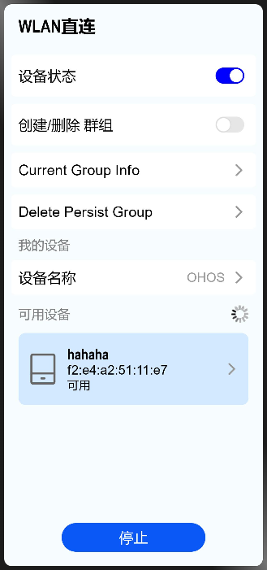

# WifiDirectDemo

## 简介
WIFI DIRECT接口使用DEMO
### 效果图


## 目录

```
├── entry             # 主entry模块目录
│   └── src
│       ├── main
│           ├── ets               # ets模块目录
│               ├── MainAbility
│                   ├── common    # 公共工具存放目录
│                   ├── model     # 数据管理和决策逻辑存放目录
│                   ├── pages     # 组件页面存放目录
│                   ├── res       # 部分图片资源
│                   ├── app.ets   # 全局ets逻辑和应用生命周期管理文件
│           ├── resources         # 资源配置文件存放目录
│               ├── base          # 默认语言场景，图片资源，字体大小，颜色资源内容存放目录
│               ├── rawfile       # 本地配置文件存放目录
│           └── config.json       # 全局配置文件
```
