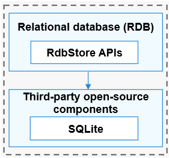
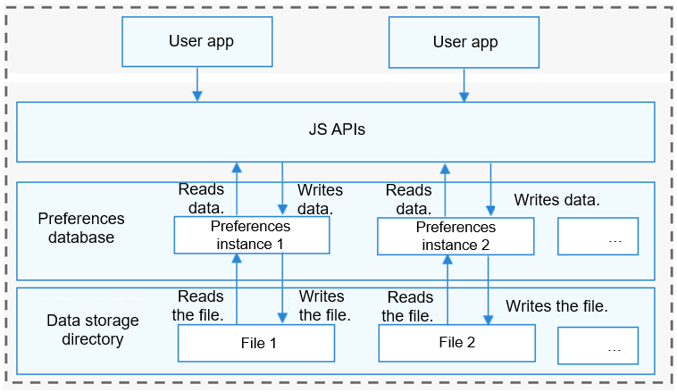

# distributeddatamgr\_appdatamgr<a name="EN-US_TOPIC_0000001124534865"></a>

-   [Introduction](#section11660541593)
    -   [RDB](#section1589234172717)
    -   [Preferences Database](#section1287582752719)

-   [Directory Structure](#section161941989596)
-   [Relational Database](#section101010894114)
    -   [Constraints](#section18387142613414)

-   [Preferences Database](#section762641474720)
    -   [Constraints](#section1944481420489)

-   [Repositories Involved](#section1371113476307)

## Introduction<a name="section11660541593"></a>

The  **relational database \(RDB\)**  manages data based on relational models. With the underlying SQLite database, the OpenHarmony RDB provides a complete mechanism for managing local databases. 

The  **preferences database**  provides lightweight key-value operations for local applications to store a small amount of data. As the stored data is already loaded in the memory, the faster data access speed achieves a higher work efficiency. The preferences database is non-relational, and therefore it is not suitable for storing a large amount of data. Instead, the preferences database is usually used to operate data in key-value pairs.

### RDB<a name="section1589234172717"></a>

With the SQLite database as the persistence engine, the OpenHarmony RDB supports all features of the SQLite database , including but not limited to transactions, indices, views, triggers, foreign keys, parameterized queries, and prepared SQL statements.

**Figure  1**  How RDB works<a name="fig3330103712254"></a>  




### Preferences Database<a name="section1287582752719"></a>

1.  The preferences database provides operation classes for applications to operate the database.
2.  With the  **PreferencesHelper**, an app can load the content of a specified file to the  **Preferences**  instance. Each file has only one  **Preferences**  instance. The system stores the instance in the memory through a static container until the app removes the instance from the memory or deletes the file.
3.  After obtaining the  **Preferences**  instance, the app can use the functions in  **Preferences**  to read data from or write data to the  **Preferences**  instance, and use  **flush\(\)**  or  **flushSync\(\)**  to save the modification to the file that stores the preference data.

**Figure  2**  How the preferences database works<a name="fig833053712258"></a>  




## Directory Structure<a name="section161941989596"></a>

```
//foundation/distributeddatamgr/appdatamgr
├── frameworks            # Framework code
│   └── innerkitsimpl     # Internal API implementation
└── interfaces            # APIs
    └── innerkits         # Internal APIs
```

## Relational Database<a name="section101010894114"></a>

Some basic concepts are as follows:

-   **Relational database \(RDB\)**

    A database created on the basis of relational models. The RDB stores data in rows and columns.

-   **Result set**

    A set of query results used to access the data. You can access the required data in a result set in flexible modes.

-   **SQLite database**

    A lightweight RDB in compliance with the atomicity, consistency, isolation, and durability \(ACID\) properties. It is an open-source database.


### Constraints<a name="section18387142613414"></a>

The RDB can use a maximum of four connection pools to manage read and write operations.

To ensure data accuracy, the RDB supports only one writ operation at a time.

## Preferences Database<a name="section762641474720"></a>

Some basic concepts are as follows:

-   **Key-value database**

    A database that stores data in key-value pairs. The  **key**  indicates keyword, and  **value**  indicates the corresponding value.

-   **Non-relational database**

    A database not in compliance with the atomicity, consistency, isolation, and durability \(ACID\) database management properties of relational data transactions. Instead, the data in a non-relational database is independent and scalable.

-   **Preference** **data**

    A type of data that is frequently accessed and used.


### Constraints<a name="section1944481420489"></a>

A key should be a string with a maximum of 80 characters and cannot be an empty string.

A value in the format of string can have a maximum of 8192 characters. A value can be an empty string.

To avoid a high memory cost, it is recommended that the preferences database store no more than ten thousand data entries.

## Repositories Involved<a name="section1371113476307"></a>

Distributed Data Management subsystem

distributeddatamgr\_appdatamgr

third\_party\_sqlite

