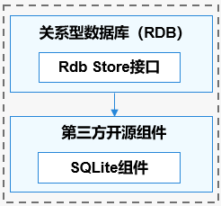
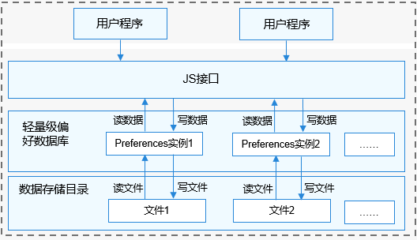

# 本地数据管理组件<a name="ZH-CN_TOPIC_0000001124534865"></a>

-   [简介](#section11660541593)
    -   [关系型数据库（RDB）](#section1589234172717)
    -   [轻量级偏好数据库（Preferences）](#section1287582752719)
    -   [轻量系统KV数据库（Lightweight KV store）](#section1287582752720)
-   [目录](#section161941989596)
-   [关系型数据库（RDB）](#section101010894114)
    -   [约束](#section18387142613414)

-   [轻量级偏好数据库（Preferences）](#section762641474720)
    -   [约束](#section1944481420489)

-   [轻量系统KV数据库（Lightweight KV store）](#section762641474721)
    -   [约束](#section1944481420490)

-   [相关仓](#section1371113476307)

## 简介<a name="section11660541593"></a>

**关系型数据库（Relational Database，RDB）** 是一种基于关系模型来管理数据的数据库。OpenHarmony关系型数据库基于SQLite组件提供了一套完整的对本地数据库进行管理的机制。

**轻量级偏好数据库（Preferences）** 主要提供轻量级Key-Value操作，支持本地应用存储少量数据，数据存储在本地文件中，同时也加载在内存中的，所以访问速度更快，效率更高。轻量级偏好数据库属于非关系型数据库，不宜存储大量数据，经常用于操作键值对形式数据的场景。

**轻量系统KV数据库（Lightweight KV store）** 依托当前公共基础库提供的KV存储能力开发，为轻量系统设备应用提供键值对数据管理能力。在有进程的平台上，KV存储提供的参数管理，供单进程访问不能被其他进程使用。在此类平台上，KV存储作为基础库加载在应用进程，以保障不被其他进程访问。

### 关系型数据库（RDB）<a name="section1589234172717"></a>

OpenHarmony关系型数据库底层使用SQLite作为持久化存储引擎，支持SQLite具有的所有数据库特性，包括但不限于事务、索引、视图、触发器、外键、参数化查询和预编译SQL语句。

**图 1**  关系型数据库运作机制<a name="fig3330103712254"></a>  




### 轻量级偏好数据库（Preferences）<a name="section1287582752719"></a>

1.  本模块提供偏好型数据库的操作类，应用通过这些操作类完成数据库操作。
2.  借助PreferencesHelper，可以将指定文件的内容加载到Preferences实例，每个文件最多有一个Preferences实例，系统会通过静态容器将该实例存储在内存中，直到主动从内存中移除该实例或者删除该文件。
3.  获取Preferences实例后，可以借助Preferences类的函数，从Preferences实例中读取数据或者将数据写入Preferences实例，通过flush或者flushSync将Preferences实例持久化。

**图 2**  轻量级偏好数据库运行机制<a name="fig833053712258"></a>  




### 轻量系统KV数据库（Lightweight KV store）<a name="section1287582752720"></a>

> 当前先支持轻量键值（KV）本地数据存储能力，后续会逐步支持其他更丰富的数据类型。
>
> 轻量键值（KV）数据：数据有结构，文件轻量，具有简易事务性，单独提供一套专用的键值对接口

分布式数据管理服务在不同平台上，将数据操作接口形成抽象层用来统一进行文件操作，使厂商不需要关注不同芯片平台文件系统的差异。

**目前，在轻量系统上默认关闭该特性，需要使用时请用户修改vendor_hisilicon仓配置以开启。**

## 目录<a name="section161941989596"></a>

```
//foundation/distributeddatamgr/appdatamgr
├── frameworks            # 框架层代码
│   └── innerkitsimpl     # 内部接口实现
└── interfaces            # 接口代码
    └── innerkits         # 内部接口声明
```

## 关系型数据库（RDB）<a name="section101010894114"></a>

以下是几个基本概念：

-   **关系型数据库**

    创建在关系模型基础上的数据库，以行和列的形式存储数据。

-   **结果集**

    指用户查询之后的结果集合，可以对数据进行访问。结果集提供了灵活的数据访问方式，可以更方便的拿到用户想要的数据。

-   **SQLite数据库**

    一款轻量级的数据库，是遵守ACID的关系型数据库组件。它是一个开源的项目。


### 约束<a name="section18387142613414"></a>

数据库中连接池的最大数量是4个，用以管理用户的读写操作。

为保证数据的准确性，数据库同一时间只能支持一个写操作。

## 轻量级偏好数据库（Preferences）<a name="section762641474720"></a>

以下是几个基本概念：

-   **Key-Value数据库**

    一种以键值对存储数据的一种数据库。Key是关键字，Value是值。

-   **非关系型数据库**

    区别于关系数据库，不保证遵循ACID（Atomic、Consistency、Isolation及Durability）特性，不采用关系模型来组织数据，数据之间无关系，扩展性好。

-   **偏好数据**

    用户经常访问和使用的数据。


### 约束<a name="section1944481420489"></a>

Key键为String类型，要求非空且长度不超过80个字符。

如果Value值为String类型，可以为空但是长度不超过8192个字符。

存储的数据量应该是轻量级的，建议存储的数据不超过一万条，否则会在内存方面产生较大的开销。

## 轻量系统KV数据库（Lightweight KV store）<a name="section762641474721"></a>

### 说明

KV存储能力继承自公共基础库原始设计，在原有能力基础上进行增强，新增提供数据删除及二进制value读写能力的同时，保证操作的原子性；

>- 轻量系统普遍性能有限，内存及计算能力不足，对于数据管理的场景大多读多写少，且内存占用敏感；
>- 平台使用的文件操作接口是由文件系统提供，一般来说文件操作接口本身并不是进程安全的，请格外注意；
>- 轻量系统，存在不具备锁能力的情况，不提供锁的机制，并发由业务保证，若需要提供有锁机制，则需要提供hook，由业务进行注册。
### 约束<a name="section1944481420490"></a>

- KV大小及可存储条目数在平台可承受内可修改配置，轻量系统默认为小于Key(32byte)，Value(512byte)，通过修改编译宏修改；

- 依赖平台具有正常的文件创建、读写删除修改、锁等能力，针对不同平台（如LiteOS-M内核、LiteOS-A内核等）尽可能表现接口语义功能的不变；

- 由于平台能力差异数据库能力需要做相应裁剪，其中不同平台内部实现可能不同；

- 对于指定路径仅支持创建数据库单例，不支持同一路径创建多数据库实例对象。

## 相关仓<a name="section1371113476307"></a>

分布式数据管理子系统

distributeddatamgr\_appdatamgr

third\_party\_sqlite