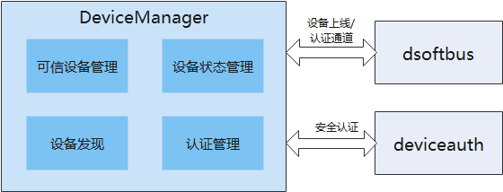

# **DeviceManager组件**

## 简介

DeviceManager组件在OpenHarmony上提供账号无关的分布式设备的认证组网能力，并为开发者提供了一套用于分布式设备间监听、发现和认证的接口。

其组成及依赖如下所示：



## 目录

```
foundation/distributedhardware/devicemanager
├── common                        #公共能力头文件存放目录
│   └── include
│       └── ipc
│           └── model             #ipc功能模块头文件存放目录
├── display                       #DM显示hap代码
│   └── entry
│       └── src
│           └── main
│               ├── js            #DM PIN码显示FA相关JS代码
│               └── resources     #DM PIN码显示FA相关资源配置文件目录
├── figures
├── interfaces
│   ├── inner_kits                #内部接口及实现存放目录
│   │   └── native_cpp            #内部native接口及实现存放目录
│   │       ├── include
│   │       │   ├── ipc           #ipc头文件存放目录
│   │       │   │   ├── lite      #small
│   │       │   │   └── standard  #standard
│   │       │   └── notify        #ipc回调通知头文件目录
│   │       └── src
│   │           ├── ipc           #ipc功能代码
│   │           │   ├── lite      #small
│   │           │   └── standard  #standard
│   │           └── notify        ipc回调通知功能代码
│   └── kits                      #外接口及实现存放目录
│       └── js                    #外部JS接口及实现存放目录
│           ├── include           #外部JS接口及实现欧文件存放目录
│           └── src               #外部JS接口及实现代码
├── sa_profile
├── services
│   └── devicemanagerservice      #devicemanagerservice服务实现核心代码
│       ├── include
│       │   ├── ability           #与PIN码显示FA拉起管理相关头文件
│       │   ├── auth              #devie_auth交互相关头文件
│       │   ├── ipc               #进程间通信相关头文件
│       │   │   ├── lite          #small
│       │   │   └── standard      #standard
│       │   ├── message           #消息数据解析相关头文件
│       │   ├── requestauth       #设备认证功能相关头文件
│       │   ├── softbus           #软总线相关头文件
│       │   └── timer             #定时器处理相关头文件
│       └── src
│           ├── ability           #与PIN码显示FA拉起管理相关功能代码
│           │   ├── lite          #small
│           │   └── standard      #standard
│           ├── auth              #devie_auth交互相关核心代码
│           ├── ipc               #进程间通信相功能代码
│           │   ├── lite          #small
│           │   └── standard      #standard
│           ├── message           #消息数据解析相功能代码
│           ├── requestauth       #设备认证功能代码
│           ├── softbus           #通道建立功能核心代码
│           └── timer             #timer处理代码
└── utils                         #公共能力头文件存放目
    ├── include
    │   ├── cipher                #加解密功能相关头文件
    │   ├── ipc                   #ipc公共头文件存放目录
    │   │   ├── lite              #small
    │   │   └── standard          #standard
    │   └── log                   #log相关头文件存放目录
    └── src
        ├── cipher                #加解密功能代码
        ├── ipc                   #ipc公共功能代码
        │   ├── lite              #small
        │   └── standard          #standard
        └── log                   #log相关功能代码
```

## 约束

- 开发语言：JS、C++
- 适用于Hi3516DV300单板等OpenHarmony设备


## 接口说明

当前版本设备管理服务不具备权限管理的能力，接口中的system api仅供系统调用，后续版本会进行严格的权限管控。
接口参见[**interface_sdk-js仓库的**](https://gitee.com/openharmony/interface_sdk-js/) *ohos.distributedHardware.deviceManager.d.ts*

- 公共接口：

  使用DeviceManager相关接口之前，需要通过createDeviceManager接口创建DeviceManager实例；

  不使用DeviceManager接口的时候需要释放对应的DeviceManager实例。

| 原型                                                         | 描述                            |
| ------------------------------------------------------------ | ------------------------------- |
| createDeviceManager(bundleName: string, callback: AsyncCallback<DeviceManager>): void; | 以异步方法获取DeviceManager实例 |
| release(): void;                                             | 释放DeviceManager实例           |


- 系统能力接口：

  提供可信设备列表获取、可信设备状态监听、周边设备发现、设备认证等相关接口，该部分作为系统能力接口，仅供系统应用调用。

  开始设备发现、停止发现设备接口要配对使用，使用同一个subscribeId。

| 原型                                                         | 描述                 |
| ------------------------------------------------------------ | -------------------- |
| getTrustedDeviceListSync(): Array<DeviceInfo>;                                                                                            | 获取信任设备列表 |
| on(type: 'deviceStateChange', callback: Callback<{ action: DeviceStateChangeAction, device: DeviceInfo }>): void;                         | 设备状态变更回调 |
| off(type: 'deviceStateChange', callback?: Callback<{ action: DeviceStateChangeAction, device: DeviceInfo }>): void;                       | 取消设备状态变更回调 |
| on(type: 'serviceDie', callback: () => void): void;                                                                                       | 服务错误回调 |
| off(type: 'serviceDie', callback?: () => void): void;                                                                                     | 取消服务错误回调 |
| startDeviceDiscovery(subscribeInfo: SubscribeInfo): void;    | 开始设备发现         |
| stopDeviceDiscovery(subscribeId: number): void;              | 停止发现设备         |
| authenticateDevice(deviceInfo: DeviceInfo, authparam: AuthParam, callback: AsyncCallback<{deviceId: string, pinTone ?: number}>): void; | 设备认证接口         |
| verifyAuthInfo(authInfo: AuthInfo, callback: AsyncCallback<{deviceId: string, level: number}>): void; | 设备认证信息校验     |
| on(type: 'deviceFound', callback: Callback<{ subscribeId: number, device: DeviceInfo }>): void; | 发现设备列表回调     |
| off(type: 'deviceFound', callback?: Callback<{ subscribeId: number, device: DeviceInfo }>): void; | 取消发现设备列表回调 |
| on(type: 'discoverFail', callback: Callback<{ subscribeId: number, reason: number }>): void; | 发现设备失败回调     |
| off(type: 'discoverFail', callback?: Callback<{ subscribeId: number, reason: number }>): void; | 取消发现设备失败回调 |

## 示例如下：

```
// 创建DeviceManager实例：
deviceManager.createDeviceManager('com.ohos.xxxx', (err, dm) => {
    this.log("createDeviceManager err:" + JSON.stringify(err) + '  --success:' + JSON.stringify(dm))
    if (err) return;
    dmClass = dm;
    dmClass.on('serviceDie', data => this.log("serviceDie on:" + JSON.stringify(data)))
});

// 注册/去注册设备上下线监听
dmClass.on('deviceStateChange', data => this.log("deviceStateChange on:" + JSON.stringify(data)))
dmClass.off('deviceStateChange')

// 查询可信设备列表
var array = dmClass.getTrustedDeviceListSync();

// 获取本地设备信息
var localDeviceInfo = dmClass.getLocalDeviceInfoSync();

// 开始设备发现（发现周边不可信设备）
var subscribeId = 0;
dmClass.on('deviceFound', (data) => {
    if (data == null) {
        this.log("deviceFound error data=null")
        return;
    }
    this.logList.push("deviceFound:" + JSON.stringify(data));
});
dmClass.on('discoverFail', (data) => {
    this.log("discoverFail on:" + JSON.stringify(data));
});
subscribeId = Math.floor(Math.random() * 10000 + 1000)
var info = {
    "subscribeId": subscribeId,
    "mode": 0xAA,
    "medium": 0,
    "freq": 2,
    "isSameAccount": false,
    "isWakeRemote": true,
    "capability": 0
};
dmClass.startDeviceDiscovery(info);

// 停止设备发现（需要和startDeviceDiscovery接口配对使用）
dmClass.stopDeviceDiscovery(subscribeId);

// 设备认证
var deviceInfo ={
    "deviceId": "XXXXXXXX",
    "deviceName": "",
    deviceType: 0
}；
let extraInfo = {
    "appIcon": new Uint8Array(), // app图标，可选参数，可不填
    "appThumbnail": new Uint8Array(), // app缩略图，可选参数，可不填
    "appName": "xxxxxxxx", // 对端设备应用名称
    "appDescription": "xxxxxxxx", // app描述
    "business": '0',
    "displayOwner": 0,
}
let authParam = {
    "authType": 1,
    "extraInfo": extraInfo
}
dmClass.authenticateDevice(this.deviceInfo, authParam, (err, data) => {
    if (err) {
        this.logList.push("authenticateDevice err:" + JSON.stringify(err));
        console.info(TAG + "authenticateDevice err:" + JSON.stringify(err));
        return;
    }
    this.logList.push("authenticateDevice result:" + JSON.stringify(data));
    console.info(TAG + "authenticateDevice result:" + JSON.stringify(data));
    token = data.pinToken;
});

// 设备取消认证
dmClass.unAuthenticateDevice(this.deviceInfo);
```
## 系统弹框FA

当前版本只支持PIN码认证，需要提供PIN码认证的授权提示界面、PIN码显示界面、PIN码输入界面；

当前，由于系统通过native层直接进行弹窗的能力尚不具备，这里使用一个临时的FA来进行对应界面的弹窗。

该FA为：DeviceManager_UI.hap，作为系统应用进行预置。

- 编译运行：

  将devicemanager/display工程导入DevEco Studio 2.2 Beta1，复制display目录下的@ohos.distributedHardware.deviceManager.d.ts文件到Sdk\js\2.2.0.1\api\common目录下，进行编译构建及运行调试.

- 编译环境依赖：IDE 2.2 SDK6

- DeviceManager_UI.hap存放位置：[applications_hap仓库](https://gitee.com/openharmony/applications_hap)

- UI显示：

  DeviceManager作为认证被控端，授权提示界面、PIN码显示界面由DeviceManager_UI FA默认进行显示；

  DeviceManager作为认证发起端，PIN码输入界面可以选择由DeviceManager_UI FA进行显示，还是由开发者自行显示。开发者如需自己定制PIN码输入界面，需要在authenticateDevice接口的认证参数AuthParam中，extraInfo属性里面指定displayOwner参数为1（DISPLAY_OWNER_OTHER）。

### 相关仓
****

[**interface_sdk-js**](https://gitee.com/openharmony/interface_sdk-js/)
[**applications_hap**](https://gitee.com/openharmony/applications_hap)
**device_manager**