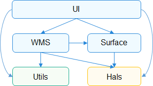
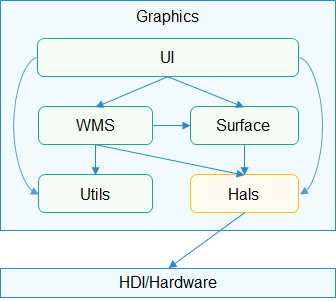

# Utils<a name="EN-US_TOPIC_0000001123083525"></a>

-   [Introduction](#section11660541593)
-   [Directory Structure](#section161941989596)
-   [Compilation and Building](#section137768191623)
-   [Description](#section1312121216216)
    -   [Usage](#section129654513264)

-   [Repositories Involved](#section1371113476307)

## Introduction<a name="section11660541593"></a>

The Utils module defines the common data structure in the graphics subsystem and provides a lite OS adaptation layer, which includes the lock, thread, and file system.

**Figure  1**  Dependency between modules of the graphics subsystem<a name="fig717664212591"></a>  


## Directory Structure<a name="section161941989596"></a>

```
/foundation/graphic/utils
├── frameworks      # Framework code
│   ├── hals        # Hardware adaptation layer
│   ├── linux       # Linux platform adaptation layer
│   ├── liteos      # LiteOS platform adaptation layer
│   └── windows     # Windows platform adaptation layer
├── interfaces      # APIs
│   ├── innerkits   # APIs between modules
│   │   └── hals    # APIs of the hardware adaptation layer
│   └── kits        # External APIs
└── test            # Unit testing
```

## Compilation and Building<a name="section137768191623"></a>

```
# Generate the libgraphic_utils.so file in the out directory of the product folder through GN compilation.
hb build lite_graphic_utils
```

## Description<a name="section1312121216216"></a>

### Usage<a name="section129654513264"></a>

-   Utils is used in UI, surface, and WMS modules. For details, see the related source code.
-   The  **test**  folder provides unit testing for each utils API. Refer to it for the usage of utils.

## Repositories Involved<a name="section1371113476307"></a>

[Graphic subsystem](https://gitee.com/openharmony/docs/blob/master/en/readme/graphics.md)

[graphic_wms](https://gitee.com/openharmony/graphic_wms/blob/master/README.md)

[graphic_surface](https://gitee.com/openharmony/graphic_surface/blob/master/README.md)

[graphic_ui](https://gitee.com/openharmony/graphic_ui/blob/master/README.md)

# Hals<a name="EN-US_TOPIC_0000001124625243"></a>

-   [Introduction](#section11660541593)
-   [Directory Structure](#section161941989596)
-   [Compilation and Building](#section137768191623)
-   [Description](#section1312121216216)
    -   [Usage](#section129654513264)

-   [Repositories Involved](#section1371113476307)

## Introduction<a name="section11660541593"></a>

The Hals module adapts and encapsulates the functions related to the driver subsystem and platform, including FrameBuffer, graphics \(GFX\), and single instruction, multiple data \(SIMD\).

**Figure  1**  Dependency between modules of the graphics subsystem and that between graphics modules and the driver subsystem<a name="fig717664212591"></a>  


## Directory Structure<a name="section161941989596"></a>

```
/foundation/graphic/utils
├── frameworks      # Framework code
│   ├── hals        # Hardware adaptation layer
│   ├── linux       # Linux platform adaptation layer
│   ├── liteos      # LiteOS platform adaptation layer
│   └── windows     # Windows platform adaptation layer
├── interfaces      # APIs
│   ├── innerkits   # APIs between modules
│   │   └── hals    # APIs of the hardware adaptation layer
│   └── kits        # External APIs
└── test            # Unit testing
```

## Compilation and Building<a name="section137768191623"></a>

```
# Generate the libgraphic_hals.so file in the out directory of the product folder through GN compilation.
hb build lite_graphic_utils
```

## Description<a name="section1312121216216"></a>

### Usage<a name="section129654513264"></a>

-   Hals is used in UI, surface, and WMS modules. For details, see the related source code.

## Repositories Involved<a name="section1371113476307"></a>

[Graphic subsystem](https://gitee.com/openharmony/docs/blob/master/en/readme/graphics.md)

[graphic_wms](https://gitee.com/openharmony/graphic_wms/blob/master/README.md)

[graphic_surface](https://gitee.com/openharmony/graphic_surface/blob/master/README.md)

[graphic_ui](https://gitee.com/openharmony/graphic_ui/blob/master/README.md)

**graphic_utils**