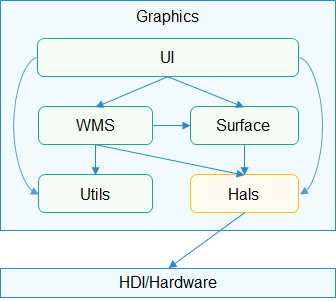
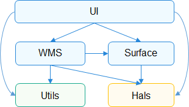

# 图形HALS组件<a name="ZH-CN_TOPIC_0000001124625243"></a>

-   [简介](#section11660541593)
-   [目录](#section161941989596)
-   [编译构建](#section137768191623)
-   [说明](#section1312121216216)
    -   [使用说明](#section129654513264)

-   [相关仓](#section1371113476307)

## 简介<a name="section11660541593"></a>

HALS组件中实现了对驱动子系统和平台相关功能的适配封装，包括了FrameBuffer/GFX/SIMD等。

**图 1**  图形子系统组件间以及与驱动子系统的依赖关系<a name="fig717664212591"></a>  


## 目录<a name="section161941989596"></a>

```
/foundation/graphic/utils
├── frameworks      # 框架代码
│   ├── hals        # 硬件适配层
│   ├── linux       # linux平台适配层
│   ├── liteos      # liteos平台适配层
│   └── windows     # windows平台适配层
├── interfaces      # 接口
│   ├── innerkits   # 模块间接口
│   │   └── hals    # 硬件适配层接口
│   └── kits        # 对外接口
└── test            # 单元测试
```

## 编译构建<a name="section137768191623"></a>

```
# 通过gn编译,在out目录下对应产品的文件夹中生成libgraphic_hals.so
hb build lite_graphic_utils
```

## 说明<a name="section1312121216216"></a>

### 使用说明<a name="section129654513264"></a>

-   图形UI/SURFACE/WMS组件均使用了HALS组件，可参考相关源码；

## 相关仓<a name="section1371113476307"></a>

[图形子系统](https://gitee.com/openharmony/docs/blob/master/zh-cn/readme/%E5%9B%BE%E5%BD%A2%E5%AD%90%E7%B3%BB%E7%BB%9F.md)

[graphic_wms](https://gitee.com/openharmony/graphic_wms/blob/master/README_zh.md)

[graphic_surface](https://gitee.com/openharmony/graphic_surface/blob/master/README_zh.md)

[graphic_ui](https://gitee.com/openharmony/graphic_ui/blob/master/README_zh.md)

# 图形UTILS组件<a name="ZH-CN_TOPIC_0000001123083525"></a>

-   [简介](#section11660541593)
-   [目录](#section161941989596)
-   [编译构建](#section137768191623)
-   [说明](#section1312121216216)
    -   [使用说明](#section129654513264)

-   [相关仓](#section1371113476307)

## 简介<a name="section11660541593"></a>

UTILS组件中定义了图形子系统中的公共数据结构，并提供了一层轻薄的操作系统适配层（如锁、线程、文件系统）。

**图 1**  图形子系统组件间依赖关系<a name="fig717664212591"></a>  


## 目录<a name="section161941989596"></a>

```
/foundation/graphic/utils
├── frameworks      # 框架代码
│   ├── hals        # 硬件适配层
│   ├── linux       # linux平台适配层
│   ├── liteos      # liteos平台适配层
│   └── windows     # windows平台适配层
├── interfaces      # 接口
│   ├── innerkits   # 模块间接口
│   │   └── hals    # 硬件适配层接口
│   └── kits        # 对外接口
└── test            # 单元测试
```

## 编译构建<a name="section137768191623"></a>

```
# 通过gn编译,在out目录下对应产品的文件夹中生成libgraphic_utils.so
hb build lite_graphic_utils
```

## 说明<a name="section1312121216216"></a>

### 使用说明<a name="section129654513264"></a>

-   图形UI/SURFACE/WMS组件均使用了UTILS组件，可参考相关源码；
-   test提供了UTILS组件各接口的单元测试，也可参考使用。

## 相关仓<a name="section1371113476307"></a>

[图形子系统](https://gitee.com/openharmony/docs/blob/master/zh-cn/readme/%E5%9B%BE%E5%BD%A2%E5%AD%90%E7%B3%BB%E7%BB%9F.md)

[graphic_wms](https://gitee.com/openharmony/graphic_wms/blob/master/README_zh.md)

[graphic_surface](https://gitee.com/openharmony/graphic_surface/blob/master/README_zh.md)

[graphic_ui](https://gitee.com/openharmony/graphic_ui/blob/master/README_zh.md)

**graphic_utils**