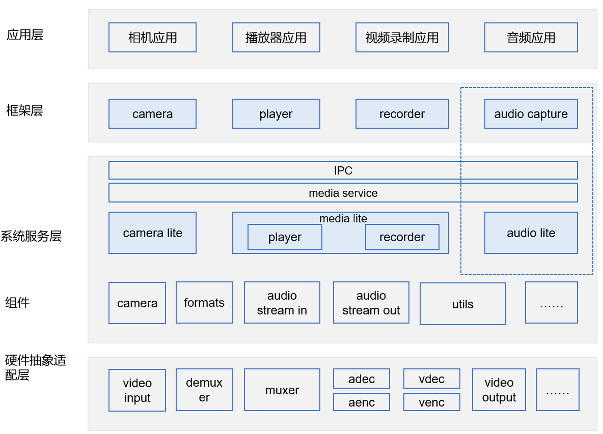

# 媒体子系统AUDIO\_LITE组件<a name="ZH-CN_TOPIC_0000001080430608"></a>

- [媒体子系统AUDIO\_LITE组件<a name="ZH-CN_TOPIC_0000001080430608"></a>](#媒体子系统audio_lite组件)
  - [简介<a name="section11660541593"></a>](#简介)
  - [目录<a name="section178251437756"></a>](#目录)
  - [使用说明<a name="section1648194512427"></a>](#使用说明)
  - [约束<a name="section722512541395"></a>](#约束)
  - [相关仓<a name="section1371113476307"></a>](#相关仓)

## 简介<a name="section11660541593"></a>

AUDIO\_LITE组件提供音频能力的支持。

**图 1**  媒体子系统架构（蓝色虚线框是audio\_lite）<a name="fig584652218594"></a>  


## 目录<a name="section178251437756"></a>

```
foundation/multimedia/audio_lite
├── frameworks         # 框架代码    
└── interfaces         # 接口
    └── kits           # 对外接口
```

## 使用说明<a name="section1648194512427"></a>

单仓的编译构建，在根目录下进行单仓的构建和编译

```
# 开发板选择
hb set  
# 单仓构建和编译
hb build audio_manager_lite 
```

## 约束<a name="section722512541395"></a>

-   C++11版本或以上

## 相关仓<a name="section1371113476307"></a>

[媒体子系统](https://gitee.com/openharmony/docs/blob/master/zh-cn/readme/%E5%AA%92%E4%BD%93%E5%AD%90%E7%B3%BB%E7%BB%9F.md)

[camera\_lite](https://gitee.com/openharmony/multimedia_camera_lite/blob/master/README_zh.md)

[camera\_sample\_lite](https://gitee.com/openharmony/applications_sample_camera/blob/master/README_zh.md)

[media\_utils\_lite](https://gitee.com/openharmony/multimedia_utils_lite/blob/master/README_zh.md)

[media\_lite](https://gitee.com/openharmony/multimedia_media_lite/blob/master/README_zh.md)

[audio\_lite](https://gitee.com/openharmony/multimedia_audio_lite/blob/master/README_zh.md)

