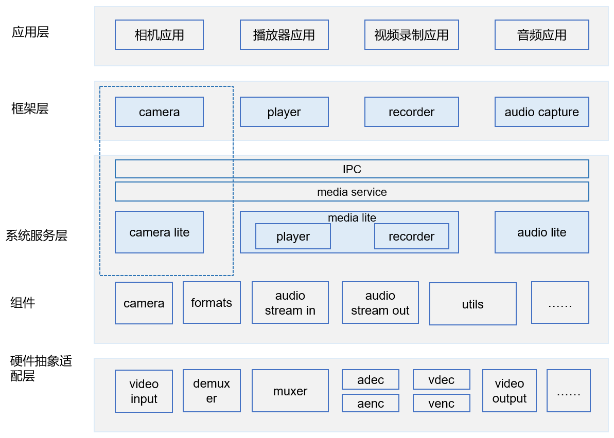

# 媒体子系统CAMERA\_LITE组件<a name="ZH-CN_TOPIC_0000001126988397"></a>

-   [简介](#section11660541593)
-   [目录](#section56984451495)
-   [使用说明](#section1648194512427)
-   [约束](#section161941989596)
-   [相关仓](#section105062051111614)

## 简介<a name="section11660541593"></a>

Camera\_Lite组件提供相机能力的支持。

**图 1**  媒体子系统架构（蓝色虚线框是camera\_lite）<a name="fig4655174610594"></a>  


## 目录<a name="section56984451495"></a>

```
/foundation/multimedia/camera_lite
├── frameworks # 框架代码 
└── interfaces # 接口
    └── kits   # 对外接口
```

## 使用说明<a name="section1648194512427"></a>

单仓的编译构建，在根目录下进行整仓的构建和编译

```
# 开发板选择
hb set  
# 单仓构建和编译
hb build camera_lite 
```

## 约束<a name="section161941989596"></a>

C++11版本或以上

## 相关仓<a name="section105062051111614"></a>

[媒体子系统](https://gitee.com/openharmony/docs/blob/master/zh-cn/readme/%E5%AA%92%E4%BD%93%E5%AD%90%E7%B3%BB%E7%BB%9F.md)

[camera\_sample\_lite](https://gitee.com/openharmony/applications_sample_camera/blob/master/README_zh.md)

[media\_utils\_lite](https://gitee.com/openharmony/multimedia_utils_lite/blob/master/README_zh.md)

[audio\_lite](https://gitee.com/openharmony/multimedia_audio_lite/blob/master/README_zh.md)

[media\_lite](https://gitee.com/openharmony/multimedia_media_lite/blob/master/README_zh.md)

**camera\_lite**

