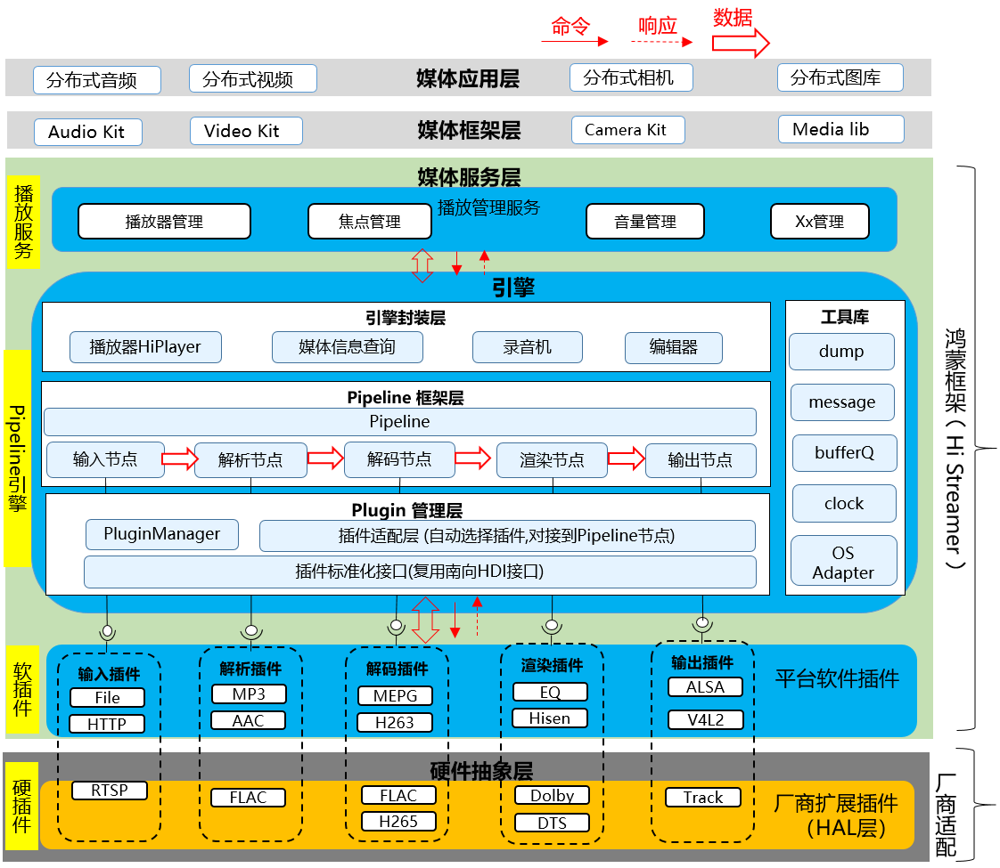

# HiStreamer<a name="EN-US_TOPIC_0000001148809513"></a>

- [HiStreamer<a name="EN-US_TOPIC_0000001148809513"></a>](#histreamer)
  - [Introduction<a name="section1158716411637"></a>](#introduction)
  - [Logical architecture<a name="section1158716411638"></a>](#logical-architecture)
  - [List of plug-ins<a name="section1158716411639"></a>](#plugin-list)
  - [Directory Structure<a name="section1158716411640"></a>](#directory-structure)
  - [Repositories Involved<a name="section1158716411641"></a>](#repositories-involved)

## Introduction<a name="section1158716411637"></a>

HiStreamer is the foundation module of the multimedia subsystem. It provides a processing pipeline and plug-ins required by the media framework, such as the file source, codecs, muxer and demuxer, and audio and video data processor.

## Logical architecture<a name="section1158716411638"></a>
As a media engine, HiStreamer connects to media_standard (on a Standard device) or media_lite (on a Mini or Small device) and provides application apis externally. It is divided into three layers:
- Application scenario Encapsulation layer: for example, HiPlayer and HiRecorder.
- Pipeline framework layer: including Pipeline framework, each Filter node implementation.
- Plug-in layer: includes plug-in framework, various plug-ins.



## Plugin list<a name="section1158716411639"></a>
The HiStreamer plug-in list is as follows:
| The plug-in name   | path      |External dependencies | License  | function         | applicable scene |
| --         | --          | --  | --       | --           | --          |
| FFMPEG Adapter| plugins/ffmpeg_adapter | FFMPEG | LGPL etc. | Decapsulation: mp3, m4a, mp4, wav<br>Decode: mp3, aac |Small/Standard devices that support dynamic linking |
| File Source | plugins/source/file_source | FileSystem | Apache | Reading file data | All the device |
| Minimp3 Adapter | plugins/minimp3_adapter | minimp3 | CC0 | Decapsulation: mp3<br>decode : mp3 | All the device |
| Minimp4 Demuxer | plugins/demuxer/minimp4_demuxer | minimp4 | CC0 | Decapsulation: m4a | All the device |
| Aac Demuxer | plugins/demuxer/aac_demuxer | NA | Apache | Decapsulation: aac | All the device |
| HDI Sink | plugins/hdi_adapter | Audio HDI | Apache | play music  | mini/small device|


## Directory Structure<a name="section1158716411640"></a>

The structure of the repository directory is as follows:

```
/foundation/multimedia/histreamer
├── LICENSE                             # License file
└── ohos.build                          # Build file
/foundation/multimedia/histreamer      # HiStreamer media engine component business code
├─LICENSE                              # The license file
├─engine                               # The engine code
│  ├─foundation                        # Basic tool classes, including OS adaptation
│  ├─pipeline framework                # pipeline frame
│  │  ├─core                           # pipeline core implementation
│  │  ├─factory                        # filter factory
│  │  └─filters                        # Several filter node implementations
│  │      ├─codec                      # Codec node implementation
│  │      ├─demux                      # Decapsulation node implementation
│  │      ├─sink                       # Output node implementation
│  │      └─source                     # Data source node implementation
│  ├─player                            # Player package
│  └─plugin                            # plug-in
│     ├─common                         # The underlying type definitions on which the plug-in interface depends
│     ├─core                           # Plug-in framework
│     ├─interface                      # Plug-in interface
│     └─plugins                        # Several plug-in implementations
│         ├─minimp3_adapter            # minimp3 adapter
│         ├─ffmpeg_adapter             # FFMPEG adaption (adaption into encapsulation and decapsulation, codec plug-in)
│         ├─hdi_adapter                # HDI adapter (adapter to output plug-in)
│         ├─demuxer                    # Unpack plugin
│         ├─sink                       # Output plug-in
│         └─source                     # Data source plug-in
└─interface                            # Engine external interface
```

## Repositories Involved<a name="section1158716411641"></a>

- [multimedia Subsystem](https://gitee.com/openharmony/docs/blob/master/en/readme/multimedia.md)

- [media_standard](https://gitee.com/openharmony/multimedia_media_standard)

- [media_lite](https://gitee.com/openharmony/multimedia_media_lite)

- **multimedia_histreamer**