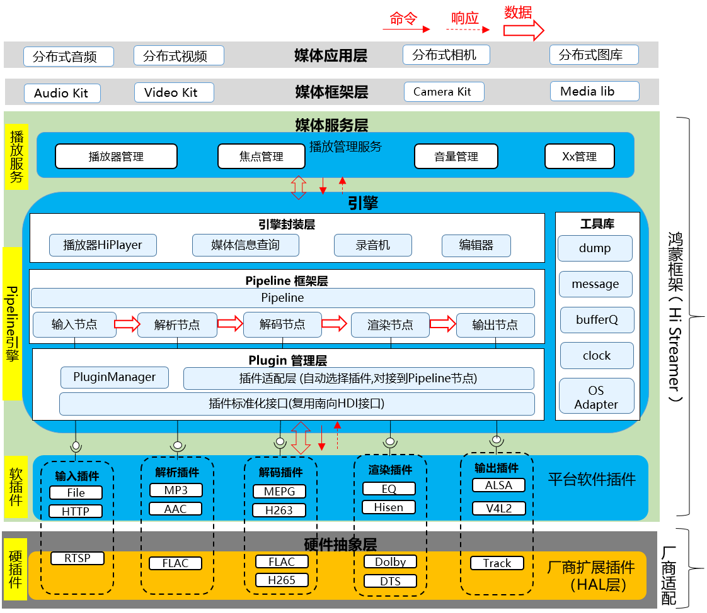

# 媒体引擎组件<a name="ZH-CN_TOPIC_0000001148809513"></a>

- [媒体引擎组件<a name="ZH-CN_TOPIC_0000001148809513"></a>](#媒体引擎组件)
  - [简介<a name="section1158716411637"></a>](#简介)
  - [逻辑架构<a name="section_histreamer_arch"></a>](#逻辑架构)
  - [插件列表<a name="section_histreamer_plugins"></a>](#插件列表)
  - [目录<a name="section161941989596"></a>](#目录)
  - [相关仓<a name="section1533973044317"></a>](#相关仓)

## 简介<a name="section1158716411637"></a>

HiStreamer是一个轻量级的媒体引擎组件，提供播放、录制等场景的媒体数据流水线处理。
- 播放场景分为如下几个节点：数据源读取、解封装、解码、输出；
- 录制场景分为如下几个节点：数据源读取、编码、封装、输出。

这些节点的具体功能，主要在插件中实现。可以插件的形式扩展支持新的数据源、封装格式、编解码格式、输出方式。

## 逻辑架构<a name="section_histreamer_arch"></a>
HiStreamer作为媒体引擎，向上对接media_standard(standard设备上)或者media_lite(mini/small设备上)，再对外提供应用API。它内部分为三层：
- 应用场景封装层: 比如HiPlayer, HiRecorder。
- Pipeline框架层: 包括Pipeline框架，各个Filter节点实现。
- 插件层: 包括插件框架，各种插件。



## 插件列表<a name="section_histreamer_plugins"></a>
HiStreamer插件列表如下:
| 插件名称    | 路径        | 外部依赖 | License  |  功能        | 适用场景    |
| --         | --          | --  | --       | --           | --          |
| FFMPEG Adapter| plugins/ffmpeg_adapter | FFMPEG | LGPL etc. | 解封装:mp3,m4a,mp4,wav<br>解码:mp3,aac | 支持动态链接的<br>small/standard设备 |
| File Source | plugins/source/file_source | FileSystem | Apache | 读取文件数据 | 所有设备 |
| Minimp3 Adapter | plugins/minimp3_adapter | minimp3 | CC0 | 解封装: mp3<br>解码: mp3 | 所有设备 |
| Minimp4 Demuxer | plugins/demuxer/minimp4_demuxer | minimp4 | CC0 | 解封装: m4a | 所有设备 |
| Aac Demuxer | plugins/demuxer/aac_demuxer | NA | Apache | 解封装: aac | 所有设备 |
| HDI Sink | plugins/hdi_adapter | Audio HDI | Apache | 播放音乐 | mini/small设备 |

## 目录<a name="section161941989596"></a>

仓目录结构如下：

```
/foundation/multimedia/histreamer      # HiStreamer媒体引擎组件业务代码
├─LICENSE                              # 证书文件
├─engine                               # 引擎代码
│  ├─foundation                        # 基础工具类, 包括OS适配
│  ├─pipeline                          # pipeline框架
│  │  ├─core                           # pipeline核心实现
│  │  ├─factory                        # filter工厂
│  │  └─filters                        # 若干filter节点实现
│  │      ├─codec                      # 编解码节点实现
│  │      ├─demux                      # 解封装节点实现
│  │      ├─sink                       # 输出节点实现
│  │      └─source                     # 数据源节点实现
│  ├─player                            # 播放器封装
│  └─plugin                            # 插件
│     ├─common                         # 插件接口依赖的基础类型定义
│     ├─core                           # 插件框架
│     ├─interface                      # 插件接口
│     └─plugins                        # 若干插件实现
│         ├─minimp3_adapter            # minimp3适配
│         ├─ffmpeg_adapter             # FFMPEG适配(适配成封装解封装、编解码插件)
│         ├─hdi_adapter                # HDI适配(适配成输出插件)
│         ├─demuxer                    # 解封装插件
│         ├─sink                       # 输出插件
│         └─source                     # 数据源插件
└─interface                            # 引擎对外接口
```

## 相关仓<a name="section1533973044317"></a>

- [媒体子系统](https://gitee.com/openharmony/docs/blob/master/zh-cn/readme/%E5%AA%92%E4%BD%93%E5%AD%90%E7%B3%BB%E7%BB%9F.md)

- [media_standard](https://gitee.com/openharmony/multimedia_media_standard)

- [media_lite](https://gitee.com/openharmony/multimedia_media_lite)

- **multimedia_histreamer**